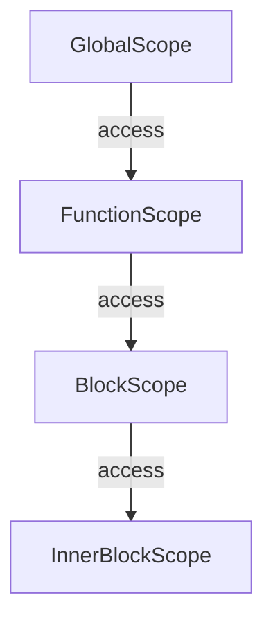

## 12.2. Scope Identification Drill

Understanding variable scope in JavaScript is crucial for writing efficient and bug-free code. In this section, we'll dive into practical exercises that will help you identify the scope of variables in various code snippets. We'll explore global, function, and block scopes, and see how different declarations (`var`, `let`, `const`) affect the scope of variables. 

### Introduction to Variable Scopes

Before we jump into the exercises, let's briefly recap the concept of variable scopes in JavaScript. A variable's scope determines where in the code it can be accessed. JavaScript has three main types of scopes:

1. **Global Scope**: Variables declared outside of any function or block are in the global scope and can be accessed from anywhere in the code.
2. **Function Scope**: Variables declared within a function are only accessible within that function.
3. **Block Scope**: Variables declared with `let` or `const` within a block (e.g., inside `{}`) are only accessible within that block.

### Code Samples and Exercises

Let's explore some code samples to identify the scope of variables. For each snippet, try to determine the scope of each variable and then check your answers with the explanations provided.

#### Exercise 1: Global and Function Scope

```javascript
// Global variable
var globalVar = "I am global";

function checkScope() {
    // Function-scoped variable
    var functionVar = "I am local to the function";
    console.log(globalVar); // Accessible here
    console.log(functionVar); // Accessible here
}

checkScope();

console.log(globalVar); // Accessible here
console.log(functionVar); // Error: functionVar is not defined
```

**Question**: Identify the scope of `globalVar` and `functionVar`.

**Answer**: 
- `globalVar` is in the global scope, accessible throughout the code.
- `functionVar` is in the function scope, accessible only within the `checkScope` function.

**Explanation**: `globalVar` is declared outside any function, making it globally accessible. `functionVar` is declared inside `checkScope`, so it cannot be accessed outside of it.

#### Exercise 2: Block Scope with `let` and `const`

```javascript
function blockScopeExample() {
    if (true) {
        let blockVar = "I am block-scoped";
        const blockConst = "I am also block-scoped";
        console.log(blockVar); // Accessible here
        console.log(blockConst); // Accessible here
    }
    console.log(blockVar); // Error: blockVar is not defined
    console.log(blockConst); // Error: blockConst is not defined
}

blockScopeExample();
```

**Question**: Determine the scope of `blockVar` and `blockConst`.

**Answer**: 
- Both `blockVar` and `blockConst` are block-scoped, accessible only within the `if` block.

**Explanation**: Variables declared with `let` and `const` are confined to the block in which they are declared. This makes them inaccessible outside the block, unlike `var`, which does not have block scope.

#### Exercise 3: Variable Shadowing

```javascript
var shadowVar = "I am global";

function shadowExample() {
    var shadowVar = "I am local to the function";
    console.log(shadowVar); // Which value is logged?
}

shadowExample();
console.log(shadowVar); // Which value is logged?
```

**Question**: What value is logged inside the function and outside the function?

**Answer**: 
- Inside the function, `"I am local to the function"` is logged.
- Outside the function, `"I am global"` is logged.

**Explanation**: The local `shadowVar` inside the function shadows the global `shadowVar`. This means the local variable takes precedence within the function scope.

#### Exercise 4: Hoisting and Scope

```javascript
console.log(hoistedVar); // What is logged?
var hoistedVar = "I am hoisted";

function hoistingExample() {
    console.log(innerHoistedVar); // What is logged?
    var innerHoistedVar = "I am also hoisted";
}

hoistingExample();
```

**Question**: What is logged for `hoistedVar` and `innerHoistedVar`?

**Answer**: 
- `hoistedVar` logs `undefined`.
- `innerHoistedVar` logs `undefined`.

**Explanation**: Variables declared with `var` are hoisted to the top of their scope, but their initialization is not. This means they exist in memory but are `undefined` until the assignment is executed.

#### Exercise 5: Lexical Scope and Closure

```javascript
function outerFunction() {
    let outerVar = "I am outside";

    function innerFunction() {
        console.log(outerVar); // Accessible here
    }

    innerFunction();
}

outerFunction();
```

**Question**: Is `outerVar` accessible inside `innerFunction`?

**Answer**: 
- Yes, `outerVar` is accessible inside `innerFunction`.

**Explanation**: JavaScript uses lexical scoping, meaning a function can access variables from its outer scope. `innerFunction` can access `outerVar` because it is defined within `outerFunction`.

### Common Mistakes and Clarifications

- **Confusing Block and Function Scope**: Remember that `var` does not have block scope, only function scope. This can lead to unexpected behavior if you're not careful.
- **Shadowing**: Be mindful of variable shadowing, which can lead to bugs if you unintentionally override a variable in a different scope.
- **Hoisting Misunderstandings**: Hoisting can be confusing. Remember that only declarations are hoisted, not initializations.

### Try It Yourself

Now it's your turn! Modify the code examples above to see how changes affect variable scope. Here are some suggestions:

- Change `var` to `let` or `const` in the examples and observe the differences.
- Add more nested functions and try accessing variables from different levels.
- Experiment with declaring variables in different blocks and see how scope changes.

### Visualizing Scope Chains

To better understand how JavaScript resolves variable names, let's visualize the scope chain using a diagram.



**Diagram Description**: This diagram represents the scope chain in JavaScript. The Global Scope can access variables in the Function Scope, which can access variables in the Block Scope, and so on. Each scope can access variables in its own scope and any outer scopes.

### References and Links

- [MDN Web Docs on Scope](https://developer.mozilla.org/en-US/docs/Web/JavaScript/Guide/Grammar_and_types#variable_scope)
- [JavaScript.info on Variable Scope](https://javascript.info/closure)

### Knowledge Check

Let's reinforce what we've learned with a few questions and challenges.

1. What is the difference between function scope and block scope?
2. How does variable shadowing affect the value of a variable?
3. What happens when a variable is hoisted?
4. How can closures affect variable accessibility?

### Embrace the Journey

Remember, mastering scope is an essential part of becoming proficient in JavaScript. As you continue to practice, you'll gain a deeper understanding of how to manage variables effectively. Keep experimenting, stay curious, and enjoy the journey!

## Quiz Time!



### What is the scope of a variable declared with `var` inside a function?

- [x] Function scope
- [ ] Block scope
- [ ] Global scope
- [ ] Lexical scope

> **Explanation:** Variables declared with `var` inside a function are function-scoped, meaning they are only accessible within that function.

### What will be the output of the following code snippet?
```javascript
let x = 10;
if (true) {
    let x = 20;
    console.log(x);
}
console.log(x);
```

- [ ] 10, 10
- [x] 20, 10
- [ ] 20, 20
- [ ] 10, 20

> **Explanation:** The first `console.log` outputs `20` because the `x` inside the block shadows the outer `x`. The second `console.log` outputs `10` because it refers to the `x` outside the block.

### Which of the following is true about hoisting?

- [x] Only declarations are hoisted, not initializations
- [ ] Both declarations and initializations are hoisted
- [ ] Neither declarations nor initializations are hoisted
- [ ] Only initializations are hoisted

> **Explanation:** In JavaScript, only the declarations are hoisted to the top of their scope, while initializations remain in place.

### What is variable shadowing?

- [x] When a variable declared in a local scope has the same name as a variable in an outer scope
- [ ] When a variable is declared but not initialized
- [ ] When a variable is used before it is declared
- [ ] When a variable is declared in the global scope

> **Explanation:** Variable shadowing occurs when a local variable has the same name as a variable in an outer scope, causing the local variable to take precedence.

### Which keyword introduces block scope in JavaScript?

- [x] let
- [x] const
- [ ] var
- [ ] function

> **Explanation:** Both `let` and `const` introduce block scope in JavaScript, unlike `var`, which is function-scoped.

### What will be logged to the console?
```javascript
var a = 1;
function test() {
    console.log(a);
    var a = 2;
}
test();
```

- [x] undefined
- [ ] 1
- [ ] 2
- [ ] ReferenceError

> **Explanation:** Due to hoisting, the `var a` declaration inside the function is hoisted to the top, resulting in `undefined` being logged.

### How can you prevent variable shadowing?

- [x] Use different variable names in different scopes
- [ ] Use `var` instead of `let` or `const`
- [ ] Declare all variables in the global scope
- [ ] Avoid using functions

> **Explanation:** Using different variable names in different scopes prevents shadowing and makes the code clearer.

### What is the output of this code?
```javascript
const y = 5;
{
    const y = 10;
    console.log(y);
}
console.log(y);
```

- [ ] 5, 5
- [x] 10, 5
- [ ] 10, 10
- [ ] 5, 10

> **Explanation:** The first `console.log` outputs `10` because it refers to the `y` inside the block. The second `console.log` outputs `5` because it refers to the `y` outside the block.

### True or False: Variables declared with `let` are hoisted.

- [x] True
- [ ] False

> **Explanation:** Variables declared with `let` are hoisted, but they are not initialized until their declaration is evaluated, leading to the Temporal Dead Zone.



By practicing these exercises and understanding the explanations, you'll become more adept at identifying and managing variable scopes in JavaScript. Keep practicing and exploring to deepen your understanding!
