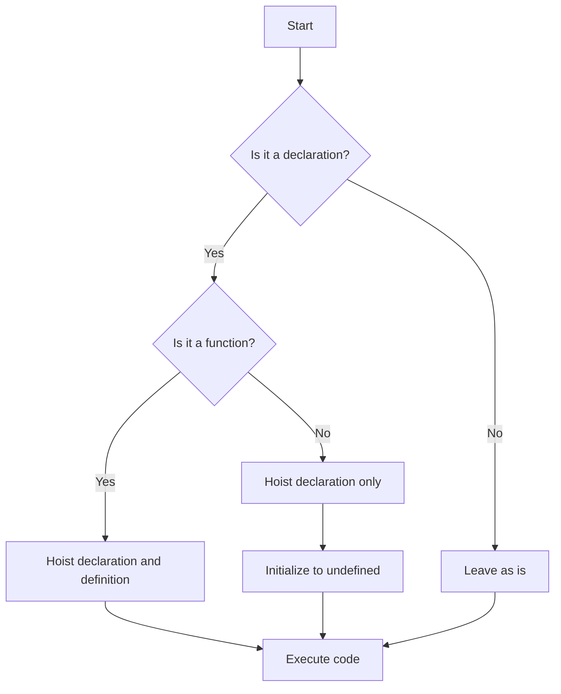

## 12.3. Hoisting Experiments

In this section, we'll dive into the fascinating world of JavaScript hoisting through hands-on experiments. Hoisting is a JavaScript mechanism where variable and function declarations are moved to the top of their containing scope during the compile phase. This behavior can lead to unexpected results if not well understood. By the end of this section, you'll have a solid grasp of how hoisting works and how it affects your code.

### Understanding Hoisting

Before we jump into experiments, let's briefly review what hoisting is. In JavaScript, hoisting allows you to use variables and functions before they are declared in the code. However, it's important to note that only the declarations are hoisted, not the initializations.

For example, consider the following code snippet:

```javascript
console.log(myVar); // Outputs: undefined
var myVar = 5;
```

In this case, the declaration `var myVar;` is hoisted to the top, but the assignment `myVar = 5;` remains in place. Therefore, when `console.log(myVar);` is executed, `myVar` is `undefined`.

### Experiment 1: Hoisting with `var`

Let's start by experimenting with the `var` keyword, which is the most common example of hoisting.

#### Code Example

```javascript
console.log(a); // What do you expect to see?
var a = 10;
console.log(a); // What about now?
```

#### Try It Yourself

1. Copy the code above into your JavaScript console or a code editor.
2. Run the code and observe the output.
3. Modify the code by changing the value of `a` and see how it affects the output.

#### Explanation

In the first `console.log(a);`, the output is `undefined`. This is because the declaration `var a;` is hoisted to the top, but the assignment `a = 10;` is not. Therefore, `a` is declared but not initialized when the first `console.log(a);` is executed. After the assignment, the second `console.log(a);` outputs `10`.

### Experiment 2: Hoisting with `let` and `const`

Unlike `var`, the `let` and `const` keywords do not allow you to access the variable before its declaration. This is due to the Temporal Dead Zone (TDZ), which is the time between entering a block and the variable being declared.

#### Code Example

```javascript
console.log(b); // What do you expect to see?
let b = 20;
console.log(b); // What about now?

console.log(c); // And here?
const c = 30;
console.log(c); // Finally, what do you see?
```

#### Try It Yourself

1. Copy the code above into your JavaScript console or a code editor.
2. Run the code and observe the output.
3. Modify the code by changing the values of `b` and `c` and see how it affects the output.

#### Explanation

When you run the code, you'll encounter a `ReferenceError` for both `console.log(b);` and `console.log(c);`. This is because `let` and `const` declarations are hoisted, but they are not initialized until the declaration is evaluated. Therefore, accessing them before their declaration results in an error.

### Experiment 3: Function Hoisting

Functions in JavaScript are also hoisted, but they behave slightly differently than variables. Function declarations are hoisted with their definitions, meaning you can call a function before it is defined in the code.

#### Code Example

```javascript
console.log(add(2, 3)); // What do you expect to see?

function add(x, y) {
  return x + y;
}

console.log(add(5, 7)); // And here?
```

#### Try It Yourself

1. Copy the code above into your JavaScript console or a code editor.
2. Run the code and observe the output.
3. Modify the function to perform a different operation and see how it affects the output.

#### Explanation

In this example, both `console.log(add(2, 3));` and `console.log(add(5, 7));` work as expected, outputting `5` and `12`, respectively. This is because the entire function declaration, including its body, is hoisted to the top of the scope.

### Experiment 4: Function Expressions and Hoisting

Function expressions, unlike function declarations, are not hoisted with their definitions. This means you cannot call a function expression before it is defined.

#### Code Example

```javascript
console.log(subtract(10, 5)); // What do you expect to see?

var subtract = function(x, y) {
  return x - y;
};

console.log(subtract(10, 5)); // And here?
```

#### Try It Yourself

1. Copy the code above into your JavaScript console or a code editor.
2. Run the code and observe the output.
3. Modify the function to perform a different operation and see how it affects the output.

#### Explanation

In this case, the first `console.log(subtract(10, 5));` results in a `TypeError` because `subtract` is `undefined` at that point. The declaration `var subtract;` is hoisted, but the assignment `subtract = function(x, y) {...};` is not. Therefore, `subtract` is not a function when the first `console.log` is executed.

### Visualizing Hoisting

To better understand hoisting, let's visualize how JavaScript handles variable and function declarations during the compile phase.



**Diagram Description:** This flowchart illustrates how JavaScript handles declarations during the compile phase. Function declarations are hoisted with their definitions, while variable declarations are hoisted without their initializations.

### Experiment 5: Hoisting in Loops

Hoisting can also affect variables declared within loops. Let's see how this works.

#### Code Example

```javascript
for (var i = 0; i < 3; i++) {
  console.log(i); // What do you expect to see?
}

console.log(i); // What about now?
```

#### Try It Yourself

1. Copy the code above into your JavaScript console or a code editor.
2. Run the code and observe the output.
3. Modify the loop to use `let` instead of `var` and see how it affects the output.

#### Explanation

When you run the code, you'll see `0`, `1`, `2`, and then `3`. This is because the `var i;` declaration is hoisted to the top of the function or global scope, making `i` accessible outside the loop. If you change `var` to `let`, the output will be `0`, `1`, `2`, and then a `ReferenceError` because `i` is block-scoped with `let`.

### Experiment 6: Hoisting with `let` and `const` in Loops

Let's see how `let` and `const` behave differently in loops due to block scoping.

#### Code Example

```javascript
for (let j = 0; j < 3; j++) {
  console.log(j); // What do you expect to see?
}

console.log(j); // What about now?
```

#### Try It Yourself

1. Copy the code above into your JavaScript console or a code editor.
2. Run the code and observe the output.
3. Modify the loop to use `const` instead of `let` and see how it affects the output.

#### Explanation

When you run the code, you'll see `0`, `1`, `2`, and then a `ReferenceError`. This is because `let` is block-scoped, so `j` is not accessible outside the loop. If you change `let` to `const`, you'll encounter a `TypeError` because `const` requires an initializer and cannot be reassigned.

### Experiment 7: Hoisting in Nested Functions

Hoisting can also affect variables and functions within nested functions. Let's explore this behavior.

#### Code Example

```javascript
function outer() {
  console.log(innerVar); // What do you expect to see?
  var innerVar = "I'm inside!";
  console.log(innerVar); // What about now?

  function inner() {
    console.log("Inner function");
  }

  inner();
}

outer();
```

#### Try It Yourself

1. Copy the code above into your JavaScript console or a code editor.
2. Run the code and observe the output.
3. Modify the `inner` function to perform a different operation and see how it affects the output.

#### Explanation

In this example, the first `console.log(innerVar);` outputs `undefined` because `var innerVar;` is hoisted, but not initialized. The second `console.log(innerVar);` outputs `"I'm inside!"` after the assignment. The `inner` function is hoisted with its definition, so it can be called before its declaration.

### Experiment 8: Hoisting with Arrow Functions

Arrow functions, introduced in ES6, are not hoisted like traditional function declarations. They behave like function expressions.

#### Code Example

```javascript
console.log(arrowFunc(5, 10)); // What do you expect to see?

var arrowFunc = (x, y) => x + y;

console.log(arrowFunc(5, 10)); // And here?
```

#### Try It Yourself

1. Copy the code above into your JavaScript console or a code editor.
2. Run the code and observe the output.
3. Modify the arrow function to perform a different operation and see how it affects the output.

#### Explanation

The first `console.log(arrowFunc(5, 10));` results in a `TypeError` because `arrowFunc` is `undefined` at that point. The declaration `var arrowFunc;` is hoisted, but the assignment `arrowFunc = (x, y) => x + y;` is not. Therefore, `arrowFunc` is not a function when the first `console.log` is executed.

### Experiment 9: Hoisting in Conditional Statements

Hoisting can also affect variables declared within conditional statements. Let's see how this works.

#### Code Example

```javascript
if (true) {
  console.log(condVar); // What do you expect to see?
  var condVar = "Conditional variable";
  console.log(condVar); // What about now?
}

console.log(condVar); // And here?
```

#### Try It Yourself

1. Copy the code above into your JavaScript console or a code editor.
2. Run the code and observe the output.
3. Modify the code to use `let` instead of `var` and see how it affects the output.

#### Explanation

When you run the code, you'll see `undefined`, `"Conditional variable"`, and `"Conditional variable"`. This is because `var condVar;` is hoisted to the top of the function or global scope, making `condVar` accessible outside the conditional block. If you change `var` to `let`, the first `console.log(condVar);` results in a `ReferenceError` because `let` is block-scoped.

### Key Takeaways

- **Hoisting** is a JavaScript mechanism that moves variable and function declarations to the top of their containing scope.
- **`var`** declarations are hoisted and initialized to `undefined`, while **`let`** and **`const`** declarations are hoisted but not initialized, resulting in a `ReferenceError` if accessed before declaration.
- **Function declarations** are hoisted with their definitions, allowing them to be called before they are defined in the code.
- **Function expressions** and **arrow functions** are not hoisted with their definitions, leading to a `TypeError` if called before assignment.
- **Block scoping** with `let` and `const` prevents variables from being accessed outside their block, unlike `var`, which is function-scoped or globally scoped.

### Embrace the Journey

Remember, understanding hoisting is crucial for writing predictable and bug-free JavaScript code. As you continue your learning journey, keep experimenting with different scenarios and observe how hoisting affects your code. Stay curious, and enjoy the process of mastering JavaScript!

## Quiz Time!



### What is hoisting in JavaScript?

- [x] The process of moving variable and function declarations to the top of their containing scope.
- [ ] The process of executing code line by line.
- [ ] The process of optimizing code for performance.
- [ ] The process of converting data types automatically.

> **Explanation:** Hoisting is a JavaScript mechanism where variable and function declarations are moved to the top of their containing scope during the compile phase.

### What is the output of the following code?

```javascript
console.log(x);
var x = 10;
```

- [x] undefined
- [ ] 10
- [ ] ReferenceError
- [ ] TypeError

> **Explanation:** The declaration `var x;` is hoisted, so `x` is `undefined` when the first `console.log(x);` is executed.

### What happens when you try to access a `let` variable before its declaration?

- [ ] It returns undefined.
- [x] It throws a ReferenceError.
- [ ] It returns null.
- [ ] It throws a TypeError.

> **Explanation:** `let` and `const` declarations are hoisted but not initialized, resulting in a `ReferenceError` if accessed before declaration.

### Which of the following is true about function declarations?

- [x] They are hoisted with their definitions.
- [ ] They are not hoisted at all.
- [ ] They are hoisted without their definitions.
- [ ] They are only hoisted in strict mode.

> **Explanation:** Function declarations are hoisted with their definitions, allowing them to be called before they are defined in the code.

### What is the output of the following code?

```javascript
console.log(add(2, 3));

function add(x, y) {
  return x + y;
}
```

- [x] 5
- [ ] undefined
- [ ] ReferenceError
- [ ] TypeError

> **Explanation:** The function `add` is hoisted with its definition, so it can be called before its declaration.

### What is the Temporal Dead Zone (TDZ)?

- [x] The time between entering a block and the variable being declared.
- [ ] The time between variable declaration and initialization.
- [ ] The time between function call and execution.
- [ ] The time between script loading and execution.

> **Explanation:** The Temporal Dead Zone (TDZ) is the time between entering a block and the variable being declared, during which accessing the variable results in a `ReferenceError`.

### What is the output of the following code?

```javascript
console.log(subtract(10, 5));

var subtract = function(x, y) {
  return x - y;
};
```

- [ ] 5
- [ ] undefined
- [x] TypeError
- [ ] ReferenceError

> **Explanation:** The declaration `var subtract;` is hoisted, but the assignment is not, so `subtract` is `undefined` when the first `console.log` is executed, resulting in a `TypeError`.

### How does `let` behave differently from `var` in loops?

- [x] `let` is block-scoped, while `var` is function-scoped.
- [ ] `let` is function-scoped, while `var` is block-scoped.
- [ ] `let` is hoisted, while `var` is not.
- [ ] `let` is not hoisted, while `var` is.

> **Explanation:** `let` is block-scoped, meaning it cannot be accessed outside the loop, unlike `var`, which is function-scoped or globally scoped.

### What is the output of the following code?

```javascript
if (true) {
  console.log(condVar);
  var condVar = "Conditional variable";
  console.log(condVar);
}

console.log(condVar);
```

- [x] undefined, "Conditional variable", "Conditional variable"
- [ ] ReferenceError
- [ ] TypeError
- [ ] "Conditional variable", "Conditional variable", undefined

> **Explanation:** The declaration `var condVar;` is hoisted, so `condVar` is `undefined` when the first `console.log` is executed. After the assignment, `condVar` is accessible outside the block.

### True or False: Arrow functions are hoisted like traditional function declarations.

- [ ] True
- [x] False

> **Explanation:** Arrow functions are not hoisted like traditional function declarations. They behave like function expressions and are not hoisted with their definitions.


