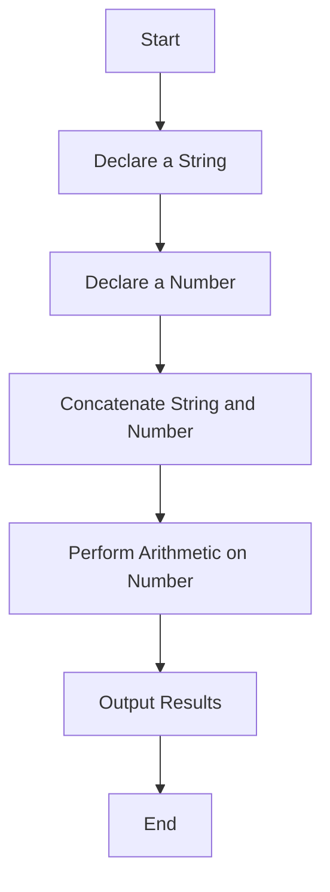

## 12.4. Data Type Manipulation

Welcome to the exciting world of data type manipulation in JavaScript! In this section, we will explore how to work with different data types through practical exercises. By the end of this chapter, you'll be comfortable performing operations like concatenation, arithmetic, and logical comparisons using JavaScript's built-in methods. Let's dive in!

### Understanding JavaScript Data Types

Before we jump into exercises, let's briefly revisit the primary data types in JavaScript:

1. **Numbers**: Represent both integer and floating-point numbers.
2. **Strings**: Used for text, enclosed in single (`'`), double (`"`), or backticks (`` ` ``).
3. **Booleans**: Represent logical values, either `true` or `false`.
4. **Undefined**: A variable that has been declared but not assigned a value.
5. **Null**: Represents the intentional absence of any object value.
6. **Symbols**: Unique and immutable primitive values, often used as object keys.
7. **BigInt**: For representing integers larger than the `Number` type can safely handle.

### Exercise 1: Working with Numbers

**Task**: Perform basic arithmetic operations and explore built-in methods for numbers.

#### Instructions

- Declare two variables with numeric values.
- Perform addition, subtraction, multiplication, and division.
- Use the `Math` object to round numbers and find the maximum and minimum values.

#### Example

```javascript
// Declare two numeric variables
let num1 = 25;
let num2 = 10;

// Perform arithmetic operations
let sum = num1 + num2; // Addition
let difference = num1 - num2; // Subtraction
let product = num1 * num2; // Multiplication
let quotient = num1 / num2; // Division

console.log(`Sum: ${sum}`); // Output: Sum: 35
console.log(`Difference: ${difference}`); // Output: Difference: 15
console.log(`Product: ${product}`); // Output: Product: 250
console.log(`Quotient: ${quotient}`); // Output: Quotient: 2.5

// Use Math object methods
let rounded = Math.round(quotient); // Round the quotient
let max = Math.max(num1, num2); // Find maximum
let min = Math.min(num1, num2); // Find minimum

console.log(`Rounded Quotient: ${rounded}`); // Output: Rounded Quotient: 3
console.log(`Max: ${max}`); // Output: Max: 25
console.log(`Min: ${min}`); // Output: Min: 10
```

#### Discussion

The `Math` object provides several methods for mathematical operations. In this example, we used `Math.round()` to round a number, `Math.max()` to find the maximum, and `Math.min()` to find the minimum. Experiment with other methods like `Math.sqrt()` for square roots or `Math.pow()` for exponentiation.

### Exercise 2: String Manipulation

**Task**: Concatenate strings and explore string methods.

#### Instructions

- Declare two string variables.
- Concatenate them using the `+` operator and template literals.
- Use string methods like `toUpperCase()`, `toLowerCase()`, and `slice()`.

#### Example

```javascript
// Declare two string variables
let greeting = "Hello";
let name = "World";

// Concatenate strings
let message1 = greeting + " " + name + "!"; // Using + operator
let message2 = `${greeting} ${name}!`; // Using template literals

console.log(message1); // Output: Hello World!
console.log(message2); // Output: Hello World!

// Use string methods
let upperCaseMessage = message1.toUpperCase(); // Convert to uppercase
let lowerCaseMessage = message1.toLowerCase(); // Convert to lowercase
let slicedMessage = message1.slice(0, 5); // Extract a portion of the string

console.log(`Uppercase: ${upperCaseMessage}`); // Output: Uppercase: HELLO WORLD!
console.log(`Lowercase: ${lowerCaseMessage}`); // Output: Lowercase: hello world!
console.log(`Sliced: ${slicedMessage}`); // Output: Sliced: Hello
```

#### Discussion

String manipulation is a powerful tool in JavaScript. The `toUpperCase()` and `toLowerCase()` methods are useful for normalizing text, while `slice()` allows you to extract specific parts of a string. Try experimenting with other methods like `substring()` and `replace()`.

### Exercise 3: Boolean Logic

**Task**: Perform logical comparisons and explore boolean operations.

#### Instructions

- Declare two boolean variables.
- Use logical operators (`&&`, `||`, `!`) to evaluate expressions.
- Compare numbers and strings to produce boolean results.

#### Example

```javascript
// Declare two boolean variables
let isSunny = true;
let isWeekend = false;

// Logical operations
let goForAWalk = isSunny && isWeekend; // Logical AND
let stayIndoors = !isSunny || !isWeekend; // Logical OR and NOT

console.log(`Go for a walk: ${goForAWalk}`); // Output: Go for a walk: false
console.log(`Stay indoors: ${stayIndoors}`); // Output: Stay indoors: true

// Compare numbers and strings
let isEqual = (5 === 5); // Strict equality
let isNotEqual = ("hello" !== "world"); // Strict inequality

console.log(`Is equal: ${isEqual}`); // Output: Is equal: true
console.log(`Is not equal: ${isNotEqual}`); // Output: Is not equal: true
```

#### Discussion

Boolean logic is fundamental in controlling program flow. The logical operators `&&` (AND), `||` (OR), and `!` (NOT) allow you to build complex conditions. Remember, `===` checks for strict equality, meaning both value and type must match.

### Exercise 4: Handling Undefined and Null

**Task**: Differentiate between `undefined` and `null` and handle them in code.

#### Instructions

- Declare a variable without assigning a value.
- Assign `null` to a variable and compare it with `undefined`.
- Use conditional statements to handle `undefined` and `null`.

#### Example

```javascript
// Declare a variable without assigning a value
let uninitializedVariable;

// Assign null to a variable
let emptyValue = null;

// Compare undefined and null
let isUndefined = (uninitializedVariable === undefined);
let isNull = (emptyValue === null);

console.log(`Is undefined: ${isUndefined}`); // Output: Is undefined: true
console.log(`Is null: ${isNull}`); // Output: Is null: true

// Handle undefined and null
if (uninitializedVariable === undefined) {
    console.log("Variable is undefined.");
} else if (emptyValue === null) {
    console.log("Variable is null.");
} else {
    console.log("Variable has a value.");
}
```

#### Discussion

`undefined` is the default value for uninitialized variables, while `null` is an assignment value representing "no value." Use conditional statements to check for these states and handle them appropriately in your code.

### Exercise 5: Using Symbols

**Task**: Create and use symbols as unique identifiers.

#### Instructions

- Create a symbol and assign it to a variable.
- Use symbols as object keys.
- Compare symbols to demonstrate their uniqueness.

#### Example

```javascript
// Create a symbol
let uniqueId = Symbol("id");

// Use symbols as object keys
let user = {
    [uniqueId]: 12345,
    name: "Alice"
};

console.log(user[uniqueId]); // Output: 12345

// Compare symbols
let anotherId = Symbol("id");
console.log(uniqueId === anotherId); // Output: false
```

#### Discussion

Symbols are unique and immutable, making them ideal for object keys where uniqueness is required. Even if two symbols have the same description, they are different entities.

### Exercise 6: Working with BigInt

**Task**: Perform operations with `BigInt` for large integers.

#### Instructions

- Declare a `BigInt` variable.
- Perform arithmetic operations with `BigInt`.
- Compare `BigInt` with regular numbers.

#### Example

```javascript
// Declare a BigInt variable
let bigIntValue = 1234567890123456789012345678901234567890n;

// Perform arithmetic operations
let bigIntSum = bigIntValue + 10n;
let bigIntProduct = bigIntValue * 2n;

console.log(`BigInt Sum: ${bigIntSum}`); // Output: BigInt Sum: 1234567890123456789012345678901234567900n
console.log(`BigInt Product: ${bigIntProduct}`); // Output: BigInt Product: 2469135780246913578024691357802469135780n

// Compare BigInt with regular numbers
let regularNumber = 12345;
console.log(bigIntValue > regularNumber); // Output: true
```

#### Discussion

`BigInt` allows you to work with integers beyond the safe limit of the `Number` type. Note that operations between `BigInt` and regular numbers require explicit conversion.

### Try It Yourself

Now it's your turn! Modify the examples above to experiment with different inputs and operations. For instance, try using different string methods, or explore more `Math` object functions. The more you practice, the more comfortable you'll become with data type manipulation in JavaScript.

### Visualizing Data Type Manipulation

To help visualize how JavaScript handles different data types, let's look at a simple flowchart illustrating the process of manipulating a string and a number:



**Caption**: This flowchart represents a basic process of declaring a string and a number, concatenating them, performing arithmetic on the number, and outputting the results.

### Key Takeaways

- **Data Types**: JavaScript supports various data types, each with unique properties and methods.
- **Arithmetic and Concatenation**: Use arithmetic operators for numbers and concatenation for strings.
- **Boolean Logic**: Logical operators help control program flow.
- **Handling Undefined and Null**: Differentiate and handle these states in your code.
- **Symbols and BigInt**: Use symbols for unique identifiers and `BigInt` for large integers.

### References and Links

- [MDN Web Docs: JavaScript Data Types](https://developer.mozilla.org/en-US/docs/Web/JavaScript/Data_structures)
- [W3Schools: JavaScript Numbers](https://www.w3schools.com/js/js_numbers.asp)
- [MDN Web Docs: Math Object](https://developer.mozilla.org/en-US/docs/Web/JavaScript/Reference/Global_Objects/Math)
- [MDN Web Docs: String Methods](https://developer.mozilla.org/en-US/docs/Web/JavaScript/Reference/Global_Objects/String)

## Quiz Time!



### What is the result of `5 + "5"` in JavaScript?

- [x] "55"
- [ ] 10
- [ ] "10"
- [ ] Error

> **Explanation:** When a number is added to a string, JavaScript performs type coercion and converts the number to a string, resulting in concatenation.


### Which method converts a string to uppercase?

- [ ] toLowerCase()
- [x] toUpperCase()
- [ ] slice()
- [ ] concat()

> **Explanation:** The `toUpperCase()` method converts all characters in a string to uppercase.


### What does `Math.max(5, 10, 15)` return?

- [ ] 5
- [ ] 10
- [x] 15
- [ ] Error

> **Explanation:** `Math.max()` returns the largest of the given numbers, which is 15 in this case.


### How do you declare a BigInt in JavaScript?

- [ ] 12345
- [ ] "12345"
- [x] 12345n
- [ ] BigInt(12345)

> **Explanation:** A `BigInt` is declared by appending `n` to the end of an integer, like `12345n`.


### Which operator is used for strict equality comparison?

- [ ] ==
- [x] ===
- [ ] !=
- [ ] !==

> **Explanation:** The `===` operator checks for strict equality, meaning both value and type must match.


### What is the output of `typeof null`?

- [ ] "null"
- [x] "object"
- [ ] "undefined"
- [ ] "boolean"

> **Explanation:** Due to a historical bug in JavaScript, `typeof null` returns "object".


### Which of the following is a unique and immutable primitive value?

- [ ] Number
- [x] Symbol
- [ ] String
- [ ] Boolean

> **Explanation:** Symbols are unique and immutable primitive values, often used as object keys.


### What does `5 > 3 && 2 < 4` evaluate to?

- [x] true
- [ ] false
- [ ] undefined
- [ ] null

> **Explanation:** Both conditions are true, so the logical AND (`&&`) operator returns true.


### What is the result of `null == undefined`?

- [x] True
- [ ] False

> **Explanation:** In JavaScript, `null` and `undefined` are loosely equal (`==`), but not strictly equal (`===`).


### Which method extracts a portion of a string?

- [ ] concat()
- [ ] toUpperCase()
- [x] slice()
- [ ] split()

> **Explanation:** The `slice()` method extracts a portion of a string and returns it as a new string.



Remember, this is just the beginning. As you progress, you'll build more complex and interactive web pages. Keep experimenting, stay curious, and enjoy the journey!
