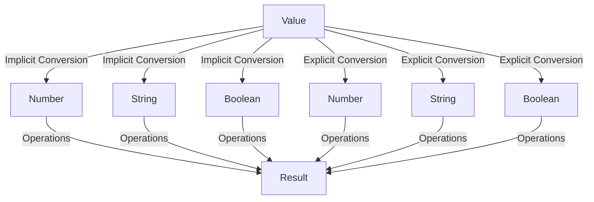

## 12.5. Type Conversion Challenges

In this section, we will dive into the fascinating world of type conversion in JavaScript. As you may already know, JavaScript is a dynamically typed language, which means that variables can hold values of any type without any explicit declaration. While this feature provides flexibility, it also introduces the need for type conversion to ensure that operations are performed correctly. Let's explore some practical exercises and challenges that will help you master type conversion in JavaScript.

### Understanding Type Conversion

Type conversion, also known as type coercion, is the process of converting a value from one data type to another. In JavaScript, this can happen implicitly or explicitly:

- **Implicit Conversion**: JavaScript automatically converts types when it deems necessary, often during operations involving different data types.
- **Explicit Conversion**: The developer manually converts a value from one type to another using functions or operators.

Understanding when and how to perform type conversion is crucial for writing robust JavaScript code. Let's explore some common scenarios where type conversion is necessary and how to handle them effectively.

### Scenario 1: Concatenating Numbers and Strings

Imagine you are building a web application that displays a user's age in a sentence. You have a variable `age` that holds a number, and you want to concatenate it with a string. Here's how you can achieve this:

```javascript
let age = 25;
let message = "You are " + age + " years old.";
console.log(message); // Output: "You are 25 years old."
```

In this example, JavaScript implicitly converts the number `age` to a string during the concatenation process. However, if you need to ensure that `age` is always treated as a string, you can perform an explicit conversion:

```javascript
let age = 25;
let message = "You are " + String(age) + " years old.";
console.log(message); // Output: "You are 25 years old."
```

### Scenario 2: Calculating with User Input

User input in web forms is often received as strings, even if the input is numeric. To perform calculations, you must convert these strings to numbers. Consider the following example:

```javascript
let input1 = "10";
let input2 = "20";
let sum = input1 + input2;
console.log(sum); // Output: "1020"
```

Here, the `+` operator concatenates the strings instead of adding them numerically. To fix this, use the `Number` function for explicit conversion:

```javascript
let input1 = "10";
let input2 = "20";
let sum = Number(input1) + Number(input2);
console.log(sum); // Output: 30
```

### Common Pitfalls in Type Conversion

Type conversion can lead to unexpected results if not handled carefully. Let's explore some common pitfalls and how to avoid them.

#### Pitfall 1: Converting Non-Numeric Strings to Numbers

When converting a non-numeric string to a number, JavaScript returns `NaN` (Not-a-Number). This can cause issues in calculations:

```javascript
let input = "abc";
let number = Number(input);
console.log(number); // Output: NaN
```

To handle this, always validate user input before conversion:

```javascript
let input = "abc";
let number = Number(input);

if (isNaN(number)) {
  console.log("Invalid number");
} else {
  console.log("Valid number");
}
```

#### Pitfall 2: Using `parseInt` and `parseFloat` Incorrectly

`parseInt` and `parseFloat` are useful for extracting numbers from strings, but they can produce unexpected results if not used correctly:

```javascript
let input = "10.5px";
let number = parseInt(input);
console.log(number); // Output: 10

number = parseFloat(input);
console.log(number); // Output: 10.5
```

`parseInt` stops parsing at the first non-numeric character, while `parseFloat` continues until it encounters a non-numeric character. Always choose the appropriate function based on your needs.

### Scenario 3: Boolean Conversion

In JavaScript, certain values are considered "truthy" or "falsy" when converted to a boolean. Understanding these conversions is essential for writing effective conditional statements.

#### Truthy and Falsy Values

- **Falsy Values**: `false`, `0`, `""` (empty string), `null`, `undefined`, `NaN`
- **Truthy Values**: All other values, including non-empty strings, non-zero numbers, and objects

Consider the following example:

```javascript
let value = "";
if (value) {
  console.log("Truthy");
} else {
  console.log("Falsy");
}
// Output: "Falsy"
```

To explicitly convert a value to a boolean, use the `Boolean` function:

```javascript
let value = 0;
let isTruthy = Boolean(value);
console.log(isTruthy); // Output: false
```

### Scenario 4: Converting Objects to Primitives

When converting objects to primitive values, JavaScript uses the `valueOf` and `toString` methods. Understanding this process is crucial for custom object conversions.

#### Custom Object Conversion

Consider an object representing a point in a 2D space:

```javascript
let point = {
  x: 10,
  y: 20,
  toString: function() {
    return `(${this.x}, ${this.y})`;
  }
};

console.log(String(point)); // Output: "(10, 20)"
```

In this example, the `toString` method is used to convert the object to a string. You can also define a `valueOf` method for numeric conversions:

```javascript
let point = {
  x: 10,
  y: 20,
  valueOf: function() {
    return this.x + this.y;
  }
};

console.log(Number(point)); // Output: 30
```

### Try It Yourself

Now that we've covered the basics of type conversion, it's time to put your knowledge to the test. Try modifying the following code examples to see how different conversions affect the output:

1. **Modify the Concatenation Example**: Change the `age` variable to a string and observe the output. What happens if you use `Number(age)` instead?

2. **Experiment with User Input**: Create a simple calculator that takes two numeric inputs as strings and performs addition, subtraction, multiplication, and division. Ensure that the inputs are converted to numbers before performing calculations.

3. **Explore Boolean Conversion**: Test different values (e.g., `null`, `undefined`, `1`, `-1`, `"false"`) to see how they convert to booleans. Use `console.log` to display the results.

4. **Create a Custom Object**: Define an object with both `toString` and `valueOf` methods. Experiment with converting the object to different types and observe the behavior.

### Visualizing Type Conversion

To better understand the process of type conversion, let's visualize how JavaScript handles these conversions internally. The following diagram illustrates the flow of type conversion in JavaScript:



In this diagram, we see how a value can undergo both implicit and explicit conversions to different types, ultimately leading to a result through various operations.

### References and Further Reading

For more information on type conversion in JavaScript, consider exploring the following resources:

- [MDN Web Docs: Type Conversion](https://developer.mozilla.org/en-US/docs/Web/JavaScript/Guide/Type_Conversion)
- [W3Schools: JavaScript Type Conversion](https://www.w3schools.com/js/js_type_conversion.asp)

### Knowledge Check

Let's reinforce what we've learned with a few questions and challenges:

1. What is the difference between implicit and explicit type conversion?
2. How can you convert a string to a number in JavaScript?
3. What are some common pitfalls to watch out for when performing type conversion?
4. How does JavaScript handle the conversion of objects to primitive values?
5. Why is it important to understand truthy and falsy values in JavaScript?

### Embrace the Journey

Remember, mastering type conversion is a crucial step in becoming proficient in JavaScript. As you continue to experiment and learn, you'll gain a deeper understanding of how JavaScript handles data types and conversions. Keep practicing, stay curious, and enjoy the journey!

## Quiz Time!



### What is implicit type conversion in JavaScript?

- [x] Automatic conversion of data types by JavaScript
- [ ] Manual conversion of data types by the developer
- [ ] Conversion using the `parseInt` function
- [ ] Conversion using the `toString` method

> **Explanation:** Implicit type conversion is when JavaScript automatically converts data types during operations.

### How can you explicitly convert a string to a number in JavaScript?

- [x] Using the `Number` function
- [ ] Using the `Boolean` function
- [ ] Using the `String` function
- [ ] Using the `parseBoolean` function

> **Explanation:** The `Number` function is used for explicit conversion of strings to numbers.

### Which of the following values is considered falsy in JavaScript?

- [x] `0`
- [ ] `"false"`
- [ ] `{}`
- [ ] `[]`

> **Explanation:** `0` is a falsy value in JavaScript, while the others are truthy.

### What does the `parseInt` function do?

- [x] Converts a string to an integer
- [ ] Converts a number to a string
- [ ] Converts a boolean to a number
- [ ] Converts an object to a string

> **Explanation:** The `parseInt` function extracts an integer from a string.

### How can you check if a value is `NaN` in JavaScript?

- [x] Using the `isNaN` function
- [ ] Using the `Number` function
- [ ] Using the `parseInt` function
- [ ] Using the `Boolean` function

> **Explanation:** The `isNaN` function is used to check if a value is `NaN`.

### What is the result of `Number("abc")` in JavaScript?

- [x] `NaN`
- [ ] `0`
- [ ] `null`
- [ ] `undefined`

> **Explanation:** Converting a non-numeric string to a number results in `NaN`.

### Which method is used to convert an object to a string in JavaScript?

- [x] `toString`
- [ ] `valueOf`
- [ ] `parseInt`
- [ ] `Boolean`

> **Explanation:** The `toString` method is used to convert objects to strings.

### What is the output of `Boolean("")` in JavaScript?

- [x] `false`
- [ ] `true`
- [ ] `null`
- [ ] `undefined`

> **Explanation:** An empty string is a falsy value, so `Boolean("")` returns `false`.

### Which of the following is a truthy value in JavaScript?

- [x] `1`
- [ ] `0`
- [ ] `""`
- [ ] `null`

> **Explanation:** `1` is a truthy value, while the others are falsy.

### True or False: JavaScript can automatically convert objects to primitive values.

- [x] True
- [ ] False

> **Explanation:** JavaScript can automatically convert objects to primitive values using methods like `toString` and `valueOf`.




