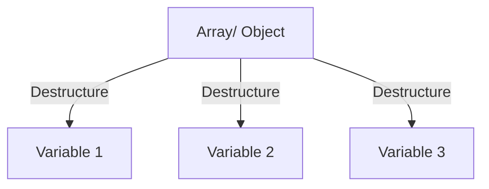
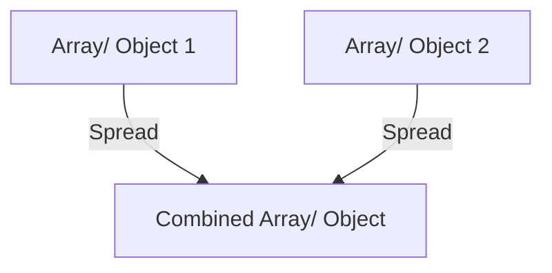

## 12.6. Destructuring and Spread Operator

Welcome to the exciting world of JavaScript's destructuring and spread operator! These ES6 features are designed to make your code more readable and efficient. In this section, we'll dive into practical exercises that will help you master these powerful tools. We'll explore how to extract values from arrays and objects, combine and copy data structures, and refactor code using these techniques.

### Understanding Destructuring

Destructuring is a convenient way of extracting multiple values from data stored in objects and arrays. It allows you to unpack values from arrays or properties from objects into distinct variables.

#### Destructuring Arrays

Let's start with arrays. Imagine you have an array of colors:

```javascript
const colors = ['red', 'green', 'blue'];
```

With destructuring, you can extract these values into individual variables:

```javascript
const [firstColor, secondColor, thirdColor] = colors;

console.log(firstColor); // Output: red
console.log(secondColor); // Output: green
console.log(thirdColor); // Output: blue
```

**Exercise 1: Extracting Values from Arrays**

1. Given the array `const fruits = ['apple', 'banana', 'cherry', 'date'];`, extract the first and third fruits into variables `firstFruit` and `thirdFruit`.
2. Log the values of `firstFruit` and `thirdFruit` to the console.

**Solution:**

```javascript
const fruits = ['apple', 'banana', 'cherry', 'date'];
const [firstFruit, , thirdFruit] = fruits;

console.log(firstFruit); // Output: apple
console.log(thirdFruit); // Output: cherry
```

#### Destructuring Objects

Objects can also be destructured. Consider the following object:

```javascript
const person = {
  name: 'Alice',
  age: 25,
  city: 'Wonderland'
};
```

You can extract properties into variables like this:

```javascript
const { name, age, city } = person;

console.log(name); // Output: Alice
console.log(age); // Output: 25
console.log(city); // Output: Wonderland
```

**Exercise 2: Extracting Properties from Objects**

1. Given the object `const book = { title: '1984', author: 'George Orwell', year: 1949 };`, extract the `title` and `year` into variables.
2. Log the values of `title` and `year` to the console.

**Solution:**

```javascript
const book = { title: '1984', author: 'George Orwell', year: 1949 };
const { title, year } = book;

console.log(title); // Output: 1984
console.log(year); // Output: 1949
```

### The Spread Operator

The spread operator (`...`) allows you to expand elements of an iterable (like an array) or properties of an object.

#### Using the Spread Operator with Arrays

You can use the spread operator to combine arrays:

```javascript
const array1 = [1, 2, 3];
const array2 = [4, 5, 6];

const combinedArray = [...array1, ...array2];

console.log(combinedArray); // Output: [1, 2, 3, 4, 5, 6]
```

**Exercise 3: Combining Arrays**

1. Combine the arrays `const numbers1 = [10, 20, 30];` and `const numbers2 = [40, 50, 60];` using the spread operator.
2. Log the combined array to the console.

**Solution:**

```javascript
const numbers1 = [10, 20, 30];
const numbers2 = [40, 50, 60];

const combinedNumbers = [...numbers1, ...numbers2];

console.log(combinedNumbers); // Output: [10, 20, 30, 40, 50, 60]
```

#### Using the Spread Operator with Objects

The spread operator can also be used to copy or merge objects:

```javascript
const obj1 = { a: 1, b: 2 };
const obj2 = { c: 3, d: 4 };

const mergedObj = { ...obj1, ...obj2 };

console.log(mergedObj); // Output: { a: 1, b: 2, c: 3, d: 4 }
```

**Exercise 4: Merging Objects**

1. Merge the objects `const objA = { x: 10, y: 20 };` and `const objB = { z: 30, w: 40 };` using the spread operator.
2. Log the merged object to the console.

**Solution:**

```javascript
const objA = { x: 10, y: 20 };
const objB = { z: 30, w: 40 };

const mergedObject = { ...objA, ...objB };

console.log(mergedObject); // Output: { x: 10, y: 20, z: 30, w: 40 }
```

### Refactoring Code with Destructuring and Spread

Destructuring and the spread operator can significantly enhance the readability and efficiency of your code. Let's refactor some code using these features.

#### Refactoring with Destructuring

Consider the following function that extracts values from an object:

```javascript
function getPersonInfo(person) {
  const name = person.name;
  const age = person.age;
  const city = person.city;

  return `${name} is ${age} years old and lives in ${city}.`;
}
```

We can refactor this function using destructuring:

```javascript
function getPersonInfo({ name, age, city }) {
  return `${name} is ${age} years old and lives in ${city}.`;
}
```

**Exercise 5: Refactor with Destructuring**

1. Refactor the function `function getBookDetails(book) { const title = book.title; const author = book.author; return `${title} by ${author}`; }` using destructuring.
2. Test the refactored function with a sample book object.

**Solution:**

```javascript
function getBookDetails({ title, author }) {
  return `${title} by ${author}`;
}

const sampleBook = { title: 'The Great Gatsby', author: 'F. Scott Fitzgerald' };
console.log(getBookDetails(sampleBook)); // Output: The Great Gatsby by F. Scott Fitzgerald
```

#### Refactoring with the Spread Operator

Let's refactor code that combines arrays:

```javascript
function combineArrays(arr1, arr2) {
  return arr1.concat(arr2);
}
```

We can refactor this using the spread operator:

```javascript
function combineArrays(arr1, arr2) {
  return [...arr1, ...arr2];
}
```

**Exercise 6: Refactor with the Spread Operator**

1. Refactor the function `function mergeObjects(obj1, obj2) { return Object.assign({}, obj1, obj2); }` using the spread operator.
2. Test the refactored function with sample objects.

**Solution:**

```javascript
function mergeObjects(obj1, obj2) {
  return { ...obj1, ...obj2 };
}

const sampleObj1 = { a: 1, b: 2 };
const sampleObj2 = { c: 3, d: 4 };
console.log(mergeObjects(sampleObj1, sampleObj2)); // Output: { a: 1, b: 2, c: 3, d: 4 }
```

### Efficiency Gains with Destructuring and Spread

Using destructuring and the spread operator can lead to more concise and readable code. These features help reduce the need for repetitive code and make it easier to work with complex data structures.

#### Destructuring for Function Parameters

Destructuring can be particularly useful when dealing with function parameters. It allows you to extract only the necessary properties from an object, making your functions more flexible and easier to read.

**Exercise 7: Destructuring Function Parameters**

1. Write a function `displayUserInfo` that takes a user object and logs the user's name and email. Use destructuring for the function parameters.
2. Test the function with a sample user object.

**Solution:**

```javascript
function displayUserInfo({ name, email }) {
  console.log(`Name: ${name}, Email: ${email}`);
}

const user = { name: 'John Doe', email: 'john.doe@example.com', age: 30 };
displayUserInfo(user); // Output: Name: John Doe, Email: john.doe@example.com
```

#### Spread Operator for Immutable Updates

The spread operator is invaluable for creating immutable updates to objects and arrays. This is particularly useful in functional programming and when working with state management libraries like Redux.

**Exercise 8: Immutable Updates with the Spread Operator**

1. Create a function `updateUser` that takes a user object and an updates object. Return a new user object with the updates applied, using the spread operator.
2. Test the function with sample data.

**Solution:**

```javascript
function updateUser(user, updates) {
  return { ...user, ...updates };
}

const originalUser = { name: 'Alice', age: 25, city: 'Wonderland' };
const updates = { age: 26, city: 'New Wonderland' };
const updatedUser = updateUser(originalUser, updates);

console.log(updatedUser); // Output: { name: 'Alice', age: 26, city: 'New Wonderland' }
```

### Try It Yourself

Now that we've covered the basics of destructuring and the spread operator, it's time to experiment! Try modifying the code examples above to see how these features can be applied in different scenarios. Here are some suggestions:

- **Modify Array Destructuring**: Try extracting only the last element of an array using destructuring.
- **Combine Multiple Objects**: Use the spread operator to merge three or more objects.
- **Nested Destructuring**: Practice destructuring nested objects and arrays.
- **Function Refactoring**: Refactor a function that takes multiple parameters into one that uses destructuring.

### Visualizing Destructuring and Spread

To better understand how destructuring and the spread operator work, let's visualize these concepts using diagrams.

#### Destructuring Arrays and Objects



*Caption: Visual representation of destructuring arrays and objects into variables.*

#### Spread Operator



*Caption: Visual representation of combining arrays or objects using the spread operator.*

### Resources for Further Learning

- [MDN Web Docs: Destructuring Assignment](https://developer.mozilla.org/en-US/docs/Web/JavaScript/Reference/Operators/Destructuring_assignment)
- [MDN Web Docs: Spread Syntax](https://developer.mozilla.org/en-US/docs/Web/JavaScript/Reference/Operators/Spread_syntax)
- [JavaScript.info: Destructuring Assignment](https://javascript.info/destructuring-assignment)
- [JavaScript.info: Spread Operator](https://javascript.info/rest-parameters-spread-operator)

### Key Takeaways

- Destructuring allows you to extract values from arrays and objects into variables.
- The spread operator enables you to expand elements of an iterable or properties of an object.
- Both features enhance code readability and efficiency.
- Practice using these features to refactor and improve your code.

### Embrace the Journey

Remember, this is just the beginning. As you progress, you'll build more complex and interactive web pages. Keep experimenting, stay curious, and enjoy the journey!

## Quiz Time!



### What does the following code output?
```javascript
const [a, b] = [10, 20, 30];
console.log(a, b);
```

- [x] 10 20
- [ ] 10 30
- [ ] 20 30
- [ ] 30 10

> **Explanation:** The destructuring assignment `[a, b] = [10, 20, 30]` assigns the first two elements of the array to `a` and `b`.

### How can you extract the `name` and `age` properties from the object `{ name: 'Alice', age: 25 }`?

- [x] `const { name, age } = { name: 'Alice', age: 25 };`
- [ ] `const [name, age] = { name: 'Alice', age: 25 };`
- [ ] `const { name, age } = ['Alice', 25];`
- [ ] `const [name, age] = ['Alice', 25];`

> **Explanation:** The correct syntax for object destructuring is `const { name, age } = { name: 'Alice', age: 25 };`.

### What is the output of the following code?
```javascript
const arr1 = [1, 2];
const arr2 = [3, 4];
const combined = [...arr1, ...arr2];
console.log(combined);
```

- [x] [1, 2, 3, 4]
- [ ] [3, 4, 1, 2]
- [ ] [1, 2, [3, 4]]
- [ ] [[1, 2], [3, 4]]

> **Explanation:** The spread operator expands the elements of `arr1` and `arr2` into a new array, resulting in `[1, 2, 3, 4]`.

### How do you merge two objects `obj1` and `obj2` using the spread operator?

- [x] `const merged = { ...obj1, ...obj2 };`
- [ ] `const merged = { obj1, obj2 };`
- [ ] `const merged = [ ...obj1, ...obj2 ];`
- [ ] `const merged = obj1 + obj2;`

> **Explanation:** The spread operator `...` is used to merge objects by expanding their properties into a new object.

### What is the purpose of destructuring in JavaScript?

- [x] To extract values from arrays or properties from objects into distinct variables.
- [ ] To combine multiple arrays or objects into one.
- [ ] To create a new array or object with the same values.
- [ ] To remove elements from an array or object.

> **Explanation:** Destructuring is used to unpack values from arrays or properties from objects into distinct variables.

### Which of the following is a correct use of the spread operator with arrays?

- [x] `const newArray = [...oldArray, 4, 5];`
- [ ] `const newArray = [...oldArray, ...4, 5];`
- [ ] `const newArray = [oldArray, 4, 5];`
- [ ] `const newArray = oldArray + [4, 5];`

> **Explanation:** The spread operator `...` is used to expand the elements of `oldArray` into `newArray`.

### What does the spread operator do when used with objects?

- [x] It copies properties from one object to another.
- [ ] It deletes properties from an object.
- [ ] It creates a new object with the same properties.
- [ ] It merges two objects into an array.

> **Explanation:** The spread operator `...` copies properties from one object to another, allowing for easy merging or copying.

### How can you extract the second element of an array using destructuring?

- [x] `const [, second] = [1, 2, 3];`
- [ ] `const [second] = [1, 2, 3];`
- [ ] `const [1, second] = [1, 2, 3];`
- [ ] `const [2, second] = [1, 2, 3];`

> **Explanation:** The comma `,` is used to skip the first element, allowing you to extract the second element into `second`.

### What is the result of the following code?
```javascript
const obj = { a: 1, b: 2 };
const newObj = { ...obj, b: 3 };
console.log(newObj);
```

- [x] { a: 1, b: 3 }
- [ ] { a: 1, b: 2 }
- [ ] { b: 3 }
- [ ] { a: 1, b: 2, b: 3 }

> **Explanation:** The spread operator copies properties from `obj` to `newObj`, and the property `b` is overwritten with the new value `3`.

### True or False: The spread operator can be used to expand elements of an iterable into a new array or object.

- [x] True
- [ ] False

> **Explanation:** True. The spread operator `...` is used to expand elements of an iterable (like an array) into a new array or object.


