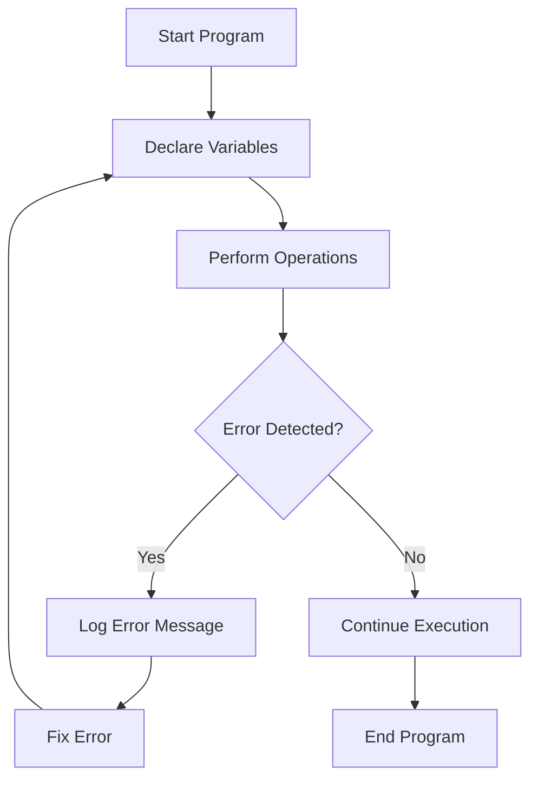

## 12.7. Debugging Practice

Debugging is an essential skill for any programmer. It involves identifying, analyzing, and fixing errors in your code. In this section, we will focus on debugging practices specifically related to variables and data types in JavaScript. We'll provide you with code snippets containing intentional errors and guide you through the process of identifying and correcting these issues. By the end of this section, you'll be equipped with systematic approaches to tackle various types of errors.

### Understanding Errors

Before diving into debugging exercises, let's briefly discuss the types of errors you might encounter in JavaScript:

1. **Syntax Errors**: These occur when the code violates the rules of the JavaScript language. They are usually detected by the JavaScript engine during the parsing phase.

2. **Runtime Errors**: These occur while the program is running. They are often caused by operations that are not possible to execute, such as accessing a variable that hasn't been defined.

3. **Logical Errors**: These occur when the code runs without crashing but produces incorrect results. They are often the most challenging to identify because the code doesn't throw any errors.

### Systematic Debugging Approaches

To effectively debug your code, consider the following systematic approaches:

- **Read the Error Message**: JavaScript error messages provide valuable information about what went wrong and where. Always start by reading the error message carefully.

- **Check Variable Declarations**: Ensure that all variables are declared correctly using `var`, `let`, or `const`.

- **Verify Data Types**: Make sure that variables are being used with the correct data types. JavaScript is dynamically typed, which can lead to unexpected behavior if types are not handled properly.

- **Use `console.log()`**: Insert `console.log()` statements to print variable values and track the flow of your program.

- **Step Through Code**: Use breakpoints and debuggers to step through your code line by line and observe the state of variables.

- **Simplify the Problem**: Break down complex code into smaller, manageable parts to isolate the source of the error.

### Debugging Exercises

Let's dive into some practical exercises. Each exercise contains a code snippet with intentional errors. Your task is to identify and fix these errors. After each exercise, we'll provide the corrected code along with an explanation of the fixes.

#### Exercise 1: Syntax Error

```javascript
function calculateArea(radius) {
    let area = Math.PI * radius * radius;
    return area
}

console.log(calculateArea(5));
```

**Task**: Identify and fix the syntax error in the code.

**Solution**:

```javascript
function calculateArea(radius) {
    let area = Math.PI * radius * radius;
    return area; // Added missing semicolon
}

console.log(calculateArea(5));
```

**Explanation**: The original code was missing a semicolon at the end of the `return` statement. While JavaScript can often handle missing semicolons, it's a good practice to include them to avoid potential issues.

#### Exercise 2: Runtime Error

```javascript
let numbers = [1, 2, 3, 4, 5];
console.log(numbers[5]);
```

**Task**: Identify and fix the runtime error in the code.

**Solution**:

```javascript
let numbers = [1, 2, 3, 4, 5];
console.log(numbers[4]); // Changed index to 4
```

**Explanation**: The original code attempted to access an index (5) that doesn't exist in the array. Arrays in JavaScript are zero-indexed, so the last element is at index 4.

#### Exercise 3: Logical Error

```javascript
function isEven(number) {
    return number % 2 == 1;
}

console.log(isEven(4)); // Should return true
```

**Task**: Identify and fix the logical error in the code.

**Solution**:

```javascript
function isEven(number) {
    return number % 2 == 0; // Changed condition to check for even numbers
}

console.log(isEven(4)); // Now returns true
```

**Explanation**: The original code incorrectly checked if a number is odd instead of even. The condition should be `number % 2 == 0` to check for even numbers.

#### Exercise 4: Type Error

```javascript
let name = "John";
console.log(name.toUpperCase);
```

**Task**: Identify and fix the type error in the code.

**Solution**:

```javascript
let name = "John";
console.log(name.toUpperCase()); // Added parentheses to call the function
```

**Explanation**: The original code attempted to access the `toUpperCase` method without calling it as a function. Adding parentheses `()` calls the method.

#### Exercise 5: Type Coercion Error

```javascript
let result = "5" + 2;
console.log(result); // Expected output: 7
```

**Task**: Identify and fix the type coercion error in the code.

**Solution**:

```javascript
let result = parseInt("5") + 2; // Used parseInt to convert string to number
console.log(result); // Now outputs 7
```

**Explanation**: The original code concatenated a string and a number, resulting in "52". Using `parseInt` converts the string to a number, allowing for arithmetic addition.

### Visualizing Debugging Concepts

To further enhance your understanding, let's visualize the flow of a simple JavaScript program and how errors can affect it.



**Diagram Description**: This flowchart represents a typical debugging process. The program starts by declaring variables and performing operations. If an error is detected, it logs an error message, and the programmer fixes the error before restarting the process. If no error is detected, the program continues execution.

### Try It Yourself

Now that you've seen some examples, try modifying the code snippets to introduce new errors and practice debugging them. Here are some suggestions:

- Change variable names to ones that haven't been declared.
- Use incorrect data types in operations.
- Introduce logical errors by altering conditions.

### Knowledge Check

Let's reinforce what we've learned with some questions and challenges:

1. What is the difference between a syntax error and a runtime error?
2. How can `console.log()` help in debugging?
3. Why is it important to use the correct data types in JavaScript?
4. What is type coercion, and how can it lead to errors?
5. How can you use breakpoints to debug JavaScript code?

### Embrace the Journey

Remember, debugging is a skill that improves with practice. As you encounter more complex code, you'll become more adept at identifying and fixing errors. Keep experimenting, stay curious, and enjoy the journey!

## Quiz Time!



### What type of error occurs when the code violates JavaScript's syntax rules?

- [x] Syntax Error
- [ ] Runtime Error
- [ ] Logical Error
- [ ] Type Error

> **Explanation:** Syntax errors occur when the code violates the rules of the JavaScript language.

### Which method can you use to print variable values to the console for debugging?

- [x] console.log()
- [ ] console.error()
- [ ] console.warn()
- [ ] console.info()

> **Explanation:** `console.log()` is commonly used to print variable values and track the flow of a program.

### What is the result of the expression `"5" + 2` in JavaScript?

- [ ] 7
- [ ] 52
- [x] "52"
- [ ] "7"

> **Explanation:** In JavaScript, the `+` operator concatenates strings, so `"5" + 2` results in the string "52".

### How can you convert a string to a number in JavaScript?

- [x] parseInt()
- [ ] toString()
- [ ] toUpperCase()
- [ ] toLowerCase()

> **Explanation:** `parseInt()` is used to convert a string to an integer.

### What is the purpose of using breakpoints in debugging?

- [x] To pause execution and inspect variable states
- [ ] To log errors to the console
- [ ] To automatically fix errors
- [ ] To run code faster

> **Explanation:** Breakpoints allow you to pause execution and inspect the state of variables at specific points in the code.

### Which type of error is often the most challenging to identify because the code doesn't crash?

- [ ] Syntax Error
- [ ] Runtime Error
- [x] Logical Error
- [ ] Type Error

> **Explanation:** Logical errors occur when the code runs without crashing but produces incorrect results.

### What is the output of the following code: `console.log(typeof 42);`?

- [x] "number"
- [ ] "string"
- [ ] "boolean"
- [ ] "undefined"

> **Explanation:** The `typeof` operator returns "number" for numeric values.

### What does the `==` operator do in JavaScript?

- [x] Compares values with type coercion
- [ ] Compares values without type coercion
- [ ] Assigns a value to a variable
- [ ] Declares a variable

> **Explanation:** The `==` operator compares values with type coercion, meaning it converts types if necessary.

### What is the purpose of the `use strict` directive in JavaScript?

- [x] To enforce stricter parsing and error handling
- [ ] To make code run faster
- [ ] To allow more flexible syntax
- [ ] To enable debugging tools

> **Explanation:** The `use strict` directive enforces stricter parsing and error handling in JavaScript.

### True or False: JavaScript is a statically typed language.

- [ ] True
- [x] False

> **Explanation:** JavaScript is a dynamically typed language, meaning variable types are determined at runtime.


