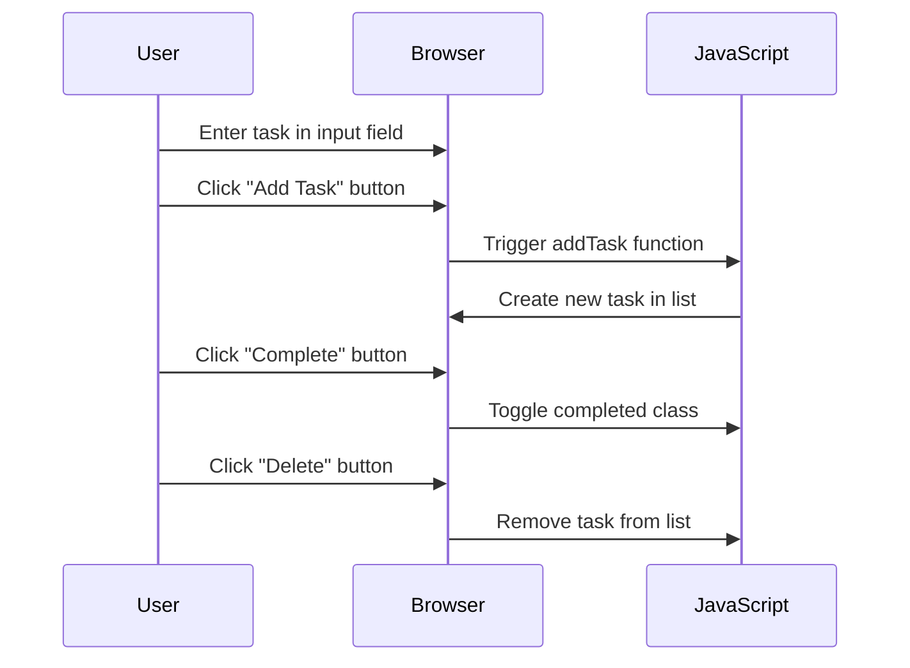

## 12.8. Building a Small JavaScript Project: To-Do List App

In this section, we'll embark on an exciting journey to build a simple yet functional To-Do List application using JavaScript. This project will help you apply the concepts of variables and data types that we've covered so far. By the end of this project, you'll have a better understanding of how to manipulate data and create interactive web applications.

### Project Overview

Our To-Do List app will allow users to:

- Add new tasks to the list.
- Mark tasks as completed.
- Remove tasks from the list.

We'll break down the project into manageable steps, providing code examples and explanations at each stage. Let's get started!

### Step 1: Setting Up the Project

First, let's set up our project structure. Create a new folder for your project and inside it, create the following files:

- `index.html`: This will be our main HTML file.
- `style.css`: This will contain the styles for our application.
- `script.js`: This will house our JavaScript code.

Here's what the initial structure should look like:

```
/to-do-list-app
    ├── index.html
    ├── style.css
    └── script.js
```

### Step 2: Creating the HTML Structure

Let's start by creating the basic HTML structure for our application. Open `index.html` and add the following code:

```html
<!DOCTYPE html>
<html lang="en">
<head>
    <meta charset="UTF-8">
    <meta name="viewport" content="width=device-width, initial-scale=1.0">
    <title>To-Do List App</title>
    <link rel="stylesheet" href="style.css">
</head>
<body>
    <div class="container">
        <h1>To-Do List</h1>
        <input type="text" id="taskInput" placeholder="Add a new task...">
        <button id="addTaskBtn">Add Task</button>
        <ul id="taskList"></ul>
    </div>
    <script src="script.js"></script>
</body>
</html>
```

**Explanation:**

- We have a text input for entering new tasks and a button to add tasks to the list.
- An unordered list (`<ul>`) will display the tasks.
- The `script.js` file is linked at the bottom of the body to ensure the DOM is fully loaded before the script runs.

### Step 3: Styling the Application

Next, let's add some basic styles to make our app look better. Open `style.css` and add the following styles:

```css
body {
    font-family: Arial, sans-serif;
    background-color: #f4f4f9;
    display: flex;
    justify-content: center;
    align-items: center;
    height: 100vh;
    margin: 0;
}

.container {
    background-color: white;
    padding: 20px;
    border-radius: 8px;
    box-shadow: 0 0 10px rgba(0, 0, 0, 0.1);
    width: 300px;
}

h1 {
    text-align: center;
    color: #333;
}

input[type="text"] {
    width: calc(100% - 22px);
    padding: 10px;
    margin-bottom: 10px;
    border: 1px solid #ddd;
    border-radius: 4px;
}

button {
    width: 100%;
    padding: 10px;
    background-color: #28a745;
    color: white;
    border: none;
    border-radius: 4px;
    cursor: pointer;
}

button:hover {
    background-color: #218838;
}

ul {
    list-style-type: none;
    padding: 0;
}

li {
    padding: 10px;
    border: 1px solid #ddd;
    border-radius: 4px;
    margin-bottom: 5px;
    display: flex;
    justify-content: space-between;
    align-items: center;
}

li.completed {
    text-decoration: line-through;
    color: #888;
}
```

**Explanation:**

- We use CSS to style the body, container, input, button, and list items for a clean and modern look.
- The `completed` class will be used to strike through tasks that are marked as completed.

### Step 4: Writing the JavaScript Code

Now, let's add the JavaScript code to make our app functional. Open `script.js` and add the following code:

```javascript
// Select DOM elements
const taskInput = document.getElementById('taskInput');
const addTaskBtn = document.getElementById('addTaskBtn');
const taskList = document.getElementById('taskList');

// Add event listener to the "Add Task" button
addTaskBtn.addEventListener('click', addTask);

// Function to add a new task
function addTask() {
    const taskText = taskInput.value.trim();
    if (taskText === '') {
        alert('Please enter a task.');
        return;
    }

    // Create a new list item
    const li = document.createElement('li');
    li.textContent = taskText;

    // Create a "Complete" button
    const completeBtn = document.createElement('button');
    completeBtn.textContent = 'Complete';
    completeBtn.addEventListener('click', () => {
        li.classList.toggle('completed');
    });

    // Create a "Delete" button
    const deleteBtn = document.createElement('button');
    deleteBtn.textContent = 'Delete';
    deleteBtn.addEventListener('click', () => {
        taskList.removeChild(li);
    });

    // Append buttons to the list item
    li.appendChild(completeBtn);
    li.appendChild(deleteBtn);

    // Append the list item to the task list
    taskList.appendChild(li);

    // Clear the input field
    taskInput.value = '';
}
```

**Explanation:**

- We select the DOM elements we'll interact with using `getElementById`.
- An event listener is added to the "Add Task" button to trigger the `addTask` function when clicked.
- The `addTask` function creates a new list item (`<li>`) with the task text and two buttons: "Complete" and "Delete".
- The "Complete" button toggles the `completed` class on the list item to mark it as done.
- The "Delete" button removes the task from the list.

### Step 5: Testing the Application

Now that we've written the code, let's test our application. Open `index.html` in a web browser and try adding, completing, and deleting tasks. Make sure everything works as expected.

### Step 6: Enhancing the Application

Let's add some enhancements to our To-Do List app. Here are a few ideas:

1. **Add a Date to Each Task:**

   Modify the `addTask` function to include the current date next to each task.

   ```javascript
   const dateSpan = document.createElement('span');
   const currentDate = new Date().toLocaleDateString();
   dateSpan.textContent = ` (${currentDate})`;
   li.appendChild(dateSpan);
   ```

2. **Persist Tasks Using Local Storage:**

   Save tasks to `localStorage` so they persist even after the page is refreshed.

   ```javascript
   function saveTasks() {
       const tasks = [];
       taskList.querySelectorAll('li').forEach(li => {
           tasks.push({
               text: li.firstChild.textContent,
               completed: li.classList.contains('completed')
           });
       });
       localStorage.setItem('tasks', JSON.stringify(tasks));
   }

   function loadTasks() {
       const tasks = JSON.parse(localStorage.getItem('tasks')) || [];
       tasks.forEach(task => {
           const li = document.createElement('li');
           li.textContent = task.text;
           if (task.completed) {
               li.classList.add('completed');
           }
           taskList.appendChild(li);
       });
   }

   // Call loadTasks on page load
   document.addEventListener('DOMContentLoaded', loadTasks);
   ```

3. **Add Keyboard Support:**

   Allow users to press "Enter" to add a task.

   ```javascript
   taskInput.addEventListener('keypress', (e) => {
       if (e.key === 'Enter') {
           addTask();
       }
   });
   ```

### Step 7: Encouraging Customization

Now that we've built a basic To-Do List app, it's time for you to make it your own. Here are some ideas for customization:

- **Change the Theme:** Modify the CSS to change the colors and fonts.
- **Add Categories:** Allow users to categorize tasks (e.g., Work, Personal).
- **Add Priority Levels:** Let users set priority levels for tasks.
- **Implement Search:** Add a search bar to filter tasks by name.

### Visualizing the Application Flow

To better understand the flow of our application, let's visualize the interaction between the user and the app using a sequence diagram.



**Diagram Explanation:**

- The user interacts with the browser by entering tasks and clicking buttons.
- The browser triggers JavaScript functions to manipulate the DOM and update the task list.

### Knowledge Check

Before we wrap up, let's reinforce what we've learned with a few questions:

1. What is the purpose of the `addEventListener` method in our JavaScript code?
2. How does the `toggle` method work when marking tasks as completed?
3. Why is it important to use `localStorage` for persisting tasks?

### Embrace the Journey

Remember, this is just the beginning. As you progress, you'll build more complex and interactive web pages. Keep experimenting, stay curious, and enjoy the journey!

## Quiz Time!



### What is the primary purpose of the `addTask` function in our To-Do List app?

- [x] To add a new task to the list
- [ ] To delete a task from the list
- [ ] To mark a task as completed
- [ ] To style the task list

> **Explanation:** The `addTask` function is responsible for adding a new task to the list when the user clicks the "Add Task" button.

### Which method is used to add an event listener to the "Add Task" button?

- [x] `addEventListener`
- [ ] `attachEvent`
- [ ] `onClick`
- [ ] `bindEvent`

> **Explanation:** The `addEventListener` method is used to attach an event handler to the "Add Task" button.

### How do we mark a task as completed in our app?

- [x] By toggling the `completed` class on the list item
- [ ] By deleting the task
- [ ] By changing the task text
- [ ] By adding a new task

> **Explanation:** We mark a task as completed by toggling the `completed` class on the list item, which applies a line-through style.

### What is the role of `localStorage` in our To-Do List app?

- [x] To persist tasks across page reloads
- [ ] To style the task list
- [ ] To add new tasks
- [ ] To delete tasks

> **Explanation:** `localStorage` is used to store tasks so that they persist even after the page is reloaded.

### What happens when the "Delete" button is clicked?

- [x] The task is removed from the list
- [ ] The task is marked as completed
- [ ] The task text is changed
- [ ] A new task is added

> **Explanation:** When the "Delete" button is clicked, the task is removed from the list.

### How can we add keyboard support for adding tasks?

- [x] By listening for the "Enter" key press on the input field
- [ ] By adding a new button
- [ ] By changing the task text
- [ ] By using `localStorage`

> **Explanation:** We can add keyboard support by listening for the "Enter" key press on the input field and triggering the `addTask` function.

### Which CSS property is used to strike through completed tasks?

- [x] `text-decoration: line-through`
- [ ] `font-weight: bold`
- [ ] `color: red`
- [ ] `background-color: yellow`

> **Explanation:** The `text-decoration: line-through` property is used to strike through completed tasks.

### What is the purpose of the `trim` method in the `addTask` function?

- [x] To remove whitespace from the task input
- [ ] To add a new task
- [ ] To delete a task
- [ ] To style the task list

> **Explanation:** The `trim` method is used to remove whitespace from the task input, ensuring that only non-empty tasks are added.

### How do we ensure tasks are loaded from `localStorage` on page load?

- [x] By calling the `loadTasks` function on the `DOMContentLoaded` event
- [ ] By adding a new button
- [ ] By changing the task text
- [ ] By using `text-decoration`

> **Explanation:** We ensure tasks are loaded by calling the `loadTasks` function when the `DOMContentLoaded` event fires, which occurs when the HTML document has been completely loaded and parsed.

### True or False: The `completed` class is used to style tasks that are marked as done.

- [x] True
- [ ] False

> **Explanation:** True. The `completed` class is used to apply styles, such as line-through, to tasks that are marked as done.



By completing this project, you've taken a significant step in your JavaScript learning journey. Keep building, experimenting, and refining your skills. Happy coding!
