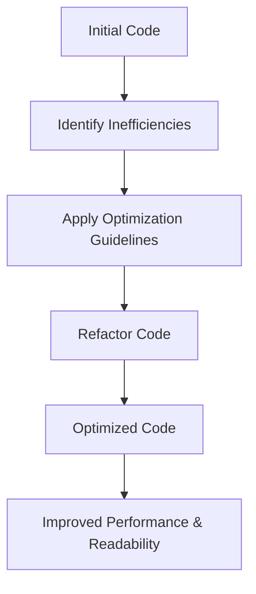

## 12.9. Code Optimization Task

In this section, we will embark on a journey to transform a piece of JavaScript code from being functional yet inefficient and hard to read, into a streamlined, efficient, and easily understandable version. This exercise will not only enhance your coding skills but also instill best practices for writing clean and efficient code. Let's dive in!

### Understanding the Importance of Code Optimization

Before we begin, let's discuss why code optimization is crucial. Optimized code is not just about making your program run faster; it's about making it more readable, maintainable, and scalable. Here are some key benefits:

- **Improved Performance**: Optimized code runs faster and uses fewer resources, which is crucial for web applications where performance directly impacts user experience.
- **Enhanced Readability**: Clean code is easier to read and understand, making it simpler for others (and yourself) to maintain and extend in the future.
- **Better Maintainability**: With clear logic and structure, optimized code is less prone to bugs and easier to debug.
- **Scalability**: Efficient code can handle increased loads and complexity more gracefully.

### The Task: Refactor and Optimize

Let's start with a piece of code that is functional but could benefit from optimization. Your task is to refactor this code to improve its performance and readability.

#### Initial Code

Below is a JavaScript function that processes an array of numbers, performs some calculations, and returns an object with the results. While it works, there are several areas where we can improve it.

```javascript
function processNumbers(numbers) {
    var sum = 0;
    var product = 1;
    var max = numbers[0];
    var min = numbers[0];
    var evenNumbers = [];
    var oddNumbers = [];
    
    for (var i = 0; i < numbers.length; i++) {
        sum += numbers[i];
        product *= numbers[i];
        
        if (numbers[i] > max) {
            max = numbers[i];
        }
        
        if (numbers[i] < min) {
            min = numbers[i];
        }
        
        if (numbers[i] % 2 === 0) {
            evenNumbers.push(numbers[i]);
        } else {
            oddNumbers.push(numbers[i]);
        }
    }
    
    return {
        sum: sum,
        product: product,
        max: max,
        min: min,
        evenNumbers: evenNumbers,
        oddNumbers: oddNumbers
    };
}

var result = processNumbers([1, 2, 3, 4, 5]);
console.log(result);
```

### Guidelines for Optimization

Here are some guidelines to help you optimize the code:

1. **Variable Declarations**: Use `let` and `const` instead of `var` to improve scope management and prevent accidental reassignments.
2. **Loop Optimization**: Consider using modern array methods like `forEach`, `map`, or `reduce` for cleaner and more expressive iterations.
3. **Simplify Logic**: Look for opportunities to simplify conditional statements and reduce redundancy.
4. **Descriptive Naming**: Ensure variable and function names are descriptive and self-explanatory.
5. **Avoid Repetition**: Implement DRY (Don't Repeat Yourself) principles to eliminate redundant code.
6. **Use Functional Programming**: Leverage functional programming concepts to make the code more declarative.

### Optimized Solution

Let's apply these guidelines to refactor the code:

```javascript
function processNumbers(numbers) {
    const sum = numbers.reduce((acc, num) => acc + num, 0);
    const product = numbers.reduce((acc, num) => acc * num, 1);
    const max = Math.max(...numbers);
    const min = Math.min(...numbers);
    const evenNumbers = numbers.filter(num => num % 2 === 0);
    const oddNumbers = numbers.filter(num => num % 2 !== 0);

    return {
        sum,
        product,
        max,
        min,
        evenNumbers,
        oddNumbers
    };
}

const result = processNumbers([1, 2, 3, 4, 5]);
console.log(result);
```

### Explanation of the Optimized Code

- **Use of `const`**: We declared variables like `sum`, `product`, `max`, and `min` using `const` as their values do not change after initialization.
- **Array Methods**: We utilized `reduce` to calculate the sum and product, `Math.max` and `Math.min` to find the maximum and minimum values, and `filter` to separate even and odd numbers. These methods make the code more concise and expressive.
- **Spread Operator**: The spread operator (`...`) was used with `Math.max` and `Math.min` to pass the array elements as individual arguments, simplifying the process of finding the max and min values.
- **Functional Approach**: The use of array methods promotes a functional programming style, which is often more readable and easier to reason about.

### Benefits of the Optimized Code

- **Performance**: By using built-in methods like `reduce` and `filter`, we leverage optimized native implementations, potentially improving performance.
- **Readability**: The code is more concise and easier to understand at a glance. Each operation is clearly defined and separated.
- **Maintainability**: With a functional approach, the code is less prone to errors and easier to modify or extend.

### Visualizing Code Optimization

Let's visualize the transformation of our code using a flowchart to better understand the process.



**Diagram Explanation**: This flowchart illustrates the process of code optimization. We start with the initial code, identify inefficiencies, apply optimization guidelines, refactor the code, and finally achieve optimized code with improved performance and readability.

### Try It Yourself

Now it's your turn! Experiment with the optimized code by making the following modifications:

- **Add More Calculations**: Extend the function to calculate additional statistics, such as the average or median.
- **Handle Edge Cases**: Modify the code to handle edge cases, such as an empty array or arrays with non-numeric values.
- **Use Different Data Sets**: Test the function with different arrays to see how it performs with various inputs.

### Knowledge Check

Let's reinforce what we've learned with a few questions:

1. What are the benefits of using `const` and `let` over `var`?
2. How does the `reduce` method improve code readability and performance?
3. Why is it important to use descriptive variable names?
4. What is the advantage of using functional programming concepts in JavaScript?

### Summary

In this section, we explored the importance of code optimization and applied practical techniques to refactor a JavaScript function. By using modern JavaScript features and adopting best practices, we improved the performance, readability, and maintainability of our code. Remember, writing clean and efficient code is an ongoing journey. Keep practicing, stay curious, and enjoy the process!

## Quiz Time!



### What is one key benefit of using `const` over `var`?

- [x] Prevents reassignment of variables
- [ ] Allows variable hoisting
- [ ] Increases code execution speed
- [ ] Enables global scope

> **Explanation:** `const` prevents reassignment of variables, ensuring that the value remains constant throughout the code.

### Which array method is used to iterate over elements and accumulate a single result?

- [ ] map
- [x] reduce
- [ ] filter
- [ ] forEach

> **Explanation:** The `reduce` method iterates over elements and accumulates a single result, making it ideal for operations like summing or multiplying array elements.

### What is a primary advantage of using the spread operator with `Math.max`?

- [x] Simplifies passing array elements as individual arguments
- [ ] Increases the array size
- [ ] Converts numbers to strings
- [ ] Enables variable hoisting

> **Explanation:** The spread operator simplifies passing array elements as individual arguments to functions like `Math.max`, making the code cleaner and more concise.

### Why is it important to use descriptive variable names?

- [x] Enhances code readability and maintainability
- [ ] Increases code execution speed
- [ ] Enables variable hoisting
- [ ] Prevents syntax errors

> **Explanation:** Descriptive variable names enhance code readability and maintainability by making the code self-explanatory and easier to understand.

### How does the `filter` method improve code readability?

- [x] By clearly defining the criteria for selecting elements
- [ ] By increasing the array size
- [ ] By converting numbers to strings
- [ ] By enabling variable hoisting

> **Explanation:** The `filter` method improves readability by clearly defining the criteria for selecting elements, making the code more expressive and easier to understand.

### What is a benefit of using functional programming concepts in JavaScript?

- [x] Promotes code that is easier to reason about
- [ ] Increases code execution speed
- [ ] Enables global scope
- [ ] Prevents syntax errors

> **Explanation:** Functional programming concepts promote code that is easier to reason about, as they encourage a declarative style that is often more readable and maintainable.

### What is the primary purpose of code optimization?

- [x] Improve performance and readability
- [ ] Increase code execution speed
- [ ] Enable global scope
- [ ] Prevent syntax errors

> **Explanation:** The primary purpose of code optimization is to improve performance and readability, making the code more efficient and easier to maintain.

### Which method is used to separate even and odd numbers in an array?

- [ ] map
- [ ] reduce
- [x] filter
- [ ] forEach

> **Explanation:** The `filter` method is used to separate even and odd numbers in an array by applying a condition to each element.

### What is the advantage of using modern JavaScript features like `reduce` and `filter`?

- [x] They make the code more concise and expressive
- [ ] They increase code execution speed
- [ ] They enable global scope
- [ ] They prevent syntax errors

> **Explanation:** Modern JavaScript features like `reduce` and `filter` make the code more concise and expressive, improving readability and maintainability.

### True or False: Code optimization only focuses on improving code execution speed.

- [ ] True
- [x] False

> **Explanation:** False. Code optimization focuses on improving both performance and readability, making the code more efficient and easier to maintain.



Remember, this is just the beginning. As you progress, you'll build more complex and interactive web pages. Keep experimenting, stay curious, and enjoy the journey!
