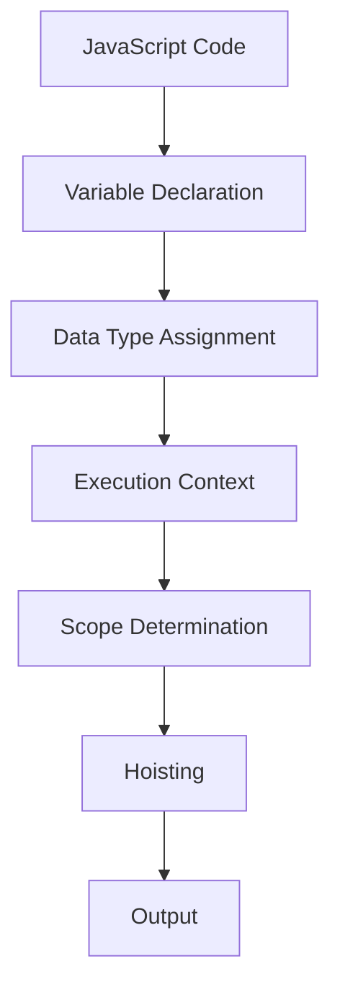

## 13.1. Recommended Books and Articles

As you embark on your journey to master JavaScript, understanding variables and data types is crucial. This section provides a curated list of books and articles that will deepen your understanding of these core concepts. Whether you're a beginner just starting out, an intermediate developer looking to solidify your knowledge, or an expert seeking advanced insights, these resources cater to all levels.

### Beginner Level Resources

#### Books

1. **"Eloquent JavaScript" by Marijn Haverbeke**
   - **Description**: This book is a comprehensive introduction to JavaScript, covering everything from basic syntax to more complex programming concepts. It includes exercises and projects to reinforce learning.
   - **Where to Obtain**: Available on [Amazon](https://www.amazon.com/Eloquent-JavaScript-3rd-Ed-Introduction/dp/1593279507) and [No Starch Press](https://nostarch.com/eloquentjavascript3).

2. **"JavaScript & jQuery: Interactive Front-End Web Development" by Jon Duckett**
   - **Description**: Known for its visual approach, this book simplifies JavaScript concepts with clear explanations and practical examples. It’s perfect for visual learners.
   - **Where to Obtain**: Available on [Amazon](https://www.amazon.com/JavaScript-JQuery-Interactive-Front-End-Development/dp/1118531647).

3. **"JavaScript: The Good Parts" by Douglas Crockford**
   - **Description**: This book focuses on the most effective features of JavaScript, helping beginners understand the language's strengths and how to use them effectively.
   - **Where to Obtain**: Available on [Amazon](https://www.amazon.com/JavaScript-Good-Parts-Douglas-Crockford/dp/0596517742).

#### Articles

1. **"Understanding JavaScript Variables" on MDN Web Docs**
   - **Description**: This article provides a beginner-friendly introduction to JavaScript variables, including how to declare and use them.
   - **Link**: [MDN Web Docs](https://developer.mozilla.org/en-US/docs/Web/JavaScript/Guide/Grammar_and_types#Declarations).

2. **"JavaScript Data Types and Data Structures" on MDN Web Docs**
   - **Description**: An essential read for beginners, this article covers the different data types in JavaScript and how they are used.
   - **Link**: [MDN Web Docs](https://developer.mozilla.org/en-US/docs/Web/JavaScript/Data_structures).

3. **"A Guide to JavaScript Variables" on W3Schools**
   - **Description**: This guide offers a straightforward explanation of variables in JavaScript, complete with examples and practice exercises.
   - **Link**: [W3Schools](https://www.w3schools.com/js/js_variables.asp).

### Intermediate Level Resources

#### Books

1. **"You Don’t Know JS: Scope & Closures" by Kyle Simpson**
   - **Description**: Part of the "You Don’t Know JS" series, this book delves into the intricacies of scope and closures, providing a deeper understanding of how variables work in JavaScript.
   - **Where to Obtain**: Available on [Amazon](https://www.amazon.com/You-Dont-Know-JS-Closures/dp/1491904151).

2. **"JavaScript: The Definitive Guide" by David Flanagan**
   - **Description**: This book is a comprehensive resource that covers all aspects of JavaScript, including variables and data types. It’s an excellent reference for intermediate developers.
   - **Where to Obtain**: Available on [Amazon](https://www.amazon.com/JavaScript-Definitive-Guide-Activate-Guides/dp/0596805527).

3. **"Learning JavaScript Design Patterns" by Addy Osmani**
   - **Description**: While focusing on design patterns, this book also covers important JavaScript concepts, including variable scope and hoisting.
   - **Where to Obtain**: Available on [Amazon](https://www.amazon.com/Learning-JavaScript-Design-Patterns-Addy/dp/1449331815).

#### Articles

1. **"JavaScript Variable Scope and Hoisting" on SitePoint**
   - **Description**: This article provides an in-depth look at variable scope and hoisting, helping intermediate developers understand these concepts better.
   - **Link**: [SitePoint](https://www.sitepoint.com/demystifying-javascript-variable-scope-hoisting/).

2. **"Understanding JavaScript’s ‘this’ Keyword" on DigitalOcean**
   - **Description**: This article explains the often-confusing ‘this’ keyword in JavaScript, which is crucial for understanding variable context.
   - **Link**: [DigitalOcean](https://www.digitalocean.com/community/tutorials/understanding-the-this-keyword-in-javascript).

3. **"JavaScript Variable Scoping and Closures" on CSS-Tricks**
   - **Description**: A detailed explanation of how scoping and closures work in JavaScript, complete with examples and diagrams.
   - **Link**: [CSS-Tricks](https://css-tricks.com/understanding-scope-and-context-in-javascript/).

### Advanced Level Resources

#### Books

1. **"Effective JavaScript: 68 Specific Ways to Harness the Power of JavaScript" by David Herman**
   - **Description**: This book offers advanced tips and techniques for writing effective JavaScript, including best practices for managing variables and data types.
   - **Where to Obtain**: Available on [Amazon](https://www.amazon.com/Effective-JavaScript-Specific-Software-Development/dp/0321812182).

2. **"JavaScript Patterns" by Stoyan Stefanov**
   - **Description**: This book covers advanced JavaScript patterns and techniques, including how to effectively use variables and manage data types.
   - **Where to Obtain**: Available on [Amazon](https://www.amazon.com/JavaScript-Patterns-Stoyan-Stefanov/dp/0596806752).

3. **"High-Performance JavaScript" by Nicholas C. Zakas**
   - **Description**: Focused on performance optimization, this book provides insights into efficient variable usage and data handling in JavaScript.
   - **Where to Obtain**: Available on [Amazon](https://www.amazon.com/High-Performance-JavaScript-Building-Applications-Performance/dp/059680279X).

#### Articles

1. **"JavaScript Performance Tips" on Smashing Magazine**
   - **Description**: This article offers advanced tips for optimizing JavaScript performance, including efficient variable management.
   - **Link**: [Smashing Magazine](https://www.smashingmagazine.com/2012/11/writing-fast-memory-efficient-javascript/).

2. **"Understanding JavaScript Prototypes and Inheritance" on Medium**
   - **Description**: An advanced exploration of prototypes and inheritance in JavaScript, which are crucial for understanding object-based variable management.
   - **Link**: [Medium](https://medium.com/javascript-in-plain-english/javascript-prototypes-and-inheritance-5bba2990e04b).

3. **"Advanced JavaScript: Scopes and Closures" on Toptal**
   - **Description**: This article dives deep into advanced scoping and closures, providing insights into complex variable interactions.
   - **Link**: [Toptal](https://www.toptal.com/javascript/interview-questions).

### Try It Yourself

To solidify your understanding, try experimenting with the code examples provided in these resources. Modify variables, change data types, and observe the outcomes. This hands-on approach will enhance your learning experience and help you grasp the nuances of JavaScript variables and data types.

### Visualizing JavaScript Concepts

To aid your understanding, here is a visual representation of how JavaScript handles variables and data types:

**Caption**: This diagram illustrates the flow of JavaScript code execution, focusing on variable declaration, data type assignment, and scope determination.

### References and Links

For further reading and exploration, consider visiting the following reputable resources:

- [MDN Web Docs](https://developer.mozilla.org/en-US/docs/Web/JavaScript)
- [W3Schools JavaScript Tutorial](https://www.w3schools.com/js/)
- [JavaScript.info](https://javascript.info/)

These platforms offer a wealth of information, tutorials, and examples to enhance your understanding of JavaScript.

### Knowledge Check

To reinforce your learning, consider the following questions and challenges:

1. What are the differences between `var`, `let`, and `const` in JavaScript?
2. How does JavaScript handle data type conversion?
3. What is hoisting, and how does it affect variable declarations?
4. Can you explain the concept of closures in JavaScript?
5. How do prototypes influence variable inheritance in JavaScript?

### Embrace the Journey

Remember, mastering JavaScript variables and data types is a journey. As you progress, you'll build more complex and interactive applications. Keep experimenting, stay curious, and enjoy the learning process!

## Quiz Time!



### What is the primary purpose of variables in JavaScript?

- [x] To store data values
- [ ] To execute functions
- [ ] To style HTML elements
- [ ] To manage server requests

> **Explanation:** Variables in JavaScript are used to store data values that can be used and manipulated throughout the program.

### Which keyword is used to declare a constant variable in JavaScript?

- [ ] var
- [ ] let
- [x] const
- [ ] function

> **Explanation:** The `const` keyword is used to declare a constant variable, which means its value cannot be reassigned.

### What is hoisting in JavaScript?

- [x] The default behavior of moving declarations to the top
- [ ] A method for sorting arrays
- [ ] A way to style elements
- [ ] A type of loop

> **Explanation:** Hoisting is JavaScript's default behavior of moving variable and function declarations to the top of their containing scope.

### Which data type is not considered a primitive in JavaScript?

- [ ] Number
- [ ] String
- [ ] Boolean
- [x] Object

> **Explanation:** Objects are not considered primitive data types in JavaScript; they are complex data structures.

### How can you check the data type of a variable in JavaScript?

- [x] Using the `typeof` operator
- [ ] Using the `instanceof` operator
- [ ] Using the `length` property
- [ ] Using the `parseInt` function

> **Explanation:** The `typeof` operator is used to check the data type of a variable in JavaScript.

### What is the result of `typeof null` in JavaScript?

- [ ] "null"
- [ ] "undefined"
- [x] "object"
- [ ] "string"

> **Explanation:** Due to a historical bug in JavaScript, `typeof null` returns "object".

### Which method can convert a string to an integer in JavaScript?

- [x] `parseInt()`
- [ ] `parseFloat()`
- [ ] `toString()`
- [ ] `toFixed()`

> **Explanation:** The `parseInt()` function is used to convert a string to an integer in JavaScript.

### What does the `let` keyword provide that `var` does not?

- [ ] Global scope
- [x] Block scope
- [ ] Function scope
- [ ] Constant declaration

> **Explanation:** The `let` keyword provides block-level scope, which `var` does not.

### Which of the following is a truthy value in JavaScript?

- [x] "false"
- [ ] 0
- [ ] null
- [ ] undefined

> **Explanation:** In JavaScript, non-empty strings are considered truthy values.

### JavaScript is a statically typed language.

- [ ] True
- [x] False

> **Explanation:** JavaScript is a dynamically typed language, meaning variables can hold values of any data type without explicit declaration.



By exploring these resources and engaging with the material, you'll gain a solid understanding of JavaScript variables and data types. Happy learning!
