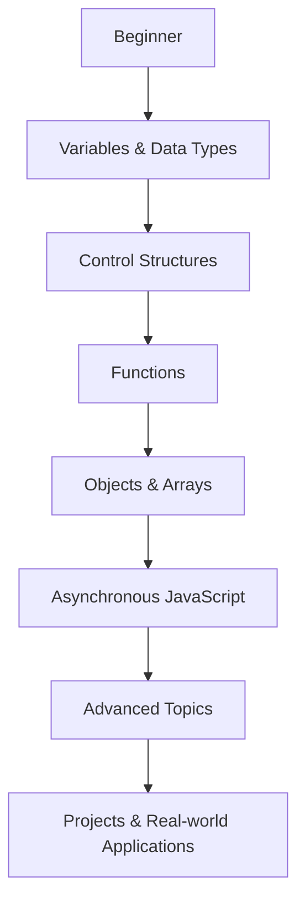

## 13.2. Online Courses and Tutorials

In the ever-evolving world of technology, continuous learning is key to staying relevant. As we delve into the intricacies of JavaScript, particularly variables and data types, it's essential to have access to quality educational resources. This section will guide you through some of the best online courses and tutorials available, helping you build a solid foundation in JavaScript programming.

### Why Online Courses?

Online courses offer flexibility, allowing you to learn at your own pace and on your own schedule. They often include a mix of video lectures, quizzes, and hands-on projects, making them an excellent way to gain practical experience. Moreover, many platforms provide forums and communities where you can interact with instructors and fellow learners, enhancing your educational journey.

### Reputable Online Learning Platforms

Let's explore some reputable platforms that offer comprehensive JavaScript courses:

#### 1. Coursera

Coursera partners with top universities and organizations to offer courses in various fields. Here are some recommended JavaScript courses:

- **JavaScript Basics** by University of California, Davis: This course covers the fundamentals of JavaScript, including variables, data types, and basic syntax. It's perfect for beginners and is part of a larger web development specialization.

- **Programming Foundations with JavaScript, HTML, and CSS** by Duke University: This course introduces the basics of web development, focusing on JavaScript's role in creating dynamic web pages.

Coursera offers both free and paid options, with the latter providing certificates upon completion.

#### 2. Udemy

Udemy is known for its vast library of courses across various subjects. Here are some standout JavaScript courses:

- **The Complete JavaScript Course 2023: From Zero to Expert!** by Jonas Schmedtmann: This comprehensive course covers everything from JavaScript basics to advanced topics, including ES6 features and asynchronous programming.

- **JavaScript: Understanding the Weird Parts** by Anthony Alicea: This course dives deep into JavaScript's quirks and features, providing a thorough understanding of the language.

Udemy courses often go on sale, making them an affordable option for learners.

#### 3. Codecademy

Codecademy offers interactive coding lessons, allowing you to practice writing code directly in your browser. Their JavaScript course covers:

- **Introduction to JavaScript**: This course introduces variables, data types, functions, and control flow, providing a solid foundation for beginners.

Codecademy offers a free tier with basic courses and a Pro subscription for more advanced content and projects.

#### 4. edX

edX is another platform offering courses from universities and institutions worldwide. Consider these JavaScript courses:

- **CS50's Web Programming with Python and JavaScript** by Harvard University: While this course covers more than just JavaScript, it provides a comprehensive look at web development, including JavaScript's role.

- **JavaScript Introduction** by W3Cx: This course focuses on the basics of JavaScript, making it ideal for beginners.

edX offers both free and paid options, with certificates available for a fee.

#### 5. Pluralsight

Pluralsight is a technology-focused platform offering expert-led courses. Recommended JavaScript courses include:

- **JavaScript: Getting Started**: This course covers the essentials of JavaScript, including variables, data types, and functions.

- **JavaScript Fundamentals**: A more in-depth look at JavaScript, covering topics like closures, prototypes, and asynchronous programming.

Pluralsight offers a free trial, after which a subscription is required.

### Interactive Coding Sites

Interactive coding sites provide a hands-on approach to learning, allowing you to practice coding in real-time. Here are some popular options:

#### 1. FreeCodeCamp

FreeCodeCamp is a nonprofit organization offering a comprehensive curriculum in web development. Their JavaScript section covers:

- **JavaScript Algorithms and Data Structures**: This course includes lessons on variables, data types, loops, and functions, with plenty of exercises to reinforce learning.

FreeCodeCamp is entirely free and includes a supportive community of learners.

#### 2. Khan Academy

Khan Academy offers a unique approach to learning with interactive challenges and projects. Their JavaScript course includes:

- **Intro to JS: Drawing & Animation**: This course introduces JavaScript through creative coding projects, making learning fun and engaging.

Khan Academy is free and suitable for learners of all ages.

#### 3. Codewars

Codewars is a platform for practicing coding through challenges called "kata." It offers exercises in JavaScript that help reinforce concepts like variables and data types.

- **JavaScript Kata**: Solve coding challenges to improve your problem-solving skills and deepen your understanding of JavaScript.

Codewars is free to join, with a community-driven approach to learning.

### Recommended Courses for JavaScript Fundamentals

To help you get started, here are some specific courses focusing on JavaScript fundamentals, particularly variables and data types:

#### 1. **JavaScript Essentials for Beginners** by Mosh Hamedani (Udemy)

This course is designed for absolute beginners, covering the basics of JavaScript, including variables, data types, and operators. Mosh's teaching style is clear and engaging, making complex topics easy to understand.

#### 2. **JavaScript Basics** by Microsoft (edX)

Part of the Microsoft Professional Program in Front-End Web Development, this course covers the fundamentals of JavaScript, focusing on variables, data types, and control structures.

#### 3. **JavaScript for Beginners** by LearnCode.academy (YouTube)

This free YouTube series covers the basics of JavaScript, including variables and data types. It's a great resource for visual learners who prefer video content.

### Free vs. Paid Options

When choosing between free and paid courses, consider your learning goals and budget. Free courses often provide a solid introduction to JavaScript, while paid courses may offer more comprehensive content, projects, and certificates of completion. Many platforms offer financial aid or scholarships, so explore these options if cost is a concern.

### Encouraging Continuous Learning

Learning JavaScript is a journey, and it's important to keep building on your knowledge. Here are some tips for continuous learning:

- **Set Goals**: Define what you want to achieve with your JavaScript skills, whether it's building a website, creating a game, or pursuing a career in web development.

- **Practice Regularly**: Consistent practice is key to mastering JavaScript. Use interactive coding sites and projects to apply what you've learned.

- **Join Communities**: Engage with online communities, forums, and social media groups to connect with other learners and professionals. Platforms like Stack Overflow, Reddit, and GitHub are great places to start.

- **Stay Updated**: JavaScript is constantly evolving, with new features and updates. Follow blogs, podcasts, and newsletters to stay informed about the latest developments.

- **Experiment and Build**: Apply your skills by building projects, whether they're personal projects or contributions to open-source initiatives. This hands-on experience is invaluable for learning.

### Try It Yourself

To reinforce your learning, try modifying the following code example to see how variables and data types work in practice:

```javascript
// Declare a variable using let
let message = "Hello, World!";

// Log the message to the console
console.log(message);

// Change the value of the variable
message = "JavaScript is fun!";

// Log the updated message
console.log(message);

// Declare a constant
const pi = 3.14159;

// Try changing the value of the constant (this will cause an error)
// pi = 3.14;

// Log the constant
console.log(pi);
```

**Experiment:** Try changing the `message` variable to a number or a boolean and observe the output. Attempt to change the `pi` constant and see what error message appears.

### Visualizing JavaScript Learning Path

To better understand the learning journey, here's a flowchart representing the progression from beginner to advanced JavaScript concepts:



**Caption:** This flowchart outlines a typical learning path for mastering JavaScript, starting with the basics and progressing to advanced topics and practical applications.

### References and Links

For further reading and exploration, consider these resources:

- [MDN Web Docs - JavaScript](https://developer.mozilla.org/en-US/docs/Web/JavaScript): A comprehensive resource for JavaScript documentation and tutorials.
- [W3Schools - JavaScript Tutorial](https://www.w3schools.com/js/): A beginner-friendly guide to JavaScript basics.
- [JavaScript.info](https://javascript.info/): A modern tutorial covering all aspects of JavaScript.

### Knowledge Check

To ensure you've grasped the concepts covered, try answering the following questions:

## Quiz Time!



### What is a key benefit of online courses for learning JavaScript?

- [x] Flexibility to learn at your own pace
- [ ] Guaranteed job placement
- [ ] Free certification
- [ ] Access to physical classrooms

> **Explanation:** Online courses offer flexibility, allowing learners to study at their own pace and schedule.

### Which platform offers interactive coding lessons directly in the browser?

- [ ] Coursera
- [ ] edX
- [x] Codecademy
- [ ] Udemy

> **Explanation:** Codecademy provides interactive coding lessons, allowing users to practice coding directly in their browser.

### What is a common feature of paid courses on platforms like Coursera and Udemy?

- [x] Certificates of completion
- [ ] Guaranteed job offers
- [ ] Free access to all courses
- [ ] Personal tutoring

> **Explanation:** Paid courses often offer certificates of completion, which can be added to resumes or LinkedIn profiles.

### Which of the following is a free platform offering a comprehensive web development curriculum?

- [ ] Pluralsight
- [x] FreeCodeCamp
- [ ] Udemy
- [ ] edX

> **Explanation:** FreeCodeCamp is a nonprofit organization offering a free, comprehensive web development curriculum.

### What should you do to reinforce your JavaScript learning?

- [x] Practice regularly
- [ ] Only watch videos
- [ ] Avoid coding challenges
- [ ] Focus solely on theory

> **Explanation:** Regular practice is crucial for reinforcing learning and mastering JavaScript.

### Which course is recommended for understanding JavaScript's quirks and features?

- [ ] JavaScript Basics by Microsoft
- [x] JavaScript: Understanding the Weird Parts by Anthony Alicea
- [ ] JavaScript Essentials for Beginners by Mosh Hamedani
- [ ] Programming Foundations with JavaScript, HTML, and CSS by Duke University

> **Explanation:** "JavaScript: Understanding the Weird Parts" dives deep into JavaScript's quirks and features.

### What is a benefit of joining online coding communities?

- [x] Connecting with other learners
- [ ] Guaranteed course discounts
- [ ] Free access to all courses
- [ ] Personal tutoring

> **Explanation:** Online coding communities allow learners to connect with others, share knowledge, and seek help.

### Which platform offers a course by Harvard University on web programming?

- [ ] Udemy
- [ ] Codecademy
- [ ] Coursera
- [x] edX

> **Explanation:** edX offers "CS50's Web Programming with Python and JavaScript" by Harvard University.

### What is a key feature of Khan Academy's JavaScript course?

- [x] Interactive challenges and projects
- [ ] Certificates of completion
- [ ] Guaranteed job placement
- [ ] Personal tutoring

> **Explanation:** Khan Academy's JavaScript course includes interactive challenges and projects, making learning engaging.

### True or False: JavaScript is a static-typed language.

- [ ] True
- [x] False

> **Explanation:** JavaScript is a dynamically-typed language, meaning variable types are determined at runtime.



Remember, this is just the beginning. As you progress, you'll build more complex and interactive web pages. Keep experimenting, stay curious, and enjoy the journey!
