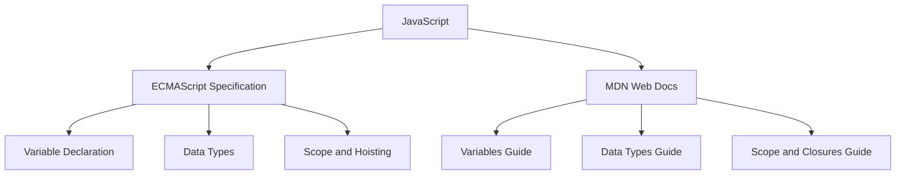

## 13.3. Official Documentation

In the journey of learning JavaScript, one of the most valuable skills you can develop is the ability to effectively use official documentation. This skill not only helps you understand the language better but also empowers you to solve problems independently. In this section, we will explore the two primary sources of official JavaScript documentation: the ECMAScript specification and the Mozilla Developer Network (MDN) Web Docs. We will guide you on how to navigate these resources, highlight sections relevant to variables and data types, and emphasize the importance of consulting authoritative sources.

### Understanding the ECMAScript Specification

The ECMAScript specification is the standardized script language specification upon which JavaScript is based. It is maintained by ECMA International, a standards organization, and provides a detailed description of how JavaScript should behave. This specification is crucial for understanding the core mechanics of JavaScript, including variables and data types.

#### Navigating the ECMAScript Specification

The ECMAScript specification can be daunting for beginners due to its technical nature. However, with a structured approach, you can extract valuable insights from it. Here’s how you can navigate it:

1. **Access the Specification**: The latest ECMAScript specification is available online at [ECMA International's website](https://www.ecma-international.org/publications-and-standards/standards/ecma-262/). You can also find it on [GitHub](https://github.com/tc39/ecma262), where it is maintained collaboratively.

2. **Understand the Structure**: The specification is divided into sections, each covering different aspects of the language. Key sections include:
   - **Introduction**: Provides an overview of the language and its purpose.
   - **Lexical Grammar**: Describes the syntax and structure of JavaScript code.
   - **Execution Contexts**: Explains how JavaScript code is executed, which is essential for understanding variable scope and hoisting.
   - **Types**: Details the data types available in JavaScript and their properties.

3. **Focus on Relevant Sections**: For variables and data types, focus on sections related to:
   - **Variable Declaration**: Understand how `var`, `let`, and `const` are defined and used.
   - **Data Types**: Explore the primitive and complex data types supported by JavaScript.
   - **Scope and Hoisting**: Learn how scope affects variable accessibility and how hoisting works.

4. **Use the Index**: The specification includes an index that can help you quickly locate topics of interest.

#### Key Sections for Variables and Data Types

- **Variable Declaration**: This section explains the rules and behaviors associated with declaring variables using `var`, `let`, and `const`.
- **Data Types**: Here, you will find detailed descriptions of JavaScript's primitive types (such as Number, String, Boolean) and complex types (such as Objects and Arrays).
- **Scope and Hoisting**: Understanding these concepts is crucial for managing variable lifetimes and accessibility.

### Exploring MDN Web Docs

The Mozilla Developer Network (MDN) Web Docs is a comprehensive resource for web developers, offering detailed documentation, tutorials, and guides on JavaScript and other web technologies. Unlike the ECMAScript specification, MDN is more beginner-friendly and provides practical examples and explanations.

#### Navigating MDN Web Docs

1. **Access MDN Web Docs**: Visit [MDN Web Docs](https://developer.mozilla.org/en-US/docs/Web/JavaScript) to access JavaScript documentation.

2. **Search Functionality**: Use the search bar to quickly find topics related to variables and data types. For example, searching for "JavaScript variables" will lead you to relevant articles.

3. **Guides and Tutorials**: MDN offers guides and tutorials that provide step-by-step instructions and examples. These are particularly useful for beginners.

4. **Reference Section**: The reference section includes detailed documentation on JavaScript syntax, operators, statements, and built-in objects.

5. **Interactive Examples**: Many MDN pages include interactive examples that allow you to experiment with code directly in the browser.

#### Key Sections for Variables and Data Types

- **Variables**: This section covers variable declaration, scope, and best practices for naming and using variables.
- **Data Types**: Explore articles on primitive data types, type conversion, and working with complex data types like objects and arrays.
- **Scope and Closures**: Learn about the different types of scope in JavaScript and how closures work.

### Importance of Referencing Authoritative Sources

Consulting official documentation is crucial for several reasons:

1. **Accuracy**: Official documentation is maintained by experts and provides accurate, up-to-date information about the language.

2. **Comprehensive Coverage**: These resources cover all aspects of JavaScript, from basic syntax to advanced features.

3. **Problem Solving**: When you encounter issues in your code, official documentation can help you understand the root cause and find solutions.

4. **Continuous Learning**: JavaScript is constantly evolving, and staying updated with the latest changes is essential for any developer.

### Practical Tips for Using Documentation

- **Start with MDN**: For beginners, MDN is a great starting point due to its approachable language and practical examples.
- **Dive into the Specification**: As you become more comfortable, refer to the ECMAScript specification for a deeper understanding of complex topics.
- **Bookmark Important Pages**: Keep a list of frequently referenced pages for quick access.
- **Participate in Community Discussions**: Engage with the developer community on platforms like Stack Overflow and Reddit to learn how others use documentation.

### Try It Yourself

To get the most out of official documentation, try the following exercises:

1. **Explore MDN**: Visit the MDN page on [JavaScript Variables](https://developer.mozilla.org/en-US/docs/Web/JavaScript/Guide/Grammar_and_types#variables) and read through the content. Experiment with the interactive examples provided.

2. **Read the ECMAScript Specification**: Access the ECMAScript specification and locate the section on [Variable Declaration](https://tc39.es/ecma262/#sec-variable-statement). Try to understand the formal description and relate it to what you've learned.

3. **Compare Sources**: Choose a topic, such as "JavaScript Data Types," and read about it on both MDN and the ECMAScript specification. Note the differences in presentation and detail.

### Visualizing JavaScript Documentation

To help you understand how to navigate these resources, here's a visual representation of the relationship between JavaScript, ECMAScript, and MDN:

**Diagram Description**: This diagram illustrates the connection between JavaScript, the ECMAScript specification, and MDN Web Docs. It shows how JavaScript is based on the ECMAScript specification, which covers topics like variable declaration, data types, and scope. MDN Web Docs provides guides on similar topics, offering practical insights and examples.

### Knowledge Check

To reinforce your understanding, consider these questions:

1. **What is the primary purpose of the ECMAScript specification?**
   - [ ] To provide a beginner-friendly guide to JavaScript.
   - [x] To define the standardized script language specification for JavaScript.
   - [ ] To offer interactive coding examples.
   - [ ] To host community discussions.

2. **Which resource is more suitable for beginners?**
   - [ ] ECMAScript specification
   - [x] MDN Web Docs
   - [ ] GitHub repositories
   - [ ] Stack Overflow

3. **What section of the ECMAScript specification should you refer to for understanding variable hoisting?**
   - [ ] Lexical Grammar
   - [ ] Data Types
   - [x] Execution Contexts
   - [ ] Introduction

4. **How can you quickly find information on MDN Web Docs?**
   - [ ] By reading the entire documentation.
   - [x] By using the search functionality.
   - [ ] By browsing GitHub issues.
   - [ ] By attending MDN webinars.

5. **Why is it important to reference authoritative sources?**
   - [ ] They provide community opinions.
   - [x] They offer accurate and up-to-date information.
   - [ ] They are easier to read than other sources.
   - [ ] They include personal blogs.

### Embrace the Journey

Remember, mastering JavaScript is a journey, not a destination. As you explore official documentation, you'll gain deeper insights into the language and become more proficient in solving complex problems. Keep experimenting, stay curious, and enjoy the process of learning and growing as a developer!

## Quiz Time!



### What is the primary purpose of the ECMAScript specification?

- [ ] To provide a beginner-friendly guide to JavaScript.
- [x] To define the standardized script language specification for JavaScript.
- [ ] To offer interactive coding examples.
- [ ] To host community discussions.

> **Explanation:** The ECMAScript specification defines the standardized script language specification for JavaScript, ensuring consistency across implementations.

### Which resource is more suitable for beginners?

- [ ] ECMAScript specification
- [x] MDN Web Docs
- [ ] GitHub repositories
- [ ] Stack Overflow

> **Explanation:** MDN Web Docs is more suitable for beginners due to its approachable language and practical examples.

### What section of the ECMAScript specification should you refer to for understanding variable hoisting?

- [ ] Lexical Grammar
- [ ] Data Types
- [x] Execution Contexts
- [ ] Introduction

> **Explanation:** The Execution Contexts section of the ECMAScript specification explains how JavaScript code is executed, including variable hoisting.

### How can you quickly find information on MDN Web Docs?

- [ ] By reading the entire documentation.
- [x] By using the search functionality.
- [ ] By browsing GitHub issues.
- [ ] By attending MDN webinars.

> **Explanation:** Using the search functionality on MDN Web Docs allows you to quickly find information on specific topics.

### Why is it important to reference authoritative sources?

- [ ] They provide community opinions.
- [x] They offer accurate and up-to-date information.
- [ ] They are easier to read than other sources.
- [ ] They include personal blogs.

> **Explanation:** Authoritative sources like the ECMAScript specification and MDN Web Docs offer accurate and up-to-date information, which is crucial for understanding JavaScript.

### What is a key benefit of using MDN Web Docs?

- [x] It provides interactive examples.
- [ ] It is maintained by ECMA International.
- [ ] It includes personal blogs.
- [ ] It is only for advanced users.

> **Explanation:** MDN Web Docs provides interactive examples that help users experiment with code directly in the browser.

### What is the relationship between JavaScript and ECMAScript?

- [x] JavaScript is based on the ECMAScript specification.
- [ ] ECMAScript is a subset of JavaScript.
- [ ] They are unrelated.
- [ ] JavaScript is a different language from ECMAScript.

> **Explanation:** JavaScript is based on the ECMAScript specification, which defines the standardized script language.

### Which section of MDN Web Docs is useful for learning about JavaScript variables?

- [x] Variables Guide
- [ ] Execution Contexts
- [ ] Lexical Grammar
- [ ] Introduction

> **Explanation:** The Variables Guide on MDN Web Docs is useful for learning about JavaScript variables, including their declaration and scope.

### How does the ECMAScript specification help in understanding JavaScript?

- [x] It provides a detailed description of how JavaScript should behave.
- [ ] It offers community opinions.
- [ ] It includes personal blogs.
- [ ] It is only for advanced users.

> **Explanation:** The ECMAScript specification provides a detailed description of how JavaScript should behave, helping users understand the language's core mechanics.

### True or False: MDN Web Docs is maintained by ECMA International.

- [ ] True
- [x] False

> **Explanation:** False. MDN Web Docs is maintained by Mozilla, not ECMA International.



