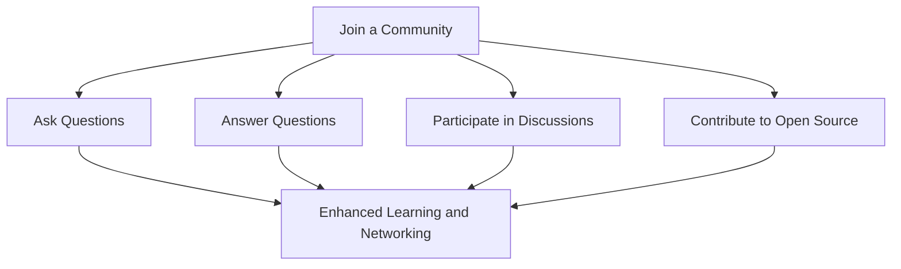

## 13.4. Community and Forums

In the ever-evolving world of JavaScript and TypeScript, staying updated and continuously learning is crucial. One of the best ways to do this is by engaging with the developer community. Communities and forums provide a platform for knowledge sharing, problem-solving, and networking with fellow developers. Let's explore some popular forums and communities, and learn how to effectively communicate and benefit from these platforms.

### Popular Forums and Communities

#### 1. Stack Overflow

**Stack Overflow** is one of the most popular platforms for developers to ask and answer questions. It covers a wide range of programming topics, including JavaScript and TypeScript. Here, you can find solutions to common problems, share your knowledge, and learn from others.

- **How to Use Stack Overflow**: 
  - **Search Before Asking**: Before posting a question, search to see if it has already been answered.
  - **Ask Clear Questions**: Provide a clear and concise question with relevant code snippets.
  - **Answer Questions**: Share your knowledge by answering questions from others.

#### 2. Reddit

**Reddit** hosts several communities (subreddits) dedicated to JavaScript and programming. Some popular subreddits include:

- **r/javascript**: A community for JavaScript developers to discuss news, libraries, and frameworks.
- **r/learnjavascript**: A place for beginners to ask questions and share learning resources.
- **r/typescript**: Focuses on TypeScript-specific discussions and resources.

- **Participating in Reddit**: 
  - **Follow Subreddits**: Subscribe to subreddits that match your interests.
  - **Engage in Discussions**: Comment on posts and participate in discussions.
  - **Share Resources**: Post interesting articles, tutorials, or projects.

#### 3. GitHub

**GitHub** is not just a platform for hosting code; it's also a community where developers collaborate on open-source projects. Engaging with GitHub can enhance your coding skills and expand your network.

- **How to Engage on GitHub**:
  - **Contribute to Projects**: Find projects that interest you and contribute by fixing bugs or adding features.
  - **Join Discussions**: Participate in issue discussions and pull request reviews.
  - **Follow Developers**: Follow developers whose work you admire to stay updated on their projects.

#### 4. Discord

**Discord** offers real-time chat communities for developers. Many programming communities have dedicated Discord servers where you can interact with other developers.

- **Using Discord for Learning**:
  - **Join Servers**: Look for Discord servers related to JavaScript and TypeScript.
  - **Participate in Chats**: Engage in text and voice chats to discuss topics and solve problems.
  - **Attend Events**: Some servers host events like coding challenges and webinars.

#### 5. Local Meetups and Online Groups

Local meetups and online groups provide opportunities to connect with developers in your area or across the globe. Platforms like **Meetup.com** and **Eventbrite** list events where you can learn and network.

- **Benefits of Meetups**:
  - **Networking**: Meet fellow developers and industry professionals.
  - **Learning**: Attend talks and workshops to learn new skills.
  - **Collaboration**: Find collaborators for projects or hackathons.

### Effective Communication in Communities

Engaging with communities requires effective communication. Here are some tips to help you communicate effectively:

- **Be Respectful**: Always be respectful and considerate in your interactions.
- **Be Clear and Concise**: When asking questions or providing answers, be clear and concise to avoid misunderstandings.
- **Provide Context**: When discussing a problem, provide enough context and relevant code snippets.
- **Be Open to Feedback**: Accept constructive criticism and use it to improve your skills.
- **Help Others**: Share your knowledge and help others whenever possible.

### Benefits of Networking with Other Developers

Networking with other developers offers numerous benefits:

- **Knowledge Sharing**: Learn from the experiences and expertise of others.
- **Career Opportunities**: Networking can lead to job opportunities and collaborations.
- **Support System**: Build a support system of peers who can help you solve problems and motivate you.
- **Exposure to New Ideas**: Gain exposure to new technologies, tools, and methodologies.

### Try It Yourself: Engaging with the Community

To get started, try joining one of the communities mentioned above. Participate in a discussion, ask a question, or contribute to an open-source project. Experiment with different platforms to find the ones that best suit your learning style and interests.

### Visualizing Community Engagement

Let's visualize how engaging with different communities can enhance your learning journey in JavaScript and TypeScript.

**Diagram Description**: This flowchart illustrates the process of joining a community and engaging through asking questions, answering questions, participating in discussions, and contributing to open-source projects, all leading to enhanced learning and networking.

### References and Links

- [Stack Overflow](https://stackoverflow.com/)
- [Reddit - r/javascript](https://www.reddit.com/r/javascript/)
- [GitHub](https://github.com/)
- [Meetup](https://www.meetup.com/)
- [Discord](https://discord.com/)

### Knowledge Check

Let's reinforce what we've learned about engaging with the JavaScript community.

1. **What is the primary benefit of participating in online forums like Stack Overflow?**
   - Gain knowledge and solve coding problems by asking and answering questions.

2. **How can you effectively communicate in developer communities?**
   - Be respectful, clear, and concise, and provide context when discussing problems.

3. **What are some platforms where you can find local meetups?**
   - Meetup.com and Eventbrite.

4. **Why is networking with other developers important?**
   - It offers knowledge sharing, career opportunities, and exposure to new ideas.

### Embrace the Journey

Remember, engaging with the community is just the beginning. As you participate and contribute, you'll build valuable connections and enhance your skills. Keep experimenting, stay curious, and enjoy the journey!

## Quiz Time!



### What is a popular platform for asking and answering programming questions?

- [x] Stack Overflow
- [ ] Facebook
- [ ] Instagram
- [ ] Twitter

> **Explanation:** Stack Overflow is a well-known platform where developers ask and answer programming-related questions.

### Which subreddit is dedicated to TypeScript discussions?

- [ ] r/javascript
- [x] r/typescript
- [ ] r/programming
- [ ] r/webdev

> **Explanation:** r/typescript is a subreddit focused on TypeScript-specific discussions and resources.

### What is a benefit of contributing to open-source projects on GitHub?

- [x] Enhancing coding skills
- [ ] Watching movies
- [ ] Playing games
- [ ] Shopping online

> **Explanation:** Contributing to open-source projects helps enhance coding skills and provides opportunities to collaborate with other developers.

### What should you do before asking a question on Stack Overflow?

- [x] Search for existing answers
- [ ] Post immediately
- [ ] Ignore the guidelines
- [ ] Ask unrelated questions

> **Explanation:** It's important to search for existing answers to avoid duplicate questions and find solutions faster.

### How can you participate in Discord developer communities?

- [x] Join servers and engage in chats
- [ ] Send emails
- [ ] Write letters
- [ ] Use telegraph

> **Explanation:** Discord allows real-time communication through servers where you can join chats and discussions.

### What is a key aspect of effective communication in developer communities?

- [x] Being respectful
- [ ] Being rude
- [ ] Ignoring others
- [ ] Arguing constantly

> **Explanation:** Respectful communication fosters a positive environment and encourages collaboration.

### Why is networking with other developers beneficial?

- [x] Knowledge sharing and career opportunities
- [ ] Watching TV shows
- [ ] Playing sports
- [ ] Cooking meals

> **Explanation:** Networking helps in knowledge sharing, finding career opportunities, and gaining exposure to new ideas.

### What is the purpose of local meetups?

- [x] Networking and learning
- [ ] Sleeping
- [ ] Eating
- [ ] Shopping

> **Explanation:** Local meetups provide opportunities for networking, learning, and collaborating with other developers.

### How can you contribute to discussions on Reddit?

- [x] Comment on posts and share resources
- [ ] Ignore all posts
- [ ] Post irrelevant content
- [ ] Complain constantly

> **Explanation:** Engaging in discussions by commenting and sharing resources contributes positively to the community.

### True or False: Engaging with the developer community can enhance your learning journey.

- [x] True
- [ ] False

> **Explanation:** Engaging with the community provides opportunities for learning, networking, and skill enhancement.


