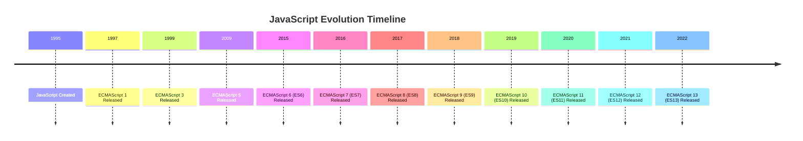

## 13.5. Keeping Up with JavaScript Updates

JavaScript is a dynamic and ever-evolving language that plays a crucial role in web development. As a developer, staying updated with the latest JavaScript features, tools, and industry trends is essential for maintaining your skills and ensuring your projects remain relevant and competitive. In this section, we will explore various strategies to help you keep up with JavaScript updates, including recommended blogs, newsletters, podcasts, influential figures, and more.

### The Importance of Staying Updated

Before diving into specific resources and strategies, let's discuss why it's important to stay updated with JavaScript:

1. **Adopt New Features**: JavaScript is constantly evolving with new features and improvements. Staying updated allows you to leverage these advancements to write more efficient and powerful code.

2. **Enhance Productivity**: New tools and libraries can significantly enhance your productivity. By staying informed, you can integrate these tools into your workflow and streamline your development process.

3. **Maintain Relevance**: The tech industry is highly competitive, and staying updated ensures that your skills remain relevant and in demand.

4. **Improve Code Quality**: Understanding the latest best practices and coding standards helps improve the quality and maintainability of your code.

5. **Expand Your Network**: Engaging with the JavaScript community through events and discussions can help you build valuable connections and learn from others' experiences.

### Recommended Blogs and Newsletters

Blogs and newsletters are excellent resources for staying informed about the latest JavaScript updates and trends. Here are some highly recommended ones:

1. **JavaScript Weekly**: A popular newsletter that delivers the latest JavaScript news, articles, and tutorials directly to your inbox every week. It's a great way to stay informed without having to actively search for information.

2. **CSS-Tricks**: While primarily focused on CSS, this blog often covers JavaScript topics, especially those related to front-end development. It's a valuable resource for learning about the intersection of CSS and JavaScript.

3. **Smashing Magazine**: Known for its high-quality articles on web development, Smashing Magazine frequently publishes content on JavaScript, including tutorials, best practices, and industry insights.

4. **2ality**: A blog by Dr. Axel Rauschmayer, a well-known JavaScript expert. 2ality covers in-depth JavaScript topics, including new language features, ECMAScript proposals, and more.

5. **A List Apart**: This blog explores the design, development, and meaning of web content, with a focus on best practices and emerging trends, including JavaScript.

### Engaging with Podcasts

Podcasts are a convenient way to stay updated while on the go. Here are some popular JavaScript-focused podcasts:

1. **JavaScript Jabber**: A weekly podcast that covers a wide range of JavaScript topics, including new frameworks, libraries, and industry trends. It's hosted by experienced developers who provide valuable insights and discussions.

2. **Syntax**: Hosted by Wes Bos and Scott Tolinski, Syntax is a fun and informative podcast that covers web development topics, including JavaScript, CSS, and more. The hosts share their experiences and tips for staying productive.

3. **ShopTalk Show**: While not exclusively focused on JavaScript, this podcast covers front-end development topics, including JavaScript, CSS, and HTML. It's a great resource for staying informed about the broader web development landscape.

4. **The Changelog**: This podcast features interviews with developers and industry leaders, discussing the latest trends and technologies in software development, including JavaScript.

### Following Influential Figures

Following influential figures in the JavaScript community can provide valuable insights and keep you informed about the latest developments. Here are some notable individuals to follow:

1. **Brendan Eich**: The creator of JavaScript and co-founder of Mozilla. Following his insights can provide a historical perspective on the language's evolution.

2. **Addy Osmani**: A Google Chrome engineer who frequently shares insights on JavaScript performance, best practices, and new tools.

3. **Kyle Simpson**: Known for his "You Don't Know JS" book series, Kyle Simpson is a JavaScript expert who shares in-depth knowledge and insights on the language.

4. **Dr. Axel Rauschmayer**: An author and speaker known for his expertise in JavaScript and ECMAScript. His blog and Twitter account are valuable resources for staying updated.

5. **Sarah Drasner**: A well-known speaker and author who shares insights on JavaScript, CSS, and front-end development. She frequently discusses new tools and techniques.

### Subscribing to Standards Bodies

To stay informed about the latest JavaScript features and proposals, consider subscribing to updates from standards bodies like TC39, the committee responsible for evolving the ECMAScript language specification. Here are some ways to stay connected:

1. **TC39 GitHub Repository**: Follow the TC39 GitHub repository to track the progress of ECMAScript proposals and see what's being discussed for future versions of JavaScript.

2. **ECMAScript Proposals**: Visit the ECMAScript proposals repository on GitHub to explore current proposals and their status. This is a great way to see what features might be coming to JavaScript.

3. **TC39 Meeting Notes**: Keep an eye on the meeting notes from TC39 meetings, which provide insights into the discussions and decisions made by the committee.

### Attending Conferences and Webinars

Conferences and webinars are excellent opportunities to learn from industry experts, discover new tools, and network with other developers. Here are some notable events to consider:

1. **JSConf**: A series of conferences held worldwide, focusing on JavaScript and web development. JSConf events feature talks from industry leaders and provide opportunities for networking and collaboration.

2. **React Conf**: If you're interested in React, attending React Conf can provide valuable insights into the latest developments in the React ecosystem, including JavaScript advancements.

3. **Node.js Interactive**: This conference focuses on Node.js and server-side JavaScript development. It's a great opportunity to learn about the latest tools and techniques for building scalable applications.

4. **Frontend Developer Love**: A conference dedicated to front-end development, including JavaScript, CSS, and HTML. It features talks from industry experts and provides opportunities for networking.

5. **Webinars and Online Meetups**: Many organizations and communities host webinars and online meetups focused on JavaScript and web development. These events are often free and provide valuable learning opportunities.

### Continuous Professional Development

Staying updated with JavaScript is an ongoing process that requires dedication and a proactive approach. Here are some additional strategies for continuous professional development:

1. **Online Courses and Tutorials**: Platforms like Udemy, Coursera, and freeCodeCamp offer a wide range of JavaScript courses and tutorials. These resources can help you learn new skills and stay updated with the latest trends.

2. **Coding Challenges**: Participate in coding challenges on platforms like LeetCode, Codewars, and HackerRank. These challenges can help you practice your skills and learn new techniques.

3. **Open Source Contributions**: Contributing to open source projects is a great way to learn from others, gain experience, and stay updated with the latest tools and practices.

4. **Local Meetups and User Groups**: Join local JavaScript meetups and user groups to connect with other developers, share knowledge, and learn from guest speakers.

5. **Reading Books and Articles**: Regularly reading books and articles on JavaScript can help you deepen your understanding and stay informed about new developments.

### Visualizing JavaScript's Evolution

To better understand how JavaScript has evolved over the years, let's visualize the key milestones and updates in the language's history:

This timeline illustrates the major releases and updates in JavaScript's history, highlighting the language's continuous evolution and the importance of staying informed about new features.

### Try It Yourself

To reinforce your understanding of the importance of staying updated with JavaScript, try the following exercise:

1. **Explore a New JavaScript Feature**: Choose a recent JavaScript feature or proposal (e.g., optional chaining, nullish coalescing) and research its purpose, usage, and benefits. Implement a small project or code snippet that demonstrates the feature in action.

2. **Follow a JavaScript Influencer**: Choose one of the influential figures mentioned earlier and follow them on social media or subscribe to their blog. Take note of any insights or updates they share about JavaScript.

3. **Attend an Online Webinar**: Find an upcoming webinar or online meetup focused on JavaScript and attend it. Take notes on any new tools, techniques, or trends discussed during the event.

### Knowledge Check

To test your understanding of the strategies for staying updated with JavaScript, consider the following questions:

- What are some benefits of staying updated with the latest JavaScript features and tools?
- Name three recommended blogs or newsletters for staying informed about JavaScript.
- Why is it important to follow influential figures in the JavaScript community?
- How can subscribing to updates from standards bodies like TC39 help you stay informed?
- What are some advantages of attending conferences and webinars focused on JavaScript?

### Embrace the Journey

Remember, staying updated with JavaScript is a continuous journey that requires curiosity, dedication, and a willingness to learn. By exploring new resources, engaging with the community, and embracing new challenges, you'll not only enhance your skills but also contribute to the vibrant and dynamic world of JavaScript development. Keep experimenting, stay curious, and enjoy the journey!

## Quiz Time!



### What is one benefit of staying updated with the latest JavaScript features?

- [x] Adopt new features for more efficient code
- [ ] Reduce the need for testing
- [ ] Eliminate the need for debugging
- [ ] Avoid learning new tools

> **Explanation:** Staying updated allows developers to adopt new features that can lead to more efficient and powerful code.

### Which newsletter is known for delivering the latest JavaScript news and articles weekly?

- [x] JavaScript Weekly
- [ ] CSS-Tricks
- [ ] Smashing Magazine
- [ ] 2ality

> **Explanation:** JavaScript Weekly is a popular newsletter that provides weekly updates on JavaScript news, articles, and tutorials.

### Who is the creator of JavaScript?

- [x] Brendan Eich
- [ ] Kyle Simpson
- [ ] Addy Osmani
- [ ] Sarah Drasner

> **Explanation:** Brendan Eich is the creator of JavaScript and co-founder of Mozilla.

### What is TC39 responsible for?

- [x] Evolving the ECMAScript language specification
- [ ] Creating JavaScript frameworks
- [ ] Designing CSS standards
- [ ] Developing web browsers

> **Explanation:** TC39 is the committee responsible for evolving the ECMAScript language specification, which defines JavaScript.

### Which podcast is hosted by Wes Bos and Scott Tolinski?

- [x] Syntax
- [ ] JavaScript Jabber
- [ ] ShopTalk Show
- [ ] The Changelog

> **Explanation:** Syntax is a podcast hosted by Wes Bos and Scott Tolinski, covering web development topics including JavaScript.

### What is one advantage of attending JavaScript conferences?

- [x] Networking with other developers
- [ ] Avoiding new technologies
- [ ] Reducing project deadlines
- [ ] Eliminating the need for testing

> **Explanation:** Attending conferences provides opportunities to network with other developers and learn from industry experts.

### Which platform offers coding challenges to practice JavaScript skills?

- [x] LeetCode
- [ ] JavaScript Weekly
- [ ] TC39
- [ ] Syntax

> **Explanation:** LeetCode is a platform that offers coding challenges to help developers practice and improve their skills.

### What is one way to stay informed about ECMAScript proposals?

- [x] Follow the ECMAScript proposals repository on GitHub
- [ ] Subscribe to CSS-Tricks
- [ ] Listen to The Changelog
- [ ] Avoid reading meeting notes

> **Explanation:** Following the ECMAScript proposals repository on GitHub allows developers to stay informed about current proposals and their status.

### Why is it important to engage with the JavaScript community?

- [x] To expand your network and learn from others
- [ ] To avoid new tools and techniques
- [ ] To eliminate the need for testing
- [ ] To reduce project deadlines

> **Explanation:** Engaging with the community helps developers expand their network, share knowledge, and learn from others' experiences.

### Staying updated with JavaScript is a continuous journey that requires curiosity and dedication.

- [x] True
- [ ] False

> **Explanation:** Staying updated with JavaScript is an ongoing process that requires curiosity, dedication, and a willingness to learn.


