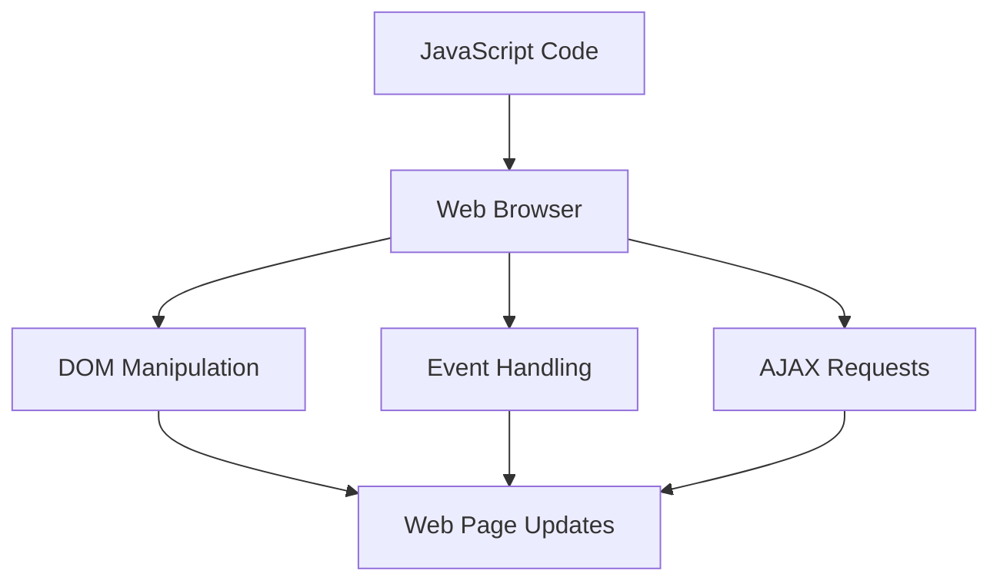

## 14.3. Final Thoughts

Congratulations on reaching the end of this comprehensive guide on understanding variables and data types in JavaScript! Your dedication and commitment to learning are commendable, and we hope this journey has been as rewarding for you as it was for us to create. As we wrap up, let's take a moment to reflect on what we've learned, the endless possibilities that lie ahead, and how you can continue to grow as a JavaScript developer.

### Expressing Appreciation for Your Commitment

First and foremost, we want to express our heartfelt appreciation for your commitment to mastering JavaScript. Learning a programming language is no small feat, and your perseverance in navigating through the intricacies of variables and data types is truly inspiring. Remember, every expert was once a beginner, and your efforts today are laying the foundation for your future success.

### Reiterating the Endless Possibilities with JavaScript

JavaScript is a versatile and powerful language that opens up a world of possibilities. From creating dynamic web pages to building complex applications, JavaScript is at the heart of modern web development. As you continue to hone your skills, you'll discover that the only limit to what you can achieve is your imagination.

#### Visualizing JavaScript's Interaction with Web Browsers and Web Pages



*Caption: This diagram illustrates how JavaScript interacts with web browsers to manipulate the DOM, handle events, and make AJAX requests, ultimately updating web pages dynamically.*

### Encouraging a Mindset of Curiosity and Lifelong Learning

The world of technology is ever-evolving, and staying curious is key to keeping up with the latest advancements. Embrace a mindset of lifelong learning, and don't be afraid to explore new concepts and technologies. Whether it's diving deeper into JavaScript frameworks, learning about server-side JavaScript with Node.js, or exploring other programming languages, your journey as a developer is just beginning.

#### Knowledge Check: Reflecting on Key Concepts

- What are the differences between `var`, `let`, and `const`?
- How does JavaScript handle type coercion?
- What is the significance of the Temporal Dead Zone (TDZ)?

### Providing Words of Motivation and Support

As you continue your journey, remember that challenges are opportunities for growth. Every bug you encounter and every error you debug is a step towards becoming a more proficient developer. Stay motivated, keep experimenting, and don't hesitate to reach out for help when needed. The developer community is vast and supportive, and there are countless resources available to assist you.

#### Try It Yourself: Experiment with Code

Encourage experimentation by modifying the following code example to see how different variable declarations affect the output:

```javascript
// Try changing 'var' to 'let' or 'const' and observe the behavior
var greeting = "Hello, World!";
console.log(greeting);

// Reassign the variable
greeting = "Hello, JavaScript!";
console.log(greeting);
```

### Inviting Feedback or Further Interaction

We would love to hear about your experiences with this guide. Your feedback is invaluable in helping us improve and provide even better resources in the future. Feel free to reach out through our website or join our community forums to connect with fellow learners and share your journey.

### Embrace the Journey

Remember, this is just the beginning. As you progress, you'll build more complex and interactive web pages. Keep experimenting, stay curious, and enjoy the journey! The skills you've acquired are the building blocks for a successful career in web development, and the possibilities are truly endless.

### Conclusion

In conclusion, mastering JavaScript variables and data types is a crucial step in your development journey. By understanding these fundamental concepts, you've equipped yourself with the tools needed to tackle more advanced topics and build robust applications. Keep pushing forward, and never stop learning. The world of JavaScript is vast and full of opportunities, and we can't wait to see what you'll create next!

## Quiz Time!



### What is the main advantage of using `let` over `var`?

- [x] Block scope
- [ ] Function scope
- [ ] Global scope
- [ ] No scope

> **Explanation:** `let` provides block-level scoping, which helps prevent issues related to variable hoisting and scope leakage that can occur with `var`.

### Which JavaScript data type is immutable?

- [x] String
- [ ] Object
- [ ] Array
- [ ] Function

> **Explanation:** Strings in JavaScript are immutable, meaning their values cannot be changed once created.

### What does the `typeof` operator return for an array?

- [ ] "array"
- [x] "object"
- [ ] "function"
- [ ] "undefined"

> **Explanation:** In JavaScript, arrays are a type of object, so the `typeof` operator returns "object" for arrays.

### What is the Temporal Dead Zone (TDZ)?

- [x] The period between entering a block and the variable being declared
- [ ] The period after a variable is declared
- [ ] The period before a variable is declared
- [ ] The period when a variable is undefined

> **Explanation:** The TDZ is the time between entering a block and when the variable is declared, during which the variable cannot be accessed.

### Which keyword is used to declare a constant in JavaScript?

- [x] const
- [ ] var
- [ ] let
- [ ] static

> **Explanation:** The `const` keyword is used to declare constants that cannot be reassigned.

### What is the result of `typeof null` in JavaScript?

- [ ] "null"
- [x] "object"
- [ ] "undefined"
- [ ] "boolean"

> **Explanation:** Due to a historical bug in JavaScript, `typeof null` returns "object".

### How can you check if a variable is an array?

- [ ] `typeof variable === "array"`
- [ ] `variable instanceof Array`
- [x] `Array.isArray(variable)`
- [ ] `variable === Array`

> **Explanation:** `Array.isArray(variable)` is the correct method to check if a variable is an array.

### What will `console.log(1 + "1")` output?

- [x] "11"
- [ ] 2
- [ ] "2"
- [ ] "1 + 1"

> **Explanation:** JavaScript performs type coercion, converting the number 1 to a string, resulting in the concatenation "11".

### Which of the following is not a primitive data type in JavaScript?

- [ ] Number
- [ ] String
- [x] Array
- [ ] Boolean

> **Explanation:** Arrays are not primitive data types; they are objects in JavaScript.

### JavaScript is a statically typed language.

- [ ] True
- [x] False

> **Explanation:** JavaScript is a dynamically typed language, meaning variable types are determined at runtime.


