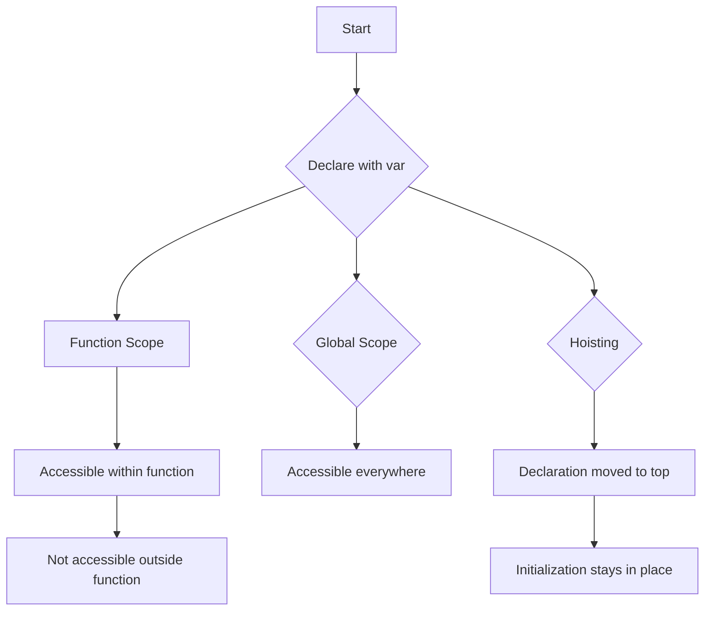

## 2.1. Declaring Variables with `var`

In this section, we will explore the `var` keyword, one of the fundamental ways to declare variables in JavaScript. Understanding how `var` works is crucial for grasping the basics of JavaScript programming. We will cover the syntax, scope, behavior, and potential pitfalls associated with using `var`.

### Understanding the `var` Keyword

The `var` keyword is used to declare a variable in JavaScript. It has been part of the language since its inception and is widely used in older codebases. Let's start by looking at the syntax for declaring a variable with `var`.

```javascript
var myVariable;
```

In this example, we declare a variable named `myVariable` using the `var` keyword. At this point, `myVariable` is undefined because we haven't assigned it a value yet. We can initialize it by assigning a value:

```javascript
var myVariable = 10;
```

Here, `myVariable` is initialized with the value `10`. You can also declare multiple variables in one line:

```javascript
var firstName = "John", lastName = "Doe", age = 30;
```

### Scope of `var`

One of the key characteristics of `var` is its scope. In JavaScript, `var` is function-scoped. This means that a variable declared with `var` is accessible within the function in which it is declared, and not outside of it.

#### Function Scope Example

Let's look at an example to illustrate function scope:

```javascript
function greet() {
    var greeting = "Hello, World!";
    console.log(greeting); // Output: Hello, World!
}

greet();
console.log(greeting); // Error: greeting is not defined
```

In this example, `greeting` is declared inside the `greet` function using `var`. It is accessible within the function, but trying to access it outside the function results in an error because it is not defined in the global scope.

#### Global Scope

If a `var` variable is declared outside of any function, it becomes a global variable, accessible from anywhere in the code:

```javascript
var globalVar = "I am global";

function showGlobalVar() {
    console.log(globalVar); // Output: I am global
}

showGlobalVar();
console.log(globalVar); // Output: I am global
```

### Hoisting with `var`

JavaScript has a behavior called hoisting, which affects how variables declared with `var` are processed. Hoisting means that variable declarations are moved to the top of their containing function or global context during the compile phase, but not their initializations.

#### Hoisting Example

Consider the following code:

```javascript
console.log(hoistedVar); // Output: undefined
var hoistedVar = "I am hoisted";
console.log(hoistedVar); // Output: I am hoisted
```

Although `hoistedVar` is declared after the first `console.log`, JavaScript hoists the declaration to the top, resulting in `undefined` being logged initially. The assignment `hoistedVar = "I am hoisted"` happens at the original line.

### Potential Issues with `var`

While `var` is a fundamental part of JavaScript, it has some potential pitfalls that can lead to bugs if not used carefully.

#### Scope Leakage

Because `var` is function-scoped, it can lead to scope leakage, where a variable is unintentionally accessible outside of its intended scope:

```javascript
if (true) {
    var leakedVar = "I am leaked";
}
console.log(leakedVar); // Output: I am leaked
```

In this example, `leakedVar` is accessible outside the `if` block, which might not be the intended behavior.

#### Re-declaration

Variables declared with `var` can be re-declared within the same scope, which can lead to confusion and errors:

```javascript
var name = "Alice";
var name = "Bob";
console.log(name); // Output: Bob
```

The second declaration of `name` overwrites the first one without any error or warning.

### Best Practices for Using `var`

Given the potential issues with `var`, it's important to follow best practices when using it:

- **Limit the use of `var`**: Prefer `let` or `const` for block-scoped variables, which we'll cover in the next sections.
- **Declare variables at the top**: To avoid confusion with hoisting, declare all variables at the top of their scope.
- **Avoid re-declaration**: Be cautious of re-declaring variables within the same scope.

### Try It Yourself

Experiment with the following code to see how `var` behaves:

```javascript
function testVar() {
    console.log(test); // Output: undefined
    var test = "Testing var";
    console.log(test); // Output: Testing var
}

testVar();
```

Try modifying the code to declare `test` outside the function or re-declare it within the function to observe the effects.

### Visualizing `var` Scope and Hoisting

To better understand how `var` works, let's visualize its scope and hoisting behavior using a flowchart.



This flowchart illustrates how `var` variables are scoped within functions, accessible globally if declared outside, and how hoisting affects their behavior.

### Further Reading

For more information on `var` and variable declarations in JavaScript, check out these resources:

- [MDN Web Docs: var](https://developer.mozilla.org/en-US/docs/Web/JavaScript/Reference/Statements/var)
- [W3Schools: JavaScript Variables](https://www.w3schools.com/js/js_variables.asp)

## Quiz Time!



### What is the scope of a variable declared with `var` inside a function?

- [x] Function scope
- [ ] Block scope
- [ ] Global scope
- [ ] Module scope

> **Explanation:** Variables declared with `var` inside a function are function-scoped, meaning they are accessible within the function but not outside of it.

### What will be the output of the following code?
```javascript
console.log(myVar);
var myVar = "Hello";
console.log(myVar);
```

- [x] undefined, Hello
- [ ] Hello, Hello
- [ ] ReferenceError, Hello
- [ ] undefined, undefined

> **Explanation:** Due to hoisting, the declaration of `myVar` is moved to the top, but the initialization happens at the original line, resulting in `undefined` being logged first.

### Can a variable declared with `var` be re-declared within the same scope?

- [x] Yes
- [ ] No

> **Explanation:** Variables declared with `var` can be re-declared within the same scope without any error.

### What is a potential issue with using `var` in loops or blocks?

- [x] Scope leakage
- [ ] Type mismatch
- [ ] Syntax error
- [ ] Memory leak

> **Explanation:** `var` is function-scoped, not block-scoped, which can lead to scope leakage where variables are accessible outside their intended block.

### How does hoisting affect variable declarations with `var`?

- [x] Declarations are moved to the top of their scope
- [ ] Initializations are moved to the top of their scope
- [ ] Both declarations and initializations are moved to the top
- [ ] Hoisting does not affect `var`

> **Explanation:** Hoisting moves only the declarations of `var` variables to the top of their scope, not the initializations.

### What keyword is recommended over `var` for block-scoped variables?

- [x] let
- [ ] const
- [ ] var
- [ ] function

> **Explanation:** The `let` keyword is recommended for block-scoped variables, providing more predictable scoping behavior than `var`.

### What happens if you try to access a `var` variable before it is declared?

- [x] It returns undefined
- [ ] It throws a ReferenceError
- [ ] It returns null
- [ ] It throws a SyntaxError

> **Explanation:** Due to hoisting, accessing a `var` variable before its declaration returns `undefined`.

### What will be the output of the following code?
```javascript
if (true) {
    var testVar = "Inside block";
}
console.log(testVar);
```

- [x] Inside block
- [ ] ReferenceError
- [ ] undefined
- [ ] SyntaxError

> **Explanation:** Because `var` is not block-scoped, `testVar` is accessible outside the `if` block.

### What is a good practice when using `var` in your code?

- [x] Declare variables at the top of their scope
- [ ] Declare variables at the bottom of their scope
- [ ] Avoid using `var` entirely
- [ ] Use `var` only in global scope

> **Explanation:** Declaring variables at the top of their scope helps avoid confusion with hoisting and improves code readability.

### True or False: `var` is block-scoped.

- [ ] True
- [x] False

> **Explanation:** `var` is function-scoped, not block-scoped, which means it is accessible throughout the function in which it is declared.



Remember, mastering `var` is just the beginning. As you continue your JavaScript journey, you'll learn about `let` and `const`, which offer more predictable scoping behavior. Keep experimenting, stay curious, and enjoy the journey!
