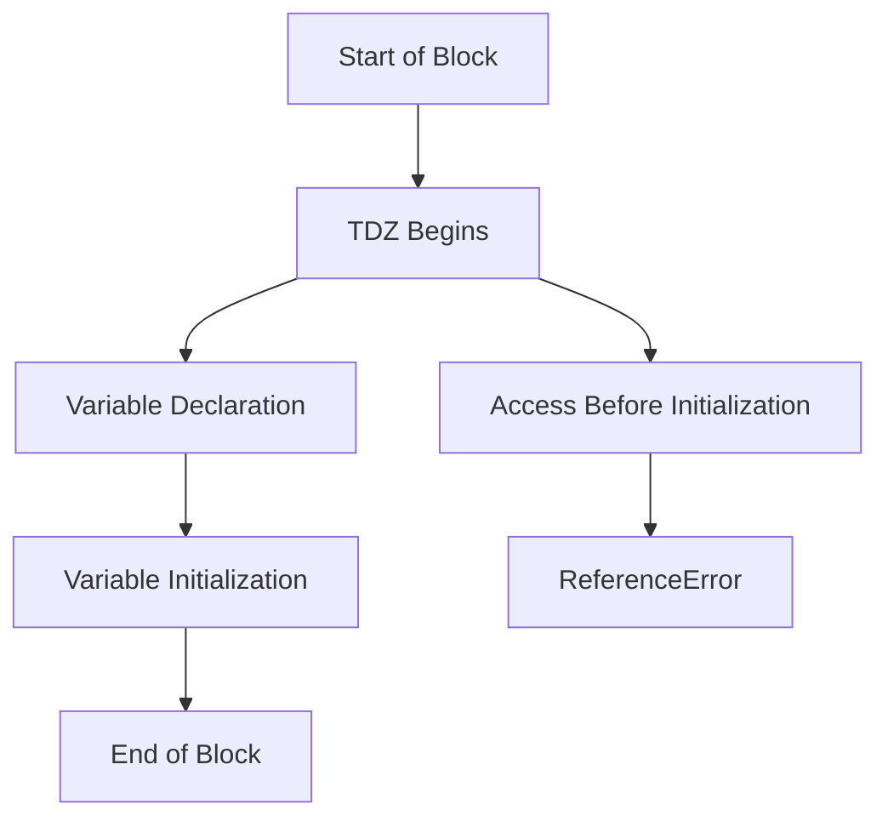

## 2.10. The Temporal Dead Zone (TDZ)

Welcome to the fascinating world of the Temporal Dead Zone (TDZ) in JavaScript! As we continue our journey through the intricacies of variable declarations, it's crucial to understand this concept, especially when working with `let` and `const`. The TDZ is a unique aspect of JavaScript that can lead to errors if not properly understood. Let's dive in to explore what it is, why it happens, and how to avoid common pitfalls.

### What is the Temporal Dead Zone?

The Temporal Dead Zone (TDZ) is a behavior in JavaScript that occurs when a variable is declared using `let` or `const` but is accessed before it has been initialized. This period between the start of the block and the point where the variable is initialized is known as the TDZ. During this time, any attempt to access the variable will result in a `ReferenceError`.

#### Why Does the TDZ Exist?

The TDZ exists to enforce a stricter, more predictable variable declaration model compared to the older `var` keyword. With `var`, variables are hoisted to the top of their scope and initialized with `undefined`, which can lead to unexpected behavior if accessed before assignment. `let` and `const`, however, are not initialized until the execution reaches their line of declaration, which helps prevent such issues.

### The Relevance of the TDZ

Understanding the TDZ is crucial for writing robust JavaScript code. It ensures that variables are not accessed before they are ready, which can prevent bugs and make your code more predictable and easier to debug. By being aware of the TDZ, you can avoid common pitfalls and write cleaner, more reliable code.

### Illustrating the TDZ with Examples

Let's look at some examples to illustrate how the TDZ works and how accessing variables before their declaration leads to errors.

```javascript
console.log(myVar); // ReferenceError: Cannot access 'myVar' before initialization
let myVar = 10;
```

In the example above, attempting to log `myVar` before its declaration results in a `ReferenceError`. This is because `myVar` is in the TDZ until the line `let myVar = 10;` is executed.

Now, let's see how `const` behaves similarly:

```javascript
console.log(myConst); // ReferenceError: Cannot access 'myConst' before initialization
const myConst = 20;
```

Again, accessing `myConst` before its declaration causes a `ReferenceError` due to the TDZ.

### Why `let` and `const` Declarations are Not Initialized Until Execution

The decision to delay initialization of `let` and `const` variables until execution reaches them is intentional. It prevents the common pitfalls associated with `var`, where variables are hoisted and initialized with `undefined`, leading to potential bugs if accessed prematurely.

By enforcing the TDZ, JavaScript ensures that variables are only accessed when they are fully initialized, promoting safer and more predictable code.

### Best Practices for Avoiding TDZ Errors

To avoid running into TDZ-related errors, follow these best practices:

1. **Declare Variables at the Top of Their Scope**: This minimizes the risk of accessing them before they are initialized.

2. **Initialize Variables Immediately**: Whenever possible, initialize your variables at the point of declaration to avoid leaving them in the TDZ.

3. **Use `let` and `const` Wisely**: Understand the differences between `let`, `const`, and `var`, and use them appropriately based on your needs.

4. **Avoid Hoisting Pitfalls**: Remember that `let` and `const` are hoisted but not initialized, so plan your code structure accordingly.

5. **Be Mindful of Block Scope**: `let` and `const` are block-scoped, so ensure your variables are declared in the correct scope to avoid unintended TDZ errors.

### Visualizing the Temporal Dead Zone

To better understand the TDZ, let's visualize it with a diagram. This will help you see how the TDZ fits into the execution context of your code.



**Diagram Description**: This flowchart illustrates the lifecycle of a variable in the TDZ. The TDZ begins at the start of the block and ends at the point of initialization. Accessing the variable before initialization results in a `ReferenceError`.

### Try It Yourself

Now that we've covered the basics of the TDZ, let's try some hands-on experimentation. Modify the code examples above to see how changing the order of declarations and initializations affects the outcome. Try declaring variables at different points in your code and observe how the TDZ impacts their accessibility.

### References and Further Reading

For more information on the TDZ and related topics, check out the following resources:

- [MDN Web Docs: let](https://developer.mozilla.org/en-US/docs/Web/JavaScript/Reference/Statements/let)
- [MDN Web Docs: const](https://developer.mozilla.org/en-US/docs/Web/JavaScript/Reference/Statements/const)
- [JavaScript Info: Variable Hoisting](https://javascript.info/var)

### Knowledge Check

Before we wrap up, let's reinforce what we've learned with a few questions and challenges:

1. What is the Temporal Dead Zone, and why does it exist?
2. How does the TDZ differ between `let` and `var`?
3. What error occurs when you access a variable in the TDZ?
4. How can you avoid TDZ-related errors in your code?

### Embrace the Journey

Remember, understanding the TDZ is just one step in mastering JavaScript. As you continue to learn and experiment, you'll gain a deeper understanding of how JavaScript handles variables and scope. Keep practicing, stay curious, and enjoy the journey!

## Quiz Time!



### What is the Temporal Dead Zone (TDZ)?

- [x] The period between the start of a block and the initialization of a variable declared with `let` or `const`.
- [ ] The time it takes for a variable to be hoisted.
- [ ] The duration a variable remains in memory after being deleted.
- [ ] The time it takes for a function to execute.

> **Explanation:** The TDZ is the period during which a variable is in scope but not yet initialized, leading to a `ReferenceError` if accessed.

### What error do you get when accessing a variable in the TDZ?

- [x] ReferenceError
- [ ] TypeError
- [ ] SyntaxError
- [ ] RangeError

> **Explanation:** Accessing a variable in the TDZ results in a `ReferenceError` because the variable is not yet initialized.

### How can you avoid TDZ-related errors?

- [x] Declare variables at the top of their scope.
- [x] Initialize variables immediately upon declaration.
- [ ] Use `var` instead of `let` or `const`.
- [ ] Avoid using variables altogether.

> **Explanation:** Declaring and initializing variables at the top of their scope helps avoid TDZ errors.

### Which keyword is associated with the TDZ?

- [x] let
- [x] const
- [ ] var
- [ ] function

> **Explanation:** The TDZ is associated with `let` and `const`, as they are not initialized until execution reaches their declaration.

### What is the main purpose of the TDZ?

- [x] To prevent variables from being accessed before they are initialized.
- [ ] To speed up variable initialization.
- [ ] To allow variables to be hoisted.
- [ ] To make JavaScript code run faster.

> **Explanation:** The TDZ ensures variables are not accessed before they are initialized, promoting safer code.

### What happens if you try to access a `let` variable before its declaration?

- [x] ReferenceError
- [ ] It returns `undefined`.
- [ ] It returns `null`.
- [ ] It throws a SyntaxError.

> **Explanation:** Accessing a `let` variable before its declaration results in a `ReferenceError` due to the TDZ.

### Which of the following is true about `const` declarations?

- [x] They are subject to the TDZ.
- [x] They must be initialized at the time of declaration.
- [ ] They can be reassigned after initialization.
- [ ] They are hoisted and initialized with `undefined`.

> **Explanation:** `const` declarations are subject to the TDZ and must be initialized at the time of declaration.

### What is the difference between `var` and `let` in terms of hoisting?

- [x] `var` is hoisted and initialized with `undefined`, while `let` is hoisted but not initialized.
- [ ] `let` is hoisted and initialized with `undefined`, while `var` is not hoisted.
- [ ] Both `var` and `let` are hoisted and initialized with `undefined`.
- [ ] Neither `var` nor `let` is hoisted.

> **Explanation:** `var` is hoisted and initialized with `undefined`, while `let` is hoisted but not initialized, leading to the TDZ.

### What is a common practice to avoid TDZ errors?

- [x] Declare and initialize variables at the top of their scope.
- [ ] Use `var` for all variable declarations.
- [ ] Avoid using `let` and `const`.
- [ ] Declare variables at the end of their scope.

> **Explanation:** Declaring and initializing variables at the top of their scope helps avoid TDZ errors.

### True or False: The TDZ applies to all variable declarations in JavaScript.

- [ ] True
- [x] False

> **Explanation:** The TDZ only applies to `let` and `const` declarations, not `var`.




