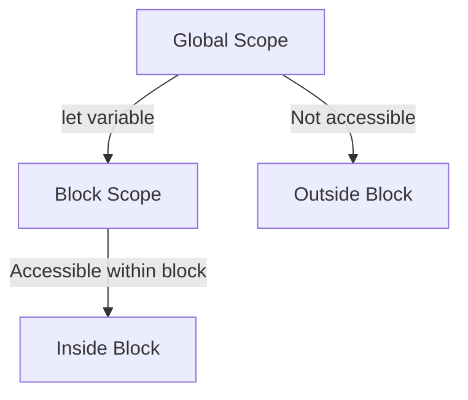

## 2.2. The `let` Keyword and Block Scope

In the world of JavaScript, understanding how to declare variables effectively is crucial for writing clean, efficient, and bug-free code. The introduction of the `let` keyword in ECMAScript 6 (ES6) brought a significant change in how developers handle variable declarations, particularly with respect to scope. In this section, we will delve into the `let` keyword, explore its syntax, understand its block-scoping capabilities, and compare it with the traditional `var` keyword. By the end of this section, you will have a clear understanding of when and why to use `let` in your JavaScript projects.

### Understanding the `let` Keyword

The `let` keyword is used to declare variables that are limited to the scope of a block statement, or expression, in which they are used. This is in contrast to the `var` keyword, which declares variables globally, or locally to an entire function regardless of block scope. The `let` keyword is part of the ES6 specification, which introduced several new features to JavaScript, aiming to make the language more robust and easier to work with.

#### Syntax of `let`

The syntax for declaring a variable using `let` is straightforward:

```javascript
let variableName = value;
```

- **`let`**: The keyword used to declare a block-scoped variable.
- **`variableName`**: The name of the variable, which must follow JavaScript naming conventions.
- **`value`**: The initial value assigned to the variable (optional).

Here's a simple example:

```javascript
let message = "Hello, World!";
console.log(message); // Output: Hello, World!
```

In this example, we declare a variable `message` using `let` and assign it a string value. The variable is then accessible within the block where it is declared.

### Block Scope Explained

Block scope refers to the visibility of variables within a specific block of code, typically defined by curly braces `{}`. Variables declared with `let` are only accessible within the block in which they are defined and any nested blocks. This is a significant departure from the function-scoped nature of `var`.

#### Example of Block Scope with `let`

Consider the following code snippet:

```javascript
if (true) {
    let blockScopedVariable = "I'm inside the block!";
    console.log(blockScopedVariable); // Output: I'm inside the block!
}

console.log(blockScopedVariable); // ReferenceError: blockScopedVariable is not defined
```

In this example, `blockScopedVariable` is declared inside an `if` block using `let`. It is accessible within the block but not outside of it. Attempting to access it outside the block results in a `ReferenceError`.

#### Visualizing Block Scope

To better understand block scope, let's visualize it using a diagram:



**Diagram Description**: This diagram illustrates how a variable declared with `let` is confined to the block scope. It is accessible within the block but not outside of it.

### Differences Between `let` and `var`

Understanding the differences between `let` and `var` is crucial for deciding which to use in your code. Here are the key differences:

1. **Scope**:
   - `var` is function-scoped or globally-scoped, meaning it is accessible throughout the function or globally if declared outside any function.
   - `let` is block-scoped, meaning it is only accessible within the block where it is declared.

2. **Hoisting**:
   - Both `var` and `let` are hoisted to the top of their containing scope. However, `let` variables are not initialized until the code execution reaches the line where they are declared, resulting in a "temporal dead zone" where accessing the variable before its declaration results in a `ReferenceError`.

3. **Re-declaration**:
   - `var` allows re-declaration of the same variable within the same scope.
   - `let` does not allow re-declaration within the same block scope, which helps prevent errors.

#### Example: `let` vs. `var`

Let's see an example that highlights these differences:

```javascript
function varVsLet() {
    if (true) {
        var functionScoped = "I'm function scoped!";
        let blockScoped = "I'm block scoped!";
    }
    console.log(functionScoped); // Output: I'm function scoped!
    console.log(blockScoped); // ReferenceError: blockScoped is not defined
}

varVsLet();
```

In this example, `functionScoped` is declared with `var` and is accessible outside the `if` block, while `blockScoped` is declared with `let` and is not accessible outside the block.

### When to Use `let` Over `var`

The `let` keyword is preferable over `var` in most scenarios due to its block-scoping behavior, which aligns more closely with how variables are scoped in many other programming languages. Here are some scenarios where `let` is particularly advantageous:

1. **Avoiding Global Variable Pollution**: By using `let`, you can ensure variables are confined to the block where they are needed, reducing the risk of accidentally overwriting global variables.

2. **Preventing Re-declaration Errors**: `let` does not allow re-declaration within the same scope, which helps prevent bugs caused by accidentally re-declaring variables.

3. **Improved Readability and Maintenance**: Using `let` makes it clear that a variable is intended to be used only within a specific block, improving code readability and maintainability.

4. **Avoiding Hoisting Pitfalls**: Since `let` variables are not initialized until their declaration is encountered, using `let` can help avoid issues related to variable hoisting.

### Code Examples Illustrating Block Scope with `let`

Let's explore more code examples to solidify our understanding of block scope with `let`.

#### Example 1: Loop Block Scope

```javascript
for (let i = 0; i < 3; i++) {
    console.log(i); // Output: 0, 1, 2
}

console.log(i); // ReferenceError: i is not defined
```

In this example, `i` is declared with `let` inside the `for` loop, making it accessible only within the loop block. Attempting to access `i` outside the loop results in a `ReferenceError`.

#### Example 2: Nested Blocks

```javascript
{
    let outerBlock = "Outer block";
    {
        let innerBlock = "Inner block";
        console.log(outerBlock); // Output: Outer block
        console.log(innerBlock); // Output: Inner block
    }
    console.log(outerBlock); // Output: Outer block
    console.log(innerBlock); // ReferenceError: innerBlock is not defined
}
```

In this example, `outerBlock` is accessible within both the outer and inner blocks, while `innerBlock` is only accessible within the inner block.

### Try It Yourself

To reinforce your understanding of `let` and block scope, try modifying the examples above. For instance, change the `let` declarations to `var` and observe the differences in behavior. Experiment with nested blocks and loops to see how `let` confines variables to specific scopes.

### References and Further Reading

For more information on the `let` keyword and block scope, consider exploring the following resources:

- [MDN Web Docs: let](https://developer.mozilla.org/en-US/docs/Web/JavaScript/Reference/Statements/let)
- [W3Schools: JavaScript let](https://www.w3schools.com/js/js_let.asp)

### Knowledge Check

Before moving on, let's summarize the key takeaways:

- The `let` keyword allows for block-scoped variable declarations.
- Variables declared with `let` are confined to the block in which they are declared.
- `let` helps prevent issues related to variable hoisting and re-declaration.
- Using `let` improves code readability and reduces the risk of global variable pollution.

Remember, mastering the use of `let` and understanding block scope is a crucial step in becoming proficient in JavaScript. Keep experimenting, stay curious, and enjoy the journey!

## Quiz Time!



### What is the primary benefit of using `let` over `var`?

- [x] Block scope
- [ ] Function scope
- [ ] Global scope
- [ ] No scope

> **Explanation:** The primary benefit of using `let` is its block-scoping capability, which confines variables to the block in which they are declared.

### What happens if you try to access a `let` variable outside its block?

- [x] ReferenceError
- [ ] SyntaxError
- [ ] TypeError
- [ ] No error

> **Explanation:** Accessing a `let` variable outside its block results in a `ReferenceError` because the variable is not defined in that scope.

### How does `let` handle variable hoisting?

- [x] Variables are hoisted but not initialized
- [ ] Variables are not hoisted
- [ ] Variables are hoisted and initialized
- [ ] Variables are hoisted with default values

> **Explanation:** `let` variables are hoisted to the top of their block but are not initialized until their declaration is encountered, leading to a temporal dead zone.

### Can you re-declare a `let` variable in the same block?

- [ ] Yes
- [x] No

> **Explanation:** You cannot re-declare a `let` variable in the same block, which helps prevent errors related to variable re-declaration.

### Which keyword should you use to declare a variable that is only needed within a loop?

- [x] let
- [ ] var
- [ ] const
- [ ] function

> **Explanation:** Use `let` to declare a variable that is only needed within a loop, as it confines the variable to the loop block.

### What is the scope of a variable declared with `let` inside a function?

- [x] Block scope
- [ ] Function scope
- [ ] Global scope
- [ ] No scope

> **Explanation:** A variable declared with `let` inside a function is confined to the block in which it is declared, making it block-scoped.

### What error is thrown when you access a `let` variable before its declaration?

- [x] ReferenceError
- [ ] SyntaxError
- [ ] TypeError
- [ ] RangeError

> **Explanation:** Accessing a `let` variable before its declaration results in a `ReferenceError` due to the temporal dead zone.

### Which of the following is a valid use case for `let`?

- [x] Declaring a loop counter
- [ ] Declaring a global variable
- [ ] Declaring a constant
- [ ] Declaring a function

> **Explanation:** `let` is ideal for declaring a loop counter because it confines the variable to the loop block.

### What is the temporal dead zone?

- [x] The period between variable hoisting and initialization
- [ ] The period after variable initialization
- [ ] The period before variable hoisting
- [ ] The period after variable declaration

> **Explanation:** The temporal dead zone is the period between when a variable is hoisted and when it is initialized, during which accessing the variable results in a `ReferenceError`.

### True or False: `let` variables can be re-assigned within their block.

- [x] True
- [ ] False

> **Explanation:** `let` variables can be re-assigned within their block, allowing for mutable variables confined to a specific scope.


