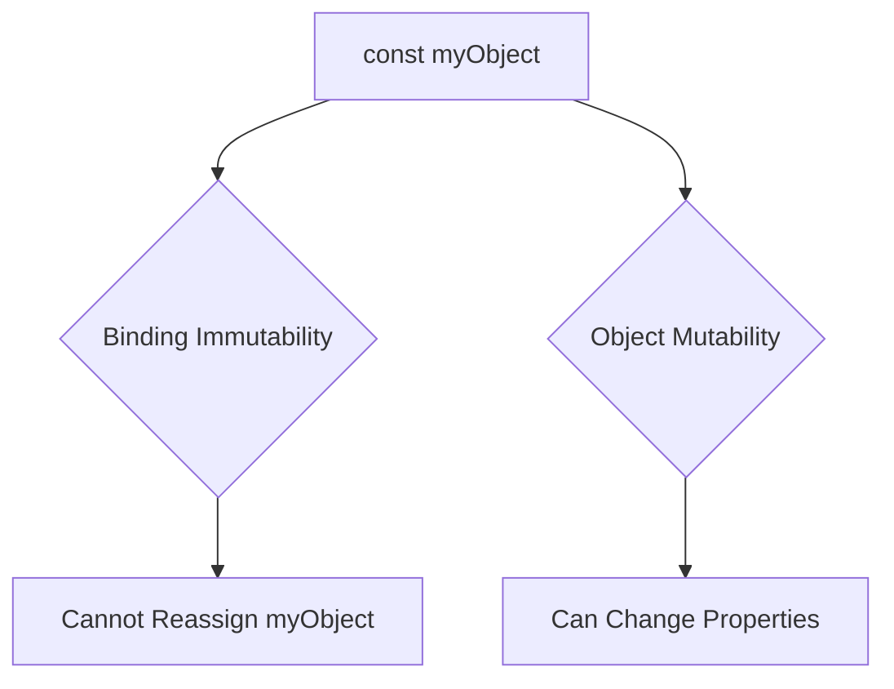

## 2.3. Constants with `const`

In JavaScript, the `const` keyword is used to declare variables that are meant to remain constant throughout the execution of a program. Understanding how to effectively use `const` is crucial for writing robust and maintainable code. In this section, we will explore the syntax and purpose of `const`, discuss the immutability of bindings, and clarify common misconceptions.

### The Purpose of `const`

The `const` keyword in JavaScript is used to create a variable that cannot be reassigned. This means once a value is assigned to a `const` variable, it cannot be changed through reassignment. This characteristic makes `const` particularly useful for defining constants—values that should remain unchanged throughout the program.

#### Syntax of `const`

The syntax for declaring a constant using `const` is straightforward. Here’s how you can declare a constant:

```javascript
const PI = 3.14159;
```

In this example, `PI` is a constant representing the mathematical constant π (pi). Once declared, `PI` cannot be reassigned to a different value.

### Immutability of Bindings vs. Mutability of Object Properties

A common point of confusion when using `const` is the distinction between the immutability of the binding and the mutability of object properties. Let's break this down:

- **Immutability of Bindings**: When you declare a variable with `const`, the binding itself is immutable. This means you cannot reassign the variable to a different value or object.

- **Mutability of Object Properties**: If the constant is an object (including arrays), the properties or elements of that object can still be changed. The immutability of `const` only applies to the binding, not the contents of the object.

#### Example: Immutability of Bindings

```javascript
const number = 42;
number = 50; // Error: Assignment to constant variable.
```

In this example, attempting to reassign `number` results in an error because `number` is a constant.

#### Example: Mutability of Object Properties

```javascript
const person = {
  name: 'Alice',
  age: 30
};

// Modifying a property of the object
person.age = 31; // This is allowed

// Attempting to reassign the object
person = { name: 'Bob', age: 25 }; // Error: Assignment to constant variable.
```

Here, while we cannot reassign the `person` object to a new object, we can modify its properties.

### Common Misconceptions About `const`

#### Misconception 1: `const` Makes Objects Immutable

A common misconception is that declaring an object with `const` makes the object itself immutable. As we’ve seen, this is not true. The object’s properties can still be changed.

#### Misconception 2: `const` Variables Must Be Initialized Immediately

Unlike `let` and `var`, `const` variables must be initialized at the time of declaration. This requirement ensures that the constant is assigned a value before it is used.

```javascript
const greeting; // Error: Missing initializer in const declaration
```

### Valid and Invalid Uses of `const`

#### Valid Use Cases

- **Defining Constants**: Use `const` for values that should not change, such as mathematical constants or configuration values.

```javascript
const MAX_USERS = 100;
const API_URL = 'https://api.example.com';
```

- **Immutable References**: Use `const` when you want to ensure that a variable reference does not change, even if the object it points to might.

```javascript
const settings = {
  theme: 'dark',
  notifications: true
};
```

#### Invalid Use Cases

- **Reassigning a `const` Variable**: Attempting to reassign a `const` variable will result in an error.

```javascript
const color = 'blue';
color = 'red'; // Error: Assignment to constant variable.
```

- **Declaring Without Initialization**: `const` variables must be initialized when they are declared.

```javascript
const user; // Error: Missing initializer in const declaration
```

### Code Examples

Let's look at some practical examples to solidify our understanding of `const`.

#### Example 1: Using `const` for Constants

```javascript
const TAX_RATE = 0.07;

function calculateTotal(price) {
  return price + (price * TAX_RATE);
}

console.log(calculateTotal(100)); // Outputs: 107
```

In this example, `TAX_RATE` is a constant that represents a fixed tax rate. It is used in the `calculateTotal` function to compute the total price including tax.

#### Example 2: `const` with Objects

```javascript
const car = {
  make: 'Toyota',
  model: 'Corolla'
};

// Modifying properties
car.model = 'Camry'; // Allowed

// Reassigning the object
car = { make: 'Honda', model: 'Civic' }; // Error: Assignment to constant variable.
```

Here, we can change the `model` property of the `car` object, but we cannot reassign `car` to a new object.

### Visualizing `const` Behavior

To better understand how `const` works, let's visualize the concept of immutability of bindings and mutability of object properties using a diagram.



**Diagram Description**: This diagram illustrates that a `const` binding is immutable, meaning the variable cannot be reassigned. However, if the `const` variable is an object, its properties can still be changed.

### Try It Yourself

Experiment with the following code examples to deepen your understanding of `const`. Try modifying the properties of objects declared with `const` and observe the behavior.

```javascript
const fruits = ['apple', 'banana', 'cherry'];

// Add a new fruit
fruits.push('date'); // Allowed

// Reassign the array
fruits = ['kiwi', 'mango']; // Error: Assignment to constant variable.
```

**Challenge**: Modify the `fruits` array by adding or removing elements without reassigning the array itself.

### References and Further Reading

For more information about `const` and variable declarations in JavaScript, consider exploring the following resources:

- [MDN Web Docs on `const`](https://developer.mozilla.org/en-US/docs/Web/JavaScript/Reference/Statements/const)
- [W3Schools JavaScript `const`](https://www.w3schools.com/js/js_const.asp)

### Knowledge Check

Before moving on, let's summarize the key points:

- `const` is used to declare variables that cannot be reassigned.
- The immutability of `const` applies to the binding, not the object properties.
- `const` variables must be initialized at the time of declaration.
- Use `const` for values that should remain constant throughout the program.

### Embrace the Journey

Remember, mastering JavaScript is a journey, and understanding the nuances of `const` is a significant step forward. Keep experimenting, stay curious, and enjoy the process of learning and discovery.

## Quiz Time!



### What is the primary purpose of the `const` keyword in JavaScript?

- [x] To declare variables that cannot be reassigned.
- [ ] To declare variables that can be reassigned.
- [ ] To declare variables with block scope.
- [ ] To declare variables without initialization.

> **Explanation:** The `const` keyword is used to declare variables that cannot be reassigned after their initial assignment.

### Can the properties of an object declared with `const` be changed?

- [x] Yes, the properties can be changed.
- [ ] No, the properties cannot be changed.
- [ ] Yes, but only if the object is an array.
- [ ] No, only primitive values can be changed.

> **Explanation:** While the binding of a `const` variable is immutable, the properties of an object declared with `const` can still be changed.

### What happens if you try to reassign a `const` variable?

- [ ] The reassignment is allowed.
- [x] An error occurs.
- [ ] The variable is silently ignored.
- [ ] The variable is converted to a `let`.

> **Explanation:** Attempting to reassign a `const` variable results in an error because `const` bindings are immutable.

### Is it possible to declare a `const` variable without initializing it?

- [ ] Yes, it is possible.
- [x] No, it is not possible.
- [ ] Yes, but only if it is a primitive type.
- [ ] No, unless it is an object.

> **Explanation:** `const` variables must be initialized at the time of declaration.

### Which of the following is a valid use of `const`?

- [x] Declaring a constant value that should not change.
- [ ] Declaring a variable that will be reassigned later.
- [ ] Declaring a variable with block scope.
- [ ] Declaring a variable without a value.

> **Explanation:** `const` is used to declare constant values that should not change throughout the program.

### What is the error message when trying to reassign a `const` variable?

- [ ] SyntaxError
- [x] TypeError
- [ ] ReferenceError
- [ ] RangeError

> **Explanation:** Attempting to reassign a `const` variable results in a TypeError.

### Can you change the elements of an array declared with `const`?

- [x] Yes, you can change the elements.
- [ ] No, you cannot change the elements.
- [ ] Yes, but only if the array is empty.
- [ ] No, unless the array is a primitive type.

> **Explanation:** The elements of an array declared with `const` can be changed, but the array itself cannot be reassigned.

### What is a common misconception about `const`?

- [ ] `const` variables can be reassigned.
- [x] `const` makes objects immutable.
- [ ] `const` variables do not need initialization.
- [ ] `const` is the same as `let`.

> **Explanation:** A common misconception is that `const` makes objects immutable, but it only makes the binding immutable.

### Which keyword should you use for a variable that will not change?

- [x] `const`
- [ ] `let`
- [ ] `var`
- [ ] `function`

> **Explanation:** Use `const` for variables that will not change throughout the program.

### True or False: `const` variables can be declared without a value.

- [ ] True
- [x] False

> **Explanation:** `const` variables must be initialized with a value at the time of declaration.




