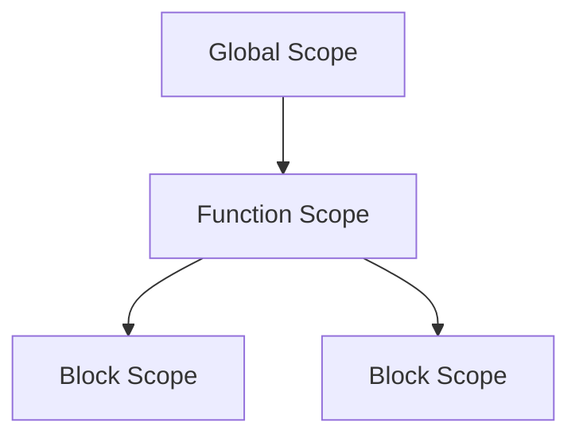
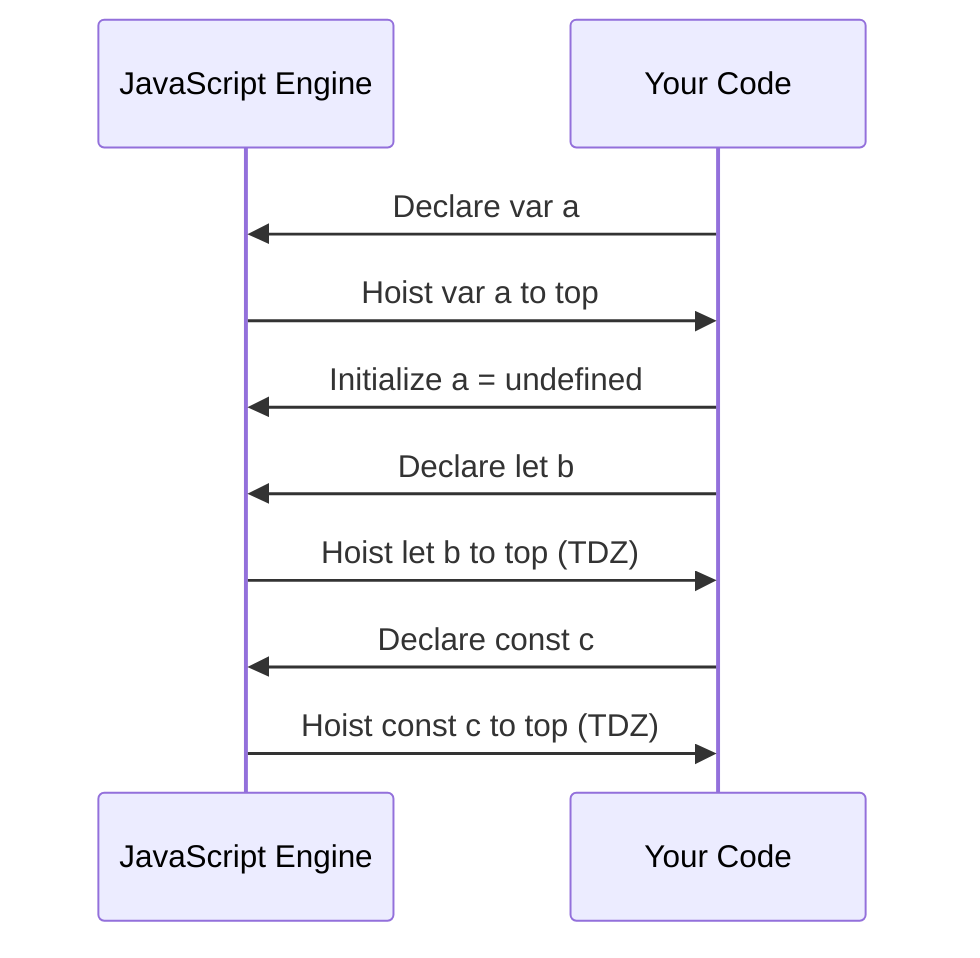

## 2.4. Comparing `var`, `let`, and `const`

As we delve deeper into JavaScript, understanding the nuances between `var`, `let`, and `const` becomes crucial. These keywords are used to declare variables, but they differ significantly in terms of scoping, hoisting, and re-assignment capabilities. In this section, we will explore these differences and provide guidance on when to use each keyword.

### Understanding Variable Declaration Keywords

JavaScript provides three keywords for declaring variables: `var`, `let`, and `const`. Each has its own characteristics and use cases. Let's break down each keyword and understand their unique properties.

#### `var`

The `var` keyword is the oldest way to declare variables in JavaScript. It has been around since the language's inception and is known for its function-scoped nature.

- **Scope**: Variables declared with `var` are function-scoped, meaning they are accessible within the function they are declared in. If declared outside any function, they become globally scoped.
- **Hoisting**: `var` declarations are hoisted to the top of their containing function or global context. This means the variable can be used before it is declared, but its value will be `undefined` until the line where it is initialized is executed.
- **Re-assignment**: Variables declared with `var` can be re-assigned and re-declared within the same scope.

**Example of `var`:**

```javascript
function exampleVar() {
    console.log(x); // undefined due to hoisting
    var x = 10;
    console.log(x); // 10
}

exampleVar();
```

#### `let`

Introduced in ECMAScript 6 (ES6), the `let` keyword provides block-level scoping, which is more predictable and intuitive compared to `var`.

- **Scope**: `let` is block-scoped, meaning it is only accessible within the block (denoted by `{}`) it is declared in.
- **Hoisting**: Like `var`, `let` is hoisted, but it is not initialized. This results in a "Temporal Dead Zone" (TDZ) from the start of the block until the declaration is encountered.
- **Re-assignment**: Variables declared with `let` can be re-assigned but not re-declared within the same block.

**Example of `let`:**

```javascript
function exampleLet() {
    if (true) {
        let y = 20;
        console.log(y); // 20
    }
    // console.log(y); // ReferenceError: y is not defined
}

exampleLet();
```

#### `const`

Also introduced in ES6, `const` is used to declare variables that are meant to be constant, meaning their values should not change after they are initialized.

- **Scope**: Like `let`, `const` is block-scoped.
- **Hoisting**: `const` is hoisted but not initialized, similar to `let`, and also experiences the TDZ.
- **Re-assignment**: Variables declared with `const` cannot be re-assigned or re-declared. However, if the variable is an object or array, its properties or elements can be modified.

**Example of `const`:**

```javascript
function exampleConst() {
    const z = 30;
    console.log(z); // 30
    // z = 40; // TypeError: Assignment to constant variable.
}

exampleConst();
```

### Comparison Table

To summarize the differences between `var`, `let`, and `const`, let's look at a comparison table:

| Feature            | `var`                     | `let`                  | `const`                |
|--------------------|---------------------------|------------------------|------------------------|
| **Scope**          | Function or global        | Block                  | Block                  |
| **Hoisting**       | Hoisted, initialized to `undefined` | Hoisted, uninitialized (TDZ) | Hoisted, uninitialized (TDZ) |
| **Re-assignment**  | Allowed                   | Allowed                | Not allowed            |
| **Re-declaration** | Allowed                   | Not allowed in the same block | Not allowed in the same block |

### Scoping Rules

Understanding scoping rules is essential for writing efficient and bug-free code. Let's explore how each keyword behaves in terms of scope.

#### Function Scope vs. Block Scope

- **Function Scope**: Variables declared with `var` are confined to the function in which they are declared. If declared outside any function, they become global.
- **Block Scope**: Variables declared with `let` and `const` are confined to the block in which they are declared. This includes any `{}` pair, such as those used in loops, conditionals, and functions.

**Example of Scoping:**

```javascript
function scopeExample() {
    if (true) {
        var a = 1;
        let b = 2;
        const c = 3;
    }
    console.log(a); // 1
    // console.log(b); // ReferenceError: b is not defined
    // console.log(c); // ReferenceError: c is not defined
}

scopeExample();
```

### Hoisting Behavior

Hoisting is a JavaScript mechanism where variable and function declarations are moved to the top of their containing scope during the compile phase. However, only the declarations are hoisted, not the initializations.

- **`var`**: Both declaration and initialization are hoisted, but initialization is set to `undefined`.
- **`let` and `const`**: Only declarations are hoisted, leading to the TDZ until the line of initialization.

**Example of Hoisting:**

```javascript
function hoistingExample() {
    console.log(d); // undefined
    var d = 4;
    // console.log(e); // ReferenceError: Cannot access 'e' before initialization
    let e = 5;
    // console.log(f); // ReferenceError: Cannot access 'f' before initialization
    const f = 6;
}

hoistingExample();
```

### Re-assignment Capabilities

Re-assignment refers to the ability to change the value of a variable after its initial declaration.

- **`var` and `let`**: Allow re-assignment.
- **`const`**: Does not allow re-assignment. However, for objects and arrays, their contents can be modified.

**Example of Re-assignment:**

```javascript
let g = 7;
g = 8; // Allowed

const h = 9;
// h = 10; // TypeError: Assignment to constant variable.

const obj = { key: 'value' };
obj.key = 'new value'; // Allowed
```

### Guidelines for Choosing the Right Keyword

Choosing the appropriate keyword for variable declaration is crucial for writing clean and maintainable code. Here are some guidelines:

- **Use `let`** when you expect the variable's value to change over time, and you want to limit its scope to the block in which it is declared.
- **Use `const`** when you want to declare a variable that should not be re-assigned. This is ideal for constants, configuration settings, or any value that should remain unchanged.
- **Avoid `var`** in modern JavaScript development unless you are maintaining legacy code. The block-scoping of `let` and `const` provides better control and predictability.

### Practical Examples

Let's look at some practical examples to see how these keywords are used in real-world scenarios.

#### Example 1: Loop with `let`

Using `let` in a loop ensures that each iteration has its own scope, preventing unexpected behavior.

```javascript
for (let i = 0; i < 3; i++) {
    setTimeout(() => console.log(i), 1000); // 0, 1, 2
}
```

#### Example 2: Constants with `const`

Use `const` for values that should not change, such as configuration settings.

```javascript
const API_URL = 'https://api.example.com/data';
fetch(API_URL)
    .then(response => response.json())
    .then(data => console.log(data));
```

#### Example 3: Legacy Code with `var`

In older codebases, you might encounter `var`. It's important to understand its behavior to maintain such code.

```javascript
function legacyFunction() {
    var x = 10;
    if (true) {
        var x = 20; // Re-declares and overwrites the previous x
        console.log(x); // 20
    }
    console.log(x); // 20
}

legacyFunction();
```

### Try It Yourself

To solidify your understanding, try modifying the examples above. For instance, change the `let` in the loop example to `var` and observe the difference in behavior. Experiment with re-assigning `const` variables and see the errors that occur.

### Visualizing Scoping and Hoisting

To better understand how scoping and hoisting work, let's visualize these concepts using diagrams.

#### Visualizing Scoping



*Diagram Caption*: This diagram illustrates the hierarchy of scopes in JavaScript. Variables declared with `var` are accessible in the function scope, while `let` and `const` are confined to block scopes.

#### Visualizing Hoisting



*Diagram Caption*: This sequence diagram shows how the JavaScript engine hoists variable declarations. `var` is initialized to `undefined`, while `let` and `const` remain in the TDZ until initialized.

### References and Links

For more information on JavaScript variable declarations, consider the following resources:

- [MDN Web Docs: var](https://developer.mozilla.org/en-US/docs/Web/JavaScript/Reference/Statements/var)
- [MDN Web Docs: let](https://developer.mozilla.org/en-US/docs/Web/JavaScript/Reference/Statements/let)
- [MDN Web Docs: const](https://developer.mozilla.org/en-US/docs/Web/JavaScript/Reference/Statements/const)
- [W3Schools JavaScript Variables](https://www.w3schools.com/js/js_variables.asp)

### Knowledge Check

Before moving on, let's reinforce what we've learned with a few questions and exercises.

1. What is the main difference between `var` and `let` in terms of scope?
2. How does hoisting affect `const` declarations?
3. Why is it recommended to use `const` for variables that should not change?
4. Modify the loop example to use `var` and observe the output.
5. Experiment with re-assigning a `const` object property.

### Embrace the Journey

Remember, mastering JavaScript is a journey. As you continue to learn, you'll become more comfortable with these concepts and how they apply to real-world programming. Keep experimenting, stay curious, and enjoy the process!

## Quiz Time!



### What is the scope of a variable declared with `var`?

- [x] Function or global
- [ ] Block
- [ ] Module
- [ ] Local

> **Explanation:** Variables declared with `var` are function-scoped or globally scoped if declared outside a function.

### Which keyword should be used for a variable that should not be re-assigned?

- [ ] var
- [ ] let
- [x] const
- [ ] function

> **Explanation:** `const` is used for variables that should not be re-assigned.

### What is the Temporal Dead Zone (TDZ)?

- [ ] A period when a variable is not declared
- [x] A period when a variable is declared but not initialized
- [ ] A period when a variable is initialized but not used
- [ ] A period when a variable is hoisted

> **Explanation:** The TDZ is the time between the hoisting of a `let` or `const` variable and its initialization.

### Can a `const` object have its properties modified?

- [x] Yes
- [ ] No

> **Explanation:** While `const` prevents re-assignment of the variable, the properties of an object declared with `const` can be modified.

### Which keyword allows re-declaration of variables within the same scope?

- [x] var
- [ ] let
- [ ] const
- [ ] function

> **Explanation:** `var` allows re-declaration of variables within the same scope.

### What happens when you try to access a `let` variable before its declaration?

- [ ] It returns `undefined`
- [x] It throws a ReferenceError
- [ ] It returns `null`
- [ ] It returns `NaN`

> **Explanation:** Accessing a `let` variable before its declaration results in a ReferenceError due to the TDZ.

### Which keyword is not recommended for use in modern JavaScript development?

- [x] var
- [ ] let
- [ ] const
- [ ] function

> **Explanation:** `var` is not recommended due to its function-scoped nature and potential for unexpected behavior.

### How are `let` and `const` variables hoisted?

- [ ] They are not hoisted
- [x] They are hoisted but not initialized
- [ ] They are hoisted and initialized to `undefined`
- [ ] They are hoisted and initialized to `null`

> **Explanation:** `let` and `const` are hoisted but not initialized, leading to the TDZ.

### What is the recommended keyword for declaring variables in loops?

- [ ] var
- [x] let
- [ ] const
- [ ] function

> **Explanation:** `let` is recommended for loops to ensure block-level scoping.

### True or False: `const` variables can be re-assigned.

- [ ] True
- [x] False

> **Explanation:** `const` variables cannot be re-assigned after their initial declaration.


