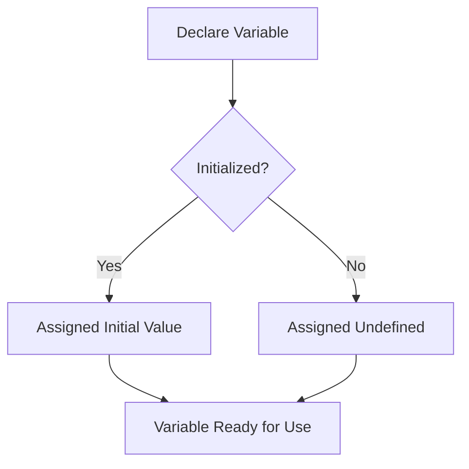

## 2.5. Default Values and Initialization

In this section, we will explore the concept of default values and initialization in JavaScript. Understanding how JavaScript handles variables, especially when they are not explicitly initialized, is crucial for writing robust and error-free code. We will delve into what happens when variables are declared without initialization, the implications of the `undefined` value, and best practices for initializing variables to prevent bugs.

### The Importance of Initialization

Initialization is the process of assigning an initial value to a variable at the time of its declaration. In JavaScript, a variable can be declared without being initialized, which means it is created without an initial value. This can lead to unexpected behavior if the variable is used before it is explicitly assigned a value.

#### Why Initialize Variables?

1. **Avoiding `undefined` Values**: When a variable is declared but not initialized, its default value is `undefined`. This can lead to runtime errors if the variable is used in operations expecting a specific data type.

2. **Improving Code Readability**: Initializing variables makes your code more readable and understandable. It provides context about the variable's intended use and expected data type.

3. **Preventing Logical Errors**: Uninitialized variables can lead to logical errors that are difficult to debug. By initializing variables, you ensure that they have a known state before being used.

4. **Enhancing Program Stability**: Proper initialization contributes to the stability of your program by reducing the chances of encountering unexpected behavior due to uninitialized variables.

### What Happens When Variables Are Declared Without Initialization?

When you declare a variable in JavaScript without initializing it, the variable is automatically assigned the value `undefined`. This is a special value that represents the absence of a meaningful value. Let's look at an example:

```javascript
let myVariable;
console.log(myVariable); // Output: undefined
```

In the example above, `myVariable` is declared but not initialized. When we log its value to the console, we see `undefined`.

#### Understanding `undefined`

The `undefined` value is a primitive value in JavaScript. It is automatically assigned to variables that have been declared but not initialized. It is important to understand that `undefined` is different from `null`. While `undefined` indicates the absence of a value, `null` is an assignment value that represents no value or no object.

Here's a comparison:

```javascript
let uninitializedVariable;
let nullVariable = null;

console.log(uninitializedVariable); // Output: undefined
console.log(nullVariable); // Output: null
```

In this example, `uninitializedVariable` is `undefined` because it hasn't been assigned a value, whereas `nullVariable` is explicitly set to `null`.

### Implications of Using `undefined`

Using `undefined` can lead to several issues in your code:

1. **Type Errors**: If you try to perform operations on an `undefined` variable, you may encounter type errors. For example, attempting to access a property of `undefined` will result in a `TypeError`.

2. **Logical Errors**: Using `undefined` in logical operations can lead to unexpected results. For example, comparing `undefined` with other values may not produce the intended outcome.

3. **Debugging Challenges**: Debugging code with `undefined` values can be challenging, especially in large codebases. It can be difficult to track down where the `undefined` value originated.

### Best Practices for Initializing Variables

To prevent issues related to uninitialized variables, follow these best practices:

#### 1. Always Initialize Variables

Whenever possible, initialize variables at the time of declaration. This ensures that they have a known state before being used.

```javascript
let count = 0; // Initialize with a number
let name = ""; // Initialize with an empty string
let isActive = false; // Initialize with a boolean
```

#### 2. Use Default Values

When declaring variables that may not always have an initial value, consider using default values. This can be particularly useful in function parameters.

```javascript
function greet(name = "Guest") {
  console.log(`Hello, ${name}!`);
}

greet(); // Output: Hello, Guest!
greet("Alice"); // Output: Hello, Alice!
```

In this example, the `greet` function uses a default value of "Guest" for the `name` parameter if no argument is provided.

#### 3. Check for `undefined` Before Use

Before using a variable that may be `undefined`, check its value to ensure it is not `undefined`. This can prevent runtime errors.

```javascript
let userInput;

if (typeof userInput !== 'undefined') {
  console.log(`User input: ${userInput}`);
} else {
  console.log("No user input provided.");
}
```

#### 4. Use `null` for Intentional Absence of Value

When you want to explicitly indicate that a variable should have no value, use `null` instead of leaving it `undefined`.

```javascript
let selectedOption = null; // Indicates no option is selected
```

#### 5. Avoid Overusing `var`

The `var` keyword has function scope and can lead to unintentional `undefined` values due to hoisting. Prefer using `let` and `const` for block-scoped variables.

```javascript
function example() {
  var x;
  console.log(x); // Output: undefined
  x = 10;
  console.log(x); // Output: 10
}
```

In this example, `x` is hoisted to the top of the function, resulting in an `undefined` value when first logged.

### Practical Examples of Initialization

Let's explore some practical examples to reinforce the concepts we've discussed.

#### Example 1: Initializing Variables in a Loop

Consider a scenario where you need to sum an array of numbers. Initializing the accumulator variable is crucial to ensure correct results.

```javascript
let numbers = [1, 2, 3, 4, 5];
let sum = 0; // Initialize the sum variable

for (let i = 0; i < numbers.length; i++) {
  sum += numbers[i];
}

console.log(`Total sum: ${sum}`); // Output: Total sum: 15
```

In this example, `sum` is initialized to `0` before the loop begins. This ensures that the accumulation starts from a known value.

#### Example 2: Default Values in Function Parameters

Using default values in function parameters can simplify function calls and provide fallback behavior.

```javascript
function calculateArea(width = 1, height = 1) {
  return width * height;
}

console.log(calculateArea(5, 10)); // Output: 50
console.log(calculateArea(5)); // Output: 5 (height defaults to 1)
console.log(calculateArea()); // Output: 1 (both width and height default to 1)
```

In this example, the `calculateArea` function provides default values for `width` and `height`, ensuring that the function can be called with fewer arguments.

### Visualizing Variable Initialization

To better understand variable initialization and the concept of `undefined`, let's visualize the process using a flowchart.



**Figure 1: Flowchart of Variable Initialization in JavaScript**

In this flowchart, we see that when a variable is declared, it is checked for initialization. If it is initialized, it is assigned the initial value; otherwise, it is assigned `undefined`. In both cases, the variable becomes ready for use.

### Try It Yourself

To solidify your understanding, try modifying the code examples provided. Experiment with different initial values, and observe how the behavior of the code changes. For instance, try initializing variables with different data types or using default values in functions with varying arguments.

### References and Further Reading

- [MDN Web Docs: Variables](https://developer.mozilla.org/en-US/docs/Web/JavaScript/Guide/Grammar_and_types#variables)
- [W3Schools: JavaScript Variables](https://www.w3schools.com/js/js_variables.asp)

### Knowledge Check

Before we conclude, let's summarize the key takeaways:

- Always initialize variables to avoid `undefined` values.
- Use default values in function parameters to provide fallback behavior.
- Check for `undefined` before using variables to prevent runtime errors.
- Prefer `let` and `const` over `var` to avoid issues with hoisting.

Remember, this is just the beginning. As you progress, you'll build more complex and interactive web pages. Keep experimenting, stay curious, and enjoy the journey!

## Quiz Time!



### What is the default value of a variable that is declared but not initialized in JavaScript?

- [x] undefined
- [ ] null
- [ ] 0
- [ ] ""

> **Explanation:** In JavaScript, a variable that is declared but not initialized is automatically assigned the value `undefined`.

### Which keyword should you prefer to avoid issues with hoisting?

- [ ] var
- [x] let
- [x] const
- [ ] function

> **Explanation:** The `let` and `const` keywords provide block-level scoping and help avoid issues with hoisting that are common with `var`.

### What is the purpose of using default values in function parameters?

- [ ] To make the function run faster
- [x] To provide fallback behavior when arguments are missing
- [ ] To prevent the function from being called
- [ ] To make the function return `undefined`

> **Explanation:** Default values in function parameters provide fallback behavior when arguments are not provided, ensuring the function can still execute with meaningful values.

### How can you check if a variable is `undefined` before using it?

- [x] Use `typeof` to check if the variable is `undefined`
- [ ] Use `console.log` to print the variable
- [ ] Use `alert` to display the variable
- [ ] Use `parseInt` to convert the variable

> **Explanation:** The `typeof` operator can be used to check if a variable is `undefined`, helping prevent runtime errors.

### What value should you use to explicitly indicate that a variable should have no value?

- [ ] undefined
- [x] null
- [ ] 0
- [ ] false

> **Explanation:** The `null` value is used to explicitly indicate that a variable should have no value, as opposed to `undefined`, which indicates an uninitialized variable.

### Why is it important to initialize variables?

- [x] To avoid `undefined` values
- [x] To improve code readability
- [x] To prevent logical errors
- [ ] To make the code run slower

> **Explanation:** Initializing variables avoids `undefined` values, improves code readability, and prevents logical errors, contributing to more robust code.

### What is the difference between `undefined` and `null`?

- [x] `undefined` is the default value for uninitialized variables, while `null` is an assignment value representing no value.
- [ ] `null` is the default value for uninitialized variables, while `undefined` is an assignment value representing no value.
- [ ] Both are the same and can be used interchangeably.
- [ ] `undefined` is used for numbers, while `null` is used for strings.

> **Explanation:** `undefined` is the default value for uninitialized variables, while `null` is an assignment value representing no value.

### What happens if you try to access a property of an `undefined` variable?

- [ ] It returns `null`
- [ ] It returns `0`
- [x] It throws a `TypeError`
- [ ] It returns `false`

> **Explanation:** Attempting to access a property of an `undefined` variable results in a `TypeError`, as `undefined` does not have properties.

### How can you provide a default value for a function parameter?

- [x] By assigning a value in the function declaration, e.g., `function example(param = 10)`
- [ ] By using `if` statements inside the function
- [ ] By declaring the variable outside the function
- [ ] By using `var` keyword

> **Explanation:** Default values for function parameters can be provided directly in the function declaration, ensuring the parameter has a value if none is provided.

### True or False: Using `var` is recommended for all variable declarations to avoid issues with block scope.

- [ ] True
- [x] False

> **Explanation:** Using `var` is not recommended for all variable declarations because it does not provide block-level scoping, which can lead to issues with hoisting and unexpected behavior. Prefer `let` and `const`.


