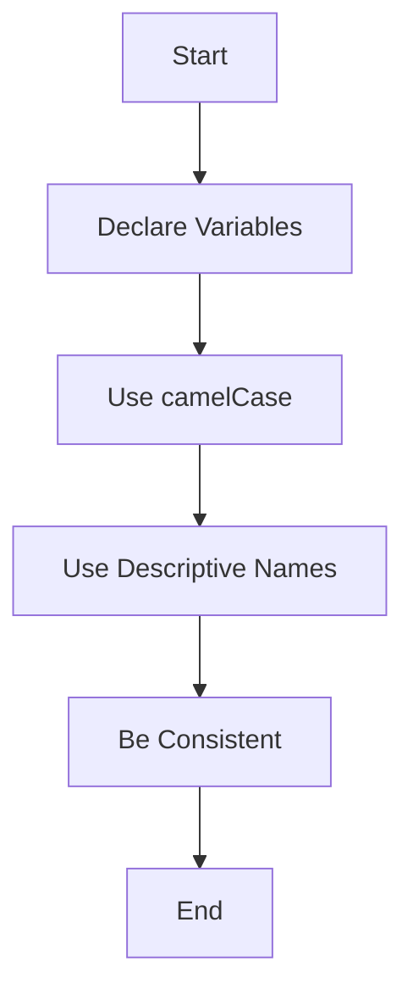

## 2.6. Variable Naming Conventions

In programming, especially in JavaScript, the way we name our variables plays a crucial role in the readability and maintainability of our code. As you embark on your journey to master JavaScript, understanding and applying effective variable naming conventions will set a strong foundation for your coding practices.

### Why Naming Conventions Matter

Variable names are not just arbitrary labels; they are the primary means by which we communicate the purpose and function of our code to ourselves and others. Good naming conventions can make your code self-documenting, reducing the need for excessive comments and making it easier for others (and your future self) to understand what your code does.

### Rules for Valid Variable Names

Before we dive into best practices, let's establish the basic rules for what constitutes a valid variable name in JavaScript:

1. **Start with a Letter, Underscore, or Dollar Sign**: Variable names must begin with a letter (a-z or A-Z), an underscore (_), or a dollar sign ($). They cannot start with a number.

2. **Case Sensitivity**: JavaScript variable names are case-sensitive. This means `myVariable`, `MyVariable`, and `MYVARIABLE` are considered distinct variables.

3. **No Reserved Keywords**: You cannot use JavaScript reserved keywords (like `var`, `let`, `const`, `function`, etc.) as variable names.

4. **Use Alphanumeric Characters**: After the first character, variable names can include letters, numbers, underscores, and dollar signs.

#### Examples of Valid and Invalid Variable Names

```javascript
// Valid variable names
let myVariable;
let _privateVariable;
let $dollarSign;
let variable123;

// Invalid variable names
let 123variable; // Starts with a number
let my-variable; // Contains a hyphen
let var;         // Reserved keyword
```

### Best Practices for Naming Variables

Now that we know the rules, let's explore some best practices to ensure your variable names are not only valid but also meaningful and consistent.

#### 1. Use Descriptive Names

**Explain**: Choose names that clearly describe the variable's purpose or the data it holds. This makes your code more intuitive.

**Example**:

```javascript
// Bad
let x = 10;

// Good
let userAge = 10;
```

#### 2. Adopt camelCase for Variables

**Explain**: In JavaScript, the convention is to use camelCase for variable names. This means starting with a lowercase letter and capitalizing the first letter of each subsequent word.

**Example**:

```javascript
// camelCase
let firstName;
let totalAmount;
```

#### 3. Avoid Single-Letter Names

**Explain**: Unless used in loops or very short-lived contexts, single-letter variable names can be ambiguous and should be avoided.

**Example**:

```javascript
// Bad
let a = 5;

// Good
let itemCount = 5;
```

#### 4. Be Consistent

**Explain**: Consistency in naming conventions across your codebase is crucial. It helps maintain readability and reduces cognitive load when switching between different parts of your code.

**Example**:

```javascript
// Consistent naming
let userName;
let userAge;

// Inconsistent naming
let userName;
let ageOfUser;
```

#### 5. Use Meaningful Context

**Explain**: Provide context in your variable names to make it clear what they represent. This is especially important in larger projects where variables might be used across multiple files.

**Example**:

```javascript
// Bad
let temp;

// Good
let temperatureInCelsius;
```

### Common Naming Conventions

Let's delve into some common naming conventions used in JavaScript and when to apply them.

#### camelCase

**Explain**: As mentioned earlier, camelCase is the standard for naming variables and functions in JavaScript. It improves readability by visually separating words.

**Example**:

```javascript
let userFirstName;
let totalPrice;
```

#### PascalCase

**Explain**: PascalCase is similar to camelCase but with the first letter capitalized. It's commonly used for class names and constructor functions.

**Example**:

```javascript
class UserAccount {
  constructor(firstName, lastName) {
    this.firstName = firstName;
    this.lastName = lastName;
  }
}
```

#### snake_case

**Explain**: While not common in JavaScript, snake_case (using underscores to separate words) is sometimes used for constants or configuration settings.

**Example**:

```javascript
const MAX_USERS = 100;
const API_BASE_URL = "https://api.example.com";
```

### Avoiding Common Pitfalls

#### Avoid Using Magic Numbers

**Explain**: Magic numbers are hard-coded values with no explanation. Instead, use named constants to provide context.

**Example**:

```javascript
// Bad
let area = length * 3.14;

// Good
const PI = 3.14;
let area = length * PI;
```

#### Avoid Abbreviations

**Explain**: While abbreviations might save a few keystrokes, they can make your code harder to understand, especially for someone unfamiliar with your project.

**Example**:

```javascript
// Bad
let usrNm;

// Good
let userName;
```

### Try It Yourself

Now that we've covered the basics, let's put these principles into practice. Try creating a few variables following the guidelines above. Experiment with different naming conventions and see how they affect the readability of your code.

```javascript
// Try creating variables for a shopping cart application
let cartItems = [];
let totalPrice = 0;
let isDiscountApplied = false;
```

### Visualizing Naming Conventions

To better understand how naming conventions can impact your code, let's visualize a simple JavaScript program using Mermaid.js.



**Description**: This flowchart illustrates the process of declaring variables with proper naming conventions in JavaScript.

### References and Links

For more information on JavaScript naming conventions and best practices, check out these resources:

- [MDN Web Docs - JavaScript Guide](https://developer.mozilla.org/en-US/docs/Web/JavaScript/Guide)
- [W3Schools - JavaScript Variables](https://www.w3schools.com/js/js_variables.asp)

### Knowledge Check

- Can you identify the rules for valid variable names in JavaScript?
- What are the benefits of using descriptive names for variables?
- How does camelCase improve code readability?

### Embrace the Journey

Remember, mastering variable naming conventions is just the beginning of writing clean and maintainable JavaScript code. As you continue to learn and grow as a developer, these foundational skills will serve you well. Keep experimenting, stay curious, and enjoy the journey!

### Quiz Time!



### Which of the following is a valid variable name in JavaScript?

- [x] _myVariable
- [ ] 123variable
- [ ] my-variable
- [ ] var

> **Explanation:** `_myVariable` is valid because it starts with an underscore. `123variable` starts with a number, `my-variable` contains a hyphen, and `var` is a reserved keyword.

### What is the recommended naming convention for variables in JavaScript?

- [x] camelCase
- [ ] snake_case
- [ ] PascalCase
- [ ] UPPERCASE

> **Explanation:** camelCase is the standard convention for naming variables in JavaScript, improving readability by visually separating words.

### Why should you avoid using single-letter variable names?

- [x] They can be ambiguous
- [ ] They are not valid in JavaScript
- [ ] They are reserved keywords
- [ ] They are too long

> **Explanation:** Single-letter variable names can be ambiguous and make the code harder to understand.

### Which of the following is an example of a descriptive variable name?

- [x] userAge
- [ ] x
- [ ] temp
- [ ] a

> **Explanation:** `userAge` clearly describes the data it holds, making the code more intuitive.

### What is the benefit of using named constants instead of magic numbers?

- [x] Provides context
- [ ] Saves memory
- [x] Improves readability
- [ ] Increases execution speed

> **Explanation:** Named constants provide context and improve readability by explaining the purpose of the value.

### Which of the following is a bad practice in variable naming?

- [x] Using abbreviations
- [ ] Using camelCase
- [ ] Being consistent
- [ ] Using descriptive names

> **Explanation:** Using abbreviations can make the code harder to understand, especially for someone unfamiliar with the project.

### What should you avoid using as variable names?

- [x] Reserved keywords
- [ ] Descriptive names
- [x] Magic numbers
- [ ] camelCase

> **Explanation:** Reserved keywords and magic numbers should be avoided as variable names.

### How does consistency in naming conventions help?

- [x] Reduces cognitive load
- [ ] Increases execution speed
- [ ] Saves memory
- [ ] Makes code longer

> **Explanation:** Consistency in naming conventions reduces cognitive load by making it easier to understand and navigate the code.

### What is the main advantage of using camelCase?

- [x] Improves readability
- [ ] Increases execution speed
- [ ] Saves memory
- [ ] Makes code shorter

> **Explanation:** camelCase improves readability by visually separating words in variable names.

### True or False: JavaScript variable names are case-sensitive.

- [x] True
- [ ] False

> **Explanation:** JavaScript variable names are case-sensitive, meaning `myVariable` and `MyVariable` are distinct.


