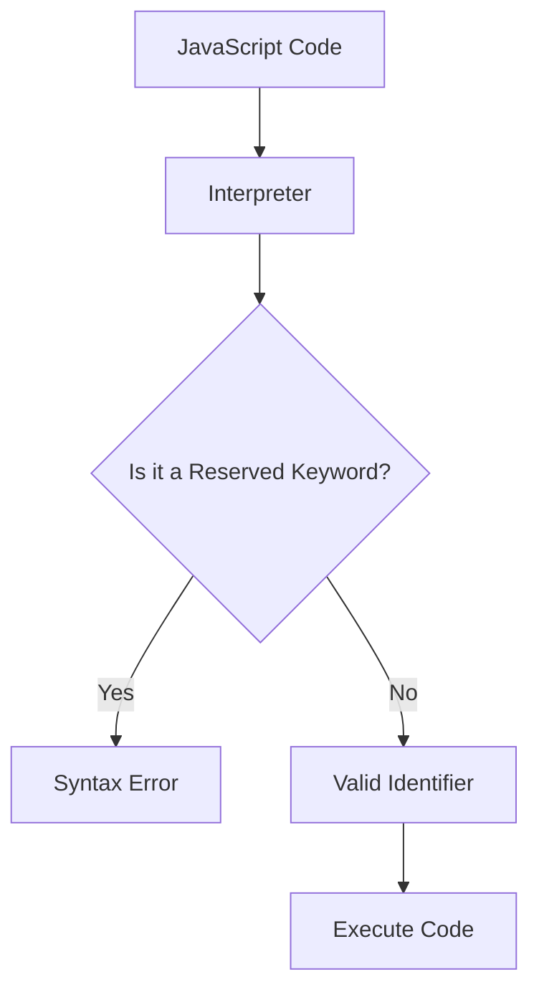

## 2.7. Reserved Keywords and Identifiers

In JavaScript, as in many programming languages, certain words are reserved for specific purposes and cannot be used as variable names. These reserved keywords are integral to the language's syntax and functionality. Understanding these keywords and identifiers is crucial for writing error-free code and ensuring compatibility with future versions of JavaScript.

### What Are Reserved Keywords?

Reserved keywords in JavaScript are predefined words that have special meanings and are part of the language's syntax. These words are used to perform specific operations and cannot be redefined or used as identifiers, such as variable names, function names, or any other identifiers.

#### List of Reserved Keywords

Here is a comprehensive list of reserved keywords in JavaScript:

- `break`
- `case`
- `catch`
- `class`
- `const`
- `continue`
- `debugger`
- `default`
- `delete`
- `do`
- `else`
- `enum`
- `export`
- `extends`
- `false`
- `finally`
- `for`
- `function`
- `if`
- `import`
- `in`
- `instanceof`
- `new`
- `null`
- `return`
- `super`
- `switch`
- `this`
- `throw`
- `true`
- `try`
- `typeof`
- `var`
- `void`
- `while`
- `with`
- `yield`

#### Why Reserved Keywords Cannot Be Used as Identifiers

Using reserved keywords as identifiers can cause syntax errors because the JavaScript interpreter expects these words to perform specific operations. For example, if you try to use `for` as a variable name, the interpreter will be confused because it expects `for` to initiate a loop.

```javascript
// Incorrect usage of reserved keyword
var for = 5; // SyntaxError: Unexpected token 'for'
```

In the example above, JavaScript throws a syntax error because `for` is a reserved keyword used to start a loop, and it cannot be used as a variable name.

### Contextual Keywords

JavaScript also has contextual keywords, which are words that have special meanings only in certain contexts. These words can sometimes be used as identifiers outside their specific contexts. However, it is generally advisable to avoid using them as identifiers to prevent confusion and potential errors.

#### Examples of Contextual Keywords

- `await`: Used in asynchronous programming with `async` functions.
- `let`: Used for block-scoped variable declarations.
- `static`: Used in class declarations to define static methods.
- `yield`: Used in generator functions to pause and resume execution.

```javascript
// Contextual keyword used as an identifier
var await = 10; // Valid, but not recommended

async function example() {
  // Here, 'await' is used in its specific context
  let result = await someAsyncFunction();
}
```

In the above example, `await` is used as a variable name outside its context, which is technically valid but not recommended. Inside the `example` function, `await` is used correctly in its context with an `async` function.

### Avoiding Future Reserved Words

JavaScript continues to evolve, and new keywords may be introduced in future versions. To ensure compatibility and avoid potential issues, it's a good practice to avoid using words that might become reserved in the future. The ECMAScript specification provides a list of future reserved words, which includes:

- `implements`
- `interface`
- `let`
- `package`
- `private`
- `protected`
- `public`
- `static`
- `yield`

### Best Practices for Choosing Identifiers

Choosing appropriate identifiers is crucial for writing clear and maintainable code. Here are some best practices:

1. **Use Descriptive Names**: Choose names that clearly describe the purpose of the variable or function. For example, use `totalPrice` instead of `x`.

2. **Follow Naming Conventions**: Use camelCase for variable and function names, and PascalCase for class names. For example, `myVariable` and `MyClass`.

3. **Avoid Single-Letter Names**: Unless used in a loop or a very short function, avoid single-letter variable names as they can be unclear.

4. **Be Consistent**: Stick to a consistent naming convention throughout your codebase to improve readability.

5. **Avoid Reserved and Contextual Keywords**: As discussed, avoid using reserved and contextual keywords as identifiers.

### Visualizing Reserved Keywords and Identifiers

To better understand the concept of reserved keywords and identifiers, let's visualize how JavaScript interprets them.



**Diagram Description**: This flowchart illustrates how JavaScript interprets code. When the interpreter encounters a word, it checks if it's a reserved keyword. If it is, a syntax error occurs. If not, it's treated as a valid identifier, and the code is executed.

### Try It Yourself

To reinforce your understanding, try modifying the following code examples:

1. Attempt to use a reserved keyword as a variable name and observe the error.
2. Use a contextual keyword as an identifier and see if it works.
3. Create a list of identifiers following the best practices mentioned above.

### References and Links

For more information on reserved keywords and identifiers, you can refer to the following resources:

- [MDN Web Docs: Reserved Words](https://developer.mozilla.org/en-US/docs/Web/JavaScript/Reference/Lexical_grammar#Keywords)
- [W3Schools: JavaScript Reserved Words](https://www.w3schools.com/js/js_reserved.asp)

### Knowledge Check

Let's summarize the key points covered in this section:

- Reserved keywords in JavaScript have special meanings and cannot be used as identifiers.
- Using reserved keywords as identifiers results in syntax errors.
- Contextual keywords have special meanings only in certain contexts and can sometimes be used as identifiers.
- Avoid using future reserved words to ensure compatibility with future JavaScript versions.
- Follow best practices for choosing identifiers to write clear and maintainable code.

## Quiz Time!



### What is a reserved keyword in JavaScript?

- [x] A word that has a special meaning and cannot be used as an identifier
- [ ] A word that can be used as a variable name
- [ ] A word that is only used in comments
- [ ] A word that is not part of the JavaScript language

> **Explanation:** Reserved keywords have special meanings in JavaScript and cannot be used as identifiers like variable names.

### Which of the following is a reserved keyword in JavaScript?

- [x] `function`
- [ ] `myVar`
- [ ] `calculate`
- [ ] `sum`

> **Explanation:** `function` is a reserved keyword used to declare functions in JavaScript.

### What happens if you use a reserved keyword as a variable name?

- [x] A syntax error occurs
- [ ] The code runs without issues
- [ ] The keyword is ignored
- [ ] The keyword is automatically renamed

> **Explanation:** Using a reserved keyword as a variable name results in a syntax error because the interpreter expects it to perform a specific operation.

### Which of the following is a contextual keyword in JavaScript?

- [x] `await`
- [ ] `var`
- [ ] `if`
- [ ] `else`

> **Explanation:** `await` is a contextual keyword used in asynchronous programming with `async` functions.

### Can contextual keywords be used as identifiers outside their specific contexts?

- [x] Yes, but it's not recommended
- [ ] No, they are always reserved
- [ ] Yes, and it's recommended
- [ ] No, they cause syntax errors

> **Explanation:** Contextual keywords can sometimes be used as identifiers outside their specific contexts, but it's not recommended to avoid confusion.

### Which of the following is a future reserved word in JavaScript?

- [x] `interface`
- [ ] `console`
- [ ] `document`
- [ ] `window`

> **Explanation:** `interface` is a future reserved word that might be used in future versions of JavaScript.

### What is the best practice for choosing identifiers?

- [x] Use descriptive names and follow naming conventions
- [ ] Use single-letter names for simplicity
- [ ] Use reserved keywords for clarity
- [ ] Use random names to avoid conflicts

> **Explanation:** Using descriptive names and following naming conventions helps write clear and maintainable code.

### Why should you avoid using future reserved words as identifiers?

- [x] To ensure compatibility with future JavaScript versions
- [ ] To make the code more complex
- [ ] To confuse other developers
- [ ] To improve performance

> **Explanation:** Avoiding future reserved words ensures compatibility with future JavaScript versions and prevents potential issues.

### Which of the following is a valid identifier in JavaScript?

- [x] `myVariable`
- [ ] `for`
- [ ] `if`
- [ ] `null`

> **Explanation:** `myVariable` is a valid identifier, while `for`, `if`, and `null` are reserved keywords.

### True or False: Reserved keywords can be used as function names.

- [ ] True
- [x] False

> **Explanation:** Reserved keywords cannot be used as function names because they have special meanings in JavaScript.



Remember, understanding reserved keywords and identifiers is a fundamental step in mastering JavaScript. As you continue your journey, keep experimenting, stay curious, and enjoy the process of learning and coding!
