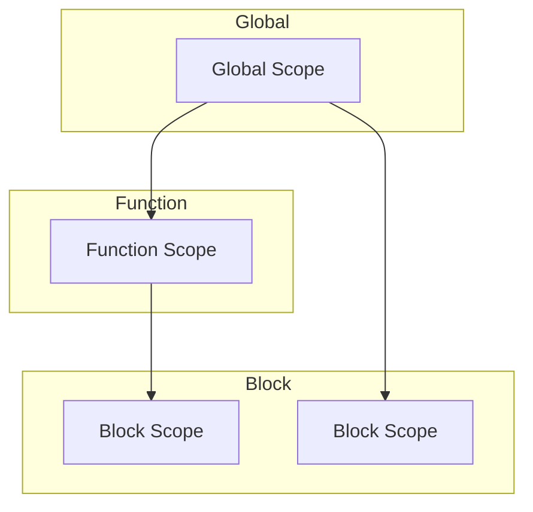

## 2.8. Re-declaration and Re-assignment Rules

In JavaScript, understanding the rules of re-declaration and re-assignment is crucial for writing clean and error-free code. As you progress in your JavaScript journey, you'll encounter three main keywords for declaring variables: `var`, `let`, and `const`. Each of these has its own rules and behaviors when it comes to re-declaration and re-assignment. In this section, we will explore these rules in detail, providing examples and best practices to help you avoid common pitfalls.

### Understanding Re-declaration and Re-assignment

Before diving into the specifics of each keyword, let's clarify what we mean by re-declaration and re-assignment:

- **Re-declaration**: This refers to declaring a variable that has already been declared within the same scope. Depending on the keyword used, this can lead to different behaviors or errors.
- **Re-assignment**: This involves assigning a new value to an already declared variable. The ability to re-assign depends on how the variable was declared.

### Re-declaration and Re-assignment with `var`

The `var` keyword has been part of JavaScript since its inception. It has some unique characteristics that can lead to unexpected behaviors if not understood properly.

#### Re-declaration with `var`

With `var`, you can re-declare a variable within the same scope without any errors. This can sometimes lead to confusion and bugs, as it allows for overwriting of variable values unintentionally.

```javascript
var greeting = "Hello";
var greeting = "Hi"; // Re-declaration is allowed
console.log(greeting); // Output: Hi
```

In the example above, the variable `greeting` is re-declared and its value is overwritten without any error. This behavior is due to `var` being function-scoped or globally-scoped, which means it does not respect block scope.

#### Re-assignment with `var`

Re-assignment with `var` is straightforward and allowed. You can change the value of a `var` declared variable as many times as needed.

```javascript
var count = 1;
count = 2; // Re-assignment is allowed
console.log(count); // Output: 2
```

### Re-declaration and Re-assignment with `let`

The `let` keyword was introduced in ECMAScript 2015 (ES6) to provide block-scoping, which is more intuitive and less error-prone than `var`.

#### Re-declaration with `let`

Re-declaration of a `let` variable within the same scope is not allowed and will result in a `SyntaxError`.

```javascript
let name = "Alice";
// let name = "Bob"; // Uncaught SyntaxError: Identifier 'name' has already been declared
```

The error in the above example prevents accidental overwriting of variables, making code more predictable and easier to debug.

#### Re-assignment with `let`

Re-assignment is allowed with `let`. You can change the value of a `let` variable after its initial declaration.

```javascript
let age = 30;
age = 31; // Re-assignment is allowed
console.log(age); // Output: 31
```

### Re-declaration and Re-assignment with `const`

The `const` keyword, also introduced in ES6, is used to declare variables that should not be re-assigned. It provides a way to define constants in your code.

#### Re-declaration with `const`

Similar to `let`, re-declaration of a `const` variable within the same scope is not allowed and will result in a `SyntaxError`.

```javascript
const pi = 3.14;
// const pi = 3.14159; // Uncaught SyntaxError: Identifier 'pi' has already been declared
```

#### Re-assignment with `const`

Re-assignment of a `const` variable is not allowed. Attempting to do so will result in a `TypeError`.

```javascript
const gravity = 9.81;
// gravity = 9.8; // Uncaught TypeError: Assignment to constant variable.
```

### Best Practices to Avoid Accidental Re-declaration

1. **Use `let` and `const` by default**: Prefer `let` and `const` over `var` to leverage block scoping and avoid accidental re-declarations.
2. **Use `const` for constants**: Declare variables with `const` when you do not intend to re-assign them, ensuring immutability.
3. **Avoid using `var`**: The flexibility of `var` can lead to bugs and unpredictable behavior. Use `let` or `const` for better control over variable scope.
4. **Use descriptive variable names**: This reduces the likelihood of accidentally re-declaring a variable, as meaningful names are less likely to be reused unintentionally.
5. **Employ linters**: Tools like ESLint can help catch accidental re-declarations and enforce coding standards.

### Visualizing Variable Scope and Re-declaration

To better understand how re-declaration and re-assignment work in different scopes, let's visualize the scope chain using a diagram.



**Diagram Explanation**: This diagram illustrates how variables declared with `var`, `let`, and `const` interact within different scopes. `var` variables can be re-declared within the same function scope, while `let` and `const` respect block scope and prevent re-declaration within the same block.

### Common Errors and How to Handle Them

1. **SyntaxError for Re-declaration**: When re-declaring a `let` or `const` variable, you'll encounter a `SyntaxError`. Ensure that each variable is uniquely declared within its scope.
2. **TypeError for Re-assignment**: Attempting to re-assign a `const` variable results in a `TypeError`. Use `let` if you need to change the value of a variable.
3. **Avoiding Global Variables**: Accidental global variable creation can occur if you forget to declare a variable with `var`, `let`, or `const`. Always declare your variables to prevent them from being added to the global scope.

### Try It Yourself

Experiment with the following code snippets to reinforce your understanding of re-declaration and re-assignment rules:

```javascript
// Try re-declaring a variable with let
let city = "New York";
// let city = "Los Angeles"; // Uncomment to see the error

// Try re-assigning a const variable
const country = "USA";
// country = "Canada"; // Uncomment to see the error

// Experiment with var re-declaration
var language = "JavaScript";
var language = "Python"; // No error
console.log(language); // Output: Python
```

### References and Further Reading

- [MDN Web Docs: var](https://developer.mozilla.org/en-US/docs/Web/JavaScript/Reference/Statements/var)
- [MDN Web Docs: let](https://developer.mozilla.org/en-US/docs/Web/JavaScript/Reference/Statements/let)
- [MDN Web Docs: const](https://developer.mozilla.org/en-US/docs/Web/JavaScript/Reference/Statements/const)
- [W3Schools JavaScript Variables](https://www.w3schools.com/js/js_variables.asp)

### Knowledge Check

1. **What happens when you re-declare a `var` variable within the same scope?**
   - [ ] Throws an error
   - [x] Overwrites the existing variable
   - [ ] Creates a new variable in a different scope

2. **Can you re-assign a `const` variable?**
   - [ ] Yes
   - [x] No

3. **What error is thrown when you try to re-declare a `let` variable in the same scope?**
   - [x] SyntaxError
   - [ ] TypeError
   - [ ] ReferenceError

4. **Which keyword should you use for variables that should not change?**
   - [ ] var
   - [ ] let
   - [x] const

5. **What is the best practice for declaring variables in modern JavaScript?**
   - [ ] Use var for all variables
   - [x] Use let and const
   - [ ] Use global variables

### Embrace the Journey

Remember, this is just the beginning. As you progress, you'll build more complex and interactive web pages. Keep experimenting, stay curious, and enjoy the journey!

## Quiz Time!



### What happens when you re-declare a `var` variable within the same scope?

- [x] Overwrites the existing variable
- [ ] Throws an error
- [ ] Creates a new variable in a different scope
- [ ] None of the above

> **Explanation:** Re-declaring a `var` variable within the same scope overwrites the existing variable without any error.

### Can you re-assign a `const` variable?

- [ ] Yes
- [x] No

> **Explanation:** `const` variables cannot be re-assigned once they have been initialized.

### What error is thrown when you try to re-declare a `let` variable in the same scope?

- [x] SyntaxError
- [ ] TypeError
- [ ] ReferenceError
- [ ] None of the above

> **Explanation:** Re-declaring a `let` variable in the same scope results in a `SyntaxError`.

### Which keyword should you use for variables that should not change?

- [ ] var
- [ ] let
- [x] const
- [ ] None of the above

> **Explanation:** `const` is used to declare variables that should not be re-assigned.

### What is the best practice for declaring variables in modern JavaScript?

- [ ] Use var for all variables
- [x] Use let and const
- [ ] Use global variables
- [ ] None of the above

> **Explanation:** Using `let` and `const` is the best practice as they provide block scope and prevent accidental re-declarations.

### What happens if you try to re-assign a `const` variable?

- [ ] It works fine
- [x] Throws a TypeError
- [ ] Throws a SyntaxError
- [ ] None of the above

> **Explanation:** Re-assigning a `const` variable results in a `TypeError`.

### Which keyword allows re-declaration within the same scope?

- [x] var
- [ ] let
- [ ] const
- [ ] None of the above

> **Explanation:** `var` allows re-declaration within the same scope without any error.

### What is the scope of a `var` variable declared inside a function?

- [ ] Global
- [x] Function
- [ ] Block
- [ ] None of the above

> **Explanation:** `var` is function-scoped, meaning it is accessible throughout the function in which it is declared.

### Which keyword should be used to declare a variable that will be re-assigned?

- [ ] var
- [x] let
- [ ] const
- [ ] None of the above

> **Explanation:** `let` should be used for variables that will be re-assigned, as it allows re-assignment within its block scope.

### True or False: `let` and `const` respect block scope.

- [x] True
- [ ] False

> **Explanation:** Both `let` and `const` respect block scope, meaning they are only accessible within the block they are declared in.


