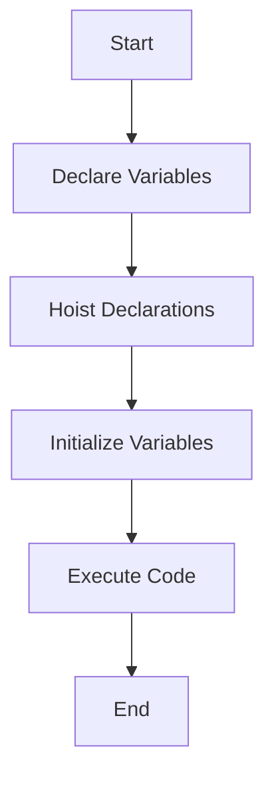

## 2.9. Hoisting Behavior of Declarations

In this section, we will delve into the concept of hoisting in JavaScript, a fundamental yet often misunderstood feature of the language. Understanding hoisting is crucial for writing predictable and bug-free code. We will explore how JavaScript handles variable and function declarations, the differences between `var`, `let`, and `const`, and provide practical advice on how to minimize confusion related to hoisting.

### What is Hoisting?

Hoisting is a JavaScript mechanism where variables and function declarations are moved to the top of their containing scope during the compile phase. This means that you can use variables and functions before they are declared in the code. However, it's important to note that only the declarations are hoisted, not the initializations.

#### Example of Hoisting

Let's look at a simple example to illustrate hoisting:

```javascript
console.log(myVar); // Output: undefined
var myVar = 5;
console.log(myVar); // Output: 5
```

In the above code, you might expect the first `console.log` to throw an error since `myVar` is declared after it. However, due to hoisting, the declaration `var myVar;` is moved to the top of the scope, and the code is interpreted as:

```javascript
var myVar;
console.log(myVar); // Output: undefined
myVar = 5;
console.log(myVar); // Output: 5
```

### Hoisting with `var`

The `var` keyword is the traditional way of declaring variables in JavaScript. When you declare a variable using `var`, JavaScript hoists the declaration to the top of the function or global scope. However, the initialization remains in place.

#### Code Example

```javascript
function exampleVarHoisting() {
    console.log(a); // Output: undefined
    var a = 10;
    console.log(a); // Output: 10
}

exampleVarHoisting();
```

In this example, the declaration `var a;` is hoisted to the top of the function `exampleVarHoisting`, but the assignment `a = 10;` is not. Therefore, the first `console.log` outputs `undefined`.

### Hoisting with `let` and `const`

The introduction of `let` and `const` in ES6 brought block-level scoping to JavaScript. Unlike `var`, variables declared with `let` and `const` are not initialized until their definition is evaluated. This means they are hoisted to the top of their block, but they are not accessible until the code execution reaches the line where they are declared. This period between the start of the block and the declaration is known as the "Temporal Dead Zone" (TDZ).

#### Code Example

```javascript
function exampleLetConstHoisting() {
    console.log(b); // ReferenceError: Cannot access 'b' before initialization
    let b = 20;
    console.log(b); // Output: 20
}

exampleLetConstHoisting();
```

In this example, trying to access `b` before its declaration results in a `ReferenceError`. The same behavior applies to `const`.

### Function Hoisting

In addition to variables, function declarations are also hoisted. This means you can call a function before its declaration in the code.

#### Code Example

```javascript
hoistedFunction(); // Output: "This function is hoisted!"

function hoistedFunction() {
    console.log("This function is hoisted!");
}
```

In this case, the entire function declaration is hoisted, allowing it to be called before its definition.

### Differences Between Function Declarations and Function Expressions

It's important to distinguish between function declarations and function expressions. Only function declarations are hoisted, not function expressions.

#### Code Example

```javascript
// Function Declaration
function declaredFunction() {
    console.log("Declared function!");
}

// Function Expression
var expressedFunction = function() {
    console.log("Expressed function!");
};

declaredFunction(); // Output: "Declared function!"
expressedFunction(); // Output: "Expressed function!"
```

If you try to call `expressedFunction` before its assignment, you'll get a `TypeError` because the variable is hoisted, but the assignment happens at runtime.

### Visualizing Hoisting

To better understand hoisting, let's visualize how JavaScript processes code with a flowchart.



**Caption:** This flowchart illustrates the process of hoisting in JavaScript, where declarations are moved to the top before code execution.

### Writing Code to Minimize Hoisting Confusion

To avoid confusion and potential bugs related to hoisting, follow these best practices:

1. **Declare Variables at the Top:** Always declare your variables at the top of their scope to make hoisting behavior explicit.

2. **Use `let` and `const`:** Prefer `let` and `const` over `var` for block-level scoping and to avoid the pitfalls of hoisting.

3. **Initialize Variables When Declaring:** Initialize variables at the time of declaration to prevent `undefined` values.

4. **Avoid Using Variables Before Declaration:** Write code in a way that variables are not accessed before they are declared.

5. **Be Mindful of Function Expressions:** Remember that function expressions are not hoisted, so declare them before use.

### Try It Yourself

Experiment with the following code snippets to see hoisting in action. Try modifying the code to observe how hoisting affects the output.

```javascript
// Experiment with var
function tryVarHoisting() {
    console.log(x); // What will this output?
    var x = 10;
    console.log(x); // What about this?
}

tryVarHoisting();

// Experiment with let
function tryLetHoisting() {
    console.log(y); // What will happen here?
    let y = 20;
    console.log(y); // And here?
}

tryLetHoisting();

// Experiment with function expressions
function tryFunctionExpression() {
    console.log(funcExpr); // What will this output?
    var funcExpr = function() {
        console.log("Function expression!");
    };
    funcExpr(); // Will this work?
}

tryFunctionExpression();
```

### References and Further Reading

- [MDN Web Docs: Hoisting](https://developer.mozilla.org/en-US/docs/Glossary/Hoisting)
- [W3Schools: JavaScript Hoisting](https://www.w3schools.com/js/js_hoisting.asp)

### Knowledge Check

Before we move on, let's summarize the key points:

- Hoisting moves declarations to the top of their scope.
- `var` declarations are hoisted, but initializations are not.
- `let` and `const` are hoisted but remain in the Temporal Dead Zone until initialized.
- Function declarations are hoisted, but function expressions are not.

Remember, this is just the beginning. As you progress, you'll build more complex and interactive web pages. Keep experimenting, stay curious, and enjoy the journey!

## Quiz Time!



### What is hoisting in JavaScript?

- [x] The process of moving variable and function declarations to the top of their scope.
- [ ] The process of executing code line by line.
- [ ] The process of converting data types.
- [ ] The process of optimizing code performance.

> **Explanation:** Hoisting refers to how JavaScript moves declarations to the top of their scope during the compile phase.

### Which keyword allows variables to be accessed before their declaration without a ReferenceError?

- [x] var
- [ ] let
- [ ] const
- [ ] function

> **Explanation:** Variables declared with `var` are hoisted and initialized with `undefined`, allowing them to be accessed before their declaration.

### What happens when you try to access a `let` variable before its declaration?

- [ ] It returns `undefined`.
- [x] It throws a `ReferenceError`.
- [ ] It returns `null`.
- [ ] It throws a `TypeError`.

> **Explanation:** Accessing a `let` variable before its declaration results in a `ReferenceError` due to the Temporal Dead Zone.

### Which of the following is NOT hoisted?

- [ ] Function declarations
- [x] Function expressions
- [ ] Variable declarations with `var`
- [ ] Variable declarations with `let`

> **Explanation:** Function expressions are not hoisted; only the variable declaration is hoisted, not the function assignment.

### What is the Temporal Dead Zone (TDZ)?

- [x] The period between entering a block and the variable's declaration where the variable cannot be accessed.
- [ ] The time it takes for a variable to be initialized.
- [ ] The time it takes for a function to execute.
- [ ] The period when a variable is undefined.

> **Explanation:** The TDZ is the time between entering a block and the variable's declaration where it cannot be accessed.

### How can you minimize confusion related to hoisting?

- [x] Declare variables at the top of their scope.
- [x] Use `let` and `const` instead of `var`.
- [ ] Use `var` for all declarations.
- [ ] Avoid using functions.

> **Explanation:** Declaring variables at the top and using `let` and `const` helps minimize hoisting-related confusion.

### What will the following code output?
```javascript
console.log(a);
var a = 10;
```

- [x] undefined
- [ ] 10
- [ ] ReferenceError
- [ ] TypeError

> **Explanation:** The variable `a` is hoisted, so it is declared but not initialized, resulting in `undefined`.

### What will the following code output?
```javascript
console.log(b);
let b = 20;
```

- [ ] undefined
- [x] ReferenceError
- [ ] 20
- [ ] TypeError

> **Explanation:** Accessing `b` before its declaration results in a `ReferenceError` due to the TDZ.

### Which of the following statements about hoisting is true?

- [x] Only declarations are hoisted, not initializations.
- [ ] Both declarations and initializations are hoisted.
- [ ] Only initializations are hoisted.
- [ ] Neither declarations nor initializations are hoisted.

> **Explanation:** In JavaScript, only declarations are hoisted, while initializations remain in place.

### True or False: Function declarations are hoisted, allowing them to be called before their definition.

- [x] True
- [ ] False

> **Explanation:** Function declarations are hoisted, so they can be called before their definition in the code.


