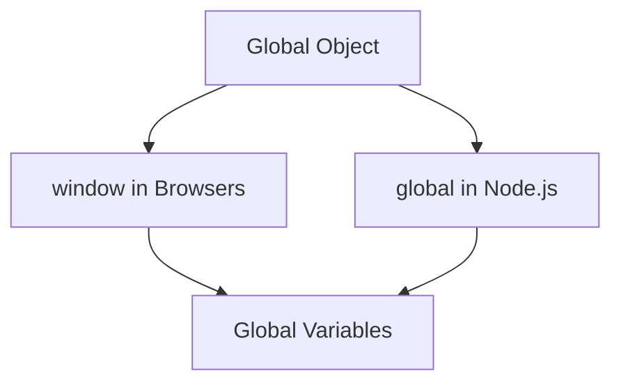

## 3.1. Global Scope

In the world of JavaScript, understanding how variables are scoped is crucial for writing efficient and bug-free code. In this section, we will delve into the concept of global scope, a fundamental aspect of variable management in JavaScript. We will explore how variables become globally scoped, the role of the global object, and the potential pitfalls of using global variables. By the end of this section, you'll have a solid understanding of global scope and how to manage it effectively in your JavaScript projects.

### What is Global Scope?

In JavaScript, scope refers to the accessibility of variables and functions in different parts of your code. The global scope is the outermost scope in a JavaScript program, where variables and functions defined here are accessible from anywhere in the code. This means that any variable declared in the global scope can be accessed and modified by any function or block within the program.

#### Defining Global Scope

A variable is said to be in the global scope if it is declared outside of any function or block. Let's look at a simple example:

```javascript
// Global variable
var globalVariable = "I am global!";

function displayGlobalVariable() {
    // Accessing the global variable
    console.log(globalVariable);
}

displayGlobalVariable(); // Output: I am global!
```

In this example, `globalVariable` is declared outside of any function, making it globally scoped. The function `displayGlobalVariable` can access and log this variable because it is in the global scope.

### How Variables Become Globally Scoped

Variables can become globally scoped in a few different ways:

1. **Declared Outside Any Function**: As shown in the previous example, any variable declared outside of a function is automatically in the global scope.

2. **Implicit Global Variables**: If you assign a value to a variable without declaring it using `var`, `let`, or `const`, it becomes a global variable. This is generally considered bad practice as it can lead to unintended consequences.

   ```javascript
   function createGlobalVariable() {
       implicitGlobal = "I am also global!";
   }

   createGlobalVariable();
   console.log(implicitGlobal); // Output: I am also global!
   ```

   In this example, `implicitGlobal` is not declared with `var`, `let`, or `const`, so it becomes a global variable.

3. **Using the `var` Keyword in the Global Context**: When you use the `var` keyword outside of any function, the variable is added to the global scope.

4. **Global Object Properties**: In JavaScript, the global object provides a way to access global variables and functions. In web browsers, this object is `window`, and in Node.js, it is `global`.

### The Global Object

The global object is an important concept in JavaScript, as it serves as the container for all globally scoped variables and functions. Depending on the environment, the global object can differ:

- **In Browsers**: The global object is `window`. Any variable declared in the global scope becomes a property of the `window` object.

  ```javascript
  var browserGlobal = "Accessible via window";
  console.log(window.browserGlobal); // Output: Accessible via window
  ```

- **In Node.js**: The global object is `global`. Similarly, variables declared in the global scope become properties of the `global` object.

  ```javascript
  global.nodeGlobal = "Accessible via global";
  console.log(global.nodeGlobal); // Output: Accessible via global
  ```

#### Visualizing the Global Object

To better understand the relationship between global variables and the global object, let's use a diagram to visualize this concept.



**Figure 1**: The Global Object in Different Environments

### Risks of Global Variables

While global variables can be convenient, they come with significant risks and drawbacks:

1. **Namespace Pollution**: As more global variables are added, the likelihood of name collisions increases. This can lead to bugs that are difficult to trace and fix.

2. **Tight Coupling**: Global variables can create dependencies between different parts of your code, making it harder to maintain and refactor.

3. **Security Risks**: In web applications, global variables can be accessed and modified by any script running on the page, potentially leading to security vulnerabilities.

4. **Memory Usage**: Global variables persist for the lifetime of the application, which can lead to increased memory usage, especially if they are not properly managed.

### Best Practices for Managing Global Scope

To mitigate the risks associated with global variables, consider the following best practices:

- **Minimize Global Variables**: Limit the number of global variables in your code. Use local variables whenever possible.

- **Use Namespaces**: Group related variables and functions into objects or modules to reduce the risk of name collisions.

  ```javascript
  var MyApp = {
      config: {
          apiUrl: "https://api.example.com"
      },
      utils: {
          formatDate: function(date) {
              // Format date logic
          }
      }
  };
  ```

- **Use `let` and `const`**: Prefer `let` and `const` over `var` to avoid accidentally creating global variables.

- **Avoid Implicit Globals**: Always declare variables with `var`, `let`, or `const` to prevent them from becoming global unintentionally.

- **Encapsulation**: Use functions or immediately invoked function expressions (IIFE) to encapsulate variables and reduce their scope.

  ```javascript
  (function() {
      var localVariable = "I am local!";
      console.log(localVariable); // Output: I am local!
  })();

  // localVariable is not accessible here
  ```

### Try It Yourself

To solidify your understanding of global scope, try modifying the following code examples:

1. **Create a Global Variable**: Declare a variable outside of any function and access it from within multiple functions.

2. **Convert a Global Variable to Local**: Take a global variable and refactor your code to make it local to a function or block.

3. **Experiment with the Global Object**: In a browser, try accessing a global variable through the `window` object. In Node.js, use the `global` object.

### Knowledge Check

Before moving on, let's review some key points:

- **Global Scope**: Variables declared outside of any function or block are in the global scope and accessible from anywhere in the code.

- **Global Object**: In browsers, the global object is `window`; in Node.js, it is `global`.

- **Risks**: Global variables can lead to namespace pollution, tight coupling, security risks, and increased memory usage.

- **Best Practices**: Minimize global variables, use namespaces, prefer `let` and `const`, avoid implicit globals, and encapsulate variables.

### References and Further Reading

- [MDN Web Docs: JavaScript Scoping](https://developer.mozilla.org/en-US/docs/Web/JavaScript/Guide/Grammar_and_types#scope)
- [W3Schools: JavaScript Scope](https://www.w3schools.com/js/js_scope.asp)
- [JavaScript.info: Global Object](https://javascript.info/global-object)

### Embrace the Journey

Remember, understanding the global scope is just one step in mastering JavaScript. As you continue to learn, you'll discover more about how to manage variables effectively and write clean, maintainable code. Keep experimenting, stay curious, and enjoy the journey!

## Quiz Time!



### What is the global scope in JavaScript?

- [x] The outermost scope where variables are accessible throughout the entire program.
- [ ] A scope limited to a single function.
- [ ] A scope that only exists within a block.
- [ ] A scope that is only accessible in Node.js.

> **Explanation:** The global scope is the outermost scope in a JavaScript program, where variables are accessible from anywhere in the code.

### How do variables become globally scoped?

- [x] By being declared outside of any function or block.
- [ ] By using the `let` keyword inside a function.
- [ ] By using the `const` keyword inside a block.
- [ ] By being declared inside a loop.

> **Explanation:** Variables become globally scoped when they are declared outside of any function or block.

### What is the global object in a web browser?

- [x] `window`
- [ ] `global`
- [ ] `document`
- [ ] `console`

> **Explanation:** In web browsers, the global object is `window`.

### What is the global object in Node.js?

- [x] `global`
- [ ] `window`
- [ ] `document`
- [ ] `console`

> **Explanation:** In Node.js, the global object is `global`.

### What is a risk of using global variables?

- [x] Namespace pollution
- [ ] Improved performance
- [ ] Easier debugging
- [ ] Increased security

> **Explanation:** Global variables can lead to namespace pollution, where name collisions occur, causing bugs.

### Which keyword should you use to avoid accidentally creating global variables?

- [x] `let` and `const`
- [ ] `var`
- [ ] `global`
- [ ] `window`

> **Explanation:** Using `let` and `const` helps avoid accidentally creating global variables.

### What is a best practice for managing global scope?

- [x] Minimize the number of global variables.
- [ ] Use global variables for all data.
- [ ] Avoid using functions.
- [ ] Declare all variables with `var`.

> **Explanation:** Minimizing the number of global variables helps reduce the risks associated with them.

### How can you encapsulate variables to reduce their scope?

- [x] Use functions or immediately invoked function expressions (IIFE).
- [ ] Declare them in the global scope.
- [ ] Use `var` in the global context.
- [ ] Avoid using functions.

> **Explanation:** Encapsulating variables in functions or IIFEs helps reduce their scope and prevent global pollution.

### What is a potential consequence of namespace pollution?

- [x] Name collisions leading to bugs.
- [ ] Improved code readability.
- [ ] Faster execution time.
- [ ] Increased security.

> **Explanation:** Namespace pollution can cause name collisions, leading to bugs that are difficult to trace.

### True or False: Global variables are always the best choice for storing data.

- [ ] True
- [x] False

> **Explanation:** Global variables are not always the best choice due to the risks of namespace pollution and tight coupling.




