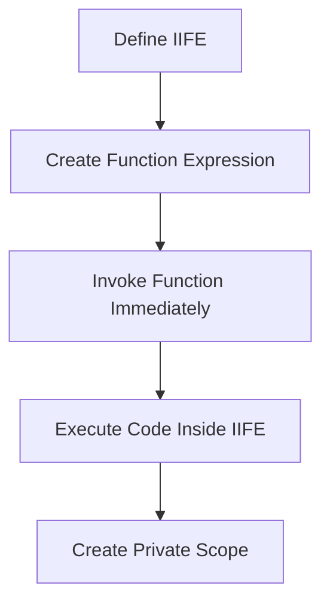

## 3.10. Immediately Invoked Function Expressions (IIFE)

In the realm of JavaScript, managing variable scope is crucial for writing clean and efficient code. One of the techniques developers have used to achieve this is the Immediately Invoked Function Expression, commonly known as IIFE. In this section, we will delve deep into what IIFEs are, their syntax, how they work, and their significance, especially in the context of modern JavaScript.

### What is an IIFE?

An Immediately Invoked Function Expression (IIFE) is a JavaScript function that runs as soon as it is defined. It is a design pattern that helps in creating a private scope for variables, thereby avoiding the pollution of the global namespace. This is particularly useful in JavaScript, where variables declared with `var` are function-scoped and can easily lead to conflicts if not managed properly.

#### Syntax of an IIFE

The syntax of an IIFE involves wrapping a function in parentheses and then immediately invoking it with another set of parentheses. Here is the basic structure:

```javascript
(function() {
    // Code inside the IIFE
})();
```

Alternatively, you can use the following syntax:

```javascript
(function() {
    // Code inside the IIFE
}());
```

Both forms are valid and achieve the same result. The parentheses around the function create a function expression, and the trailing parentheses `()` execute the function immediately.

### How IIFEs Work

To understand how IIFEs work, let's break down the process:

1. **Function Expression**: The function is wrapped in parentheses, which turns it into a function expression. In JavaScript, a function expression is different from a function declaration in that it can be anonymous and is not hoisted.

2. **Immediate Invocation**: The trailing parentheses `()` immediately invoke the function expression. This means the code inside the function runs as soon as the JavaScript engine encounters it.

3. **Private Scope**: Since the function is executed immediately, any variables declared within it are not accessible outside of the function. This creates a private scope, which is one of the primary benefits of using an IIFE.

### Why Use IIFEs?

IIFEs are particularly useful for several reasons:

- **Avoiding Global Namespace Pollution**: By encapsulating code within an IIFE, you prevent variables from being added to the global scope. This reduces the risk of variable name collisions and makes your code more modular.

- **Data Privacy**: Variables declared inside an IIFE are not accessible from the outside, providing a form of data encapsulation. This is similar to private variables in other programming languages.

- **Initialization Code**: IIFEs are often used for initialization code that needs to run once and doesn't need to be accessed later. This can include setting up event listeners, initializing libraries, or configuring settings.

- **Compatibility**: Before the advent of ES6 modules, IIFEs were a common pattern for creating modular code in JavaScript. They allowed developers to simulate private and public interfaces.

### Examples of IIFEs

Let's look at some examples to better understand how IIFEs can be used in practice.

#### Basic Example

Here's a simple example of an IIFE that logs a message to the console:

```javascript
(function() {
    console.log("Hello, World!");
})();
```

In this example, the function is defined and immediately invoked, printing "Hello, World!" to the console.

#### Using Parameters

IIFEs can also accept parameters, allowing you to pass data into the function:

```javascript
(function(name) {
    console.log("Hello, " + name + "!");
})("Alice");
```

This IIFE takes a parameter `name` and logs a personalized greeting to the console.

#### Creating a Private Scope

Consider a scenario where you want to keep a counter private:

```javascript
var counter = (function() {
    var count = 0; // Private variable

    return {
        increment: function() {
            count++;
            return count;
        },
        decrement: function() {
            count--;
            return count;
        }
    };
})();

console.log(counter.increment()); // 1
console.log(counter.increment()); // 2
console.log(counter.decrement()); // 1
```

In this example, the `count` variable is private to the IIFE and cannot be accessed directly from the outside. The `increment` and `decrement` methods provide controlled access to modify the `count`.

### Relevance of IIFEs in Modern JavaScript

With the introduction of ES6 (ECMAScript 2015), JavaScript gained new features like `let`, `const`, and modules, which provide better ways to manage scope and encapsulation. However, IIFEs still hold relevance in certain contexts:

- **Legacy Code**: Many existing JavaScript projects still use IIFEs, so understanding them is crucial for maintaining and updating older codebases.

- **Quick Scripts**: For small scripts or snippets that need to run immediately and don't justify the overhead of a module, IIFEs are still a handy tool.

- **Compatibility**: In environments where ES6 modules are not supported, IIFEs can still be used to achieve modularity.

### Visualizing IIFE Execution

To better understand how IIFEs work, let's visualize the process:



In this flowchart, we see the steps involved in defining and executing an IIFE. The process starts with defining the IIFE, creating a function expression, invoking it immediately, executing the code inside, and finally creating a private scope.

### Try It Yourself

Experiment with the following IIFE examples to reinforce your understanding:

1. **Modify the Greeting**: Change the parameter passed to the IIFE to see how it affects the output.
2. **Add More Methods**: Extend the counter example by adding a `reset` method to set the count back to zero.
3. **Nested IIFEs**: Try creating an IIFE inside another IIFE and observe how the scopes interact.

### References and Further Reading

- [MDN Web Docs: Functions](https://developer.mozilla.org/en-US/docs/Web/JavaScript/Guide/Functions)
- [JavaScript IIFE Pattern](https://www.digitalocean.com/community/tutorials/understanding-the-iife-pattern-in-javascript)

### Knowledge Check

Let's reinforce what we've learned with a few questions:

1. What is the primary purpose of an IIFE?
2. How does an IIFE help in avoiding global namespace pollution?
3. Can IIFEs accept parameters? Provide an example.
4. How has the introduction of ES6 modules affected the use of IIFEs?

### Embrace the Journey

Remember, mastering JavaScript is a journey. Understanding concepts like IIFEs will empower you to write cleaner and more efficient code. Keep experimenting, stay curious, and enjoy the process of learning and growing as a developer!

## Quiz Time!



### What is an IIFE in JavaScript?

- [x] A function that runs as soon as it is defined
- [ ] A function that is declared but not executed
- [ ] A function that is only used for event handling
- [ ] A function that is hoisted to the top of the scope

> **Explanation:** An Immediately Invoked Function Expression (IIFE) is a function that is executed right after it is created.

### What is the main benefit of using an IIFE?

- [x] To create a private scope for variables
- [ ] To make functions globally accessible
- [ ] To delay function execution
- [ ] To simplify function syntax

> **Explanation:** IIFEs create a private scope, preventing variables from polluting the global namespace.

### How do you define an IIFE?

- [x] By wrapping a function in parentheses and invoking it immediately
- [ ] By using the `function` keyword followed by `invoke`
- [ ] By declaring a function with `var` and calling it later
- [ ] By using the `async` keyword

> **Explanation:** An IIFE is defined by wrapping a function in parentheses and immediately invoking it with `()`.

### Can IIFEs accept parameters?

- [x] Yes
- [ ] No

> **Explanation:** IIFEs can accept parameters, allowing data to be passed into the function.

### What is a common use case for IIFEs?

- [x] Initialization code that runs once
- [ ] Repeatedly calling a function
- [ ] Creating global variables
- [ ] Handling asynchronous operations

> **Explanation:** IIFEs are often used for initialization code that needs to run once and doesn't need to be accessed later.

### How have ES6 modules affected the use of IIFEs?

- [x] They provide a more modern way to manage scope and encapsulation
- [ ] They have made IIFEs obsolete
- [ ] They require IIFEs for module definition
- [ ] They have no impact on IIFEs

> **Explanation:** ES6 modules offer a more modern approach to managing scope and encapsulation, reducing the need for IIFEs.

### What happens to variables declared inside an IIFE?

- [x] They are not accessible outside the IIFE
- [ ] They become global variables
- [ ] They are hoisted to the top of the global scope
- [ ] They are accessible in all functions

> **Explanation:** Variables declared inside an IIFE are scoped to the function and not accessible outside of it.

### Why might you still use an IIFE in modern JavaScript?

- [x] For quick scripts or environments without module support
- [ ] To replace `let` and `const`
- [ ] To create asynchronous code
- [ ] To define classes

> **Explanation:** IIFEs are useful for quick scripts or in environments where ES6 modules are not supported.

### What is the syntax to immediately invoke a function?

- [x] (function() { /* code */ })();
- [ ] function() { /* code */ };
- [ ] var func = function() { /* code */ };
- [ ] function invoke() { /* code */ }

> **Explanation:** The correct syntax for an IIFE is wrapping the function in parentheses and immediately invoking it with `()`.

### True or False: IIFEs can help in reducing variable name collisions.

- [x] True
- [ ] False

> **Explanation:** IIFEs help in creating a private scope, which reduces the risk of variable name collisions.


