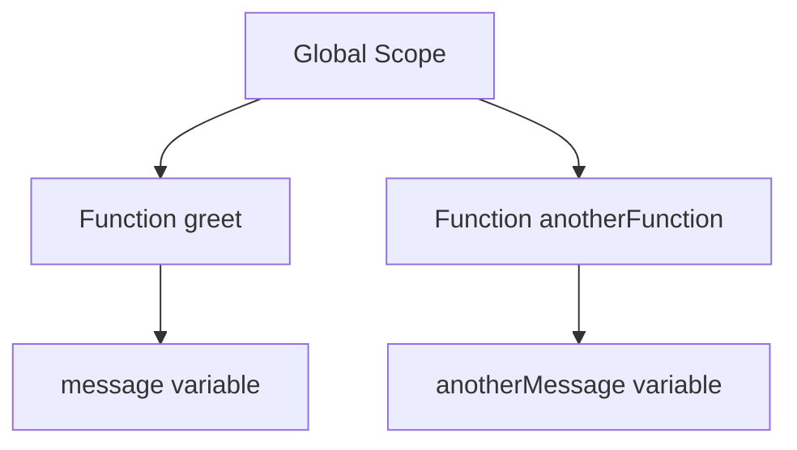

## 3.2. Function Scope

In JavaScript, understanding how variables are scoped is crucial for writing efficient and error-free code. Function scope is one of the fundamental concepts that dictate how and where variables can be accessed within your code. In this section, we will delve into the intricacies of function scope, illustrating how variables declared within functions behave and how you can effectively manage them.

### What is Function Scope?

Function scope refers to the accessibility of variables declared within a function. In JavaScript, when you declare a variable using the `var` keyword inside a function, that variable is accessible only within that function. This means that the variable is "scoped" to the function, and it cannot be accessed from outside the function. This encapsulation is a powerful feature that helps prevent variable name conflicts and keeps your code modular and organized.

### Characteristics of Function Scope

1. **Encapsulation**: Variables declared within a function are encapsulated within that function. They are not accessible from outside the function, which helps in preventing unintended interference with other parts of the code.

2. **Isolation**: Each function has its own scope. Variables declared in one function do not interfere with variables declared in another function, even if they have the same name.

3. **Lifecycle**: Variables in function scope are created when the function is invoked and destroyed when the function execution is complete. This means that each time a function is called, a new set of variables is created.

### Declaring Variables with `var` Inside Functions

The `var` keyword is used to declare variables that are function-scoped. Let's look at an example to better understand how this works:

```javascript
function greet() {
    var message = "Hello, World!";
    console.log(message); // Output: Hello, World!
}

greet();
console.log(message); // Error: message is not defined
```

In the example above, the variable `message` is declared inside the `greet` function using the `var` keyword. It is accessible within the function, but trying to access it outside the function results in an error because `message` is not defined in the global scope.

### Visualizing Function Scope

To better understand function scope, let's visualize it using a diagram. This will help you see how variables are isolated within their respective functions.



In this diagram, the `message` variable is scoped within the `greet` function, and the `anotherMessage` variable is scoped within the `anotherFunction`. These variables do not interfere with each other or with the global scope.

### Accessing Variables Inside and Outside Functions

Let's explore more examples to solidify our understanding of function scope:

#### Example 1: Accessing Variables Inside a Function

```javascript
function calculateArea(radius) {
    var area = Math.PI * radius * radius;
    console.log("Area:", area);
}

calculateArea(5); // Output: Area: 78.53981633974483
```

In this example, the variable `area` is declared inside the `calculateArea` function. It is accessible within the function, allowing us to calculate and print the area of a circle.

#### Example 2: Attempting to Access Variables Outside a Function

```javascript
function calculateCircumference(radius) {
    var circumference = 2 * Math.PI * radius;
    console.log("Circumference:", circumference);
}

calculateCircumference(5); // Output: Circumference: 31.41592653589793
console.log(circumference); // Error: circumference is not defined
```

Here, the variable `circumference` is scoped within the `calculateCircumference` function. Attempting to access it outside the function results in an error, demonstrating the encapsulation provided by function scope.

### Best Practices for Managing Function-Scoped Variables

1. **Use Descriptive Names**: Choose meaningful and descriptive names for your variables to make your code more readable and maintainable.

2. **Minimize Global Variables**: Rely on function scope to encapsulate variables whenever possible, reducing the risk of global variable conflicts.

3. **Limit Variable Scope**: Declare variables in the narrowest scope necessary. This reduces the chances of accidental modifications and makes your code easier to debug.

4. **Avoid Re-declaring Variables**: Be cautious when re-declaring variables within the same function, as it can lead to unexpected behavior.

5. **Use Functions to Encapsulate Logic**: Break down complex logic into smaller, reusable functions with their own scoped variables. This promotes code reusability and clarity.

### Try It Yourself

To reinforce your understanding of function scope, try modifying the following code examples:

1. **Modify the `greet` Function**: Add a new variable inside the `greet` function and print its value. Observe how it behaves when accessed outside the function.

2. **Create a New Function**: Write a new function that calculates the perimeter of a rectangle. Declare variables inside the function and attempt to access them outside.

3. **Experiment with Nested Functions**: Create a function that contains another function inside it. Declare variables in both functions and observe their accessibility.

### Conclusion

Understanding function scope is essential for writing clean and efficient JavaScript code. By leveraging function scope, you can encapsulate variables, prevent conflicts, and create modular code. Remember to use descriptive variable names, minimize global variables, and encapsulate logic within functions to enhance the maintainability of your code.

### Additional Resources

- [MDN Web Docs: Function Scope](https://developer.mozilla.org/en-US/docs/Web/JavaScript/Guide/Functions#function_scope)
- [W3Schools: JavaScript Functions](https://www.w3schools.com/js/js_functions.asp)

## Quiz Time!



### What is function scope in JavaScript?

- [x] The accessibility of variables declared within a function.
- [ ] The accessibility of variables declared outside a function.
- [ ] The accessibility of variables declared in the global scope.
- [ ] The accessibility of variables declared with `let`.

> **Explanation:** Function scope refers to the accessibility of variables declared within a function, meaning they are only accessible inside that function.

### What keyword is used to declare function-scoped variables?

- [x] var
- [ ] let
- [ ] const
- [ ] function

> **Explanation:** The `var` keyword is used to declare variables that are function-scoped in JavaScript.

### What happens if you try to access a function-scoped variable outside the function?

- [x] You get an error because the variable is not defined outside the function.
- [ ] The variable is accessible and retains its value.
- [ ] The variable is accessible but has a different value.
- [ ] The variable is automatically converted to a global variable.

> **Explanation:** Function-scoped variables are not accessible outside the function, resulting in an error if you try to access them.

### Which of the following is a best practice for managing function-scoped variables?

- [x] Use descriptive names for variables.
- [ ] Declare all variables in the global scope.
- [ ] Avoid using functions to encapsulate logic.
- [ ] Re-declare variables frequently within the same function.

> **Explanation:** Using descriptive names for variables is a best practice that enhances code readability and maintainability.

### What is the lifecycle of a function-scoped variable?

- [x] Created when the function is invoked and destroyed when the function execution is complete.
- [ ] Created when the script is loaded and destroyed when the page is closed.
- [ ] Created when the variable is declared and destroyed when the variable is reassigned.
- [ ] Created when the function is defined and destroyed when the function is deleted.

> **Explanation:** Function-scoped variables are created when the function is invoked and destroyed when the function execution is complete.

### How can you prevent variable name conflicts in JavaScript?

- [x] Encapsulate variables within functions.
- [ ] Declare all variables in the global scope.
- [ ] Use the same variable names in different functions.
- [ ] Avoid using functions altogether.

> **Explanation:** Encapsulating variables within functions helps prevent variable name conflicts by isolating them within their respective scopes.

### What is the advantage of using function scope?

- [x] It helps in preventing unintended interference with other parts of the code.
- [ ] It makes all variables globally accessible.
- [ ] It allows variables to be accessed from anywhere in the code.
- [ ] It automatically optimizes the code for performance.

> **Explanation:** Function scope helps in preventing unintended interference with other parts of the code by encapsulating variables within functions.

### How does function scope help with code modularity?

- [x] By isolating variables within functions, making the code more organized.
- [ ] By allowing variables to be accessed globally.
- [ ] By reducing the number of functions needed in the code.
- [ ] By automatically refactoring the code.

> **Explanation:** Function scope isolates variables within functions, making the code more organized and modular.

### What happens to function-scoped variables when the function execution is complete?

- [x] They are destroyed.
- [ ] They become global variables.
- [ ] They are saved for future function calls.
- [ ] They are converted to constants.

> **Explanation:** Function-scoped variables are destroyed when the function execution is complete.

### True or False: Variables declared with `var` inside a function are accessible outside the function.

- [ ] True
- [x] False

> **Explanation:** Variables declared with `var` inside a function are not accessible outside the function due to function scope.


