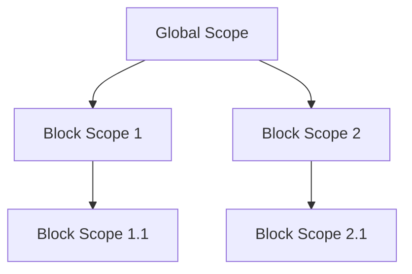

## 3.3. Block Scope with `let` and `const`

Welcome to the exciting world of block scope in JavaScript! In this section, we will explore how `let` and `const` keywords help us manage variable scope more effectively, making our code safer and more readable. We'll delve into the concept of block scope, demonstrate how `let` and `const` work within various control structures, and discuss the benefits of using block scope to prevent unintended variable access.

### What is Block Scope?

Block scope refers to the visibility and lifetime of variables declared within a specific block of code. A block is defined by a pair of curly braces `{}` and can be found in constructs like `if` statements, loops, and functions. Variables declared within a block are only accessible within that block and its sub-blocks, preventing them from being accessed or modified outside.

#### Understanding Block Scope with a Simple Example

Let's start with a simple example to illustrate block scope:

```javascript
{
  let blockScopedVariable = "I'm only accessible within this block!";
  console.log(blockScopedVariable); // Output: I'm only accessible within this block!
}

console.log(blockScopedVariable); // Error: blockScopedVariable is not defined
```

In this example, `blockScopedVariable` is declared using `let` inside a block. It is accessible within the block but not outside, as demonstrated by the error when trying to access it outside the block.

### Creating Block-Scoped Variables with `let`

The `let` keyword allows us to declare variables that are block-scoped. This means they are confined to the block in which they are declared, including any nested blocks.

#### Using `let` in Conditional Statements

Let's see how `let` works within an `if` statement:

```javascript
let outsideVariable = "I'm outside the block";

if (true) {
  let insideVariable = "I'm inside the block";
  console.log(outsideVariable); // Output: I'm outside the block
  console.log(insideVariable);  // Output: I'm inside the block
}

console.log(outsideVariable); // Output: I'm outside the block
console.log(insideVariable);  // Error: insideVariable is not defined
```

Here, `insideVariable` is declared within the `if` block and is not accessible outside of it, demonstrating block scope.

#### Using `let` in Loops

The `let` keyword is particularly useful in loops, where each iteration can have its own scope:

```javascript
for (let i = 0; i < 3; i++) {
  let loopScopedVariable = `Iteration ${i}`;
  console.log(loopScopedVariable); // Output: Iteration 0, Iteration 1, Iteration 2
}

console.log(loopScopedVariable); // Error: loopScopedVariable is not defined
```

In this example, `loopScopedVariable` is re-declared in each iteration of the loop, and its value is not accessible outside the loop.

### Creating Constants with `const`

The `const` keyword is used to declare variables that are block-scoped and cannot be reassigned. This is useful for values that should remain constant throughout the execution of a block.

#### Using `const` in Conditional Statements

Let's see how `const` works within an `if` statement:

```javascript
const outsideConstant = "I'm a constant outside the block";

if (true) {
  const insideConstant = "I'm a constant inside the block";
  console.log(outsideConstant); // Output: I'm a constant outside the block
  console.log(insideConstant);  // Output: I'm a constant inside the block
}

console.log(outsideConstant); // Output: I'm a constant outside the block
console.log(insideConstant);  // Error: insideConstant is not defined
```

Here, `insideConstant` is declared within the `if` block and is not accessible outside of it, similar to `let`.

#### Using `const` in Loops

While `const` can be used in loops, it is important to note that the variable cannot be reassigned:

```javascript
for (let i = 0; i < 3; i++) {
  const loopConstant = `Constant ${i}`;
  console.log(loopConstant); // Output: Constant 0, Constant 1, Constant 2
}

// Error: loopConstant is not defined
```

In this example, `loopConstant` is re-declared in each iteration of the loop, but it cannot be reassigned within the same iteration.

### Benefits of Block Scope

Block scope provides several benefits that enhance code safety and readability:

1. **Prevents Unintended Variable Access**: By confining variables to specific blocks, we reduce the risk of accidentally accessing or modifying them from outside the intended scope.

2. **Reduces Name Collisions**: Block scope allows us to use the same variable name in different blocks without conflict, reducing the likelihood of naming collisions.

3. **Improves Code Readability**: By limiting the scope of variables, we make it easier to understand where and how variables are used, improving code readability.

4. **Enhances Maintainability**: Block scope helps us write modular code, making it easier to maintain and refactor.

### Visualizing Block Scope

To better understand block scope, let's visualize it using a scope chain diagram:



In this diagram, `Block Scope 1` and `Block Scope 2` are separate blocks within the global scope. Each block can have its own nested blocks, like `Block Scope 1.1` and `Block Scope 2.1`. Variables declared in a block are only accessible within that block and its nested blocks.

### Try It Yourself

To reinforce your understanding of block scope, try modifying the code examples above. Experiment with declaring variables using `let` and `const` in different blocks and observe how their accessibility changes. This hands-on practice will help solidify your grasp of block scope in JavaScript.

### Knowledge Check

Before moving on, let's summarize the key takeaways:

- Block scope confines variables to specific blocks, preventing unintended access.
- `let` and `const` are used to create block-scoped variables.
- `let` allows reassignment, while `const` does not.
- Block scope reduces name collisions and improves code readability.

### Further Reading

For more information on block scope and variable declarations in JavaScript, check out the following resources:

- [MDN Web Docs: let](https://developer.mozilla.org/en-US/docs/Web/JavaScript/Reference/Statements/let)
- [MDN Web Docs: const](https://developer.mozilla.org/en-US/docs/Web/JavaScript/Reference/Statements/const)
- [W3Schools: JavaScript Scope](https://www.w3schools.com/js/js_scope.asp)

### Embrace the Journey

Remember, mastering block scope is just one step in your JavaScript journey. As you continue to learn and experiment, you'll build more complex and interactive applications. Keep exploring, stay curious, and enjoy the process!

## Quiz Time!



### What is block scope in JavaScript?

- [x] A scope that confines variables to a specific block of code
- [ ] A scope that allows variables to be accessed globally
- [ ] A scope that is only applicable to functions
- [ ] A scope that is only applicable to objects

> **Explanation:** Block scope confines variables to a specific block of code, such as those enclosed in curly braces `{}`.

### Which keyword is used to declare block-scoped variables in JavaScript?

- [x] let
- [ ] var
- [ ] function
- [ ] class

> **Explanation:** The `let` keyword is used to declare block-scoped variables in JavaScript.

### What happens if you try to access a block-scoped variable outside its block?

- [x] You get a reference error
- [ ] The variable is automatically converted to a global variable
- [ ] The variable is accessible but read-only
- [ ] The variable is accessible and writable

> **Explanation:** Accessing a block-scoped variable outside its block results in a reference error.

### Can you reassign a variable declared with `const`?

- [ ] Yes
- [x] No

> **Explanation:** Variables declared with `const` cannot be reassigned.

### Which of the following is a benefit of block scope?

- [x] Prevents unintended variable access
- [x] Reduces name collisions
- [ ] Increases global variable usage
- [ ] Makes code harder to read

> **Explanation:** Block scope prevents unintended variable access and reduces name collisions, improving code readability.

### What is the output of the following code?
```javascript
if (true) {
  let x = 10;
}
console.log(x);
```

- [ ] 10
- [x] ReferenceError
- [ ] undefined
- [ ] null

> **Explanation:** The variable `x` is block-scoped and cannot be accessed outside the `if` block, resulting in a ReferenceError.

### How does block scope improve code maintainability?

- [x] By making code modular and easier to refactor
- [ ] By increasing the number of global variables
- [ ] By allowing variables to be accessed from anywhere
- [ ] By making variable names longer

> **Explanation:** Block scope makes code modular and easier to refactor, improving maintainability.

### Which keyword should you use for variables that should not be reassigned?

- [ ] let
- [x] const
- [ ] var
- [ ] function

> **Explanation:** The `const` keyword is used for variables that should not be reassigned.

### What is the scope of a variable declared with `let` inside a loop?

- [x] Limited to the loop block
- [ ] Global scope
- [ ] Function scope
- [ ] Class scope

> **Explanation:** A variable declared with `let` inside a loop is limited to the loop block.

### True or False: Block scope allows the same variable name to be used in different blocks without conflict.

- [x] True
- [ ] False

> **Explanation:** Block scope allows the same variable name to be used in different blocks without conflict, reducing name collisions.


