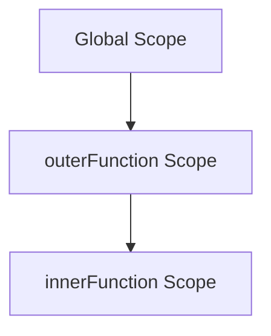
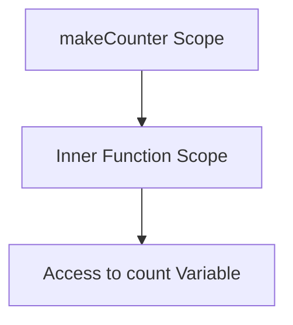

## 3.4. Lexical Scope and Closure

In this section, we will delve into two fundamental concepts in JavaScript: **lexical scope** and **closure**. These concepts are crucial for understanding how variables are accessed and manipulated within functions, and they form the backbone of many advanced programming techniques.

### Understanding Lexical Scoping

**Lexical scoping** refers to the way JavaScript determines the scope of variables based on their location within the source code. Unlike dynamic scoping, where the scope is determined at runtime, lexical scoping is resolved at compile time. This means that the structure of the code itself dictates how variables are accessed.

#### How Lexical Scoping Works

In JavaScript, the scope of a variable is defined by its position within the nested function hierarchy. Let's break this down with a simple example:

```javascript
function outerFunction() {
    const outerVariable = 'I am outside!';

    function innerFunction() {
        console.log(outerVariable); // Accessing outerVariable from the outer scope
    }

    innerFunction();
}

outerFunction();
```

In the example above, `innerFunction` is nested within `outerFunction`. Due to lexical scoping, `innerFunction` can access `outerVariable`, even though `outerVariable` is defined outside of `innerFunction`. This is because `innerFunction` is lexically within the scope of `outerFunction`.

#### Visualizing Lexical Scope

To better understand lexical scoping, let's visualize the scope chain using a diagram:



In this diagram, the `innerFunction` scope is nested within the `outerFunction` scope, which in turn is nested within the global scope. This nesting hierarchy is what allows `innerFunction` to access variables from `outerFunction`.

### Introducing Closures

A **closure** is a feature in JavaScript where an inner function has access to the outer (enclosing) function's variables. Closures are created every time a function is created, at function creation time.

#### How Closures Work

Closures allow a function to retain access to its lexical scope, even when the function is executed outside that scope. This can be particularly powerful for creating private variables or functions.

Consider the following example:

```javascript
function makeCounter() {
    let count = 0;

    return function() {
        count += 1;
        return count;
    };
}

const counter = makeCounter();
console.log(counter()); // Outputs: 1
console.log(counter()); // Outputs: 2
```

In this example, `makeCounter` returns an inner function that increments and returns the `count` variable. The inner function forms a closure, capturing the `count` variable from its lexical scope. Even after `makeCounter` has finished executing, the returned function retains access to `count`.

#### Practical Applications of Closures

Closures are used in various scenarios, such as:

1. **Data Encapsulation**: Closures can be used to create private variables that cannot be accessed from outside the function.
   
   ```javascript
   function createSecretHolder(secret) {
       return {
           getSecret: function() {
               return secret;
           },
           setSecret: function(newSecret) {
               secret = newSecret;
           }
       };
   }

   const secretHolder = createSecretHolder('mySecret');
   console.log(secretHolder.getSecret()); // Outputs: 'mySecret'
   secretHolder.setSecret('newSecret');
   console.log(secretHolder.getSecret()); // Outputs: 'newSecret'
   ```

2. **Function Factories**: Closures can be used to create functions with preset configurations.

   ```javascript
   function createAdder(x) {
       return function(y) {
           return x + y;
       };
   }

   const addFive = createAdder(5);
   console.log(addFive(10)); // Outputs: 15
   ```

3. **Event Handlers**: Closures are often used in event handlers to maintain state.

   ```javascript
   function setupButton() {
       let clickCount = 0;

       document.getElementById('myButton').addEventListener('click', function() {
           clickCount += 1;
           console.log(`Button clicked ${clickCount} times`);
       });
   }

   setupButton();
   ```

### Code Examples and Exercises

Let's explore some additional examples and exercises to reinforce your understanding of closures.

#### Example: Using Closures for Iterators

```javascript
function createIterator(array) {
    let index = 0;

    return {
        next: function() {
            if (index < array.length) {
                return { value: array[index++], done: false };
            } else {
                return { done: true };
            }
        }
    };
}

const iterator = createIterator(['a', 'b', 'c']);
console.log(iterator.next().value); // Outputs: 'a'
console.log(iterator.next().value); // Outputs: 'b'
console.log(iterator.next().value); // Outputs: 'c'
console.log(iterator.next().done);  // Outputs: true
```

#### Try It Yourself

Try modifying the `createIterator` function to include a `reset` method that resets the iterator back to the start of the array. This will help you understand how closures can maintain state across multiple function calls.

### Visualizing Closures

To visualize how closures work, consider the following diagram:



This diagram illustrates how the inner function retains access to the `count` variable, even after `makeCounter` has finished executing.

### Key Takeaways

- **Lexical Scope**: JavaScript determines variable scope based on the code's structure, not the runtime call stack.
- **Closures**: Functions retain access to their lexical scope, allowing them to access variables from their enclosing scope even after that scope has exited.
- **Practical Uses**: Closures are useful for data encapsulation, creating function factories, and maintaining state in asynchronous operations.

### Further Reading

For more information on lexical scoping and closures, consider exploring the following resources:

- [MDN Web Docs on Closures](https://developer.mozilla.org/en-US/docs/Web/JavaScript/Closures)
- [JavaScript.info on Closures](https://javascript.info/closure)

### Embrace the Journey

Remember, understanding lexical scope and closures is a significant step in mastering JavaScript. As you continue to explore these concepts, you'll unlock new possibilities for writing efficient and powerful code. Keep experimenting, stay curious, and enjoy the journey!

## Quiz Time!



### What is lexical scoping?

- [x] A way of determining variable scope based on the code's structure.
- [ ] A method of resolving scope at runtime.
- [ ] A feature that allows functions to access global variables.
- [ ] A technique for optimizing code execution.

> **Explanation:** Lexical scoping determines variable scope based on the code's structure, not runtime execution.

### What is a closure in JavaScript?

- [x] A function that retains access to its lexical scope.
- [ ] A method for optimizing code execution.
- [ ] A way to create global variables.
- [ ] A technique for resolving scope at runtime.

> **Explanation:** A closure is a function that retains access to its lexical scope, allowing it to access variables from its enclosing scope.

### Which of the following is a practical use of closures?

- [x] Data encapsulation
- [x] Function factories
- [ ] Creating global variables
- [ ] Optimizing code execution

> **Explanation:** Closures are used for data encapsulation and creating function factories, among other uses.

### How does lexical scoping differ from dynamic scoping?

- [x] Lexical scoping is determined at compile time, while dynamic scoping is determined at runtime.
- [ ] Lexical scoping allows access to global variables, while dynamic scoping does not.
- [ ] Lexical scoping is used for optimizing code execution, while dynamic scoping is not.
- [ ] Lexical scoping is a feature of all programming languages, while dynamic scoping is not.

> **Explanation:** Lexical scoping is determined by the code's structure at compile time, whereas dynamic scoping is determined at runtime.

### What is the output of the following code?
```javascript
function outer() {
    let count = 0;
    return function() {
        count += 1;
        return count;
    };
}
const counter = outer();
console.log(counter());
console.log(counter());
```

- [x] 1, 2
- [ ] 0, 1
- [ ] 2, 3
- [ ] 1, 1

> **Explanation:** The closure retains access to the `count` variable, incrementing it with each call.

### Which of the following best describes a closure?

- [x] A function that can access variables from its enclosing scope.
- [ ] A method for optimizing code execution.
- [ ] A way to create global variables.
- [ ] A technique for resolving scope at runtime.

> **Explanation:** A closure is a function that can access variables from its enclosing scope.

### What is the purpose of the `createAdder` function in the example?

- [x] To create a function that adds a preset number to its argument.
- [ ] To create a global variable.
- [ ] To optimize code execution.
- [ ] To resolve scope at runtime.

> **Explanation:** The `createAdder` function creates a function that adds a preset number to its argument.

### What is the output of the following code?
```javascript
function makeMultiplier(x) {
    return function(y) {
        return x * y;
    };
}
const double = makeMultiplier(2);
console.log(double(5));
```

- [x] 10
- [ ] 5
- [ ] 2
- [ ] 0

> **Explanation:** The `double` function multiplies its argument by 2, resulting in 10.

### How can closures be used in event handlers?

- [x] To maintain state across multiple event triggers.
- [ ] To create global variables.
- [ ] To optimize code execution.
- [ ] To resolve scope at runtime.

> **Explanation:** Closures can maintain state across multiple event triggers, making them useful in event handlers.

### True or False: Closures are only useful for advanced programming techniques.

- [ ] True
- [x] False

> **Explanation:** Closures are useful for both basic and advanced programming techniques, including data encapsulation and event handling.


