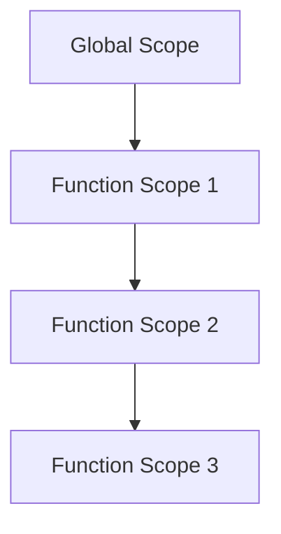

## 3.5. The Scope Chain

In the world of JavaScript, understanding how variables are resolved is crucial for writing efficient and bug-free code. One of the key concepts that govern this process is the **scope chain**. In this section, we'll explore what the scope chain is, how it works, and how JavaScript uses it to search for variables through parent scopes. We'll also provide practical examples and discuss performance considerations with deeply nested scopes.

### What is the Scope Chain?

The scope chain is a mechanism that JavaScript uses to resolve variable names in nested functions. When a variable is referenced, JavaScript starts looking for it in the current scope. If it doesn't find the variable there, it moves up to the next outer scope, continuing this process until it reaches the global scope. This series of scopes that JavaScript traverses is known as the scope chain.

#### Visualizing the Scope Chain

To better understand the scope chain, let's visualize it with a simple diagram:



In this diagram, each node represents a scope, and the arrows indicate the direction in which JavaScript searches for variables. The search begins at the innermost scope and proceeds outward.

### How the Scope Chain Works

When JavaScript executes a function, it creates a new execution context. Each execution context has its own scope, which contains variables declared within that function. If a variable is not found in the current scope, JavaScript looks up the scope chain to find it.

#### Example: Basic Scope Chain

Let's look at a simple example to illustrate the scope chain:

```javascript
let globalVar = 'I am global';

function outerFunction() {
    let outerVar = 'I am outer';

    function innerFunction() {
        let innerVar = 'I am inner';
        console.log(innerVar); // I am inner
        console.log(outerVar); // I am outer
        console.log(globalVar); // I am global
    }

    innerFunction();
}

outerFunction();
```

**Explanation:**

- `innerFunction` has access to `innerVar`, `outerVar`, and `globalVar`.
- When `innerVar` is accessed, JavaScript finds it in the current scope.
- When `outerVar` is accessed, JavaScript doesn't find it in `innerFunction`'s scope, so it looks up to `outerFunction`'s scope.
- When `globalVar` is accessed, JavaScript doesn't find it in either `innerFunction` or `outerFunction`, so it looks up to the global scope.

### Searching for Variables through Parent Scopes

The process of searching for variables through parent scopes is a fundamental aspect of the scope chain. This search is hierarchical and follows a specific order:

1. **Current Scope**: JavaScript first looks for the variable in the current scope.
2. **Parent Scope**: If the variable is not found, JavaScript moves to the immediate parent scope.
3. **Global Scope**: If the variable is still not found, JavaScript continues to the global scope.

#### Example: Nested Functions and Scope Resolution

Let's examine a more complex example with multiple nested functions:

```javascript
let globalVar = 'Global';

function firstLevel() {
    let firstLevelVar = 'First Level';

    function secondLevel() {
        let secondLevelVar = 'Second Level';

        function thirdLevel() {
            let thirdLevelVar = 'Third Level';
            console.log(thirdLevelVar); // Third Level
            console.log(secondLevelVar); // Second Level
            console.log(firstLevelVar); // First Level
            console.log(globalVar); // Global
        }

        thirdLevel();
    }

    secondLevel();
}

firstLevel();
```

**Explanation:**

- `thirdLevel` has access to `thirdLevelVar`, `secondLevelVar`, `firstLevelVar`, and `globalVar`.
- JavaScript resolves each variable by searching through the scope chain, starting from the innermost scope (`thirdLevel`) and moving outward.

### Performance Considerations with Deeply Nested Scopes

While the scope chain is a powerful feature, deeply nested scopes can lead to performance issues. Each time JavaScript needs to resolve a variable, it traverses the scope chain. If the chain is long, this can slow down execution, especially in performance-critical applications.

#### Tips for Managing Scope Chain Performance

1. **Minimize Nesting**: Avoid excessive nesting of functions, which can create long scope chains.
2. **Use Closures Wisely**: Closures can capture variables from outer scopes, but overusing them can lead to memory leaks.
3. **Optimize Variable Access**: Access variables from the nearest scope whenever possible to reduce the number of lookups.

### Try It Yourself

To solidify your understanding of the scope chain, try modifying the examples above. Experiment with adding more nested functions or changing variable names to see how JavaScript resolves them. Observe how the scope chain affects variable access and performance.

### Conclusion

Understanding the scope chain is essential for mastering JavaScript's variable resolution process. By knowing how JavaScript searches for variables through parent scopes, you can write more efficient and maintainable code. Remember to consider performance implications when working with deeply nested scopes, and always strive for clarity and simplicity in your code.

### Further Reading

For more information on JavaScript scopes and the scope chain, check out these resources:

- [MDN Web Docs: JavaScript Scopes](https://developer.mozilla.org/en-US/docs/Web/JavaScript/Guide/Grammar_and_types#variable_scope)
- [JavaScript.info: Closures](https://javascript.info/closure)

---

## Quiz Time!



### What is the scope chain in JavaScript?

- [x] A mechanism that JavaScript uses to resolve variable names in nested functions.
- [ ] A method for optimizing JavaScript code.
- [ ] A tool for debugging JavaScript applications.
- [ ] A library for managing JavaScript variables.

> **Explanation:** The scope chain is a mechanism that JavaScript uses to resolve variable names in nested functions by searching through parent scopes.

### In which order does JavaScript search for variables?

- [x] Current Scope, Parent Scope, Global Scope
- [ ] Global Scope, Parent Scope, Current Scope
- [ ] Parent Scope, Global Scope, Current Scope
- [ ] Current Scope, Global Scope, Parent Scope

> **Explanation:** JavaScript first looks for the variable in the current scope, then the parent scope, and finally the global scope.

### What happens if a variable is not found in the current scope?

- [x] JavaScript looks up the scope chain to find it.
- [ ] JavaScript throws an error immediately.
- [ ] JavaScript automatically creates the variable.
- [ ] JavaScript ignores the variable.

> **Explanation:** If a variable is not found in the current scope, JavaScript looks up the scope chain to find it.

### What is a potential performance issue with deeply nested scopes?

- [x] Slower execution due to long scope chains.
- [ ] Increased memory usage.
- [ ] Reduced readability of code.
- [ ] Difficulty in debugging.

> **Explanation:** Deeply nested scopes can lead to slower execution due to the long scope chains that JavaScript must traverse to resolve variables.

### How can you optimize variable access in JavaScript?

- [x] Access variables from the nearest scope.
- [ ] Use global variables for everything.
- [ ] Avoid using functions.
- [ ] Use closures for all variables.

> **Explanation:** Accessing variables from the nearest scope reduces the number of lookups and optimizes variable access.

### What is the primary benefit of understanding the scope chain?

- [x] Writing more efficient and maintainable code.
- [ ] Learning a new programming language.
- [ ] Debugging network issues.
- [ ] Designing user interfaces.

> **Explanation:** Understanding the scope chain helps in writing more efficient and maintainable code by knowing how JavaScript resolves variables.

### Which of the following is a good practice for managing scope chain performance?

- [x] Minimize nesting of functions.
- [ ] Use global variables extensively.
- [ ] Avoid using closures.
- [ ] Write long and complex functions.

> **Explanation:** Minimizing nesting of functions helps manage scope chain performance by reducing the length of the scope chain.

### What is a closure in JavaScript?

- [x] A function that captures variables from outer scopes.
- [ ] A method for optimizing JavaScript code.
- [ ] A tool for debugging JavaScript applications.
- [ ] A library for managing JavaScript variables.

> **Explanation:** A closure is a function that captures variables from outer scopes, allowing them to be used within the function.

### Which scope is at the top of the scope chain?

- [x] Global Scope
- [ ] Current Scope
- [ ] Parent Scope
- [ ] Function Scope

> **Explanation:** The global scope is at the top of the scope chain, as it is the outermost scope.

### True or False: JavaScript automatically creates variables if they are not found in the scope chain.

- [ ] True
- [x] False

> **Explanation:** False. JavaScript does not automatically create variables if they are not found in the scope chain; it throws a ReferenceError instead.



Remember, this is just the beginning. As you progress, you'll build more complex and interactive web pages. Keep experimenting, stay curious, and enjoy the journey!
