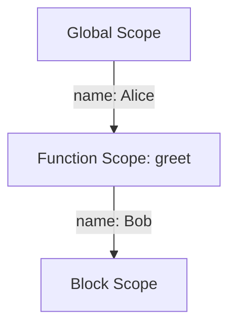

## 3.6. Variable Shadowing

In our journey to understand JavaScript, we've explored variable declarations, scopes, and hoisting. Now, let's delve into a fascinating aspect of scope management: **variable shadowing**. This concept arises when a variable in an inner scope shares the same name as a variable in an outer scope. While this might seem straightforward, it can lead to unexpected behavior and bugs if not handled properly. In this section, we'll define variable shadowing, explore its effects, and provide strategies to manage it effectively.

### What is Variable Shadowing?

Variable shadowing occurs when a variable declared within a certain scope (such as a function or block) has the same name as a variable declared in an outer scope. The inner variable "shadows" the outer one, meaning that within the inner scope, the outer variable is inaccessible. This can lead to confusion, especially for beginners, as it may not be immediately clear which variable is being referenced.

#### Example of Variable Shadowing

Let's start with a simple example to illustrate variable shadowing:

```javascript
let name = "Alice";

function greet() {
    let name = "Bob";
    console.log("Hello, " + name);
}

greet(); // Output: Hello, Bob
console.log(name); // Output: Alice
```

In this example, we have a variable `name` declared in the global scope with the value "Alice". Inside the `greet` function, we declare another variable `name` with the value "Bob". When we call `console.log` inside the function, it accesses the `name` variable in the function's scope, shadowing the global `name` variable. Thus, "Bob" is printed instead of "Alice".

### Effects of Variable Shadowing

Variable shadowing can lead to several effects, both intended and unintended:

1. **Isolation of Scope**: Shadowing allows for the isolation of variables within a specific scope, which can be useful for encapsulation and avoiding unintended side effects.

2. **Potential for Errors**: If not carefully managed, shadowing can lead to errors where the wrong variable is accessed or modified, leading to bugs that are hard to trace.

3. **Confusion in Code Readability**: For those reading the code, shadowing can make it difficult to understand which variable is being referenced, especially in large codebases.

#### Potential Issues and Confusion

Consider the following example, which demonstrates how shadowing can lead to confusion:

```javascript
let counter = 10;

function incrementCounter() {
    let counter = 0;
    counter++;
    console.log(counter); // Output: 1
}

incrementCounter();
console.log(counter); // Output: 10
```

In this example, the `counter` variable inside the `incrementCounter` function shadows the global `counter` variable. As a result, when we increment `counter` inside the function, it only affects the local variable, leaving the global `counter` unchanged. This behavior might not be immediately obvious, leading to potential confusion and errors.

### Best Practices to Avoid or Handle Variable Shadowing

To manage variable shadowing effectively, consider the following best practices:

1. **Use Descriptive Variable Names**: Avoid using generic names like `data`, `value`, or `counter`. Instead, use descriptive names that reflect the variable's purpose, reducing the likelihood of accidental shadowing.

2. **Limit Scope**: Declare variables in the smallest scope necessary. This minimizes the chance of shadowing and makes the code easier to understand.

3. **Consistent Naming Conventions**: Adopt a consistent naming convention across your codebase to differentiate between variables in different scopes.

4. **Use `const` for Constants**: When a variable's value should not change, use `const` to declare it. This prevents accidental reassignment and can help avoid shadowing issues.

5. **Review and Refactor**: Regularly review your code for instances of shadowing and refactor where necessary to improve clarity and maintainability.

### Visualizing Variable Shadowing

To better understand how variable shadowing works, let's visualize the scope chain and how JavaScript resolves variable names:



In this diagram, the global scope contains the variable `name` with the value "Alice". The `greet` function introduces a new scope with its own `name` variable, shadowing the global one. Within the function, the `name` variable refers to "Bob", and the global `name` is inaccessible.

### Try It Yourself

Experiment with the following code to see variable shadowing in action. Try modifying the variable names and observe the changes in behavior:

```javascript
let color = "red";

function setColor() {
    let color = "blue";
    console.log("Inside function: " + color);
}

setColor(); // Output: Inside function: blue
console.log("Outside function: " + color); // Output: Outside function: red
```

Try changing the inner `color` variable to a different name and see how it affects the output. This exercise will help reinforce your understanding of variable shadowing.

### Knowledge Check

Before we conclude, let's summarize the key takeaways:

- Variable shadowing occurs when a variable in an inner scope shares the same name as a variable in an outer scope.
- Shadowing can lead to isolation of scope, potential errors, and confusion in code readability.
- Best practices include using descriptive names, limiting scope, and adopting consistent naming conventions.

### Embrace the Journey

Remember, mastering JavaScript is a journey. As you continue to learn and experiment, you'll develop a deeper understanding of how variables and scopes interact. Keep practicing, stay curious, and enjoy the process!

## Quiz Time!



### What is variable shadowing?

- [x] When a variable in an inner scope has the same name as a variable in an outer scope.
- [ ] When a variable is declared but not initialized.
- [ ] When a variable is used before it is declared.
- [ ] When a variable is declared in the global scope.

> **Explanation:** Variable shadowing occurs when a variable in an inner scope has the same name as one in an outer scope, causing the inner variable to "shadow" the outer one.

### What happens to the outer variable when shadowed by an inner variable?

- [x] It becomes inaccessible within the inner scope.
- [ ] It is deleted.
- [ ] It is automatically updated.
- [ ] It remains unaffected and accessible.

> **Explanation:** When a variable is shadowed, the outer variable becomes inaccessible within the inner scope, and only the inner variable is used.

### Which of the following is a best practice to avoid variable shadowing?

- [x] Use descriptive variable names.
- [ ] Use the same variable names everywhere.
- [ ] Avoid using functions.
- [ ] Declare all variables globally.

> **Explanation:** Using descriptive variable names helps avoid accidental shadowing by making it clear what each variable represents.

### In the following code, what will `console.log(counter)` output inside the function?

```javascript
let counter = 5;

function updateCounter() {
    let counter = 10;
    console.log(counter);
}

updateCounter();
```

- [x] 10
- [ ] 5
- [ ] Undefined
- [ ] Error

> **Explanation:** Inside the function, the local `counter` variable shadows the global one, so `console.log(counter)` outputs 10.

### How can you ensure a variable is not accidentally reassigned?

- [x] Use `const` to declare the variable.
- [ ] Use `var` to declare the variable.
- [ ] Use `let` to declare the variable.
- [ ] Declare it globally.

> **Explanation:** Using `const` ensures that a variable cannot be reassigned, helping prevent accidental changes.

### What is the effect of variable shadowing on code readability?

- [x] It can make the code harder to understand.
- [ ] It improves code readability.
- [ ] It has no effect on readability.
- [ ] It simplifies the code.

> **Explanation:** Variable shadowing can make code harder to understand, especially for those unfamiliar with the codebase, as it may not be clear which variable is being referenced.

### What is a common issue caused by variable shadowing?

- [x] Unintended variable access or modification.
- [ ] Improved performance.
- [ ] Reduced memory usage.
- [ ] Enhanced security.

> **Explanation:** A common issue with variable shadowing is unintended access or modification of variables, leading to potential bugs.

### Which keyword helps limit the scope of a variable to the smallest necessary?

- [x] `let`
- [ ] `var`
- [ ] `global`
- [ ] `static`

> **Explanation:** The `let` keyword allows you to declare variables with block scope, limiting their accessibility to the smallest necessary scope.

### In the following code, what will `console.log(color)` output outside the function?

```javascript
let color = "green";

function changeColor() {
    let color = "yellow";
}

changeColor();
console.log(color);
```

- [x] green
- [ ] yellow
- [ ] undefined
- [ ] Error

> **Explanation:** Outside the function, the global `color` variable is not affected by the local `color` variable inside the function, so `console.log(color)` outputs "green".

### True or False: Variable shadowing can be completely avoided by using unique variable names.

- [x] True
- [ ] False

> **Explanation:** Using unique variable names can help avoid variable shadowing by ensuring that variables in different scopes do not share the same name.


