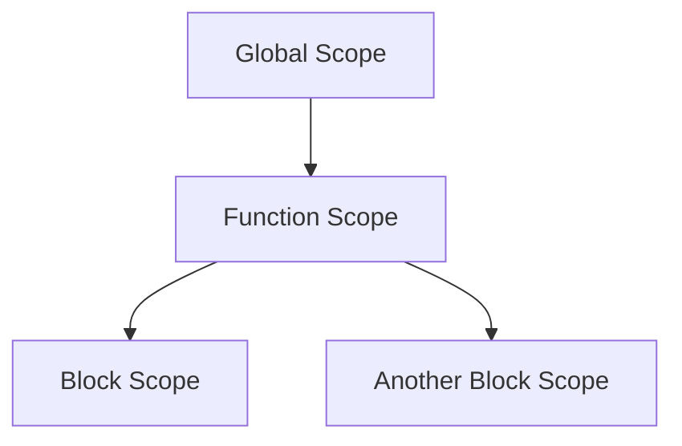

## 3.7. Best Practices for Variable Scope

In this section, we will explore the best practices for managing variable scope in JavaScript. Understanding and effectively using variable scope is crucial for writing clean, maintainable, and efficient code. By following these best practices, you can reduce side effects, avoid bugs, and create code that is easier to understand and modify.

### Understanding Variable Scope

Before diving into best practices, let's briefly recap what variable scope means in JavaScript. Variable scope determines the accessibility of variables within different parts of your code. JavaScript has three types of scope:

1. **Global Scope**: Variables declared outside any function or block have global scope. They are accessible from anywhere in the code.
2. **Function Scope**: Variables declared within a function are only accessible within that function.
3. **Block Scope**: Introduced with ES6, variables declared with `let` and `const` within a block (e.g., inside a loop or conditional statement) are only accessible within that block.

Understanding these scopes is fundamental to managing your variables effectively.

### Key Principles for Scoping Variables

#### 1. Limit Variable Scope

One of the most important principles is to limit the scope of your variables as much as possible. By doing so, you minimize the risk of variable name conflicts and unintended side effects. Here's how you can achieve this:

- **Declare variables in the smallest scope necessary**: If a variable is only needed within a loop or a conditional block, declare it there instead of at the top of the function or globally.
  
```javascript
function processItems(items) {
  for (let i = 0; i < items.length; i++) {
    let item = items[i]; // Declare item within the loop
    console.log(item);
  }
}
```

- **Avoid using global variables**: Global variables can be accessed and modified from anywhere in your code, leading to potential conflicts and bugs. Always prefer local variables over global ones.

#### 2. Use `let` and `const` Consistently

With the introduction of `let` and `const` in ES6, JavaScript developers have better tools for managing scope. Here are some guidelines for using them effectively:

- **Use `const` by default**: If a variable's value should not change, declare it with `const`. This not only prevents reassignment but also signals to other developers that the variable is intended to remain constant.

```javascript
const MAX_USERS = 100; // Use const for constants
```

- **Use `let` for variables that change**: When you need to reassign a variable, use `let`. This provides block-level scope and helps prevent issues related to variable hoisting.

```javascript
let counter = 0; // Use let for variables that will change
counter++;
```

- **Avoid using `var`**: The `var` keyword has function scope and can lead to unexpected behavior due to hoisting. Prefer `let` and `const` for their block-level scoping.

#### 3. Structure Code with Scope in Mind

When writing code, think about how you can structure it to take advantage of scope. This can lead to cleaner and more efficient code:

- **Use functions to encapsulate logic**: Functions create their own scope, so use them to encapsulate logic and variables that don't need to be accessible elsewhere.

```javascript
function calculateTotal(price, tax) {
  const total = price + tax;
  return total;
}
```

- **Leverage block scope for temporary variables**: Use block scope to limit the lifespan of temporary variables, reducing the chance of accidental modification.

```javascript
if (condition) {
  let temporaryValue = computeValue();
  console.log(temporaryValue);
}
```

- **Avoid deeply nested code**: Deeply nested code can be difficult to read and understand. Try to flatten your code structure by using functions or early returns.

### Visualizing Scope with Diagrams

To better understand how scope works in JavaScript, let's visualize it using a scope chain diagram. This will help illustrate how JavaScript resolves variable names.



**Figure 1: JavaScript Scope Chain**

In this diagram, the global scope contains a function, which in turn contains two block scopes. When JavaScript looks for a variable, it starts from the innermost scope and moves outward until it finds the variable or reaches the global scope.

### Guidelines for Managing Scope

#### 1. Name Variables Intentionally

Choosing meaningful and descriptive names for your variables can make your code more readable and maintainable. Avoid single-letter names unless they are commonly understood (e.g., `i` for loop counters).

#### 2. Avoid Variable Shadowing

Variable shadowing occurs when a variable in a local scope has the same name as a variable in an outer scope. This can lead to confusion and bugs. Always use unique names for variables in different scopes.

```javascript
let name = "Alice";

function greet() {
  let name = "Bob"; // Shadows the outer name variable
  console.log("Hello, " + name);
}

greet(); // Outputs: Hello, Bob
console.log(name); // Outputs: Alice
```

#### 3. Use IIFEs for Private Scope

Immediately Invoked Function Expressions (IIFEs) can be used to create private scope for variables, preventing them from polluting the global scope.

```javascript
(function() {
  let privateVar = "I am private";
  console.log(privateVar);
})();
```

#### 4. Avoid Global Namespace Pollution

Minimize the use of global variables to avoid conflicts and unintended modifications. Instead, encapsulate your code within functions or modules.

### Try It Yourself

Now that we've covered some best practices, try modifying the following code to improve its scope management:

```javascript
var count = 0;

function increment() {
  count++;
  console.log(count);
}

increment();
increment();
```

**Challenge**: Refactor the code to use `let` or `const` and limit the scope of variables as much as possible.

### Knowledge Check

- What are the three types of scope in JavaScript?
- Why should you prefer `let` and `const` over `var`?
- How can you use functions to manage variable scope effectively?

### References and Further Reading

For more information on JavaScript scope and best practices, check out the following resources:

- [MDN Web Docs: JavaScript Scoping](https://developer.mozilla.org/en-US/docs/Glossary/Scope)
- [W3Schools: JavaScript Scope](https://www.w3schools.com/js/js_scope.asp)

### Embrace the Journey

Remember, mastering variable scope is a journey. As you continue to practice and write more JavaScript code, you'll become more comfortable with these concepts. Keep experimenting, stay curious, and enjoy the process of learning and improving your coding skills!

## Quiz Time!



### What is the primary benefit of limiting variable scope?

- [x] Reduces the risk of variable name conflicts and unintended side effects.
- [ ] Increases the number of global variables.
- [ ] Makes code harder to read.
- [ ] Allows variables to be accessed from anywhere in the code.

> **Explanation:** Limiting variable scope reduces the risk of variable name conflicts and unintended side effects, leading to cleaner and more maintainable code.

### Which keyword should you use by default for variables that should not change?

- [x] const
- [ ] let
- [ ] var
- [ ] function

> **Explanation:** Use `const` by default for variables that should not change, as it prevents reassignment and signals that the variable is intended to remain constant.

### What is a common issue with using the `var` keyword?

- [x] It has function scope and can lead to unexpected behavior due to hoisting.
- [ ] It provides block-level scope.
- [ ] It prevents reassignment of variables.
- [ ] It is not supported in modern browsers.

> **Explanation:** The `var` keyword has function scope and can lead to unexpected behavior due to hoisting, making it less preferable compared to `let` and `const`.

### How can you create a private scope for variables?

- [x] Use an Immediately Invoked Function Expression (IIFE).
- [ ] Declare variables globally.
- [ ] Use the `var` keyword.
- [ ] Avoid using functions.

> **Explanation:** An IIFE creates a private scope for variables, preventing them from polluting the global scope.

### What is variable shadowing?

- [x] When a variable in a local scope has the same name as a variable in an outer scope.
- [ ] When a variable is declared globally.
- [ ] When a variable is not initialized.
- [ ] When a variable is declared with `const`.

> **Explanation:** Variable shadowing occurs when a variable in a local scope has the same name as a variable in an outer scope, leading to potential confusion and bugs.

### Why is it important to avoid deeply nested code?

- [x] It can be difficult to read and understand.
- [ ] It improves performance.
- [ ] It increases the number of global variables.
- [ ] It allows for more variable shadowing.

> **Explanation:** Deeply nested code can be difficult to read and understand, so it's important to structure code in a way that minimizes nesting.

### What is the purpose of using functions to encapsulate logic?

- [x] To create their own scope and encapsulate logic and variables that don't need to be accessible elsewhere.
- [ ] To increase the number of global variables.
- [ ] To make code harder to read.
- [ ] To allow variables to be accessed from anywhere in the code.

> **Explanation:** Functions create their own scope and encapsulate logic and variables that don't need to be accessible elsewhere, leading to cleaner and more maintainable code.

### What is the scope chain?

- [x] The mechanism by which JavaScript resolves variable names by looking through nested scopes.
- [ ] The order in which variables are declared.
- [ ] The list of all global variables.
- [ ] The hierarchy of function calls.

> **Explanation:** The scope chain is the mechanism by which JavaScript resolves variable names by looking through nested scopes, starting from the innermost scope and moving outward.

### How can you avoid global namespace pollution?

- [x] Encapsulate your code within functions or modules.
- [ ] Declare all variables globally.
- [ ] Use the `var` keyword.
- [ ] Avoid using functions.

> **Explanation:** Encapsulating your code within functions or modules helps avoid global namespace pollution by minimizing the use of global variables.

### True or False: Using `let` and `const` can help prevent issues related to variable hoisting.

- [x] True
- [ ] False

> **Explanation:** True. Using `let` and `const` provides block-level scope and helps prevent issues related to variable hoisting, making them preferable to `var`.


