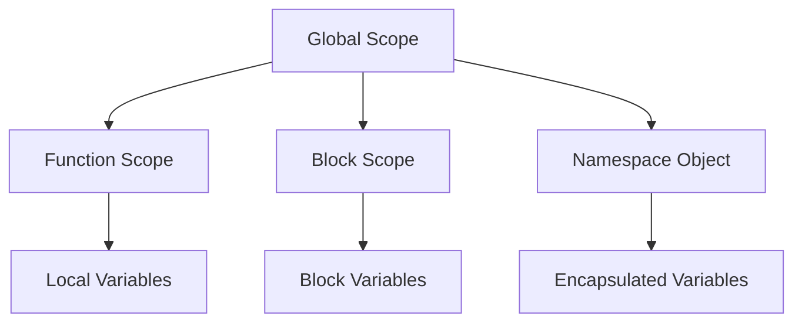

## 3.8. Avoiding Global Namespace Pollution

In the world of JavaScript, managing variables effectively is crucial for maintaining clean, efficient, and bug-free code. One of the common pitfalls developers face is global namespace pollution. In this section, we will explore what global namespace pollution is, why it's problematic, and how we can avoid it using various techniques such as Immediately Invoked Function Expressions (IIFEs) and modules. We'll also look at the benefits of organizing code in a modular fashion.

### Understanding Global Namespace Pollution

Before we dive into solutions, let's first understand what global namespace pollution is. In JavaScript, the global namespace is the environment where all global variables reside. When a variable is declared in the global scope, it becomes accessible throughout the entire codebase. While this might seem convenient, it can lead to several issues:

1. **Name Conflicts**: As your codebase grows, the likelihood of variable name conflicts increases. Two different parts of your application might inadvertently use the same variable name, leading to unexpected behavior.

2. **Maintenance Challenges**: Global variables make it harder to track where and how a variable is being used and modified. This can complicate debugging and maintenance.

3. **Increased Risk of Bugs**: Since global variables can be accessed and modified from anywhere in the code, they increase the risk of unintended side effects and bugs.

4. **Performance Issues**: Excessive use of global variables can lead to performance degradation, as the JavaScript engine has to search through a larger scope chain to resolve variable references.

### Strategies to Avoid Global Namespace Pollution

To mitigate these issues, we can employ several strategies to minimize the use of global variables and encapsulate our code.

#### 1. Use of Immediately Invoked Function Expressions (IIFEs)

An IIFE is a function that runs as soon as it is defined. It helps in creating a local scope for variables, thus preventing them from polluting the global namespace.

**Example Before IIFE:**

```javascript
// Global variables
var counter = 0;

function incrementCounter() {
  counter++;
}

incrementCounter();
console.log(counter); // Output: 1
```

**Example After IIFE:**

```javascript
(function() {
  // Local variable within IIFE
  var counter = 0;

  function incrementCounter() {
    counter++;
  }

  incrementCounter();
  console.log(counter); // Output: 1
})();

// Trying to access counter outside the IIFE
console.log(typeof counter); // Output: "undefined"
```

**Benefits of IIFEs:**

- **Encapsulation**: Variables defined inside an IIFE are not accessible from the outside, reducing the risk of name conflicts.
- **Immediate Execution**: The function executes immediately, which is useful for initialization code.

#### 2. Modular Code Organization

With the introduction of ES6, JavaScript now supports modules, which allow developers to encapsulate code in separate files and import/export functionality as needed.

**Example Using ES6 Modules:**

```javascript
// counterModule.js
let counter = 0;

export function incrementCounter() {
  counter++;
}

export function getCounter() {
  return counter;
}
```

```javascript
// main.js
import { incrementCounter, getCounter } from './counterModule.js';

incrementCounter();
console.log(getCounter()); // Output: 1
```

**Benefits of Modules:**

- **Separation of Concerns**: Modules help in organizing code logically, making it easier to manage and understand.
- **Reusability**: Functions and variables can be reused across different parts of the application without polluting the global namespace.
- **Maintainability**: Changes in one module do not affect others, reducing the risk of bugs.

#### 3. Using Block Scope with `let` and `const`

Unlike `var`, which is function-scoped, `let` and `const` are block-scoped. This means they are confined to the block in which they are defined, preventing them from leaking into the global scope.

**Example Using `let` and `const`:**

```javascript
if (true) {
  let blockScopedVariable = 'I am block scoped';
  console.log(blockScopedVariable); // Output: I am block scoped
}

// Trying to access blockScopedVariable outside the block
console.log(typeof blockScopedVariable); // Output: "undefined"
```

**Benefits of Block Scope:**

- **Reduced Risk of Conflicts**: Variables are limited to the block in which they are declared, reducing the chance of conflicts.
- **Cleaner Code**: Encourages the use of variables only where necessary, leading to cleaner and more readable code.

#### 4. Avoiding Global Variables

Whenever possible, avoid creating global variables. Instead, use local variables within functions or modules. If a global variable is necessary, consider using a namespace object to group related variables and functions.

**Example Using a Namespace Object:**

```javascript
var MyApp = MyApp || {};

MyApp.counter = 0;

MyApp.incrementCounter = function() {
  MyApp.counter++;
};

MyApp.incrementCounter();
console.log(MyApp.counter); // Output: 1
```

**Benefits of Namespace Objects:**

- **Organization**: Groups related variables and functions, making the code more organized.
- **Reduced Global Variables**: Limits the number of global variables by encapsulating them within a single object.

### Visualizing Variable Scope and Encapsulation

To better understand how these techniques work, let's visualize the concept of variable scope and encapsulation using a diagram.



**Diagram Description**: This diagram illustrates the different levels of scope in JavaScript. The global scope contains function and block scopes, each with their own local variables. Namespace objects encapsulate variables, reducing global namespace pollution.

### Try It Yourself

Now that we've covered the theory, let's put it into practice. Try modifying the following code to use an IIFE and a namespace object to encapsulate variables.

**Original Code:**

```javascript
var name = 'John Doe';

function greet() {
  console.log('Hello, ' + name);
}

greet();
```

**Suggested Modifications:**

1. Wrap the code in an IIFE to encapsulate the `name` variable.
2. Use a namespace object to group the `name` variable and `greet` function.

### Benefits of Modular Code Organization

Organizing code in a modular fashion offers several advantages:

- **Scalability**: As your application grows, modules make it easier to add new features without affecting existing code.
- **Collaboration**: Modules enable multiple developers to work on different parts of the application simultaneously.
- **Testing**: Isolated modules can be tested independently, improving the reliability of the application.

### References and Links

For more information on avoiding global namespace pollution, check out the following resources:

- [MDN Web Docs: JavaScript Modules](https://developer.mozilla.org/en-US/docs/Web/JavaScript/Guide/Modules)
- [W3Schools: JavaScript Scope](https://www.w3schools.com/js/js_scope.asp)
- [JavaScript.info: Global Object](https://javascript.info/global-object)

### Knowledge Check

Let's reinforce what we've learned with a few questions:

1. What is global namespace pollution, and why is it problematic?
2. How do IIFEs help in avoiding global namespace pollution?
3. What are the benefits of using ES6 modules?
4. How does block scope differ from function scope?
5. Why should we avoid using global variables?

### Embrace the Journey

Remember, this is just the beginning. As you progress, you'll build more complex and interactive web pages. Keep experimenting, stay curious, and enjoy the journey!

## Quiz Time!



### What is global namespace pollution?

- [x] When too many global variables are declared, causing conflicts and maintenance issues.
- [ ] When variables are declared inside functions.
- [ ] When variables are declared using `let` or `const`.
- [ ] When variables are declared using `var`.

> **Explanation:** Global namespace pollution occurs when too many global variables are declared, leading to conflicts and maintenance challenges.

### How does an IIFE help in avoiding global namespace pollution?

- [x] It creates a local scope for variables, preventing them from being global.
- [ ] It makes variables global.
- [ ] It removes all global variables.
- [ ] It changes variable names automatically.

> **Explanation:** An IIFE creates a local scope for variables, preventing them from polluting the global namespace.

### What is a benefit of using ES6 modules?

- [x] They encapsulate code, reducing the risk of global namespace pollution.
- [ ] They make all variables global.
- [ ] They automatically fix bugs in the code.
- [ ] They increase the size of the codebase.

> **Explanation:** ES6 modules encapsulate code, reducing the risk of global namespace pollution and improving code organization.

### What is the difference between block scope and function scope?

- [x] Block scope confines variables to a block, while function scope confines them to a function.
- [ ] Block scope is the same as global scope.
- [ ] Function scope is the same as block scope.
- [ ] Block scope makes variables global.

> **Explanation:** Block scope confines variables to a block, while function scope confines them to a function.

### Why should we avoid using global variables?

- [x] They can lead to name conflicts and make maintenance difficult.
- [ ] They make the code run faster.
- [ ] They are easier to debug.
- [ ] They automatically fix errors.

> **Explanation:** Global variables can lead to name conflicts, make maintenance difficult, and increase the risk of bugs.

### What is a namespace object?

- [x] An object used to group related variables and functions to reduce global variables.
- [ ] A function that makes variables global.
- [ ] A special type of global variable.
- [ ] A method to delete all global variables.

> **Explanation:** A namespace object is used to group related variables and functions, reducing the number of global variables.

### What is the purpose of the `let` keyword?

- [x] To declare block-scoped variables.
- [ ] To declare global variables.
- [ ] To declare function-scoped variables.
- [ ] To declare variables that cannot be changed.

> **Explanation:** The `let` keyword is used to declare block-scoped variables, preventing them from leaking into the global scope.

### How can modules improve code maintainability?

- [x] By isolating code, making it easier to manage and understand.
- [ ] By making all code global.
- [ ] By automatically fixing errors.
- [ ] By increasing the complexity of the code.

> **Explanation:** Modules isolate code, making it easier to manage, understand, and maintain.

### What is an advantage of using `const`?

- [x] It declares variables that cannot be reassigned, reducing errors.
- [ ] It makes variables global.
- [ ] It automatically fixes bugs.
- [ ] It increases the size of the codebase.

> **Explanation:** The `const` keyword declares variables that cannot be reassigned, reducing the risk of errors.

### True or False: Using IIFEs can help reduce global namespace pollution.

- [x] True
- [ ] False

> **Explanation:** True. IIFEs create a local scope for variables, helping to reduce global namespace pollution.


