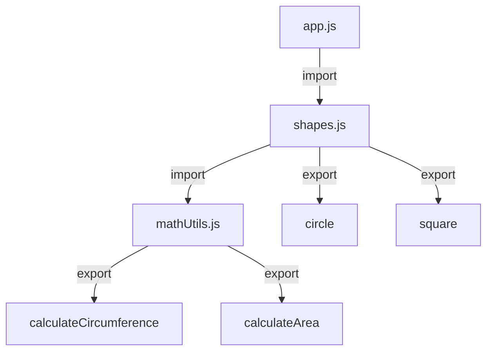

## 3.9. Modules and Encapsulation

In the world of programming, organizing code in a way that is both manageable and reusable is crucial. As applications grow in complexity, the need for a structured approach to code organization becomes evident. This is where JavaScript modules come into play. In this section, we will explore the concept of modules in JavaScript, focusing on the ES6 module system, which provides a robust mechanism for encapsulating code and managing scope.

### Understanding Modules in JavaScript

Modules are essentially files that contain JavaScript code. They help in organizing code by dividing it into separate files, each responsible for a specific functionality. This modular approach not only makes code easier to maintain but also promotes reusability.

Before ES6, JavaScript did not have a native module system. Developers relied on various patterns and libraries, such as CommonJS and AMD, to achieve modularity. However, with the introduction of ES6 (ECMAScript 2015), JavaScript gained a standardized module system that is now widely supported by modern browsers and Node.js.

#### Key Benefits of Using Modules

- **Encapsulation**: Modules encapsulate code, meaning that variables and functions defined in one module are not accessible to others unless explicitly exported. This prevents naming conflicts and keeps the global namespace clean.
- **Reusability**: By exporting functions, objects, or primitives from a module, you can reuse them across different parts of your application or even in different projects.
- **Maintainability**: Modules help in organizing code into logical sections, making it easier to understand and maintain.
- **Scope Management**: Each module has its own scope, which means variables declared in a module are local to that module unless exported.

### The ES6 Module Syntax

The ES6 module system introduces two main keywords: `import` and `export`. These keywords are used to share code between modules.

#### Exporting from a Module

The `export` keyword is used to make variables, functions, or objects available to other modules. There are two types of exports: named exports and default exports.

##### Named Exports

Named exports allow you to export multiple values from a module. Each exported value must be imported using the same name.

```javascript
// mathUtils.js
export const pi = 3.14159;

export function calculateCircumference(radius) {
  return 2 * pi * radius;
}

export function calculateArea(radius) {
  return pi * radius * radius;
}
```

In the above example, we have a module `mathUtils.js` that exports a constant `pi` and two functions, `calculateCircumference` and `calculateArea`.

##### Default Exports

A module can have one default export. This is useful when you want to export a single value or function from a module.

```javascript
// logger.js
export default function log(message) {
  console.log(message);
}
```

Here, the `logger.js` module exports a default function `log`.

#### Importing into a Module

The `import` keyword is used to bring exported values into another module. You can import named exports and default exports using different syntax.

##### Importing Named Exports

To import named exports, you use curly braces `{}` and specify the exact names of the exports you want to import.

```javascript
// app.js
import { pi, calculateCircumference, calculateArea } from './mathUtils.js';

console.log(`Circumference: ${calculateCircumference(10)}`);
console.log(`Area: ${calculateArea(10)}`);
```

In this example, we import the named exports from `mathUtils.js` into `app.js`.

##### Importing Default Exports

To import a default export, you simply use a variable name without curly braces.

```javascript
// main.js
import log from './logger.js';

log('Hello, world!');
```

Here, we import the default export from `logger.js` and use it in `main.js`.

#### Combining Named and Default Exports

You can combine named and default exports in a single module.

```javascript
// shapes.js
export const square = (x) => x * x;

export default function circle(radius) {
  return pi * radius * radius;
}
```

To import both named and default exports, you can use the following syntax:

```javascript
// geometry.js
import circle, { square } from './shapes.js';

console.log(`Square of 4: ${square(4)}`);
console.log(`Area of circle with radius 5: ${circle(5)}`);
```

### Splitting Code into Modules

Let's explore how to split code into modules using a practical example. Suppose we are building a simple application that calculates the area and circumference of different shapes.

#### Step 1: Create a Module for Math Utilities

First, we create a module `mathUtils.js` to handle mathematical calculations.

```javascript
// mathUtils.js
export const pi = 3.14159;

export function calculateCircumference(radius) {
  return 2 * pi * radius;
}

export function calculateArea(radius) {
  return pi * radius * radius;
}
```

#### Step 2: Create a Module for Shapes

Next, we create a module `shapes.js` that uses the functions from `mathUtils.js`.

```javascript
// shapes.js
import { calculateCircumference, calculateArea } from './mathUtils.js';

export function circle(radius) {
  return {
    circumference: calculateCircumference(radius),
    area: calculateArea(radius),
  };
}

export function square(side) {
  return {
    perimeter: 4 * side,
    area: side * side,
  };
}
```

#### Step 3: Create the Main Application Module

Finally, we create a main module `app.js` to use the `shapes.js` module.

```javascript
// app.js
import { circle, square } from './shapes.js';

const circleMetrics = circle(5);
console.log(`Circle - Circumference: ${circleMetrics.circumference}, Area: ${circleMetrics.area}`);

const squareMetrics = square(4);
console.log(`Square - Perimeter: ${squareMetrics.perimeter}, Area: ${squareMetrics.area}`);
```

### How Modules Create Their Own Scope

One of the key features of modules is that they create their own scope. This means that variables and functions declared inside a module are not accessible outside of it unless explicitly exported. This encapsulation helps prevent naming conflicts and keeps the global namespace clean.

#### Example of Module Scope

Consider the following example:

```javascript
// moduleA.js
const secret = 'This is a secret';

export function revealSecret() {
  return secret;
}
```

```javascript
// moduleB.js
import { revealSecret } from './moduleA.js';

console.log(revealSecret()); // Outputs: This is a secret
console.log(secret); // Error: secret is not defined
```

In this example, the variable `secret` is not accessible in `moduleB.js` because it is encapsulated within `moduleA.js`.

### Promoting Code Reusability with Modules

Modules promote code reusability by allowing you to export and import code across different parts of your application. This modular approach makes it easy to share code between projects and encourages the development of reusable components.

#### Example of Code Reusability

Suppose you have a utility function that you want to use in multiple projects. You can create a module for it and import it wherever needed.

```javascript
// utilities.js
export function formatCurrency(amount) {
  return `$${amount.toFixed(2)}`;
}
```

Now, you can import and use `formatCurrency` in any project:

```javascript
// project1.js
import { formatCurrency } from './utilities.js';

console.log(formatCurrency(123.456)); // Outputs: $123.46
```

```javascript
// project2.js
import { formatCurrency } from './utilities.js';

console.log(formatCurrency(789.012)); // Outputs: $789.01
```

### Visualizing Module Interaction

To better understand how modules interact with each other, let's visualize the process using a diagram.



**Diagram Description**: This diagram illustrates the interaction between modules in our example application. The `app.js` module imports functions from `shapes.js`, which in turn imports functions from `mathUtils.js`. The arrows indicate the flow of imports and exports between modules.

### Try It Yourself

Now that we've covered the basics of modules and encapsulation, it's time to experiment with the code examples provided. Try the following exercises:

1. **Modify the `mathUtils.js` Module**: Add a new function to calculate the diameter of a circle and export it. Import and use this function in `shapes.js`.

2. **Create a New Module**: Create a new module `triangle.js` that exports functions to calculate the perimeter and area of a triangle. Use this module in `app.js`.

3. **Experiment with Default Exports**: Change one of the named exports in `shapes.js` to a default export. Update the import statement in `app.js` accordingly.

### References and Links

For more information on JavaScript modules, you can refer to the following resources:

- [MDN Web Docs: Modules](https://developer.mozilla.org/en-US/docs/Web/JavaScript/Guide/Modules)
- [JavaScript.info: Modules](https://javascript.info/modules)
- [W3Schools: JavaScript Modules](https://www.w3schools.com/js/js_modules.asp)

### Knowledge Check

Before we wrap up, let's reinforce what we've learned with a few questions:

- What are the benefits of using modules in JavaScript?
- How do you export a function from a module?
- What is the difference between named exports and default exports?
- How do modules help in managing scope?
- Why is code reusability important in software development?

### Embrace the Journey

Remember, understanding modules and encapsulation is a significant step towards mastering JavaScript. As you continue to learn and experiment, you'll find that modules are an invaluable tool for building scalable and maintainable applications. Keep exploring, stay curious, and enjoy the journey!

## Quiz Time!



### What is the primary purpose of using modules in JavaScript?

- [x] To organize code into separate files for better maintainability and reusability
- [ ] To increase the execution speed of JavaScript code
- [ ] To make JavaScript code compatible with older browsers
- [ ] To enhance the visual appearance of web pages

> **Explanation:** Modules help organize code into separate files, making it easier to maintain and reuse.

### Which keyword is used to export a function from a module?

- [x] export
- [ ] import
- [ ] module
- [ ] function

> **Explanation:** The `export` keyword is used to make functions, objects, or primitives available to other modules.

### How do you import a named export from a module?

- [x] Using curly braces with the import keyword
- [ ] Using square brackets with the import keyword
- [ ] Using parentheses with the import keyword
- [ ] Using the require function

> **Explanation:** Named exports are imported using curly braces with the `import` keyword.

### What is the difference between named exports and default exports?

- [x] Named exports allow multiple exports per module, while default exports allow only one
- [ ] Named exports are faster to import than default exports
- [ ] Default exports can only be functions
- [ ] Named exports require a special syntax to import

> **Explanation:** Named exports allow multiple exports, whereas a module can have only one default export.

### How do modules help in managing scope?

- [x] By encapsulating code and preventing naming conflicts
- [ ] By increasing the execution speed of JavaScript code
- [ ] By making JavaScript code compatible with older browsers
- [ ] By enhancing the visual appearance of web pages

> **Explanation:** Modules encapsulate code, meaning variables and functions are not accessible outside unless exported.

### Why is code reusability important in software development?

- [x] It reduces redundancy and improves maintainability
- [ ] It increases the execution speed of JavaScript code
- [ ] It makes JavaScript code compatible with older browsers
- [ ] It enhances the visual appearance of web pages

> **Explanation:** Reusability reduces redundancy, making code easier to maintain and extend.

### What happens if you try to access a variable from another module without exporting it?

- [x] You will get an error because the variable is not accessible
- [ ] The variable will be automatically imported
- [ ] The variable will be accessible but with a warning
- [ ] The variable will be accessible without any issues

> **Explanation:** Variables not exported from a module are not accessible in other modules, leading to an error.

### Can a module have both named exports and a default export?

- [x] True
- [ ] False

> **Explanation:** A module can have both named exports and a default export.

### What is the syntax to import a default export?

- [x] Using a variable name without curly braces
- [ ] Using curly braces with the import keyword
- [ ] Using square brackets with the import keyword
- [ ] Using the require function

> **Explanation:** Default exports are imported using a variable name without curly braces.

### Which of the following is a benefit of using ES6 modules?

- [x] They provide a standardized way to organize and share code
- [ ] They increase the execution speed of JavaScript code
- [ ] They make JavaScript code compatible with older browsers
- [ ] They enhance the visual appearance of web pages

> **Explanation:** ES6 modules provide a standardized way to organize and share code, improving maintainability and reusability.


