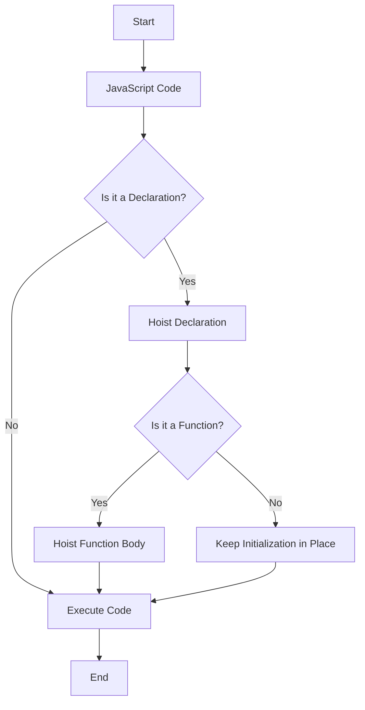

## 4.1. What is Hoisting?

In the world of JavaScript, understanding how the language interprets and executes code is crucial for writing effective and bug-free programs. One of the fundamental concepts that influence code execution is **hoisting**. In this section, we will delve into what hoisting is, how it affects variable and function declarations, and why it's important to grasp this concept as you embark on your journey to mastering JavaScript.

### What is Hoisting?

**Hoisting** is a JavaScript mechanism where variables and function declarations are moved to the top of their containing scope during the compile phase, before the code is executed. This means that no matter where functions and variables are declared in your code, they are moved to the top of their scope, making them accessible throughout the entire scope.

#### Key Points About Hoisting:

- **Declarations are hoisted, not initializations.** This means that while the declaration of a variable or function is moved to the top, the assignment or initialization remains in place.
- **Hoisting applies to both variables and functions.** However, the way they are hoisted differs slightly, as we will see later.
- **JavaScript's execution context** is responsible for hoisting, which occurs during the creation phase of the execution context.

### How Hoisting Affects Variable Declarations

In JavaScript, variables can be declared using `var`, `let`, or `const`. Hoisting behaves differently with each of these keywords.

#### Hoisting with `var`

When you declare a variable using `var`, JavaScript hoists the declaration to the top of its function or global scope. However, the initialization remains in place. Let's look at an example to illustrate this:

```javascript
console.log(myVar); // Output: undefined
var myVar = 5;
console.log(myVar); // Output: 5
```

**Explanation:**

- The declaration `var myVar;` is hoisted to the top of the scope.
- The initialization `myVar = 5;` stays where it is.
- Before the initialization, `myVar` is `undefined`.

#### Hoisting with `let` and `const`

Variables declared with `let` and `const` are also hoisted, but they are not initialized until the code execution reaches the line where they are defined. This leads to a concept known as the **Temporal Dead Zone (TDZ)**, where the variable is in scope but not yet initialized.

```javascript
console.log(myLet); // ReferenceError: Cannot access 'myLet' before initialization
let myLet = 10;
console.log(myLet); // Output: 10
```

**Explanation:**

- The declaration `let myLet;` is hoisted, but it remains uninitialized.
- Accessing `myLet` before its initialization results in a `ReferenceError`.

### How Hoisting Affects Function Declarations

Function declarations are also hoisted in JavaScript, but they behave differently compared to variable declarations. When a function is declared, both the function's name and its body are hoisted to the top of the scope.

#### Example of Function Hoisting

```javascript
console.log(greet()); // Output: Hello, World!

function greet() {
  return "Hello, World!";
}
```

**Explanation:**

- The entire function `greet` is hoisted, including its implementation.
- This allows you to call the function before its actual declaration in the code.

### Visualizing Hoisting

To better understand hoisting, let's visualize how JavaScript interprets the code using a simple flowchart.



**Diagram Description:**

- **Start:** The process begins with JavaScript code.
- **Check Declaration:** JavaScript checks if the line is a declaration.
- **Hoist Declaration:** If it's a declaration, it is hoisted.
- **Function Check:** If it's a function, the entire body is hoisted.
- **Execute Code:** If not a declaration, the code is executed as is.
- **End:** The process concludes.

### Common Misunderstandings About Hoisting

1. **Hoisting Initializations:** A common misconception is that both declarations and initializations are hoisted. Remember, only declarations are hoisted, not initializations.

2. **Order of Execution:** Hoisting does not change the order of execution. It only affects the accessibility of variables and functions within their scope.

3. **TDZ with `let` and `const`:** The Temporal Dead Zone can be confusing, but it's crucial to understand that accessing a `let` or `const` variable before its declaration results in a `ReferenceError`.

### Try It Yourself

Experiment with the following code snippets to see hoisting in action. Try modifying them to deepen your understanding.

```javascript
// Try changing the order of declarations and initializations
console.log(myVar); // What do you expect here?
var myVar = 10;
console.log(myVar); // What do you expect here?

// Experiment with let and const
console.log(myLet); // What happens here?
let myLet = 20;
console.log(myLet); // What do you expect here?
```

### Hoisting in Practice

Understanding hoisting is essential for debugging and writing predictable JavaScript code. It helps you anticipate how your code will behave and avoid common pitfalls.

#### Best Practices to Avoid Hoisting Issues

1. **Declare Variables at the Top:** Always declare variables at the top of their scope to avoid confusion and potential errors.
2. **Use `let` and `const`:** Prefer `let` and `const` over `var` to minimize hoisting-related issues and take advantage of block scoping.
3. **Initialize Variables When Declaring:** Whenever possible, initialize variables at the time of declaration to avoid `undefined` values.

### Further Reading

For more information on hoisting and related concepts, check out these resources:

- [MDN Web Docs on Hoisting](https://developer.mozilla.org/en-US/docs/Glossary/Hoisting)
- [W3Schools JavaScript Hoisting](https://www.w3schools.com/js/js_hoisting.asp)

### Summary

Hoisting is a fundamental concept in JavaScript that affects how variables and functions are declared and accessed. By understanding hoisting, you can write more predictable and error-free code. Remember, only declarations are hoisted, not initializations, and using `let` and `const` can help you avoid many common pitfalls associated with hoisting.

## Quiz Time!



### What is hoisting in JavaScript?

- [x] A mechanism where variable and function declarations are moved to the top of their scope.
- [ ] A process that initializes variables before execution.
- [ ] A feature that allows functions to be executed before they are declared.
- [ ] A method for optimizing code performance.

> **Explanation:** Hoisting is the mechanism where variable and function declarations are moved to the top of their scope during the compile phase.

### Which of the following is true about hoisting?

- [x] Only declarations are hoisted, not initializations.
- [ ] Both declarations and initializations are hoisted.
- [ ] Initializations are hoisted before declarations.
- [ ] Hoisting only applies to variables, not functions.

> **Explanation:** Only the declarations are hoisted, while initializations remain in their original place.

### What happens when you access a `let` variable before its declaration?

- [ ] It returns `undefined`.
- [x] It throws a `ReferenceError`.
- [ ] It returns `null`.
- [ ] It throws a `TypeError`.

> **Explanation:** Accessing a `let` variable before its declaration results in a `ReferenceError` due to the Temporal Dead Zone.

### Which keyword should you prefer to avoid hoisting issues?

- [ ] `var`
- [x] `let`
- [x] `const`
- [ ] `function`

> **Explanation:** Using `let` and `const` helps avoid many hoisting-related issues and provides block scoping.

### What is the Temporal Dead Zone?

- [x] The period between entering a scope and the variable's declaration where the variable cannot be accessed.
- [ ] The time it takes for a variable to initialize.
- [ ] The time between a function call and its execution.
- [ ] The period when a variable is `undefined`.

> **Explanation:** The Temporal Dead Zone is the time between entering a scope and the variable's declaration where it cannot be accessed.

### How are function declarations hoisted?

- [x] Both the function name and its body are hoisted.
- [ ] Only the function name is hoisted.
- [ ] Only the function body is hoisted.
- [ ] Neither the function name nor the body is hoisted.

> **Explanation:** In JavaScript, both the function name and its body are hoisted to the top of their scope.

### What is a common best practice to avoid hoisting issues?

- [x] Declare variables at the top of their scope.
- [ ] Use `var` for all declarations.
- [ ] Initialize variables after using them.
- [ ] Avoid using functions.

> **Explanation:** Declaring variables at the top of their scope helps avoid confusion and potential errors related to hoisting.

### What is the output of the following code?
```javascript
console.log(myVar);
var myVar = 5;
```

- [x] `undefined`
- [ ] `5`
- [ ] `ReferenceError`
- [ ] `null`

> **Explanation:** The variable `myVar` is hoisted, so its declaration is moved to the top, but the initialization remains, resulting in `undefined`.

### What is the output of the following code?
```javascript
console.log(myConst);
const myConst = 10;
```

- [ ] `undefined`
- [ ] `10`
- [x] `ReferenceError`
- [ ] `TypeError`

> **Explanation:** Accessing `myConst` before its declaration results in a `ReferenceError` due to the Temporal Dead Zone.

### True or False: Hoisting changes the order of execution in JavaScript.

- [ ] True
- [x] False

> **Explanation:** Hoisting does not change the order of execution; it only affects the accessibility of variables and functions within their scope.



Remember, this is just the beginning. As you progress, you'll build more complex and interactive web pages. Keep experimenting, stay curious, and enjoy the journey!
