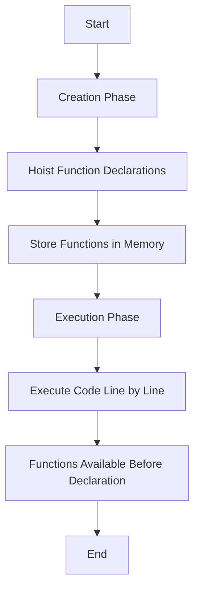

## 4.3. Hoisting of Functions

In the world of JavaScript, understanding how functions are hoisted is crucial for writing effective and bug-free code. Function hoisting allows you to call functions before they are defined in your code, which can be both a powerful feature and a source of confusion for beginners. In this section, we will explore the concept of function hoisting, differentiate between function declarations and expressions, and provide examples to illustrate these concepts.

### Understanding Function Declarations and Expressions

Before diving into hoisting, it's essential to understand the two primary ways to define functions in JavaScript: **function declarations** and **function expressions**.

#### Function Declarations

A function declaration is a straightforward way to define a function. It uses the `function` keyword, followed by the function name, a list of parameters in parentheses, and a block of code enclosed in curly braces. Here's an example:

```javascript
function greet() {
    console.log("Hello, world!");
}
```

Function declarations are hoisted entirely, meaning both the function's name and its implementation are moved to the top of their containing scope during the execution phase. This allows you to call the function before its actual declaration in the code.

#### Function Expressions

A function expression involves defining a function as part of a larger expression, typically by assigning it to a variable. Function expressions can be named or anonymous. Here's an example of an anonymous function expression:

```javascript
const greet = function() {
    console.log("Hello, world!");
};
```

Unlike function declarations, function expressions are not hoisted. This means you cannot call the function before the line where the expression is defined.

### Hoisting of Function Declarations

Function declarations are hoisted to the top of their containing scope, making them accessible before their actual definition in the code. This behavior is one of the unique features of JavaScript and can be quite handy. Let's explore this with an example:

```javascript
// Calling the function before its declaration
greet();

function greet() {
    console.log("Hello, world!");
}
```

In this example, the `greet` function is called before its declaration. Thanks to hoisting, this code works perfectly, and "Hello, world!" is logged to the console.

#### How Function Hoisting Works

To understand how function hoisting works, it's helpful to visualize the process. When JavaScript code is executed, it goes through two phases: the creation phase and the execution phase.

1. **Creation Phase**: During this phase, the JavaScript engine scans the code for function declarations and hoists them to the top of their containing scope. This means the function's name and its implementation are stored in memory before the code runs.

2. **Execution Phase**: In this phase, the code is executed line by line. Since the function declarations have already been hoisted, they can be called even before their original position in the code.

### Function Expressions and Hoisting

Function expressions, unlike function declarations, are not hoisted. This means you cannot call a function expression before it is defined in the code. Let's see an example to illustrate this:

```javascript
// Attempting to call the function expression before its definition
try {
    greet();
} catch (error) {
    console.log(error); // ReferenceError: Cannot access 'greet' before initialization
}

const greet = function() {
    console.log("Hello, world!");
};
```

In this example, trying to call `greet` before its definition results in a `ReferenceError`. This is because the variable `greet` is hoisted, but its assignment (the function expression) is not.

### Key Differences Between Function Declarations and Expressions

To summarize, here are the key differences between function declarations and expressions concerning hoisting:

- **Function Declarations**: The entire function is hoisted, allowing it to be called before its definition.
- **Function Expressions**: Only the variable declaration is hoisted, not the assignment. The function cannot be called before its definition.

### Code Examples and Experiments

Let's explore some additional examples to solidify our understanding of function hoisting.

#### Example 1: Function Declaration Hoisting

```javascript
// Function call before declaration
console.log(add(2, 3)); // Output: 5

function add(a, b) {
    return a + b;
}
```

In this example, the `add` function is called before its declaration, and it works because the function is hoisted.

#### Example 2: Function Expression and Hoisting

```javascript
// Attempting to call the function expression before its definition
try {
    console.log(subtract(5, 2));
} catch (error) {
    console.log(error); // ReferenceError: Cannot access 'subtract' before initialization
}

const subtract = function(a, b) {
    return a - b;
};
```

Here, calling `subtract` before its definition results in an error because function expressions are not hoisted.

### Visualizing Function Hoisting

To better understand how function hoisting works, let's visualize the process using a flowchart.



This flowchart illustrates the two-phase process of hoisting, where function declarations are moved to the top during the creation phase, making them accessible during execution.

### Try It Yourself

Now that we've explored function hoisting, try experimenting with the following code:

1. Create a function declaration and call it before its definition.
2. Create a function expression and try calling it before its definition.
3. Observe the behavior and any errors that occur.

### Knowledge Check

Before we wrap up, let's reinforce what we've learned with a few questions:

1. What is the primary difference between function declarations and expressions concerning hoisting?
2. Can you call a function expression before its definition? Why or why not?
3. What happens during the creation phase of JavaScript execution?

### Conclusion

Understanding function hoisting is a fundamental aspect of mastering JavaScript. By recognizing the differences between function declarations and expressions, you can write more predictable and error-free code. Remember, function declarations are hoisted, allowing you to call them before their definition, while function expressions are not. Keep experimenting and exploring to deepen your understanding of JavaScript's unique features.

## Quiz Time!



### What is function hoisting in JavaScript?

- [x] The process of moving function declarations to the top of their containing scope.
- [ ] The process of executing functions in reverse order.
- [ ] The process of converting functions into variables.
- [ ] The process of removing functions from the code.

> **Explanation:** Function hoisting refers to the process where function declarations are moved to the top of their containing scope during the creation phase, making them accessible before their definition.

### Which of the following is hoisted in JavaScript?

- [x] Function declarations
- [ ] Function expressions
- [ ] Both function declarations and expressions
- [ ] Neither function declarations nor expressions

> **Explanation:** Only function declarations are hoisted in JavaScript, allowing them to be called before their definition.

### What error occurs when calling a function expression before its definition?

- [x] ReferenceError
- [ ] SyntaxError
- [ ] TypeError
- [ ] RangeError

> **Explanation:** A ReferenceError occurs when trying to call a function expression before its definition because the variable is hoisted, but not the function assignment.

### How are function declarations hoisted?

- [x] Both the function's name and implementation are hoisted.
- [ ] Only the function's name is hoisted.
- [ ] Only the function's implementation is hoisted.
- [ ] Neither the function's name nor implementation is hoisted.

> **Explanation:** In function declarations, both the function's name and implementation are hoisted, allowing the function to be called before its definition.

### Can a function expression be called before its definition?

- [ ] Yes, because function expressions are hoisted.
- [x] No, because only the variable declaration is hoisted, not the function assignment.
- [ ] Yes, because the function is stored in memory.
- [ ] No, because JavaScript does not support function expressions.

> **Explanation:** Function expressions cannot be called before their definition because only the variable declaration is hoisted, not the function assignment.

### What phase comes before the execution phase in JavaScript?

- [x] Creation Phase
- [ ] Compilation Phase
- [ ] Evaluation Phase
- [ ] Initialization Phase

> **Explanation:** The creation phase comes before the execution phase, during which function declarations are hoisted.

### Which of the following is true about function expressions?

- [ ] They are hoisted like function declarations.
- [x] They are not hoisted, only the variable declaration is.
- [ ] They can be called before their definition.
- [ ] They are stored in a separate memory space.

> **Explanation:** Function expressions are not hoisted; only the variable declaration is hoisted, not the function assignment.

### What is the result of calling a function declaration before its definition?

- [x] The function executes successfully.
- [ ] A ReferenceError occurs.
- [ ] A SyntaxError occurs.
- [ ] The function returns `undefined`.

> **Explanation:** Calling a function declaration before its definition executes successfully due to hoisting.

### Which of the following is a correct function declaration?

- [x] `function greet() { console.log("Hello"); }`
- [ ] `const greet = function() { console.log("Hello"); };`
- [ ] `let greet = () => { console.log("Hello"); };`
- [ ] `var greet = function greet() { console.log("Hello"); };`

> **Explanation:** `function greet() { console.log("Hello"); }` is a correct function declaration, which is hoisted.

### True or False: Function expressions are hoisted in JavaScript.

- [ ] True
- [x] False

> **Explanation:** False. Function expressions are not hoisted; only the variable declaration is hoisted, not the function assignment.



Remember, this is just the beginning. As you progress, you'll build more complex and interactive web pages. Keep experimenting, stay curious, and enjoy the journey!
