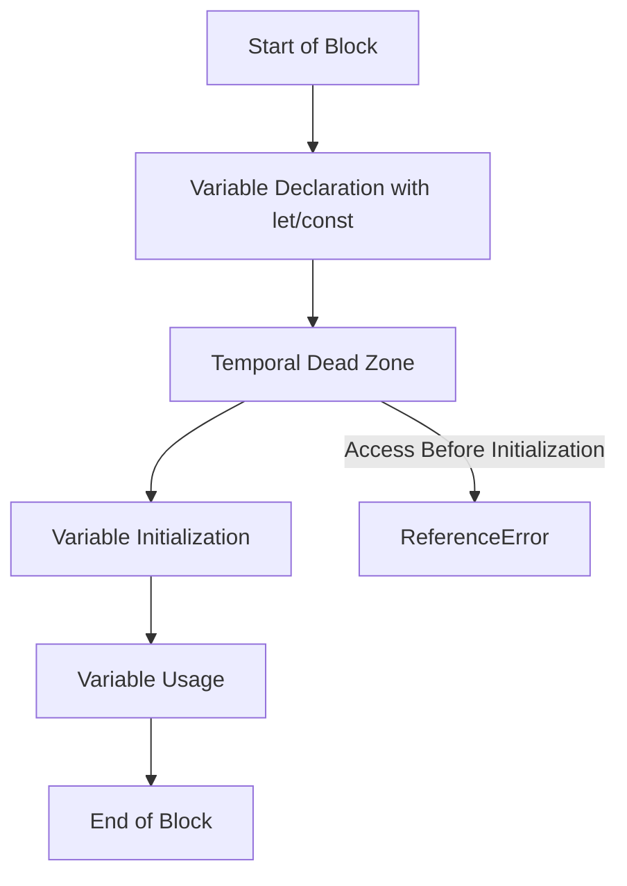

## 4.4. Hoisting of `let` and `const`

In JavaScript, understanding how variables are hoisted is crucial for writing predictable and bug-free code. In this section, we will delve into the specifics of how hoisting works with `let` and `const`, two keywords introduced in ECMAScript 2015 (ES6) that provide block-level scoping. We will also explore the concept of the Temporal Dead Zone (TDZ) and discuss best practices for variable declaration.

### Understanding Hoisting

Before we dive into `let` and `const`, let's briefly revisit the concept of hoisting. In JavaScript, hoisting is the behavior where variable and function declarations are moved to the top of their containing scope during the compile phase. This means you can use variables and functions before they are declared in the code.

However, hoisting behaves differently for `let` and `const` compared to `var`. While `var` declarations are hoisted and initialized with `undefined`, `let` and `const` are hoisted but not initialized. This distinction is critical for understanding their behavior.

### Hoisting of `let` and `const`

When you declare a variable using `let` or `const`, the declaration is hoisted to the top of its block scope. However, unlike `var`, these variables are not initialized until the code execution reaches the line where they are defined. This means that accessing them before their declaration results in a `ReferenceError`.

#### The Temporal Dead Zone (TDZ)

The period between the start of the block and the actual declaration of the variable is known as the Temporal Dead Zone (TDZ). During this time, the variable exists in the scope but cannot be accessed. Attempting to do so will result in a `ReferenceError`.

**Example of Temporal Dead Zone:**

```javascript
console.log(myVar); // ReferenceError: Cannot access 'myVar' before initialization
let myVar = 10;
```

In the example above, `myVar` is in the TDZ from the start of the block until the `let myVar = 10;` line is executed. Attempting to access `myVar` before this line results in a `ReferenceError`.

#### Why the TDZ Exists

The TDZ exists to prevent accidental use of variables before they are properly initialized. This helps catch errors early in the development process and ensures that variables are used in a predictable manner.

### Hoisting Behavior with `let` and `const`

Let's explore some examples to understand the hoisting behavior of `let` and `const`.

**Example 1: Hoisting with `let`**

```javascript
function exampleLet() {
    console.log(a); // ReferenceError: Cannot access 'a' before initialization
    let a = 5;
    console.log(a); // 5
}

exampleLet();
```

In this example, the variable `a` is hoisted to the top of the `exampleLet` function's block scope. However, it is not initialized until the `let a = 5;` line is executed. Therefore, the first `console.log(a);` results in a `ReferenceError`.

**Example 2: Hoisting with `const`**

```javascript
function exampleConst() {
    console.log(b); // ReferenceError: Cannot access 'b' before initialization
    const b = 10;
    console.log(b); // 10
}

exampleConst();
```

Similarly, in this example, the variable `b` is hoisted but not initialized until the `const b = 10;` line. Accessing `b` before this line results in a `ReferenceError`.

### Best Practices for Using `let` and `const`

To avoid issues related to hoisting and the TDZ, it's important to follow best practices when using `let` and `const`.

1. **Declare Variables at the Top of Their Scope:**

   Always declare variables at the top of their scope to avoid confusion and potential errors related to the TDZ.

   ```javascript
   function calculateArea(radius) {
       const pi = 3.14159;
       let area = pi * radius * radius;
       return area;
   }
   ```

2. **Use `const` by Default:**

   Use `const` for variables that should not be reassigned. This makes your code more predictable and easier to understand.

   ```javascript
   const maxUsers = 100;
   ```

3. **Use `let` for Reassignable Variables:**

   Use `let` for variables that need to be reassigned. This makes it clear which variables are meant to change.

   ```javascript
   let counter = 0;
   counter++;
   ```

4. **Avoid Using `var`:**

   Prefer `let` and `const` over `var` to take advantage of block scoping and avoid hoisting issues.

### Visualizing Hoisting and the Temporal Dead Zone

To better understand the concept of hoisting and the TDZ, let's visualize the process using a flowchart.



**Diagram Explanation:**

- The flowchart illustrates the lifecycle of a variable declared with `let` or `const`.
- The variable is declared at the start of the block but remains in the TDZ until it is initialized.
- Accessing the variable during the TDZ results in a `ReferenceError`.
- Once initialized, the variable can be used until the end of the block.

### Common Pitfalls and How to Avoid Them

Understanding the hoisting behavior of `let` and `const` can help you avoid common pitfalls in JavaScript programming.

1. **Accessing Variables Before Declaration:**

   Always declare variables before using them to avoid `ReferenceError`.

   ```javascript
   let userName = "John";
   console.log(userName); // John
   ```

2. **Misunderstanding the TDZ:**

   Be aware of the TDZ and ensure variables are initialized before use.

   ```javascript
   if (true) {
       console.log(value); // ReferenceError
       let value = 42;
   }
   ```

3. **Reassigning `const` Variables:**

   Remember that `const` variables cannot be reassigned. Attempting to do so will result in a `TypeError`.

   ```javascript
   const maxLimit = 100;
   // maxLimit = 200; // TypeError: Assignment to constant variable.
   ```

### Try It Yourself

To solidify your understanding of hoisting and the TDZ, try modifying the following code examples:

1. **Experiment with Different Scopes:**

   - Move the `let` and `const` declarations to different parts of the code and observe the behavior.
   - Try declaring variables inside loops or conditional blocks.

2. **Test with Functions:**

   - Declare variables with `let` and `const` inside functions and see how hoisting affects them.
   - Try accessing variables before and after their declaration within the function.

3. **Play with the TDZ:**

   - Intentionally access variables in the TDZ to see the `ReferenceError`.
   - Experiment with different block structures to understand the TDZ better.

### Additional Resources

For further reading on hoisting and the Temporal Dead Zone, consider exploring the following resources:

- [MDN Web Docs: let](https://developer.mozilla.org/en-US/docs/Web/JavaScript/Reference/Statements/let)
- [MDN Web Docs: const](https://developer.mozilla.org/en-US/docs/Web/JavaScript/Reference/Statements/const)
- [JavaScript.info: Variable scope, closure](https://javascript.info/closure)

### Knowledge Check

Before moving on, let's summarize the key takeaways from this section:

- `let` and `const` declarations are hoisted but not initialized, leading to the Temporal Dead Zone.
- Accessing a variable in the TDZ results in a `ReferenceError`.
- Declare variables at the top of their scope to avoid TDZ-related issues.
- Use `const` for variables that should not be reassigned and `let` for those that can be.

### Embrace the Journey

Remember, mastering JavaScript takes time and practice. Understanding hoisting and the TDZ is a significant step toward writing robust and error-free code. Keep experimenting, stay curious, and enjoy the journey!

## Quiz Time!



### What happens when you try to access a `let` variable before it's declared?

- [x] ReferenceError
- [ ] TypeError
- [ ] SyntaxError
- [ ] No error, it returns `undefined`

> **Explanation:** Accessing a `let` variable before its declaration results in a `ReferenceError` due to the Temporal Dead Zone.

### What is the Temporal Dead Zone?

- [x] The period between the start of the block and the variable's initialization
- [ ] The time when a variable is declared but not yet used
- [ ] The time when a variable is initialized but not yet declared
- [ ] The time when a variable is declared and initialized

> **Explanation:** The Temporal Dead Zone is the period between the start of the block and the variable's initialization, during which accessing the variable results in a `ReferenceError`.

### Which keyword should you use for variables that should not be reassigned?

- [x] const
- [ ] let
- [ ] var
- [ ] function

> **Explanation:** Use `const` for variables that should not be reassigned, as it enforces immutability.

### What is the main advantage of using `let` and `const` over `var`?

- [x] Block-level scoping
- [ ] Function-level scoping
- [ ] Global scoping
- [ ] No scoping

> **Explanation:** `let` and `const` provide block-level scoping, which helps avoid issues related to hoisting and scope pollution.

### What error occurs when you try to reassign a `const` variable?

- [x] TypeError
- [ ] ReferenceError
- [ ] SyntaxError
- [ ] RangeError

> **Explanation:** Reassigning a `const` variable results in a `TypeError` because `const` variables are immutable.

### What is hoisting?

- [x] The process of moving variable and function declarations to the top of their scope
- [ ] The process of executing code from top to bottom
- [ ] The process of initializing variables before declaration
- [ ] The process of declaring variables without initialization

> **Explanation:** Hoisting is the process of moving variable and function declarations to the top of their scope during the compile phase.

### How can you avoid issues related to the Temporal Dead Zone?

- [x] Declare variables at the top of their scope
- [ ] Use `var` instead of `let` or `const`
- [ ] Avoid using functions
- [ ] Declare variables outside of any block

> **Explanation:** Declaring variables at the top of their scope helps avoid issues related to the Temporal Dead Zone.

### What happens if you try to access a `const` variable before it's declared?

- [x] ReferenceError
- [ ] TypeError
- [ ] SyntaxError
- [ ] No error, it returns `undefined`

> **Explanation:** Accessing a `const` variable before its declaration results in a `ReferenceError` due to the Temporal Dead Zone.

### Which of the following is a best practice when using `let` and `const`?

- [x] Declare variables at the top of their scope
- [ ] Use `var` for all variables
- [ ] Declare variables at the bottom of their scope
- [ ] Avoid using `let` and `const`

> **Explanation:** Declaring variables at the top of their scope is a best practice to avoid issues related to hoisting and the Temporal Dead Zone.

### True or False: `let` and `const` variables are initialized with `undefined` during hoisting.

- [ ] True
- [x] False

> **Explanation:** `let` and `const` variables are hoisted but not initialized during hoisting, leading to the Temporal Dead Zone.




