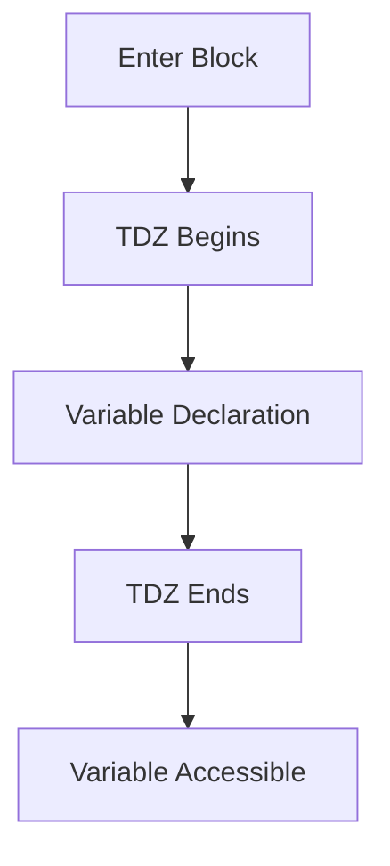

## 4.5. The Temporal Dead Zone Explained

In JavaScript, understanding how variables are declared and accessed is crucial for writing efficient and error-free code. One of the concepts that play a significant role in this process is the Temporal Dead Zone (TDZ). In this section, we will delve into what the TDZ is, why it exists, and how it affects your code. We will also provide examples to illustrate its impact and discuss how it can help catch errors early in the development process.

### What is the Temporal Dead Zone?

The Temporal Dead Zone (TDZ) is a behavior in JavaScript that occurs when a variable is declared using `let` or `const` but is accessed before its declaration is fully executed. During this period, the variable is in a "dead zone," and any attempt to access it will result in a `ReferenceError`.

To put it simply, the TDZ is the time between entering a block of code and the point where the variable is declared and initialized. During this time, the variable cannot be accessed or used.

### Why Does the Temporal Dead Zone Exist?

The TDZ exists to enforce a more predictable and safer coding environment. Here are some reasons why it is beneficial:

1. **Error Prevention**: By throwing a `ReferenceError` when a variable is accessed before its declaration, the TDZ helps prevent bugs that could arise from using uninitialized variables.

2. **Encourages Proper Declaration**: It encourages developers to declare variables at the beginning of their block or scope, promoting cleaner and more organized code.

3. **Consistency with Block Scope**: The TDZ aligns with the block-scoping behavior of `let` and `const`, ensuring that variables are only accessible within their defined scope.

### Code Examples Illustrating the Temporal Dead Zone

Let's explore some code examples to understand how the TDZ works in practice.

#### Example 1: Accessing a Variable Before Declaration

```javascript
console.log(myVar); // ReferenceError: Cannot access 'myVar' before initialization
let myVar = 10;
```

In this example, we attempt to log `myVar` to the console before it is declared with `let`. This results in a `ReferenceError` because `myVar` is in the TDZ until the declaration is reached.

#### Example 2: Proper Declaration and Access

```javascript
let myVar = 10;
console.log(myVar); // Outputs: 10
```

Here, `myVar` is declared before it is accessed, so there is no error, and the value `10` is successfully logged to the console.

#### Example 3: TDZ with `const`

```javascript
console.log(myConst); // ReferenceError: Cannot access 'myConst' before initialization
const myConst = 20;
```

The TDZ also applies to variables declared with `const`. In this example, attempting to access `myConst` before its declaration results in a `ReferenceError`.

#### Example 4: TDZ in a Block Scope

```javascript
{
    console.log(blockVar); // ReferenceError: Cannot access 'blockVar' before initialization
    let blockVar = 30;
}
```

In this block-scoped example, `blockVar` is in the TDZ until its declaration is encountered. Accessing it before this point results in a `ReferenceError`.

### How TDZ Helps Catch Errors

The TDZ is a valuable feature for catching errors early in the development process. By enforcing strict rules about variable access, it helps developers identify and fix issues related to uninitialized variables. This can lead to more robust and reliable code.

#### Example 5: Preventing Unintended Behavior

```javascript
function calculateTotal(price) {
    console.log(discount); // ReferenceError: Cannot access 'discount' before initialization
    let discount = price * 0.1;
    return price - discount;
}

calculateTotal(100);
```

In this function, attempting to log `discount` before its declaration results in a `ReferenceError`. Without the TDZ, this could lead to unintended behavior, such as using an undefined variable in calculations.

### Visualizing the Temporal Dead Zone

To further illustrate the concept of the TDZ, let's use a diagram to visualize the timeline of variable access and declaration.



**Diagram Description**: This diagram shows the timeline of a variable in the TDZ. The TDZ begins when the block is entered and ends when the variable is declared. After the declaration, the variable becomes accessible.

### Try It Yourself

To better understand the TDZ, try modifying the examples above. Experiment with different scenarios, such as moving the declaration to different parts of the code or using `var` instead of `let` or `const`. Observe how the behavior changes and how the TDZ affects variable access.

### Conclusion

The Temporal Dead Zone is an essential concept in JavaScript that helps enforce proper variable declaration and access. By understanding how the TDZ works, you can write more predictable and error-free code. Remember, the TDZ is there to help you catch errors early and ensure that your variables are used correctly within their intended scope.

### Key Takeaways

- The TDZ is the period between entering a block and the execution of a variable's declaration.
- It applies to variables declared with `let` and `const`.
- Accessing a variable in the TDZ results in a `ReferenceError`.
- The TDZ encourages proper variable declaration and helps prevent bugs.

### References and Further Reading

- [MDN Web Docs: let](https://developer.mozilla.org/en-US/docs/Web/JavaScript/Reference/Statements/let)
- [MDN Web Docs: const](https://developer.mozilla.org/en-US/docs/Web/JavaScript/Reference/Statements/const)
- [JavaScript Info: Variables](https://javascript.info/variables)

## Quiz Time!



### What is the Temporal Dead Zone (TDZ)?

- [x] The period between entering a block and the execution of a variable's declaration.
- [ ] The time when a variable is declared and initialized.
- [ ] The time when a variable is accessible after declaration.
- [ ] The period when a variable is not used in a program.

> **Explanation:** The TDZ is the period between entering a block and the execution of a variable's declaration, during which the variable cannot be accessed.

### Which variable declarations are affected by the TDZ?

- [x] let
- [x] const
- [ ] var
- [ ] function

> **Explanation:** The TDZ applies to variables declared with `let` and `const`, not `var`.

### What happens if you access a variable in the TDZ?

- [x] A ReferenceError is thrown.
- [ ] The variable is initialized to `undefined`.
- [ ] The variable is initialized to `null`.
- [ ] The variable is accessible with its declared value.

> **Explanation:** Accessing a variable in the TDZ results in a `ReferenceError`.

### Why does the TDZ exist?

- [x] To prevent bugs from using uninitialized variables.
- [ ] To allow variables to be accessed before declaration.
- [ ] To make variables globally accessible.
- [ ] To initialize variables to `undefined`.

> **Explanation:** The TDZ prevents bugs by ensuring variables are not accessed before they are initialized.

### How does the TDZ encourage proper coding practices?

- [x] By enforcing variable declaration before access.
- [ ] By allowing variables to be used anywhere in the code.
- [ ] By initializing all variables to `null`.
- [ ] By making variables globally accessible.

> **Explanation:** The TDZ encourages developers to declare variables before accessing them, promoting cleaner code.

### Can a variable declared with `var` be in the TDZ?

- [ ] Yes
- [x] No

> **Explanation:** Variables declared with `var` are not affected by the TDZ; they are hoisted and initialized to `undefined`.

### What error is thrown when accessing a variable in the TDZ?

- [x] ReferenceError
- [ ] TypeError
- [ ] SyntaxError
- [ ] RangeError

> **Explanation:** A `ReferenceError` is thrown when accessing a variable in the TDZ.

### How does the TDZ relate to block scope?

- [x] It ensures variables are only accessible within their defined block.
- [ ] It allows variables to be accessed outside their block.
- [ ] It makes variables globally accessible.
- [ ] It initializes variables to `undefined`.

> **Explanation:** The TDZ aligns with block scope by ensuring variables are only accessible within their defined block.

### What is the benefit of the TDZ?

- [x] It helps catch errors early in development.
- [ ] It allows variables to be accessed before declaration.
- [ ] It makes variables globally accessible.
- [ ] It initializes variables to `null`.

> **Explanation:** The TDZ helps catch errors early by preventing access to uninitialized variables.

### Is the TDZ applicable to function declarations?

- [ ] True
- [x] False

> **Explanation:** The TDZ is not applicable to function declarations; it only affects `let` and `const` variable declarations.


