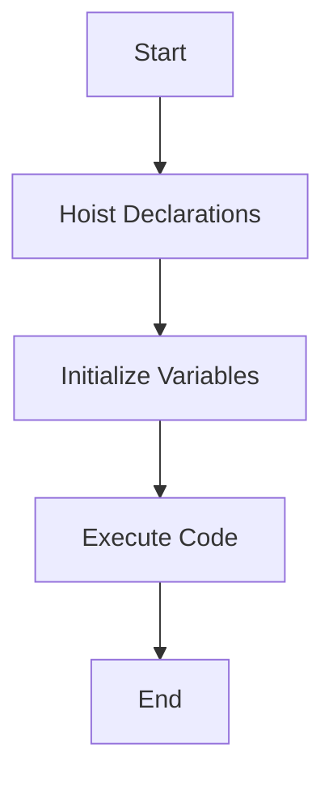

## 4.6. Practical Examples of Hoisting

In this section, we will explore the concept of hoisting in JavaScript through practical examples. Hoisting is a fundamental aspect of JavaScript that can often lead to confusion for beginners. By the end of this section, you will have a clearer understanding of how hoisting works and how it affects the behavior of your code.

### Understanding Hoisting

Before we dive into examples, let's briefly recap what hoisting is. In JavaScript, hoisting is the behavior where variable and function declarations are moved to the top of their containing scope during the compilation phase. This means that you can use variables and functions before they are declared in your code, although this can lead to unexpected results if not understood properly.

### Variable Hoisting

#### Example 1: Hoisting with `var`

Let's start with a simple example using the `var` keyword:

```javascript
console.log(myVar); // Output: undefined
var myVar = 5;
console.log(myVar); // Output: 5
```

**Predict the Output:** Before running the code, try to predict what the output will be.

**Explanation:** In this example, the declaration of `myVar` is hoisted to the top of the scope, but its assignment (`myVar = 5`) is not. Therefore, when we first log `myVar`, it is `undefined` because the assignment hasn't occurred yet. After the assignment, `myVar` holds the value `5`.

#### Example 2: Hoisting with `let` and `const`

Now, let's see how `let` and `const` behave:

```javascript
console.log(myLet); // ReferenceError: Cannot access 'myLet' before initialization
let myLet = 10;

console.log(myConst); // ReferenceError: Cannot access 'myConst' before initialization
const myConst = 15;
```

**Predict the Output:** What do you think will happen when this code runs?

**Explanation:** Unlike `var`, `let` and `const` are hoisted but not initialized. This means they exist in a "temporal dead zone" from the start of the block until the declaration is encountered. Attempting to access them before their declaration results in a `ReferenceError`.

### Function Hoisting

#### Example 3: Function Declaration Hoisting

Functions declared using the `function` keyword are fully hoisted:

```javascript
sayHello(); // Output: Hello, World!

function sayHello() {
  console.log("Hello, World!");
}
```

**Predict the Output:** Can you guess what this code will output?

**Explanation:** The entire function declaration is hoisted to the top of the scope, allowing us to call `sayHello` before its actual declaration in the code.

#### Example 4: Function Expression Hoisting

Function expressions behave differently:

```javascript
sayGoodbye(); // TypeError: sayGoodbye is not a function

var sayGoodbye = function() {
  console.log("Goodbye, World!");
};
```

**Predict the Output:** What do you expect to happen here?

**Explanation:** In this case, the variable `sayGoodbye` is hoisted, but it is initialized to `undefined`. Therefore, calling it before the function expression is assigned results in a `TypeError`.

### Try It Yourself

Experiment with the following code snippets to deepen your understanding of hoisting. Try modifying the examples and predicting the outcomes:

```javascript
// Modify the order of declarations and assignments
console.log(a);
var a = 20;
console.log(a);

console.log(b);
let b = 30;
console.log(b);

console.log(c);
const c = 40;
console.log(c);
```

### Visualizing Hoisting

To better understand hoisting, let's visualize how JavaScript processes the code:



**Diagram Explanation:** This flowchart illustrates the process of hoisting in JavaScript. First, declarations are hoisted, then variables are initialized, and finally, the code is executed.

### Common Pitfalls and Best Practices

#### Avoiding Hoisting Issues

- **Declare Variables at the Top:** To avoid confusion, always declare your variables at the top of their scope.
- **Use `let` and `const`:** Prefer `let` and `const` over `var` to prevent accidental hoisting issues and to take advantage of block scoping.
- **Understand Temporal Dead Zone:** Be aware of the temporal dead zone when using `let` and `const`.

### Knowledge Check

Let's reinforce what we've learned with a few questions:

1. What is hoisting in JavaScript?
2. How does hoisting affect variables declared with `var`?
3. What happens when you try to access a `let` variable before its declaration?
4. How are function declarations hoisted compared to function expressions?

### Embrace the Journey

Remember, understanding hoisting is a crucial step in mastering JavaScript. As you continue to learn, you'll encounter more complex scenarios where hoisting plays a role. Keep experimenting, stay curious, and enjoy the journey!

### References and Links

For further reading on hoisting, check out the following resources:

- [MDN Web Docs: Hoisting](https://developer.mozilla.org/en-US/docs/Glossary/Hoisting)
- [W3Schools: JavaScript Hoisting](https://www.w3schools.com/js/js_hoisting.asp)

## Quiz Time!



### What is hoisting in JavaScript?

- [x] The behavior of moving declarations to the top of their containing scope.
- [ ] The process of initializing variables at the start of the program.
- [ ] The action of executing code before it is declared.
- [ ] The method of optimizing code for performance.

> **Explanation:** Hoisting is the behavior where variable and function declarations are moved to the top of their containing scope during the compilation phase.

### What is the output of the following code?
```javascript
console.log(myVar);
var myVar = 5;
console.log(myVar);
```

- [x] undefined, 5
- [ ] 5, 5
- [ ] ReferenceError, 5
- [ ] 0, 5

> **Explanation:** The declaration of `myVar` is hoisted, so the first `console.log` outputs `undefined`. After the assignment, `myVar` holds the value `5`.

### How does `let` behave during hoisting?

- [ ] It is not hoisted at all.
- [x] It is hoisted but not initialized, leading to a temporal dead zone.
- [ ] It is hoisted and initialized to `undefined`.
- [ ] It is hoisted and initialized to `null`.

> **Explanation:** `let` is hoisted but not initialized, which means it exists in a temporal dead zone until the declaration is encountered.

### What is the output of the following code?
```javascript
sayHello();

function sayHello() {
  console.log("Hello, World!");
}
```

- [x] Hello, World!
- [ ] TypeError
- [ ] ReferenceError
- [ ] undefined

> **Explanation:** Function declarations are fully hoisted, so `sayHello` can be called before its declaration.

### What happens when you access a `const` variable before its declaration?

- [ ] It returns `undefined`.
- [ ] It returns `null`.
- [x] It throws a `ReferenceError`.
- [ ] It returns the default value.

> **Explanation:** Accessing a `const` variable before its declaration results in a `ReferenceError` due to the temporal dead zone.

### Which keyword should you prefer to avoid hoisting issues?

- [ ] var
- [x] let
- [x] const
- [ ] function

> **Explanation:** Prefer `let` and `const` over `var` to prevent accidental hoisting issues and to take advantage of block scoping.

### What is the output of the following code?
```javascript
sayGoodbye();

var sayGoodbye = function() {
  console.log("Goodbye, World!");
};
```

- [ ] Goodbye, World!
- [x] TypeError
- [ ] ReferenceError
- [ ] undefined

> **Explanation:** The variable `sayGoodbye` is hoisted, but it is initialized to `undefined`. Calling it before the function expression is assigned results in a `TypeError`.

### How are function expressions hoisted compared to function declarations?

- [ ] Both are fully hoisted.
- [x] Only the variable is hoisted, not the function body.
- [ ] Neither is hoisted.
- [ ] Only the function body is hoisted.

> **Explanation:** In function expressions, only the variable is hoisted, not the function body.

### What is the temporal dead zone?

- [x] The period between the start of a block and the declaration of a `let` or `const` variable.
- [ ] The time it takes for a variable to be initialized.
- [ ] The phase when a function is being executed.
- [ ] The duration a variable remains in memory.

> **Explanation:** The temporal dead zone is the period between the start of a block and the declaration of a `let` or `const` variable.

### True or False: `var` declarations are initialized to `undefined` when hoisted.

- [x] True
- [ ] False

> **Explanation:** `var` declarations are hoisted and initialized to `undefined`, which is why they can be accessed before their assignment.


