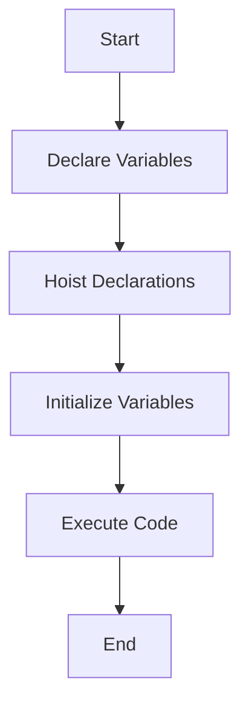

## 4.7. Avoiding Hoisting Issues

In this section, we'll explore strategies to prevent common problems associated with hoisting in JavaScript. Hoisting is a JavaScript mechanism where variable and function declarations are moved to the top of their containing scope during the compile phase. While this behavior can be convenient, it can also lead to unexpected results if not understood properly. Let's dive into how you can write clear and predictable code by avoiding hoisting pitfalls.

### Understanding Hoisting

Before we discuss how to avoid hoisting issues, let's briefly recap what hoisting is. In JavaScript, both variable and function declarations are hoisted to the top of their containing scope. This means that you can use a variable or function before you declare it in your code. However, only the declarations are hoisted, not the initializations.

#### Example of Hoisting

```javascript
console.log(myVar); // Output: undefined
var myVar = 5;
console.log(myVar); // Output: 5
```

In this example, `myVar` is hoisted to the top of its scope, but its assignment (`myVar = 5`) is not. Therefore, the first `console.log` outputs `undefined`.

### Strategies to Avoid Hoisting Issues

#### 1. Declare Variables at the Beginning of Their Scope

One of the simplest ways to avoid hoisting issues is to declare all your variables at the beginning of their scope. This makes it clear to anyone reading your code where variables are declared and helps prevent confusion.

**Example:**

```javascript
function exampleFunction() {
    var myVar;
    console.log(myVar); // Output: undefined
    myVar = 5;
    console.log(myVar); // Output: 5
}
```

By declaring `myVar` at the beginning, we make the code more predictable and easier to read.

#### 2. Use `let` and `const` Instead of `var`

The `let` and `const` keywords, introduced in ES6, provide block-level scoping, which reduces the risk of hoisting-related issues. Unlike `var`, variables declared with `let` and `const` are not initialized until their definition is evaluated. This means they are not accessible before they are declared, preventing the common pitfalls associated with hoisting.

**Example:**

```javascript
console.log(myLet); // ReferenceError: Cannot access 'myLet' before initialization
let myLet = 10;
console.log(myLet); // Output: 10
```

Using `let` or `const` helps you avoid the "undefined" issue that occurs with `var`.

#### 3. Avoid Relying on Hoisting for Code Functionality

Relying on hoisting can lead to code that is difficult to understand and maintain. Instead, write your code as if hoisting does not exist. This means always declaring variables and functions before you use them.

**Example:**

```javascript
// Avoid this
function hoistedFunction() {
    console.log(myVar); // Output: undefined
    var myVar = 10;
}

// Prefer this
function nonHoistedFunction() {
    var myVar = 10;
    console.log(myVar); // Output: 10
}
```

By declaring `myVar` before using it, the intention of the code is clearer.

### Tips for Writing Clear and Predictable Code

1. **Use Descriptive Variable Names**: This makes your code easier to read and understand. Avoid single-letter variable names unless they are commonly understood (e.g., `i` for loop counters).

2. **Consistent Coding Style**: Adopt a consistent style for variable declarations and assignments. This includes using the same keyword (`let`, `const`, or `var`) throughout your codebase.

3. **Avoid Global Variables**: Minimize the use of global variables to reduce the risk of variable name collisions and unintended side effects.

4. **Use Strict Mode**: Enabling strict mode (`'use strict';`) at the beginning of your scripts can help catch common coding mistakes and unsafe actions, such as using undeclared variables.

5. **Comment Your Code**: Use comments to explain complex logic or the purpose of certain variables. This is especially helpful for others reading your code or when you return to your code after some time.

6. **Break Down Complex Functions**: If a function is doing too much, break it down into smaller, more manageable functions. This makes your code easier to understand and test.

### Visualizing Hoisting

To better understand how hoisting works, let's visualize the process using a flowchart.



**Caption**: This flowchart represents the process of hoisting in JavaScript. First, variables are declared, then declarations are hoisted, followed by variable initialization, and finally, the code is executed.

### Try It Yourself

Experiment with the following code snippets to see how hoisting works in practice. Try modifying the code to use `let` and `const` and observe the differences.

```javascript
// Example 1: Using var
function testVar() {
    console.log(a); // Output: undefined
    var a = 1;
    console.log(a); // Output: 1
}

// Example 2: Using let
function testLet() {
    console.log(b); // ReferenceError: Cannot access 'b' before initialization
    let b = 2;
    console.log(b); // Output: 2
}

testVar();
testLet();
```

### Knowledge Check

- **Question**: What is hoisting in JavaScript?
  - **Answer**: Hoisting is the process where variable and function declarations are moved to the top of their containing scope during the compile phase.

- **Question**: How can you avoid hoisting issues?
  - **Answer**: Declare variables at the beginning of their scope, use `let` and `const`, and avoid relying on hoisting for code functionality.

### References and Links

For further reading on hoisting and best practices in JavaScript, consider the following resources:

- [MDN Web Docs: Hoisting](https://developer.mozilla.org/en-US/docs/Glossary/Hoisting)
- [W3Schools: JavaScript Hoisting](https://www.w3schools.com/js/js_hoisting.asp)

### Embrace the Journey

Remember, understanding hoisting is just one step in mastering JavaScript. As you continue to learn, you'll encounter more complex topics and challenges. Keep experimenting, stay curious, and enjoy the journey!

## Quiz Time!



### What is hoisting in JavaScript?

- [x] The process where variable and function declarations are moved to the top of their containing scope during the compile phase.
- [ ] The process of initializing variables at the start of the program.
- [ ] The process of executing code line by line.
- [ ] The process of declaring variables at the end of their scope.

> **Explanation:** Hoisting is a JavaScript mechanism where variable and function declarations are moved to the top of their containing scope during the compile phase.

### Which keyword should you use to avoid hoisting issues?

- [x] let
- [x] const
- [ ] var
- [ ] function

> **Explanation:** Using `let` and `const` helps avoid hoisting issues because they provide block-level scoping and are not initialized until their definition is evaluated.

### What happens when you try to access a `let` variable before its declaration?

- [x] ReferenceError
- [ ] undefined
- [ ] null
- [ ] NaN

> **Explanation:** Accessing a `let` variable before its declaration results in a ReferenceError because it is not initialized until its definition is evaluated.

### What is the best practice for declaring variables to avoid hoisting issues?

- [x] Declare variables at the beginning of their scope.
- [ ] Declare variables at the end of their scope.
- [ ] Declare variables in the middle of their scope.
- [ ] Declare variables outside of their scope.

> **Explanation:** Declaring variables at the beginning of their scope helps avoid hoisting issues and makes the code more predictable and easier to read.

### What should you avoid relying on for code functionality?

- [x] Hoisting
- [ ] Initialization
- [ ] Execution
- [ ] Declaration

> **Explanation:** Avoid relying on hoisting for code functionality as it can lead to code that is difficult to understand and maintain.

### What is the output of the following code snippet?
```javascript
console.log(a);
var a = 5;
```

- [x] undefined
- [ ] 5
- [ ] ReferenceError
- [ ] null

> **Explanation:** The output is `undefined` because the declaration of `a` is hoisted, but its initialization is not.

### What is the output of the following code snippet?
```javascript
console.log(b);
let b = 10;
```

- [x] ReferenceError
- [ ] 10
- [ ] undefined
- [ ] null

> **Explanation:** The output is a ReferenceError because `let` variables are not accessible before they are declared.

### Which of the following is a benefit of using `let` and `const`?

- [x] Block-level scoping
- [x] Prevents hoisting issues
- [ ] Global scoping
- [ ] Automatic initialization

> **Explanation:** `let` and `const` provide block-level scoping and prevent hoisting issues by not initializing variables until their definition is evaluated.

### What is a common mistake when using `var`?

- [x] Assuming variables are initialized before their declaration
- [ ] Declaring variables at the beginning of their scope
- [ ] Using descriptive variable names
- [ ] Using consistent coding style

> **Explanation:** A common mistake with `var` is assuming variables are initialized before their declaration, which can lead to unexpected results due to hoisting.

### True or False: Hoisting moves both variable declarations and initializations to the top of their scope.

- [x] False
- [ ] True

> **Explanation:** False. Hoisting only moves variable declarations to the top of their scope, not the initializations.




