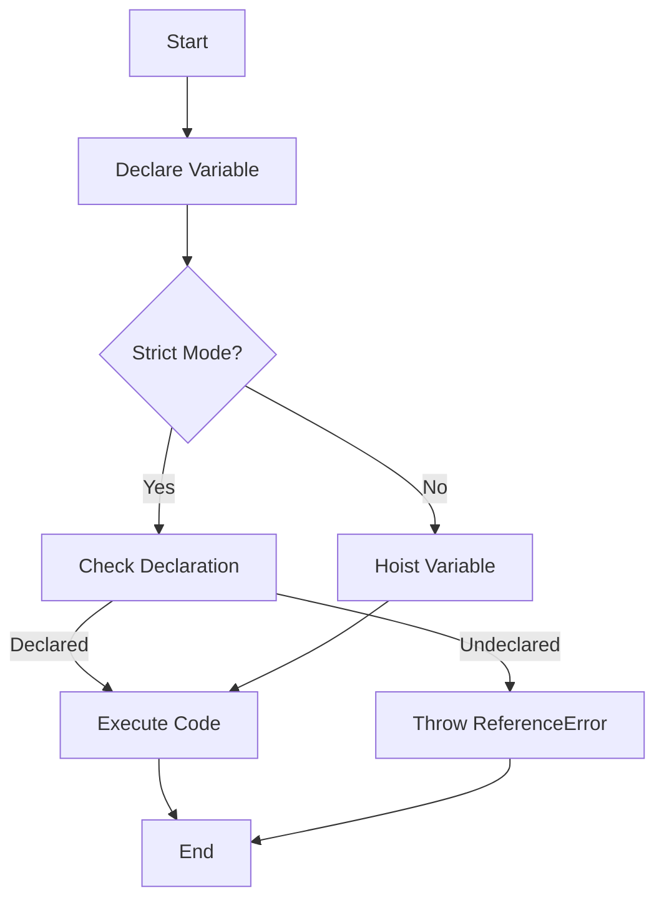

## 4.8. Strict Mode and Hoisting

In this section, we will delve into the concept of strict mode in JavaScript, its impact on hoisting, and how it influences variable declarations. Understanding these concepts is crucial for writing robust and error-free JavaScript code. Let's embark on this journey to explore strict mode and its relationship with hoisting.

### What is Strict Mode?

Strict mode is a feature in JavaScript that allows you to opt into a restricted variant of the language. It was introduced in ECMAScript 5 (ES5) to provide a way to enforce stricter parsing and error handling in your JavaScript code. By enabling strict mode, you can catch common coding errors and "unsafe" actions that might otherwise go unnoticed in non-strict mode.

#### How to Enable Strict Mode

To enable strict mode, you simply need to include the string `"use strict";` at the beginning of your JavaScript file or within a function. Here's how you can do it:

```javascript
// Enabling strict mode for the entire script
"use strict";

function exampleFunction() {
    // Function code here
}

// Enabling strict mode for a specific function
function anotherFunction() {
    "use strict";
    // Function code here
}
```

**Note:** When you enable strict mode at the top of a script, it applies to the entire script. However, if you enable it within a function, it only applies to that function.

### Changes in Hoisting Behavior Under Strict Mode

Hoisting is a JavaScript mechanism where variable and function declarations are moved to the top of their containing scope during the compile phase. In non-strict mode, JavaScript's hoisting behavior can sometimes lead to unexpected results, especially with variable declarations using `var`.

Strict mode modifies some aspects of this behavior, making JavaScript more predictable and less error-prone. Let's explore how strict mode affects hoisting.

#### Variable Declarations

In non-strict mode, using undeclared variables is allowed, and JavaScript automatically creates a global variable. However, in strict mode, using an undeclared variable results in a `ReferenceError`. This change helps prevent accidental global variable creation, which can lead to difficult-to-debug issues.

**Example Without Strict Mode:**

```javascript
// Non-strict mode
function nonStrictFunction() {
    undeclaredVariable = 10; // No error, creates a global variable
    console.log(undeclaredVariable); // Output: 10
}

nonStrictFunction();
console.log(undeclaredVariable); // Output: 10
```

**Example With Strict Mode:**

```javascript
// Strict mode
"use strict";

function strictFunction() {
    undeclaredVariable = 10; // ReferenceError: undeclaredVariable is not defined
    console.log(undeclaredVariable);
}

strictFunction();
```

#### Function Declarations

In non-strict mode, function declarations are hoisted to the top of their containing scope, allowing you to call a function before its declaration. This behavior remains unchanged in strict mode. However, strict mode enforces stricter rules on function declarations within blocks.

**Example of Hoisting with Function Declarations:**

```javascript
// Non-strict mode
console.log(hoistedFunction()); // Output: "Hoisted!"

function hoistedFunction() {
    return "Hoisted!";
}

// Strict mode
"use strict";
console.log(strictHoistedFunction()); // Output: "Strictly Hoisted!"

function strictHoistedFunction() {
    return "Strictly Hoisted!";
}
```

### Advantages of Using Strict Mode

Strict mode offers several advantages that make it a valuable tool for modern JavaScript development. Let's explore these benefits:

1. **Prevents Accidental Globals:** As demonstrated earlier, strict mode prevents the creation of global variables by mistake, reducing the risk of variable name collisions and unintended side effects.

2. **Eliminates Silent Errors:** In non-strict mode, certain errors are silently ignored, which can lead to bugs that are difficult to trace. Strict mode throws errors for such cases, making debugging easier.

3. **Disallows Duplicate Parameter Names:** In strict mode, functions cannot have duplicate parameter names, which helps avoid confusion and potential errors.

4. **Restricts `this` Keyword:** In strict mode, the value of `this` is `undefined` in functions that are not called as methods, preventing unintended global object modifications.

5. **Enhances Performance:** Some JavaScript engines can optimize code better when strict mode is enabled, leading to improved performance.

### Code Examples: Hoisting with and without Strict Mode

Let's compare hoisting behavior in non-strict and strict modes through a series of examples.

#### Example 1: Variable Hoisting

**Non-Strict Mode:**

```javascript
console.log(nonStrictVar); // Output: undefined
var nonStrictVar = "I'm hoisted!";
console.log(nonStrictVar); // Output: "I'm hoisted!"
```

**Strict Mode:**

```javascript
"use strict";
console.log(strictVar); // ReferenceError: strictVar is not defined
let strictVar = "I'm hoisted!";
console.log(strictVar);
```

#### Example 2: Function Hoisting

**Non-Strict Mode:**

```javascript
console.log(nonStrictFunc()); // Output: "Function hoisted!"

function nonStrictFunc() {
    return "Function hoisted!";
}
```

**Strict Mode:**

```javascript
"use strict";
console.log(strictFunc()); // Output: "Strict function hoisted!"

function strictFunc() {
    return "Strict function hoisted!";
}
```

### Visualizing Hoisting and Strict Mode

To better understand how hoisting works with and without strict mode, let's visualize the process using a flowchart.



**Caption:** This flowchart illustrates the decision-making process in JavaScript when handling variable declarations with and without strict mode.

### Try It Yourself

Now that we've explored strict mode and hoisting, it's time to experiment with the concepts. Try modifying the code examples above by:

- Removing `"use strict";` and observing the changes in behavior.
- Introducing undeclared variables in strict mode to see the errors.
- Creating functions with duplicate parameter names in strict mode.

### References and Further Reading

For more in-depth information on strict mode and hoisting, consider exploring the following resources:

- [MDN Web Docs: Strict mode](https://developer.mozilla.org/en-US/docs/Web/JavaScript/Reference/Strict_mode)
- [MDN Web Docs: Hoisting](https://developer.mozilla.org/en-US/docs/Glossary/Hoisting)

### Knowledge Check

Let's reinforce what we've learned with a few questions:

- What is the purpose of strict mode in JavaScript?
- How does strict mode affect variable declarations?
- What are the benefits of using strict mode in modern development?

### Embrace the Journey

Remember, this is just the beginning. As you progress, you'll build more complex and interactive web pages. Keep experimenting, stay curious, and enjoy the journey!

## Quiz Time!



### What is the main purpose of strict mode in JavaScript?

- [x] To enforce stricter parsing and error handling
- [ ] To make JavaScript code run faster
- [ ] To allow the use of undeclared variables
- [ ] To disable hoisting

> **Explanation:** Strict mode enforces stricter parsing and error handling, helping to catch common coding errors.

### How do you enable strict mode in a JavaScript file?

- [x] By adding "use strict"; at the beginning of the file
- [ ] By setting a global variable
- [ ] By using a special function
- [ ] By including a library

> **Explanation:** Strict mode is enabled by adding "use strict"; at the beginning of a JavaScript file or function.

### What happens if you use an undeclared variable in strict mode?

- [x] A ReferenceError is thrown
- [ ] The variable is automatically declared globally
- [ ] The variable is ignored
- [ ] The script stops executing

> **Explanation:** In strict mode, using an undeclared variable results in a ReferenceError.

### How does strict mode affect the `this` keyword?

- [x] `this` is `undefined` in functions not called as methods
- [ ] `this` always refers to the global object
- [ ] `this` is automatically bound to the nearest object
- [ ] `this` is ignored

> **Explanation:** In strict mode, the value of `this` is `undefined` in functions that are not called as methods.

### What is one advantage of using strict mode?

- [x] It prevents accidental global variable creation
- [ ] It allows duplicate parameter names
- [ ] It speeds up code execution
- [ ] It disables error handling

> **Explanation:** Strict mode prevents accidental global variable creation, reducing the risk of name collisions.

### Can strict mode be enabled for a specific function?

- [x] Yes
- [ ] No

> **Explanation:** Strict mode can be enabled for a specific function by including "use strict"; within the function.

### What is the behavior of function declarations in strict mode?

- [x] They are hoisted to the top of their containing scope
- [ ] They are not hoisted
- [ ] They are ignored
- [ ] They are only hoisted if declared with `var`

> **Explanation:** Function declarations are hoisted to the top of their containing scope, even in strict mode.

### How does strict mode affect duplicate parameter names?

- [x] It disallows duplicate parameter names
- [ ] It allows duplicate parameter names
- [ ] It ignores duplicate parameter names
- [ ] It throws a warning for duplicate parameter names

> **Explanation:** Strict mode disallows duplicate parameter names, helping to avoid confusion and potential errors.

### What is hoisting in JavaScript?

- [x] The process of moving variable and function declarations to the top of their scope
- [ ] The process of optimizing code execution
- [ ] The process of converting data types
- [ ] The process of creating global variables

> **Explanation:** Hoisting is the process of moving variable and function declarations to the top of their containing scope.

### True or False: Strict mode can improve JavaScript performance.

- [x] True
- [ ] False

> **Explanation:** Some JavaScript engines can optimize code better when strict mode is enabled, leading to improved performance.


