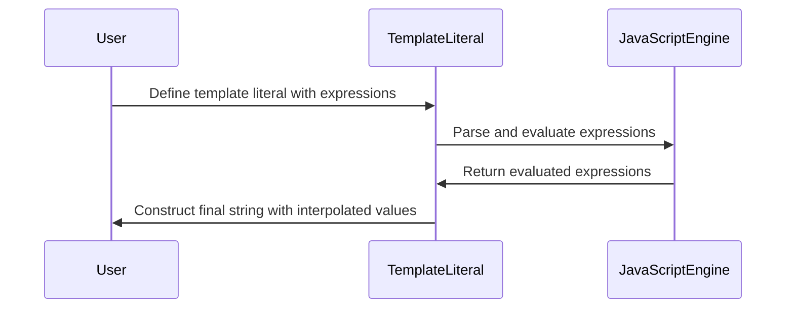

## 5.10. Template Literals (ES6)

In the world of JavaScript, strings are a fundamental data type that we use to represent text. With the introduction of ECMAScript 6 (ES6), a new and powerful feature called **template literals** was introduced. Template literals provide an easier and more readable way to work with strings, offering capabilities such as string interpolation and multi-line strings without the need for cumbersome concatenation. In this section, we'll delve into the syntax and usage of template literals, explore embedding expressions, and discuss advanced concepts like tagged templates.

### Introduction to Template Literals

Template literals are a new way to create strings in JavaScript. Unlike traditional strings that use single (`'`) or double (`"`) quotes, template literals use backticks (`` ` ``). This seemingly small change brings with it a host of new features that make working with strings much more intuitive.

#### Basic Syntax

The basic syntax for a template literal is to enclose your string within backticks:

```javascript
const greeting = `Hello, World!`;
console.log(greeting); // Output: Hello, World!
```

This may look similar to using single or double quotes, but template literals offer much more flexibility.

### String Interpolation with Template Literals

One of the most powerful features of template literals is **string interpolation**. This allows you to embed expressions directly within your strings, making it easy to construct strings dynamically.

#### Embedding Expressions

To embed an expression within a template literal, use the `${}` syntax. The expression inside the curly braces is evaluated, and its result is inserted into the string.

```javascript
const name = 'Alice';
const age = 30;
const message = `My name is ${name} and I am ${age} years old.`;
console.log(message); // Output: My name is Alice and I am 30 years old.
```

This feature eliminates the need for cumbersome string concatenation using the `+` operator, making your code cleaner and more readable.

#### Complex Expressions

You can embed any valid JavaScript expression inside `${}`. This includes arithmetic operations, function calls, and even ternary operators.

```javascript
const a = 5;
const b = 10;
const result = `The sum of ${a} and ${b} is ${a + b}.`;
console.log(result); // Output: The sum of 5 and 10 is 15.

const isEven = (num) => num % 2 === 0;
const number = 4;
const checkEven = `The number ${number} is ${isEven(number) ? 'even' : 'odd'}.`;
console.log(checkEven); // Output: The number 4 is even.
```

### Multi-line Strings

Before ES6, creating multi-line strings required awkward concatenation or escaping newline characters. Template literals simplify this by allowing you to write multi-line strings naturally.

#### Creating Multi-line Strings

With template literals, you can create multi-line strings by simply pressing Enter within the backticks.

```javascript
const poem = `Roses are red,
Violets are blue,
JavaScript is fun,
And so are you.`;
console.log(poem);
/* Output:
Roses are red,
Violets are blue,
JavaScript is fun,
And so are you.
*/
```

This feature is particularly useful for formatting text or writing long strings of code.

### Tagged Templates

Tagged templates are an advanced feature of template literals that allow you to parse template literals with a function. This can be useful for custom string processing, such as escaping HTML or localizing strings.

#### Basic Usage of Tagged Templates

A tagged template is a function that receives the template literal's parts as arguments. The first argument is an array of string literals, and the subsequent arguments are the evaluated expressions.

```javascript
function tag(strings, ...values) {
  console.log(strings); // Array of string literals
  console.log(values);  // Array of evaluated expressions
}

const user = 'Bob';
const age = 25;
tag`User ${user} is ${age} years old.`;
// Output:
// [ 'User ', ' is ', ' years old.' ]
// [ 'Bob', 25 ]
```

#### Practical Example: Escaping HTML

One common use case for tagged templates is escaping HTML to prevent XSS attacks.

```javascript
function escapeHTML(strings, ...values) {
  return strings.reduce((result, string, i) => {
    const value = values[i - 1];
    return result + (value ? String(value).replace(/&/g, '&amp;').replace(/</g, '&lt;').replace(/>/g, '&gt;') : '') + string;
  });
}

const unsafeString = '<script>alert("XSS")</script>';
const safeHTML = escapeHTML`<div>${unsafeString}</div>`;
console.log(safeHTML); // Output: <div>&lt;script&gt;alert("XSS")&lt;/script&gt;</div>
```

### Advanced Usage of Template Literals

Template literals can be used in various advanced scenarios, such as creating DSLs (Domain-Specific Languages) or formatting strings with custom logic.

#### Creating a Simple DSL

You can use tagged templates to create a simple DSL for building SQL queries.

```javascript
function sql(strings, ...values) {
  return strings.reduce((result, string, i) => {
    const value = values[i - 1];
    return result + (value ? `'${value}'` : '') + string;
  });
}

const table = 'users';
const column = 'name';
const value = 'Alice';
const query = sql`SELECT * FROM ${table} WHERE ${column} = ${value};`;
console.log(query); // Output: SELECT * FROM 'users' WHERE 'name' = 'Alice';
```

#### Formatting Strings

You can use template literals to format strings with custom logic, such as padding numbers or aligning text.

```javascript
function padNumber(strings, ...values) {
  return strings.reduce((result, string, i) => {
    const value = values[i - 1];
    return result + (value ? String(value).padStart(3, '0') : '') + string;
  });
}

const num = 5;
const padded = padNumber`The number is ${num}.`;
console.log(padded); // Output: The number is 005.
```

### Visualizing Template Literals

To better understand how template literals work, let's visualize the process of string interpolation and tagged templates.



**Figure 1**: This diagram illustrates how JavaScript processes template literals, evaluating expressions and constructing the final string.

### Try It Yourself

Now that we've covered the basics and some advanced uses of template literals, it's time to experiment. Try modifying the following code examples to see how template literals can simplify your string handling:

1. Create a multi-line string using template literals.
2. Embed a complex expression within a template literal.
3. Use a tagged template to format a string with custom logic.

### References and Further Reading

- [MDN Web Docs: Template Literals](https://developer.mozilla.org/en-US/docs/Web/JavaScript/Reference/Template_literals)
- [W3Schools: JavaScript Template Literals](https://www.w3schools.com/js/js_string_templates.asp)

### Knowledge Check

Before we wrap up, let's reinforce what we've learned with a few questions and exercises.

## Quiz Time!



### What is the primary syntax used for template literals in JavaScript?

- [x] Backticks (`` ` ``)
- [ ] Single quotes (`'`)
- [ ] Double quotes (`"`)
- [ ] Curly braces (`{}`)

> **Explanation:** Template literals in JavaScript are enclosed in backticks, which allow for string interpolation and multi-line strings.

### How do you embed an expression within a template literal?

- [x] Using `${}`
- [ ] Using `{{}}`
- [ ] Using `[]`
- [ ] Using `<>`

> **Explanation:** Expressions are embedded within template literals using the `${}` syntax.

### What feature of template literals allows for multi-line strings?

- [x] Using backticks
- [ ] Using escape characters
- [ ] Using the `+` operator
- [ ] Using `\n`

> **Explanation:** Template literals allow for multi-line strings naturally by using backticks.

### What is a tagged template?

- [x] A function that processes a template literal
- [ ] A template literal with a tag attribute
- [ ] A template literal used in HTML
- [ ] A template literal with a CSS class

> **Explanation:** Tagged templates involve a function that processes the template literal's parts, allowing for custom string processing.

### Which of the following is a use case for tagged templates?

- [x] Escaping HTML
- [ ] Creating arrays
- [ ] Defining functions
- [ ] Declaring variables

> **Explanation:** Tagged templates can be used to escape HTML, preventing XSS attacks by processing the template literal's parts.

### Can template literals include complex expressions?

- [x] Yes
- [ ] No

> **Explanation:** Template literals can include any valid JavaScript expression within `${}`, including complex expressions.

### What is the output of the following code?

```javascript
const a = 5;
const b = 10;
console.log(`The result is ${a * b}.`);
```

- [x] The result is 50.
- [ ] The result is 15.
- [ ] The result is 510.
- [ ] The result is 5 * 10.

> **Explanation:** The expression `${a * b}` is evaluated to `50`, which is then inserted into the string.

### How does JavaScript process a template literal?

- [x] It evaluates expressions and constructs the final string.
- [ ] It treats it as a regular string.
- [ ] It ignores expressions inside `${}`.
- [ ] It converts it to a number.

> **Explanation:** JavaScript evaluates the expressions within `${}` and constructs the final string with the interpolated values.

### What is the advantage of using template literals over traditional strings?

- [x] Easier string interpolation and multi-line strings
- [ ] Faster execution
- [ ] Smaller file size
- [ ] Better compatibility

> **Explanation:** Template literals provide easier string interpolation and support multi-line strings without concatenation.

### True or False: Template literals can only be used with strings.

- [ ] True
- [x] False

> **Explanation:** Template literals can be used with any data type, as they allow embedding of any valid JavaScript expression.



Remember, this is just the beginning. As you progress, you'll build more complex and interactive web pages. Keep experimenting, stay curious, and enjoy the journey!
