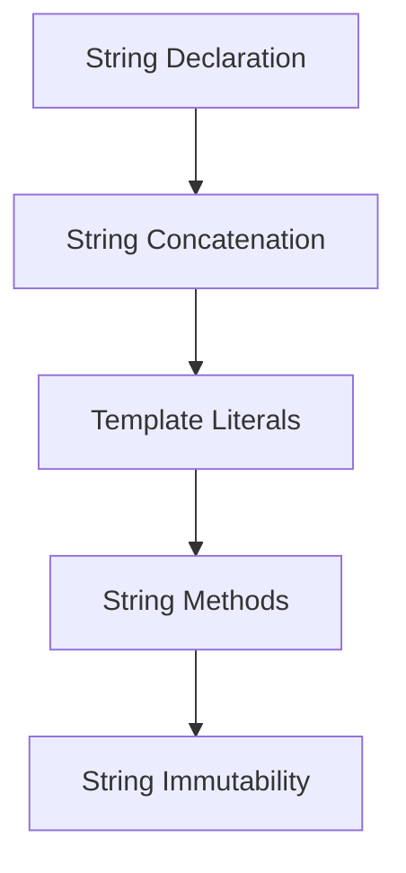

## 5.2. String Type

Welcome to the world of strings in JavaScript! Strings are an essential part of programming, allowing us to work with textual data. In this section, we'll explore what strings are, how to declare and manipulate them, and the various methods available for working with strings. By the end of this section, you'll have a solid understanding of strings and be able to use them effectively in your JavaScript programs.

### What is a String?

In JavaScript, a string is a sequence of characters used to represent text. Strings can include letters, numbers, symbols, and even spaces. They are one of the primitive data types in JavaScript, which means they are immutable and have a fixed size. Strings are enclosed in either single quotes (`'`), double quotes (`"`), or backticks (`` ` ``).

#### Declaring Strings

To declare a string in JavaScript, you can use any of the following methods:

```javascript
// Using single quotes
let singleQuoteString = 'Hello, World!';

// Using double quotes
let doubleQuoteString = "Hello, World!";

// Using backticks (template literals)
let templateLiteralString = `Hello, World!`;
```

Each of these methods has its own use cases, and we'll explore template literals in more detail later.

### String Concatenation

String concatenation is the process of joining two or more strings together. In JavaScript, you can concatenate strings using the `+` operator or by using template literals.

#### Using the `+` Operator

The `+` operator is a simple way to concatenate strings:

```javascript
let greeting = 'Hello';
let name = 'Alice';
let message = greeting + ', ' + name + '!'; // "Hello, Alice!"
```

In this example, we concatenate the `greeting` and `name` strings with a comma and space in between.

#### Using Template Literals

Template literals, introduced in ES6, provide a more readable and flexible way to concatenate strings. They allow you to embed expressions within a string using `${expression}` syntax:

```javascript
let greeting = 'Hello';
let name = 'Alice';
let message = `${greeting}, ${name}!`; // "Hello, Alice!"
```

Template literals are enclosed in backticks and can span multiple lines, making them ideal for creating complex strings.

### Common String Methods

JavaScript provides a variety of methods for working with strings. Let's explore some of the most commonly used string methods.

#### `length`

The `length` property returns the number of characters in a string:

```javascript
let text = 'JavaScript';
console.log(text.length); // 10
```

#### `slice()`

The `slice()` method extracts a section of a string and returns it as a new string. It takes two arguments: the start index and the end index (optional):

```javascript
let text = 'JavaScript';
let slicedText = text.slice(0, 4); // "Java"
```

If the end index is omitted, `slice()` extracts to the end of the string.

#### `substring()`

The `substring()` method is similar to `slice()`, but it doesn't accept negative indices. It also takes two arguments: the start index and the end index (optional):

```javascript
let text = 'JavaScript';
let substringText = text.substring(4, 10); // "Script"
```

#### `toUpperCase()` and `toLowerCase()`

These methods convert a string to uppercase or lowercase, respectively:

```javascript
let text = 'JavaScript';
console.log(text.toUpperCase()); // "JAVASCRIPT"
console.log(text.toLowerCase()); // "javascript"
```

#### `indexOf()`

The `indexOf()` method returns the index of the first occurrence of a specified value in a string. If the value is not found, it returns `-1`:

```javascript
let text = 'JavaScript';
console.log(text.indexOf('S')); // 4
console.log(text.indexOf('x')); // -1
```

#### `replace()`

The `replace()` method searches a string for a specified value and returns a new string with the value replaced:

```javascript
let text = 'Hello, World!';
let newText = text.replace('World', 'JavaScript'); // "Hello, JavaScript!"
```

### String Immutability

Strings in JavaScript are immutable, meaning once a string is created, it cannot be changed. Any operation that appears to modify a string actually creates a new string. This behavior has important implications for performance and memory usage.

#### Implications of Immutability

Because strings are immutable, methods like `replace()` or `toUpperCase()` do not alter the original string but return a new one. This means you should always assign the result of such operations to a new variable or overwrite the existing one:

```javascript
let text = 'Hello';
text = text.toUpperCase(); // "HELLO"
```

### Try It Yourself

Now that we've covered the basics of strings, let's try some hands-on exercises. Modify the following code examples and observe the results:

```javascript
// Concatenate strings using the + operator
let firstName = 'John';
let lastName = 'Doe';
let fullName = firstName + ' ' + lastName;
console.log(fullName); // Try changing the names

// Use template literals to create a greeting
let greeting = `Hello, ${firstName} ${lastName}!`;
console.log(greeting); // Try adding more expressions

// Experiment with string methods
let phrase = 'Learning JavaScript is fun!';
console.log(phrase.slice(9, 19)); // Try different indices
console.log(phrase.toLowerCase()); // Try toUpperCase()
console.log(phrase.replace('fun', 'awesome')); // Try replacing other words
```

### Visualizing String Manipulation

To better understand how strings are manipulated in JavaScript, let's visualize the process of string concatenation and method application.



This flowchart represents the journey of working with strings, from declaration to understanding their immutable nature.

### References and Links

For further reading on strings in JavaScript, check out these resources:

- [MDN Web Docs: String](https://developer.mozilla.org/en-US/docs/Web/JavaScript/Reference/Global_Objects/String)
- [W3Schools: JavaScript Strings](https://www.w3schools.com/js/js_strings.asp)

### Knowledge Check

Before we wrap up, let's reinforce what we've learned with some questions:

1. What is a string in JavaScript?
2. How do you declare a string using template literals?
3. What is the difference between `slice()` and `substring()`?
4. Why are strings considered immutable?
5. How can you concatenate strings using the `+` operator?

### Embrace the Journey

Remember, mastering strings is just one step in your JavaScript journey. As you continue to learn, you'll discover more powerful ways to manipulate and interact with text. Keep experimenting, stay curious, and enjoy the process!

## Quiz Time!



### What is the result of the following code: `let text = 'JavaScript'; console.log(text.length);`?

- [x] 10
- [ ] 9
- [ ] 11
- [ ] 8

> **Explanation:** The `length` property returns the number of characters in the string, which is 10 in this case.

### How do you declare a string using template literals?

- [x] Using backticks (`` ` ``)
- [ ] Using single quotes (`'`)
- [ ] Using double quotes (`"`)
- [ ] Using parentheses (`()`)

> **Explanation:** Template literals are declared using backticks, allowing for embedded expressions and multi-line strings.

### Which method would you use to convert a string to uppercase?

- [x] `toUpperCase()`
- [ ] `toLowerCase()`
- [ ] `slice()`
- [ ] `replace()`

> **Explanation:** The `toUpperCase()` method is used to convert a string to uppercase.

### What does the `replace()` method do?

- [x] It returns a new string with specified values replaced.
- [ ] It modifies the original string.
- [ ] It deletes a part of the string.
- [ ] It splits the string into an array.

> **Explanation:** The `replace()` method returns a new string with the specified values replaced, without modifying the original string.

### Why are strings considered immutable in JavaScript?

- [x] Because once created, they cannot be changed.
- [ ] Because they can be modified directly.
- [ ] Because they are stored in a special memory area.
- [ ] Because they are not primitive data types.

> **Explanation:** Strings are immutable, meaning any operation on them creates a new string rather than modifying the original.

### What is the result of concatenating `'Hello' + ' ' + 'World!'`?

- [x] "Hello World!"
- [ ] "HelloWorld!"
- [ ] "Hello, World!"
- [ ] "Hello World"

> **Explanation:** The `+` operator concatenates the strings with a space in between, resulting in "Hello World!".

### Which method would you use to find the index of a character in a string?

- [x] `indexOf()`
- [ ] `slice()`
- [ ] `substring()`
- [ ] `toUpperCase()`

> **Explanation:** The `indexOf()` method returns the index of the first occurrence of a specified value in a string.

### What does the `slice()` method do?

- [x] It extracts a section of a string and returns it as a new string.
- [ ] It modifies the original string.
- [ ] It converts a string to uppercase.
- [ ] It replaces a part of the string.

> **Explanation:** The `slice()` method extracts a section of a string and returns it as a new string without modifying the original.

### Can template literals span multiple lines?

- [x] True
- [ ] False

> **Explanation:** Template literals can span multiple lines, making them useful for creating complex strings.

### What is the purpose of the `${expression}` syntax in template literals?

- [x] To embed expressions within a string
- [ ] To declare a new variable
- [ ] To create a new string
- [ ] To replace a part of the string

> **Explanation:** The `${expression}` syntax allows embedding expressions within a string when using template literals.


