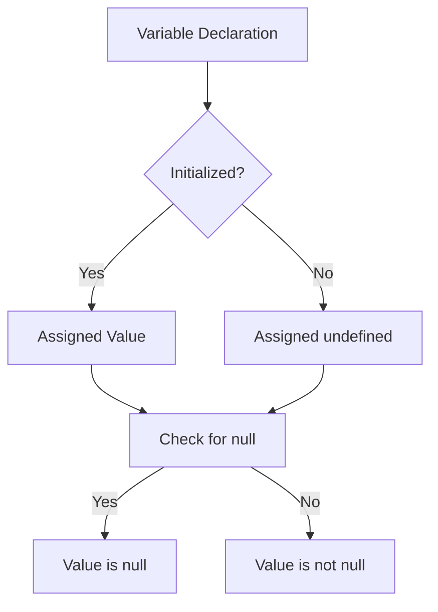

## 5.4. Undefined and Null Types

In JavaScript, understanding the nuances of different data types is crucial for writing effective and bug-free code. Among the primitive data types, `undefined` and `null` often confuse beginners due to their seemingly similar nature. However, they serve distinct purposes and are used in different contexts. In this section, we'll delve into the definitions, differences, and best practices for using `undefined` and `null`.

### What is `undefined`?

The `undefined` type in JavaScript is a primitive value automatically assigned to variables that have been declared but not yet assigned a value. It signifies the absence of a value in a variable. Let's explore this concept with an example:

```javascript
let myVariable;
console.log(myVariable); // Output: undefined
```

In the example above, `myVariable` is declared but not initialized with any value. As a result, JavaScript assigns it the value `undefined`. This behavior is automatic and indicates that the variable is not yet defined with a specific value.

#### When Does `undefined` Occur?

`undefined` can occur in several scenarios:

1. **Variable Declaration Without Initialization**: As shown in the example above, when a variable is declared but not initialized, it is automatically assigned `undefined`.

2. **Function Return Value**: If a function does not explicitly return a value, it returns `undefined` by default.

   ```javascript
   function greet() {
       console.log("Hello, World!");
   }

   const result = greet(); // Output: Hello, World!
   console.log(result); // Output: undefined
   ```

3. **Accessing Non-Existent Object Properties**: When you try to access a property that does not exist on an object, the result is `undefined`.

   ```javascript
   const person = { name: "Alice" };
   console.log(person.age); // Output: undefined
   ```

4. **Function Parameters**: If a function is called with fewer arguments than it is defined to accept, the missing parameters are assigned `undefined`.

   ```javascript
   function displayMessage(message) {
       console.log(message);
   }

   displayMessage(); // Output: undefined
   ```

### What is `null`?

`null` is another primitive value in JavaScript that represents the intentional absence of any object value. It is explicitly assigned to a variable to indicate that it should have no value. Unlike `undefined`, which is automatically assigned, `null` is used deliberately by the programmer.

#### Intentional Use of `null`

`null` is typically used in scenarios where you want to explicitly denote that a variable should not have a value or should be empty. Here are some common use cases:

1. **Resetting a Variable**: You can assign `null` to a variable to clear its value, indicating that it no longer holds any meaningful data.

   ```javascript
   let user = { name: "Bob" };
   user = null; // The user object is now cleared
   ```

2. **Function Return Value**: A function can return `null` to indicate the absence of a meaningful result.

   ```javascript
   function findUser(username) {
       // Simulate a user search
       return null; // No user found
   }

   const user = findUser("Charlie");
   console.log(user); // Output: null
   ```

3. **Initial State**: In some cases, `null` is used to initialize a variable that will later hold an object, indicating that it currently has no value.

   ```javascript
   let selectedElement = null;
   ```

### Comparing `undefined` and `null`

While both `undefined` and `null` represent the absence of a value, they are used in different contexts and have different meanings:

- **Type**: `undefined` is a type itself, whereas `null` is an object type.
- **Automatic vs. Intentional**: `undefined` is automatically assigned by JavaScript, while `null` is explicitly assigned by the programmer.
- **Use Cases**: `undefined` is used to indicate uninitialized variables or non-existent properties, whereas `null` is used to explicitly clear a variable or indicate the absence of an object.

#### Code Example: `undefined` vs. `null`

```javascript
let uninitializedVariable;
let emptyValue = null;

console.log(typeof uninitializedVariable); // Output: "undefined"
console.log(typeof emptyValue); // Output: "object"

console.log(uninitializedVariable == null); // Output: true
console.log(uninitializedVariable === null); // Output: false
```

In the example above, we see that both `undefined` and `null` are loosely equal (`==`) but not strictly equal (`===`). This is because `==` performs type coercion, treating `undefined` and `null` as equivalent, while `===` checks for both value and type equality.

### Best Practices for Using `undefined` and `null`

To avoid confusion and potential bugs, it's important to follow best practices when working with `undefined` and `null`:

1. **Initialize Variables**: Always initialize variables to avoid accidental `undefined` values. Use `null` if you intend to represent an empty or non-existent value.

   ```javascript
   let user = null; // Explicitly set to null
   ```

2. **Check for `undefined`**: When accessing object properties or function parameters, check for `undefined` to handle cases where values may not be present.

   ```javascript
   if (typeof user !== 'undefined') {
       // Handle the user object
   }
   ```

3. **Use `null` for Intentional Absence**: Use `null` when you want to explicitly indicate that a variable should not have a value.

   ```javascript
   let selectedItem = null; // No item selected
   ```

4. **Avoid Overusing `null`**: While `null` is useful for indicating the absence of a value, overusing it can lead to unnecessary complexity. Use it judiciously.

5. **Prefer `===` for Comparisons**: Use strict equality (`===`) to avoid unexpected type coercion when comparing `undefined` and `null`.

   ```javascript
   if (value === null) {
       // Handle null value
   }
   ```

### Visualizing `undefined` and `null`

To better understand the differences between `undefined` and `null`, let's visualize their behavior in a flowchart:



In this flowchart, we see the process of variable declaration and initialization, highlighting when `undefined` and `null` are assigned.

### Try It Yourself

To solidify your understanding, try modifying the following code examples:

1. Declare a variable without initializing it and log its value. Then, assign it a value and log it again.
2. Create a function that returns `null` and call it, logging the result.
3. Experiment with comparing `undefined` and `null` using both `==` and `===`.

### Knowledge Check

Before we conclude, let's summarize the key takeaways:

- `undefined` is automatically assigned to uninitialized variables and non-existent properties.
- `null` is explicitly assigned to represent the intentional absence of a value.
- Use `null` to clear variables or indicate an empty state.
- Prefer strict equality (`===`) to avoid type coercion issues.

Remember, mastering these concepts is an important step in your JavaScript journey. Keep practicing and experimenting with code to deepen your understanding.

## Quiz Time!



### What is the default value of a declared but uninitialized variable in JavaScript?

- [x] undefined
- [ ] null
- [ ] 0
- [ ] ""

> **Explanation:** In JavaScript, a declared but uninitialized variable is automatically assigned the value `undefined`.

### Which of the following is a primitive type in JavaScript?

- [ ] object
- [x] undefined
- [ ] array
- [ ] function

> **Explanation:** `undefined` is a primitive type in JavaScript, while `object`, `array`, and `function` are not.

### How do you explicitly clear a variable's value in JavaScript?

- [ ] Assign it to `undefined`
- [x] Assign it to `null`
- [ ] Assign it to `0`
- [ ] Assign it to `false`

> **Explanation:** Assigning `null` to a variable explicitly clears its value, indicating that it should have no value.

### What is the result of comparing `undefined` and `null` using `==`?

- [x] true
- [ ] false
- [ ] TypeError
- [ ] NaN

> **Explanation:** Using `==` to compare `undefined` and `null` results in `true` due to type coercion.

### What is the result of comparing `undefined` and `null` using `===`?

- [ ] true
- [x] false
- [ ] TypeError
- [ ] NaN

> **Explanation:** Using `===` to compare `undefined` and `null` results in `false` because they are different types.

### Which keyword is used to declare a variable in JavaScript?

- [x] let
- [ ] var
- [ ] const
- [ ] All of the above

> **Explanation:** All of the above (`let`, `var`, and `const`) are used to declare variables in JavaScript.

### What does a function return if it does not explicitly return a value?

- [x] undefined
- [ ] null
- [ ] 0
- [ ] NaN

> **Explanation:** If a function does not explicitly return a value, it returns `undefined` by default.

### Which of the following is true about `null`?

- [x] It is an object type
- [ ] It is automatically assigned
- [ ] It is a primitive type
- [ ] It is the same as `undefined`

> **Explanation:** `null` is an object type and must be explicitly assigned, unlike `undefined`.

### What is the output of `typeof null` in JavaScript?

- [ ] "null"
- [x] "object"
- [ ] "undefined"
- [ ] "string"

> **Explanation:** The `typeof` operator returns "object" for `null`, which is a known quirk in JavaScript.

### True or False: You should always use `==` to compare `undefined` and `null`.

- [ ] True
- [x] False

> **Explanation:** It is generally better to use `===` to avoid type coercion issues when comparing `undefined` and `null`.



Remember, this is just the beginning of your journey with JavaScript. Keep experimenting, stay curious, and enjoy the process of learning and mastering this powerful language!
