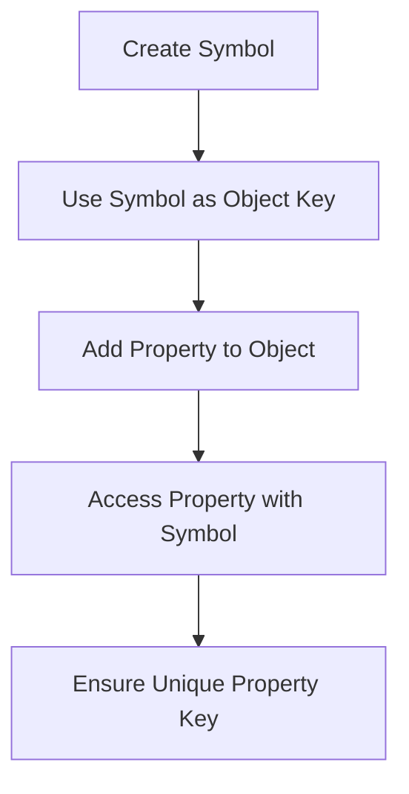

## 5.5. Symbol Type (ES6)

In the world of JavaScript, the introduction of the `Symbol` data type in ECMAScript 6 (ES6) marked a significant step forward in how developers can handle unique identifiers. Symbols provide a way to create truly unique values that can be used as keys for object properties, ensuring that there are no accidental name collisions. In this section, we'll explore what symbols are, how to create and use them, and their practical applications in JavaScript programming.

### Understanding Symbols

#### What is a Symbol?

A `Symbol` is a primitive data type introduced in ES6. It is unique and immutable, meaning that each symbol value is distinct and cannot be changed once created. Symbols are often used to create unique keys for object properties, which helps prevent property name collisions in objects.

#### Why Use Symbols?

Symbols are particularly useful when you want to add properties to an object without risking overwriting existing properties. They provide a way to ensure that property keys are unique, even if they have the same description. This is especially important in large codebases or when integrating third-party libraries, where property name collisions could lead to bugs.

### Creating Symbols

#### Basic Symbol Creation

To create a symbol, you use the `Symbol()` function. This function can take an optional description, which is useful for debugging purposes but does not affect the uniqueness of the symbol.

```javascript
// Create a symbol without a description
const mySymbol = Symbol();

// Create a symbol with a description
const mySymbolWithDescription = Symbol('mySymbolDescription');

console.log(mySymbol); // Symbol()
console.log(mySymbolWithDescription); // Symbol(mySymbolDescription)
```

#### Unique Nature of Symbols

Even if two symbols are created with the same description, they are not equal. Each call to `Symbol()` generates a new, unique symbol.

```javascript
const symbol1 = Symbol('description');
const symbol2 = Symbol('description');

console.log(symbol1 === symbol2); // false
```

### Using Symbols as Object Properties

Symbols can be used as keys for object properties. This ensures that the property key is unique, even if other properties have the same name.

#### Adding Symbol Properties to Objects

You can add a symbol as a property key by using square bracket notation.

```javascript
const uniqueId = Symbol('id');

const user = {
  name: 'Alice',
  [uniqueId]: 12345
};

console.log(user[uniqueId]); // 12345
```

#### Accessing Symbol Properties

To access a property keyed by a symbol, you must use the same symbol reference. This prevents accidental access or modification of symbol-keyed properties.

```javascript
console.log(user[uniqueId]); // 12345
```

### Use Cases for Symbols

#### Avoiding Property Name Collisions

Symbols are ideal for avoiding property name collisions in objects. This is particularly useful when extending objects or integrating with third-party libraries.

```javascript
const librarySymbol = Symbol('libraryProperty');

const myObject = {
  [librarySymbol]: 'Library Value'
};

// No risk of collision with other properties
myObject[librarySymbol] = 'New Library Value';
```

#### Implementing Private Properties

While JavaScript does not have true private properties, symbols can be used to simulate them. Since symbols are not accessible through normal property enumeration, they can act as a form of private property.

```javascript
const privateSymbol = Symbol('private');

class MyClass {
  constructor() {
    this[privateSymbol] = 'privateValue';
  }

  getPrivateValue() {
    return this[privateSymbol];
  }
}

const instance = new MyClass();
console.log(instance.getPrivateValue()); // 'privateValue'
```

### Well-Known Symbols

JavaScript provides several built-in symbols, known as well-known symbols, which are used to customize the behavior of objects. These symbols are part of the JavaScript language and have specific purposes.

#### Examples of Well-Known Symbols

1. **`Symbol.iterator`**: Used to define the default iterator for an object. This is what allows objects to be iterable using `for...of` loops.

   ```javascript
   const iterableObject = {
     *[Symbol.iterator]() {
       yield 1;
       yield 2;
       yield 3;
     }
   };

   for (const value of iterableObject) {
     console.log(value); // 1, 2, 3
   }
   ```

2. **`Symbol.toStringTag`**: Used to customize the default string description of an object.

   ```javascript
   const customObject = {
     [Symbol.toStringTag]: 'CustomObject'
   };

   console.log(customObject.toString()); // [object CustomObject]
   ```

3. **`Symbol.hasInstance`**: Used to customize the behavior of the `instanceof` operator.

   ```javascript
   class MyClass {
     static [Symbol.hasInstance](instance) {
       return instance instanceof Array;
     }
   }

   console.log([] instanceof MyClass); // true
   ```

### Visualizing Symbol Usage

To better understand how symbols work in JavaScript, let's visualize the process of using symbols as unique keys in an object.



### Try It Yourself

To reinforce your understanding of symbols, try modifying the following code examples:

1. Create a symbol with a description and use it as a key in an object.
2. Add multiple symbol properties to an object and access them using the correct symbol references.
3. Implement a class with a private property using symbols and create a method to access it.

### References and Links

For more information on symbols and their use in JavaScript, check out the following resources:

- [MDN Web Docs: Symbol](https://developer.mozilla.org/en-US/docs/Web/JavaScript/Reference/Global_Objects/Symbol)
- [JavaScript Info: Symbol](https://javascript.info/symbol)

### Knowledge Check

Before moving on, let's review some key points about symbols:

- Symbols are unique and immutable.
- Symbols can be used as keys for object properties to avoid name collisions.
- Well-known symbols allow customization of object behavior.

### Embrace the Journey

Remember, symbols are just one of the many powerful tools in JavaScript. As you continue to learn, you'll discover more ways to harness the power of symbols in your code. Keep experimenting, stay curious, and enjoy the journey!

## Quiz Time!



### What is a Symbol in JavaScript?

- [x] A unique and immutable primitive data type
- [ ] A mutable object type
- [ ] A string representation of a number
- [ ] A deprecated feature in ES6

> **Explanation:** Symbols are a unique and immutable primitive data type introduced in ES6.

### How do you create a Symbol with a description?

- [x] `Symbol('description')`
- [ ] `new Symbol('description')`
- [ ] `Symbol.create('description')`
- [ ] `Symbol.description('description')`

> **Explanation:** You create a symbol with a description using `Symbol('description')`.

### Can two Symbols with the same description be equal?

- [ ] Yes
- [x] No

> **Explanation:** Each symbol is unique, even if they have the same description.

### How do you add a Symbol as a property key to an object?

- [x] Use square bracket notation with the symbol
- [ ] Use dot notation with the symbol
- [ ] Use the `addProperty` method
- [ ] Use the `defineSymbol` method

> **Explanation:** You add a symbol as a property key using square bracket notation.

### What is a use case for Symbols?

- [x] Avoiding property name collisions
- [ ] Storing large amounts of data
- [ ] Creating arrays
- [ ] Defining functions

> **Explanation:** Symbols are used to avoid property name collisions in objects.

### Which of the following is a well-known Symbol?

- [x] `Symbol.iterator`
- [ ] `Symbol.custom`
- [ ] `Symbol.unique`
- [ ] `Symbol.private`

> **Explanation:** `Symbol.iterator` is a well-known symbol used to define default iterators.

### What does `Symbol.toStringTag` customize?

- [x] The default string description of an object
- [ ] The default iterator of an object
- [ ] The default value of an object
- [ ] The default key of an object

> **Explanation:** `Symbol.toStringTag` customizes the default string description of an object.

### How do you access a Symbol property in an object?

- [x] Use the symbol reference with square brackets
- [ ] Use the symbol reference with dot notation
- [ ] Use the `getSymbol` method
- [ ] Use the `accessSymbol` method

> **Explanation:** You access a symbol property using the symbol reference with square brackets.

### What is the result of `Symbol('desc') === Symbol('desc')`?

- [ ] True
- [x] False

> **Explanation:** Each call to `Symbol()` creates a unique symbol, so they are not equal.

### Are Symbols enumerable by default?

- [ ] Yes
- [x] No

> **Explanation:** Symbols are not enumerable by default, meaning they do not show up in `for...in` loops or `Object.keys()`.


