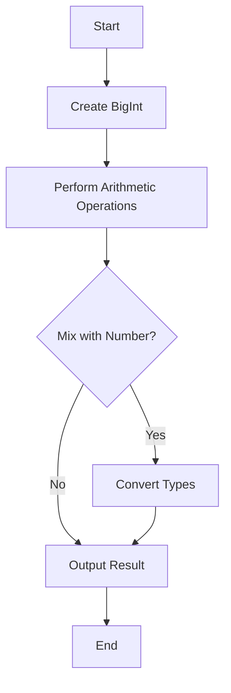

## 5.6. BigInt Type (ES2020)

In this section, we will explore the `BigInt` data type introduced in ECMAScript 2020 (ES2020). The `BigInt` type allows JavaScript developers to work with integers larger than the `Number` type's maximum safe integer limit. This capability is crucial for applications requiring precise calculations with very large numbers, such as cryptography, scientific computations, and financial systems.

### Introduction to BigInt

JavaScript's `Number` type is based on the IEEE 754 double-precision floating-point standard, which can safely represent integers between `-(2^53 - 1)` and `2^53 - 1`. This range is often sufficient for everyday calculations, but it falls short in fields requiring high precision and large integer values. Enter `BigInt`, a new primitive data type designed to handle integers of arbitrary precision.

#### Why BigInt?

The necessity for `BigInt` arises from the limitations of the `Number` type in representing large integers accurately. When calculations exceed the safe integer range, JavaScript's `Number` type can produce incorrect results due to precision loss. `BigInt` addresses this issue by allowing developers to represent and manipulate integers beyond the `Number.MAX_SAFE_INTEGER` limit.

### Creating and Using BigInt Values

Creating a `BigInt` is straightforward. You can append the letter `n` to an integer literal or use the `BigInt()` function. Let's explore both methods with examples.

#### Literal Syntax

The simplest way to create a `BigInt` is by appending `n` to an integer literal:

```javascript
// Creating BigInt using literal syntax
const bigIntLiteral = 1234567890123456789012345678901234567890n;
console.log(bigIntLiteral); // Output: 1234567890123456789012345678901234567890n
```

#### BigInt Function

Alternatively, you can use the `BigInt()` function to convert a number or string into a `BigInt`:

```javascript
// Creating BigInt using BigInt function
const bigIntFromNumber = BigInt(12345678901234567890);
const bigIntFromString = BigInt("1234567890123456789012345678901234567890");

console.log(bigIntFromNumber); // Output: 12345678901234567890n
console.log(bigIntFromString); // Output: 1234567890123456789012345678901234567890n
```

### Operations with BigInt

`BigInt` supports standard arithmetic operations such as addition, subtraction, multiplication, division, and exponentiation. However, you must ensure that both operands are of the `BigInt` type, as mixing `BigInt` with `Number` directly results in a `TypeError`.

#### Arithmetic Operations

Here's how you can perform basic arithmetic operations with `BigInt`:

```javascript
const a = 1000000000000000000000n;
const b = 2000000000000000000000n;

// Addition
const sum = a + b;
console.log(sum); // Output: 3000000000000000000000n

// Subtraction
const difference = b - a;
console.log(difference); // Output: 1000000000000000000000n

// Multiplication
const product = a * b;
console.log(product); // Output: 2000000000000000000000000000000000000000n

// Division
const quotient = b / a;
console.log(quotient); // Output: 2n

// Exponentiation
const power = a ** 2n;
console.log(power); // Output: 1000000000000000000000000000000000000000n
```

#### Comparison Operations

`BigInt` values can be compared using standard comparison operators:

```javascript
const x = 1000n;
const y = 2000n;

console.log(x < y);  // Output: true
console.log(x > y);  // Output: false
console.log(x === 1000n); // Output: true
```

### Limitations and Interactions with Number

While `BigInt` is a powerful tool, it has some limitations and considerations when interacting with the `Number` type.

#### Mixing BigInt and Number

JavaScript does not allow direct arithmetic operations between `BigInt` and `Number`. Attempting to do so results in a `TypeError`:

```javascript
const bigIntValue = 1000n;
const numberValue = 1000;

// This will throw a TypeError
// const result = bigIntValue + numberValue;
```

To perform operations between `BigInt` and `Number`, you must explicitly convert one type to the other:

```javascript
const bigIntValue = 1000n;
const numberValue = 1000;

// Convert Number to BigInt
const result = bigIntValue + BigInt(numberValue);
console.log(result); // Output: 2000n

// Convert BigInt to Number (not recommended for large values)
const resultNumber = Number(bigIntValue) + numberValue;
console.log(resultNumber); // Output: 2000
```

**Note:** Converting a `BigInt` to a `Number` can lead to precision loss if the `BigInt` exceeds the safe integer range.

### Use Cases for BigInt

`BigInt` is particularly useful in scenarios where precise calculations with large integers are required. Here are some common use cases:

#### Cryptography

Cryptographic algorithms often involve large integer calculations that exceed the `Number` type's safe range. `BigInt` provides the precision needed for these computations.

#### Scientific Computations

In scientific fields, calculations may involve very large numbers. `BigInt` ensures accuracy in these scenarios, preventing precision loss.

#### Financial Systems

Financial applications require precise calculations to avoid rounding errors. `BigInt` allows for accurate representation and manipulation of large monetary values.

### Visualizing BigInt Operations

Let's visualize how `BigInt` operations work in JavaScript using a simple flowchart:



**Description:** This flowchart illustrates the process of creating a `BigInt`, performing arithmetic operations, and handling type conversions when mixing `BigInt` with `Number`.

### Try It Yourself

Experiment with `BigInt` by modifying the code examples provided. Try creating `BigInt` values using different methods, perform various arithmetic operations, and explore type conversions. This hands-on practice will reinforce your understanding of `BigInt` and its capabilities.

### References and Further Reading

For more information on `BigInt`, refer to the following resources:

- [MDN Web Docs: BigInt](https://developer.mozilla.org/en-US/docs/Web/JavaScript/Reference/Global_Objects/BigInt)
- [ECMAScript 2020 Specification](https://www.ecma-international.org/ecma-262/11.0/index.html#sec-bigint-objects)

### Knowledge Check

Let's summarize the key takeaways from this section:

- `BigInt` allows for arbitrary-precision integer calculations.
- You can create `BigInt` values using literals or the `BigInt()` function.
- Arithmetic operations with `BigInt` require both operands to be of the `BigInt` type.
- Mixing `BigInt` and `Number` requires explicit type conversion.
- `BigInt` is useful in cryptography, scientific computations, and financial systems.

Remember, mastering `BigInt` is just one step in your JavaScript journey. Keep exploring, experimenting, and building your skills as you progress.

## Quiz Time!



### What is the primary purpose of the BigInt type in JavaScript?

- [x] To handle integers larger than the Number type's maximum safe integer limit
- [ ] To perform floating-point arithmetic
- [ ] To store decimal numbers
- [ ] To represent complex numbers

> **Explanation:** BigInt is designed to handle integers larger than the Number type's maximum safe integer limit, providing arbitrary precision for large integer calculations.

### How do you create a BigInt using a literal syntax?

- [x] By appending the letter 'n' to an integer literal
- [ ] By using the BigInt() function
- [ ] By appending the letter 'b' to an integer literal
- [ ] By using the Number() function

> **Explanation:** You create a BigInt using a literal syntax by appending the letter 'n' to an integer literal.

### What happens if you try to mix BigInt and Number in an arithmetic operation?

- [x] A TypeError is thrown
- [ ] The operation is performed with automatic type conversion
- [ ] The result is always a BigInt
- [ ] The result is always a Number

> **Explanation:** Mixing BigInt and Number in an arithmetic operation results in a TypeError because JavaScript does not allow direct operations between these types.

### Which of the following is a valid way to convert a Number to a BigInt?

- [x] Using the BigInt() function
- [ ] Using the Number() function
- [ ] Appending 'n' to the Number
- [ ] Using the parseInt() function

> **Explanation:** You can convert a Number to a BigInt using the BigInt() function.

### What is a potential drawback of converting a BigInt to a Number?

- [x] Precision loss if the BigInt exceeds the safe integer range
- [ ] The conversion is not allowed
- [ ] The result is always zero
- [ ] The conversion is slow

> **Explanation:** Converting a BigInt to a Number can lead to precision loss if the BigInt exceeds the safe integer range.

### In which scenario is BigInt particularly useful?

- [x] Cryptographic algorithms
- [ ] Storing decimal numbers
- [ ] Performing floating-point arithmetic
- [ ] Representing complex numbers

> **Explanation:** BigInt is particularly useful in cryptographic algorithms where precise calculations with large integers are required.

### What is the output of the following code: `console.log(1000n + BigInt(2000));`?

- [x] 3000n
- [ ] 3000
- [ ] TypeError
- [ ] 0

> **Explanation:** The output is 3000n because both operands are of the BigInt type, allowing the addition to be performed.

### Which of the following operations is NOT supported directly between BigInt and Number?

- [x] Addition
- [ ] Comparison
- [ ] Conversion
- [ ] Assignment

> **Explanation:** Addition is not supported directly between BigInt and Number, and requires explicit type conversion.

### What is the result of `BigInt("1234567890123456789012345678901234567890")`?

- [x] A BigInt representing the large integer value
- [ ] A Number representing the large integer value
- [ ] A string of the large integer value
- [ ] An error is thrown

> **Explanation:** The result is a BigInt representing the large integer value specified in the string.

### True or False: BigInt can be used to represent decimal numbers.

- [ ] True
- [x] False

> **Explanation:** False. BigInt is designed for integer values only and cannot represent decimal numbers.


