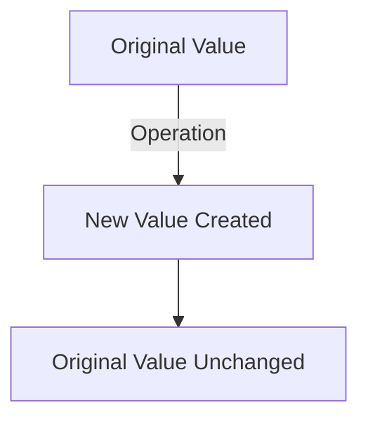

## 5.8. Immutable Primitives

Understanding immutability in JavaScript is crucial for grasping how data is manipulated and stored in memory. In this section, we will delve into the concept of immutable primitives, explore how operations on these values create new instances, and examine the implications for performance and memory management. We'll also contrast primitives with objects to highlight differences in mutability.

### What is Immutability?

Immutability refers to the inability to change an object or value after it has been created. In JavaScript, primitive data types are inherently immutable. This means that once a primitive value is created, it cannot be altered. Instead, any operation that appears to modify a primitive value actually results in the creation of a new value.

#### Primitive Data Types in JavaScript

Before we dive deeper into immutability, let's recap the primitive data types in JavaScript:

1. **Number**: Represents both integer and floating-point numbers.
2. **String**: Represents a sequence of characters.
3. **Boolean**: Represents a logical entity with two values: `true` and `false`.
4. **Undefined**: Represents a variable that has been declared but not assigned a value.
5. **Null**: Represents the intentional absence of any object value.
6. **Symbol**: Represents a unique and immutable primitive value.
7. **BigInt**: Represents integers with arbitrary precision.

### Immutability in Action

Let's illustrate immutability with a simple example using strings, which are immutable:

```javascript
let greeting = "Hello";
let newGreeting = greeting.toUpperCase();

console.log(greeting); // Output: "Hello"
console.log(newGreeting); // Output: "HELLO"
```

In this example, calling `toUpperCase()` on the `greeting` string does not modify the original string. Instead, it creates a new string `newGreeting` with the transformed value. The original `greeting` remains unchanged.

#### Immutability in Numbers

Numbers in JavaScript are also immutable. Any arithmetic operation on a number results in a new number being created:

```javascript
let num = 5;
let newNum = num + 10;

console.log(num); // Output: 5
console.log(newNum); // Output: 15
```

Here, adding `10` to `num` does not alter the original value of `num`. Instead, a new value `newNum` is created.

### Implications of Immutability

#### Memory Management

Immutability has significant implications for memory management. Since new values are created rather than modifying existing ones, this can lead to increased memory usage, especially when dealing with large datasets or frequent operations. However, JavaScript engines are optimized to handle such scenarios efficiently.

#### Performance Considerations

While immutability can lead to increased memory usage, it also offers performance benefits. Immutable data structures are inherently thread-safe and can be shared across different parts of a program without the risk of unintended side effects. This can lead to more predictable and reliable code.

### Comparing Primitives and Objects

In contrast to primitives, objects in JavaScript are mutable. This means that their properties can be changed after they are created. Let's explore this difference with an example:

#### Mutable Objects

```javascript
let person = {
    name: "Alice",
    age: 25
};

person.age = 26; // Modifying the age property

console.log(person); // Output: { name: "Alice", age: 26 }
```

In this example, the `person` object is mutable, allowing us to change the `age` property directly.

#### Immutable Primitives vs. Mutable Objects

| Feature          | Primitives (Immutable) | Objects (Mutable)  |
|------------------|------------------------|--------------------|
| **Mutability**   | Immutable              | Mutable            |
| **Memory Usage** | New value created      | Modified in place  |
| **Thread Safety**| Thread-safe            | Not inherently safe|
| **Performance**  | Predictable            | May have side effects|

### Code Examples and Exercises

Let's look at some more examples and encourage you to experiment with the code.

#### Example: String Manipulation

```javascript
let originalString = "JavaScript";
let modifiedString = originalString.replace("Java", "Type");

console.log(originalString); // Output: "JavaScript"
console.log(modifiedString); // Output: "TypeScript"
```

Try It Yourself: Modify the `originalString` to replace "Script" with "Lang" and observe the results.

#### Example: Number Operations

```javascript
let baseNumber = 42;
let multipliedNumber = baseNumber * 2;

console.log(baseNumber); // Output: 42
console.log(multipliedNumber); // Output: 84
```

Try It Yourself: Divide `baseNumber` by 2 and store the result in a new variable. Check if `baseNumber` changes.

### Visualizing Immutability

To better understand how immutability works, let's visualize the process of creating new values with a flowchart.



**Figure 1:** This flowchart illustrates that operations on immutable primitives result in the creation of new values, leaving the original value unchanged.

### References and Further Reading

For more information on JavaScript's data types and immutability, consider exploring the following resources:

- [MDN Web Docs: JavaScript Data Types and Data Structures](https://developer.mozilla.org/en-US/docs/Web/JavaScript/Data_structures)
- [W3Schools: JavaScript Data Types](https://www.w3schools.com/js/js_datatypes.asp)

### Knowledge Check

Let's reinforce what we've learned with some questions and exercises.

## Quiz Time!



### Which of the following is an immutable primitive in JavaScript?

- [x] String
- [ ] Object
- [ ] Array
- [ ] Function

> **Explanation:** Strings are immutable primitives in JavaScript, whereas objects, arrays, and functions are mutable.

### What happens when you perform an operation on a primitive value?

- [x] A new value is created
- [ ] The original value is modified
- [ ] The original value is deleted
- [ ] The operation is ignored

> **Explanation:** Operations on primitive values create new values without modifying the original.

### Why are immutable primitives beneficial for performance?

- [x] They are thread-safe
- [ ] They use less memory
- [ ] They are faster to modify
- [ ] They are easier to delete

> **Explanation:** Immutable primitives are thread-safe, allowing them to be shared without side effects.

### How does immutability affect memory usage?

- [x] It can increase memory usage
- [ ] It decreases memory usage
- [ ] It has no effect on memory
- [ ] It deletes unused memory

> **Explanation:** Immutability can increase memory usage because new values are created instead of modifying existing ones.

### What is the main difference between primitives and objects in terms of mutability?

- [x] Primitives are immutable, objects are mutable
- [ ] Both are immutable
- [ ] Both are mutable
- [ ] Primitives are mutable, objects are immutable

> **Explanation:** Primitives are immutable, meaning they cannot be changed after creation, while objects can be modified.

### Which of the following operations will create a new value?

- [x] `toUpperCase()` on a string
- [ ] Modifying an object property
- [ ] Adding an element to an array
- [ ] Changing a function's behavior

> **Explanation:** The `toUpperCase()` method on a string creates a new string, demonstrating immutability.

### What does immutability mean in the context of JavaScript primitives?

- [x] Values cannot be changed after creation
- [ ] Values can be changed at any time
- [ ] Values are deleted after use
- [ ] Values are shared across all variables

> **Explanation:** Immutability means that once a primitive value is created, it cannot be changed.

### Which of the following is NOT a primitive data type in JavaScript?

- [ ] Number
- [x] Object
- [ ] Boolean
- [ ] Symbol

> **Explanation:** Objects are not primitive data types; they are complex data structures.

### How does immutability contribute to code predictability?

- [x] It prevents unintended side effects
- [ ] It allows for dynamic changes
- [ ] It reduces code readability
- [ ] It increases code complexity

> **Explanation:** Immutability prevents unintended side effects, making code more predictable and reliable.

### True or False: Immutability in JavaScript primitives means that operations on them modify the original value.

- [ ] True
- [x] False

> **Explanation:** False. Immutability means that operations on primitives do not modify the original value; they create new ones.



### Embrace the Journey

Remember, understanding immutability is just one step in mastering JavaScript. As you continue to learn, you'll discover how these concepts apply to more complex data structures and programming paradigms. Keep experimenting, stay curious, and enjoy the journey!
