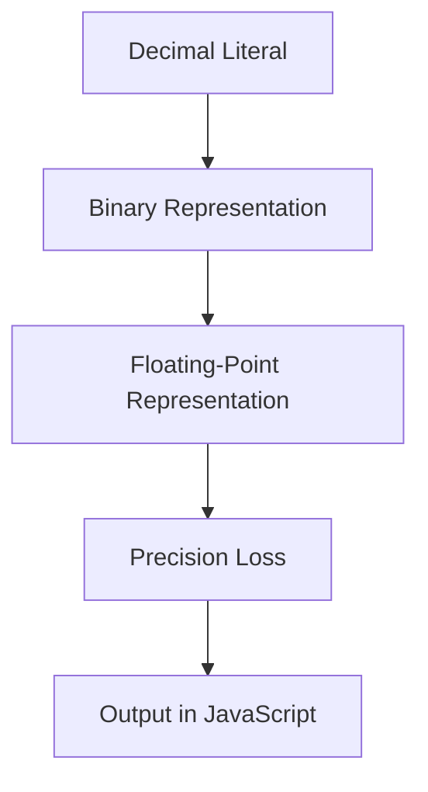

## 5.9. Numeric Literals and Precision

Welcome to the fascinating world of numbers in JavaScript! In this section, we'll explore the different ways you can represent numbers in JavaScript, delve into the intricacies of floating-point precision, and learn how to manage precision effectively. Whether you're just starting out or looking to deepen your understanding, this guide will provide you with the knowledge you need to work confidently with numbers in JavaScript.

### Understanding Numeric Literals

In JavaScript, numeric literals are the way we represent numbers directly in our code. These literals can be expressed in several forms, each serving a specific purpose. Let's explore these forms:

#### Decimal Literals

Decimal literals are the most common way to represent numbers. They are written as a sequence of digits without any prefix.

```javascript
let decimalNumber = 42; // A simple decimal number
```

#### Hexadecimal Literals

Hexadecimal literals are base-16 numbers, often used in computing for their compact representation of binary data. They are prefixed with `0x` or `0X`.

```javascript
let hexNumber = 0x2A; // 42 in hexadecimal
```

#### Octal Literals

Octal literals are base-8 numbers. In modern JavaScript (ES6 and later), they are prefixed with `0o` or `0O`.

```javascript
let octalNumber = 0o52; // 42 in octal
```

#### Binary Literals

Binary literals are base-2 numbers, introduced in ES6. They are prefixed with `0b` or `0B`.

```javascript
let binaryNumber = 0b101010; // 42 in binary
```

### Floating-Point Numbers and Precision

JavaScript uses the IEEE 754 standard for representing numbers, which means all numbers are stored as double-precision floating-point numbers. This representation can lead to precision issues, especially with fractional numbers.

#### Floating-Point Precision Issues

Floating-point numbers are an approximation of real numbers, which can result in precision loss. This is due to the way numbers are stored in binary form. Let's see an example:

```javascript
let sum = 0.1 + 0.2;
console.log(sum); // Output: 0.30000000000000004
```

As you can see, adding `0.1` and `0.2` does not yield the expected result of `0.3`. This small error is due to the limitations of floating-point arithmetic.

#### Rounding Errors

Rounding errors occur when a number cannot be represented exactly in binary form. Consider the following example:

```javascript
let number = 0.1 + 0.2;
let roundedNumber = Math.round(number * 100) / 100;
console.log(roundedNumber); // Output: 0.3
```

Here, we multiply the number by `100`, round it, and then divide by `100` to achieve the desired precision.

### Handling Precision in JavaScript

To manage precision issues, JavaScript provides several methods and techniques. Let's explore some of them:

#### Using `toFixed()`

The `toFixed()` method formats a number using fixed-point notation. It returns a string representing the number with a specified number of decimal places.

```javascript
let number = 0.1 + 0.2;
console.log(number.toFixed(2)); // Output: "0.30"
```

#### Using `toPrecision()`

The `toPrecision()` method formats a number to a specified length. It returns a string representing the number with the specified precision.

```javascript
let number = 123.456;
console.log(number.toPrecision(4)); // Output: "123.5"
```

#### Using Libraries for Precision

For more complex calculations requiring high precision, consider using libraries like [Big.js](https://github.com/MikeMcl/big.js/) or [Decimal.js](https://github.com/MikeMcl/decimal.js/). These libraries provide arbitrary-precision arithmetic.

```javascript
// Using Big.js for precise calculations
const Big = require('big.js');

let a = new Big(0.1);
let b = new Big(0.2);
let sum = a.plus(b);

console.log(sum.toString()); // Output: "0.3"
```

### Visualizing Numeric Literals and Precision

To better understand how JavaScript handles numeric literals and precision, let's visualize the process using a diagram.



**Diagram Description**: This flowchart illustrates how a decimal literal is converted into a binary representation, then into a floating-point representation, leading to potential precision loss, and finally output in JavaScript.

### Try It Yourself

Now that we've covered the basics, it's time to experiment! Try modifying the code examples above to see how different numeric literals behave. For instance, change the base of a number or experiment with different precision methods.

### Knowledge Check

Before we move on, let's reinforce what we've learned:

- What are the different forms of numeric literals in JavaScript?
- How does floating-point precision affect calculations?
- What methods can we use to handle precision issues?

### Embrace the Journey

Remember, working with numbers in JavaScript is just the beginning. As you continue your programming journey, you'll encounter more complex scenarios and learn new techniques to manage them. Keep experimenting, stay curious, and enjoy the process!

### References and Further Reading

For more information on numeric literals and precision in JavaScript, check out these resources:

- [MDN Web Docs: Number](https://developer.mozilla.org/en-US/docs/Web/JavaScript/Reference/Global_Objects/Number)
- [JavaScript: The Definitive Guide](https://www.oreilly.com/library/view/javascript-the-definitive/9781449393854/)
- [IEEE 754 Floating Point Standard](https://en.wikipedia.org/wiki/IEEE_754)

## Quiz Time!



### What is the prefix for a hexadecimal literal in JavaScript?

- [x] 0x
- [ ] 0o
- [ ] 0b
- [ ] 0d

> **Explanation:** Hexadecimal literals in JavaScript are prefixed with `0x`.

### What is the result of `0.1 + 0.2` in JavaScript?

- [ ] 0.3
- [x] 0.30000000000000004
- [ ] 0.2
- [ ] 0.1

> **Explanation:** Due to floating-point precision issues, `0.1 + 0.2` results in `0.30000000000000004`.

### Which method formats a number to a specified number of decimal places?

- [x] toFixed()
- [ ] toPrecision()
- [ ] toString()
- [ ] toLocaleString()

> **Explanation:** The `toFixed()` method formats a number to a specified number of decimal places.

### What is the base of an octal literal in JavaScript?

- [ ] 2
- [ ] 10
- [x] 8
- [ ] 16

> **Explanation:** Octal literals are base-8 numbers.

### Which library can be used for arbitrary-precision arithmetic in JavaScript?

- [x] Big.js
- [ ] Math.js
- [ ] Lodash
- [ ] jQuery

> **Explanation:** Big.js is a library used for arbitrary-precision arithmetic in JavaScript.

### What is the prefix for a binary literal in JavaScript?

- [ ] 0x
- [x] 0b
- [ ] 0o
- [ ] 0d

> **Explanation:** Binary literals in JavaScript are prefixed with `0b`.

### Which method formats a number to a specified length?

- [ ] toFixed()
- [x] toPrecision()
- [ ] toString()
- [ ] toLocaleString()

> **Explanation:** The `toPrecision()` method formats a number to a specified length.

### What does IEEE 754 standardize?

- [x] Floating-point arithmetic
- [ ] Integer arithmetic
- [ ] String manipulation
- [ ] Object serialization

> **Explanation:** The IEEE 754 standardizes floating-point arithmetic.

### What is the result of `Math.round(0.1 + 0.2)`?

- [ ] 0
- [x] 0
- [ ] 1
- [ ] 0.3

> **Explanation:** `Math.round(0.1 + 0.2)` rounds the result to the nearest integer, which is `0`.

### True or False: All numbers in JavaScript are stored as double-precision floating-point numbers.

- [x] True
- [ ] False

> **Explanation:** JavaScript uses the IEEE 754 standard, which stores all numbers as double-precision floating-point numbers.


