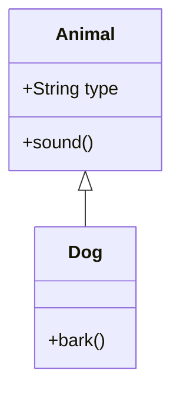

## 6.1. Objects in JavaScript

Welcome to the fascinating world of JavaScript objects! As we delve into this topic, you'll discover how objects serve as the backbone of JavaScript programming, allowing you to create complex data structures and encapsulate functionality. Whether you're building a simple web page or a sophisticated application, understanding objects is crucial to harnessing the full power of JavaScript.

### What Are Objects in JavaScript?

In JavaScript, an object is a collection of properties, where each property is an association between a name (or key) and a value. These values can be of any data type, including other objects, which makes objects incredibly versatile. Think of objects as containers that hold related data and functionality, allowing you to model real-world entities in your code.

#### Key Characteristics of JavaScript Objects

- **Properties**: Attributes that describe the object. Each property has a name and a value.
- **Methods**: Functions that are associated with an object. They define behaviors that the object can perform.
- **Dynamic Nature**: Objects can be modified at runtime, allowing you to add, change, or remove properties and methods as needed.

### Creating Objects in JavaScript

There are several ways to create objects in JavaScript, each with its own use cases and advantages. Let's explore the most common methods:

#### Object Literals

The simplest and most common way to create an object is by using an object literal. This involves defining an object directly within your code using curly braces `{}`.

```javascript
// Creating an object using an object literal
let person = {
    firstName: "John",
    lastName: "Doe",
    age: 30,
    greet: function() {
        console.log("Hello, my name is " + this.firstName + " " + this.lastName);
    }
};

// Accessing properties and methods
console.log(person.firstName); // Output: John
person.greet(); // Output: Hello, my name is John Doe
```

In this example, `person` is an object with properties `firstName`, `lastName`, and `age`, as well as a method `greet`.

#### Constructors

Constructors are special functions used to create and initialize objects. They allow you to create multiple instances of an object with similar properties and methods.

```javascript
// Constructor function for creating Person objects
function Person(firstName, lastName, age) {
    this.firstName = firstName;
    this.lastName = lastName;
    this.age = age;
    this.greet = function() {
        console.log("Hello, my name is " + this.firstName + " " + this.lastName);
    };
}

// Creating new instances of Person
let person1 = new Person("Alice", "Smith", 25);
let person2 = new Person("Bob", "Johnson", 40);

person1.greet(); // Output: Hello, my name is Alice Smith
person2.greet(); // Output: Hello, my name is Bob Johnson
```

Constructors provide a blueprint for creating objects, making it easy to generate multiple objects with the same structure.

#### `Object.create()`

The `Object.create()` method creates a new object with a specified prototype object and properties. This approach is useful for creating objects that inherit from other objects.

```javascript
// Prototype object
let animal = {
    type: "Mammal",
    sound: function() {
        console.log("Some generic sound");
    }
};

// Creating a new object that inherits from animal
let dog = Object.create(animal);
dog.bark = function() {
    console.log("Woof! Woof!");
};

console.log(dog.type); // Output: Mammal
dog.sound(); // Output: Some generic sound
dog.bark(); // Output: Woof! Woof!
```

In this example, `dog` inherits properties and methods from `animal`, while also having its own unique method `bark`.

### Manipulating Objects

Once you've created an object, you can manipulate its properties and methods in various ways. Let's explore some common operations:

#### Adding and Modifying Properties

You can add new properties to an object or modify existing ones using dot notation or bracket notation.

```javascript
let car = {
    brand: "Toyota",
    model: "Corolla"
};

// Adding a new property
car.year = 2020;

// Modifying an existing property
car.model = "Camry";

console.log(car); // Output: { brand: 'Toyota', model: 'Camry', year: 2020 }
```

#### Deleting Properties

To remove a property from an object, use the `delete` operator.

```javascript
let book = {
    title: "JavaScript for Beginners",
    author: "Jane Doe",
    pages: 300
};

// Deleting a property
delete book.pages;

console.log(book); // Output: { title: 'JavaScript for Beginners', author: 'Jane Doe' }
```

#### Iterating Over Properties

You can iterate over an object's properties using a `for...in` loop.

```javascript
let fruit = {
    name: "Apple",
    color: "Red",
    weight: "200g"
};

for (let key in fruit) {
    console.log(key + ": " + fruit[key]);
}

// Output:
// name: Apple
// color: Red
// weight: 200g
```

### The Importance of Objects in JavaScript Programming

Objects are a fundamental part of JavaScript, serving as the building blocks for more complex data structures and applications. They allow you to:

- **Model Real-World Entities**: Objects can represent complex entities with multiple attributes and behaviors, making it easier to model real-world scenarios in your code.
- **Encapsulate Data and Functionality**: By grouping related data and functions together, objects help organize your code and improve readability.
- **Facilitate Code Reuse**: With constructors and prototypes, you can create reusable code that can be easily extended and modified.
- **Enable Object-Oriented Programming**: JavaScript supports object-oriented programming (OOP) principles, such as inheritance and polymorphism, through its use of objects.

### Visualizing Object Relationships

To better understand how objects relate to each other, let's visualize the inheritance relationship using a diagram.



In this diagram, `Dog` inherits from `Animal`, meaning it has access to the properties and methods of `Animal`, in addition to its own.

### Try It Yourself

Now that we've covered the basics of objects in JavaScript, it's time to experiment! Try modifying the code examples to create your own objects, add properties, and define methods. Here are a few ideas to get you started:

- Create a `Student` object with properties like `name`, `grade`, and `subjects`.
- Add a method to the `Student` object that calculates the average grade.
- Use a constructor to create multiple `Student` objects with different data.

### References and Links

For more information on JavaScript objects, check out these resources:

- [MDN Web Docs: Working with Objects](https://developer.mozilla.org/en-US/docs/Web/JavaScript/Guide/Working_with_Objects)
- [W3Schools: JavaScript Objects](https://www.w3schools.com/js/js_objects.asp)

### Knowledge Check

Let's reinforce what we've learned with a few questions:

- What is an object in JavaScript?
- How do you create an object using an object literal?
- What is the purpose of a constructor function?
- How does `Object.create()` differ from using a constructor?
- How can you add a new property to an existing object?

### Embrace the Journey

Remember, this is just the beginning. As you progress, you'll build more complex and interactive web pages. Keep experimenting, stay curious, and enjoy the journey!

## Quiz Time!



### What is an object in JavaScript?

- [x] A collection of properties and methods
- [ ] A function that returns a value
- [ ] A primitive data type
- [ ] A loop structure

> **Explanation:** An object in JavaScript is a collection of properties and methods, allowing you to model real-world entities and encapsulate data and functionality.

### How do you create an object using an object literal?

- [x] By defining an object directly with curly braces `{}` and specifying properties and methods
- [ ] By using the `new` keyword
- [ ] By calling a constructor function
- [ ] By using `Object.create()`

> **Explanation:** An object literal is created by defining an object directly within your code using curly braces `{}` and specifying properties and methods.

### What is the purpose of a constructor function?

- [x] To create and initialize objects with similar properties and methods
- [ ] To delete properties from an object
- [ ] To iterate over an object's properties
- [ ] To convert an object to a string

> **Explanation:** A constructor function provides a blueprint for creating objects, allowing you to create multiple instances with similar properties and methods.

### How does `Object.create()` differ from using a constructor?

- [x] `Object.create()` creates a new object with a specified prototype, while a constructor initializes objects with specific properties and methods
- [ ] `Object.create()` is used to delete properties, while a constructor is used to add properties
- [ ] `Object.create()` is used to convert objects to strings, while a constructor is used to convert strings to objects
- [ ] `Object.create()` is used for iteration, while a constructor is used for recursion

> **Explanation:** `Object.create()` creates a new object with a specified prototype, allowing for inheritance, while a constructor initializes objects with specific properties and methods.

### How can you add a new property to an existing object?

- [x] By using dot notation or bracket notation to assign a value to a new property name
- [ ] By using the `delete` operator
- [ ] By calling a constructor function
- [ ] By using `Object.create()`

> **Explanation:** You can add a new property to an existing object by using dot notation or bracket notation to assign a value to a new property name.

### What is a method in a JavaScript object?

- [x] A function associated with an object
- [ ] A property that holds a string value
- [ ] A loop structure
- [ ] A primitive data type

> **Explanation:** A method is a function associated with an object, defining behaviors that the object can perform.

### Which of the following is a key characteristic of JavaScript objects?

- [x] They can be modified at runtime
- [ ] They are immutable
- [ ] They cannot contain other objects
- [ ] They are primitive data types

> **Explanation:** JavaScript objects are dynamic and can be modified at runtime, allowing you to add, change, or remove properties and methods.

### What does the `delete` operator do?

- [x] Removes a property from an object
- [ ] Adds a new property to an object
- [ ] Iterates over an object's properties
- [ ] Converts an object to a string

> **Explanation:** The `delete` operator is used to remove a property from an object.

### How can you iterate over an object's properties?

- [x] By using a `for...in` loop
- [ ] By using the `delete` operator
- [ ] By calling a constructor function
- [ ] By using `Object.create()`

> **Explanation:** You can iterate over an object's properties using a `for...in` loop.

### True or False: Objects in JavaScript can only contain primitive data types as property values.

- [ ] True
- [x] False

> **Explanation:** Objects in JavaScript can contain any data type as property values, including other objects and functions.


