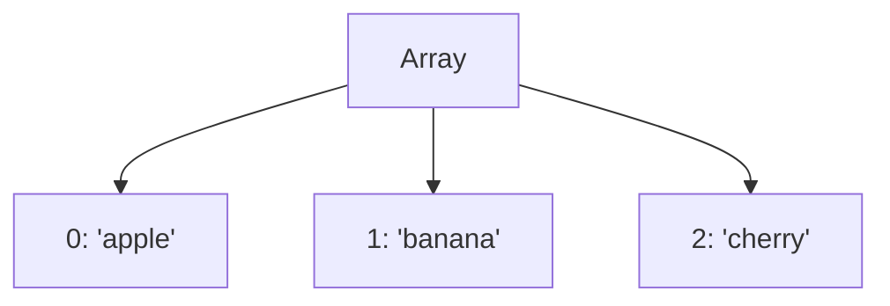

## 6.2. Arrays as Objects

In JavaScript, arrays are a fundamental data structure that allows us to store and manipulate collections of data. While arrays might seem like a simple list of items, they are, in fact, a special kind of object. This section will explore the unique characteristics of arrays, how they differ from regular objects, and how we can leverage their properties to perform common operations efficiently.

### Understanding Arrays as Objects

Arrays in JavaScript are essentially objects with numerical keys. This means that each element in an array is associated with a numeric index, starting from zero. Unlike regular objects, which use strings as keys, arrays use these numeric indices to organize and access their elements.

#### Creating Arrays

To create an array in JavaScript, we can use either the array literal syntax or the `Array` constructor. Let's explore both methods:

**Array Literal Syntax:**

```javascript
// Creating an array using array literal syntax
let fruits = ['apple', 'banana', 'cherry'];
```

**Array Constructor:**

```javascript
// Creating an array using the Array constructor
let numbers = new Array(1, 2, 3, 4, 5);
```

While both methods achieve the same result, the array literal syntax is more concise and commonly used.

#### Accessing Array Elements

Accessing elements in an array is straightforward. We use the index of the element we want to retrieve, enclosed in square brackets:

```javascript
let colors = ['red', 'green', 'blue'];

// Accessing elements by index
console.log(colors[0]); // Output: 'red'
console.log(colors[1]); // Output: 'green'
console.log(colors[2]); // Output: 'blue'
```

### Common Array Methods

JavaScript arrays come with a plethora of built-in methods that make it easy to perform various operations. Let's explore some of the most commonly used array methods.

#### Adding and Removing Elements

**`push` Method:**

The `push` method adds one or more elements to the end of an array and returns the new length of the array.

```javascript
let animals = ['dog', 'cat'];

// Adding elements to the array
animals.push('rabbit');
console.log(animals); // Output: ['dog', 'cat', 'rabbit']
```

**`pop` Method:**

The `pop` method removes the last element from an array and returns that element.

```javascript
let numbers = [1, 2, 3];

// Removing the last element
let lastNumber = numbers.pop();
console.log(lastNumber); // Output: 3
console.log(numbers); // Output: [1, 2]
```

#### Transforming Arrays

**`map` Method:**

The `map` method creates a new array by applying a function to each element of the original array.

```javascript
let numbers = [1, 2, 3, 4];

// Doubling each number in the array
let doubled = numbers.map(function(number) {
  return number * 2;
});
console.log(doubled); // Output: [2, 4, 6, 8]
```

**`filter` Method:**

The `filter` method creates a new array with all elements that pass the test implemented by the provided function.

```javascript
let ages = [18, 21, 16, 25, 30];

// Filtering out ages less than 21
let adults = ages.filter(function(age) {
  return age >= 21;
});
console.log(adults); // Output: [21, 25, 30]
```

### Arrays vs. Regular Objects

While arrays and objects in JavaScript share some similarities, they are designed for different purposes and have distinct characteristics.

#### Key Differences:

1. **Indexing:**
   - Arrays use numerical indices, starting from zero.
   - Objects use string keys.

2. **Purpose:**
   - Arrays are optimized for storing ordered collections of data.
   - Objects are used for storing key-value pairs.

3. **Methods:**
   - Arrays have a variety of built-in methods for iteration, transformation, and manipulation.
   - Objects have fewer built-in methods, focusing more on property manipulation.

### Visualizing Arrays as Objects

To better understand how arrays function as objects, let's visualize their structure using a diagram:



**Diagram Explanation:** This diagram represents an array with three elements, each associated with a numerical index. The indices (0, 1, 2) are the keys used to access the corresponding values ('apple', 'banana', 'cherry').

### Try It Yourself

Now that we've covered the basics of arrays, let's experiment with some code. Try modifying the examples above to see how arrays behave:

1. **Add More Elements:** Use the `push` method to add more elements to an array.
2. **Remove Elements:** Use the `pop` method to remove elements and observe the changes.
3. **Transform Arrays:** Use the `map` method to apply different transformations to an array.
4. **Filter Arrays:** Use the `filter` method to create a new array based on specific conditions.

### Knowledge Check

Before we move on, let's reinforce what we've learned with a few questions:

1. **What is the primary difference between arrays and regular objects in JavaScript?**
2. **How do you access the second element of an array named `colors`?**
3. **Which method would you use to add an element to the end of an array?**
4. **How can you create a new array with only the even numbers from an existing array of numbers?**

### Summary

In this section, we've explored arrays as special objects in JavaScript. We've learned how to create and access array elements, discovered common array methods, and discussed the differences between arrays and regular objects. Remember, arrays are a powerful tool for managing collections of data, and mastering their use will greatly enhance your JavaScript programming skills.

Keep experimenting with arrays, try out new methods, and don't hesitate to explore further resources to deepen your understanding. As you continue your journey in JavaScript, you'll find arrays to be an indispensable part of your toolkit.

## Quiz Time!



### What is the primary difference between arrays and regular objects in JavaScript?

- [x] Arrays use numerical indices, while objects use string keys.
- [ ] Arrays use string keys, while objects use numerical indices.
- [ ] Arrays and objects use the same type of keys.
- [ ] Arrays are immutable, while objects are mutable.

> **Explanation:** Arrays in JavaScript use numerical indices to access elements, whereas objects use string keys for property access.

### How do you access the second element of an array named `colors`?

- [x] `colors[1]`
- [ ] `colors[2]`
- [ ] `colors[0]`
- [ ] `colors['second']`

> **Explanation:** Arrays in JavaScript are zero-indexed, meaning the first element is at index 0, and the second element is at index 1.

### Which method would you use to add an element to the end of an array?

- [x] `push`
- [ ] `pop`
- [ ] `shift`
- [ ] `unshift`

> **Explanation:** The `push` method adds one or more elements to the end of an array.

### How can you create a new array with only the even numbers from an existing array of numbers?

- [x] Use the `filter` method with a function that checks for even numbers.
- [ ] Use the `map` method with a function that checks for even numbers.
- [ ] Use the `reduce` method with a function that checks for even numbers.
- [ ] Use the `forEach` method with a function that checks for even numbers.

> **Explanation:** The `filter` method creates a new array with all elements that pass the test implemented by the provided function.

### What does the `pop` method do?

- [x] Removes the last element from an array and returns it.
- [ ] Adds an element to the beginning of an array.
- [ ] Removes the first element from an array and returns it.
- [ ] Adds an element to the end of an array.

> **Explanation:** The `pop` method removes the last element from an array and returns that element.

### Which method would you use to apply a function to each element of an array and create a new array?

- [x] `map`
- [ ] `filter`
- [ ] `forEach`
- [ ] `reduce`

> **Explanation:** The `map` method creates a new array by applying a function to each element of the original array.

### How do arrays differ from objects in terms of purpose?

- [x] Arrays are optimized for ordered collections, while objects store key-value pairs.
- [ ] Arrays store key-value pairs, while objects are optimized for ordered collections.
- [ ] Arrays and objects serve the same purpose.
- [ ] Arrays are immutable, while objects are mutable.

> **Explanation:** Arrays are designed for ordered collections of data, whereas objects are used for storing key-value pairs.

### What is the output of `console.log(['a', 'b', 'c'].length)`?

- [x] 3
- [ ] 2
- [ ] 1
- [ ] 0

> **Explanation:** The `length` property of an array returns the number of elements in the array.

### Which method would you use to remove the first element from an array?

- [x] `shift`
- [ ] `unshift`
- [ ] `pop`
- [ ] `push`

> **Explanation:** The `shift` method removes the first element from an array and returns it.

### True or False: Arrays in JavaScript can store different data types.

- [x] True
- [ ] False

> **Explanation:** Arrays in JavaScript can store elements of different data types, including numbers, strings, objects, and more.



Remember, this is just the beginning. As you progress, you'll build more complex and interactive web pages. Keep experimenting, stay curious, and enjoy the journey!
